# Descriptive Statistics in Python
For this tutorial will be using the following Python modules. Do not forget to change your working directory to where you have stored your data files.

```python
import pandas as pd
import numpy as np
import matplotlib.pyplot as plt
import os

#For QQ Plot
import scipy.stats as sts

os.chdir(r'C:\Users\bryan\source\repos\msis5193-pds1-master\descriptive-statistics\data')
```

You will also be using the following data files.
* [ozone.data.txt](../data/ozone.data.txt)
* [car.test.frame.txt](../data/car.test.frame.txt)

There are many ways to assess the basic descriptive information of the data. Python’s Pandas library provides two functions that behave similarly to `summary()` and `str()` in R. These two functions are `describe()` and `dtypes`. The former provides an overview like `summary()`, providing basic descriptive information for numeric and categorical data. The attribute, `dtypes`, only provides the datatype of the columns, unlike `str()` in R that provides more beyond datatypes.

Load the ozone data and use `describe()`. The output provides count, mean, standard deviation, minimum value, maximum value, and the values for the 25th, 50th, and 75th quartiles.

```python
ozone_data.describe()
```

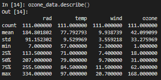

Perform the same operation on the car data. Recall, the car data contains eight columns of data. 

```python
car_data.describe()
```

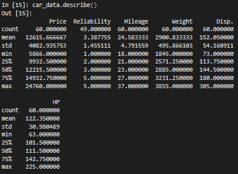

Unfortunately, the output only presents six columns worth of descriptive data. The reason is, the two columns left out are string/categorical, not numeric. The `describe()` function in Pandas has additional arguments (and some beyond these):
* `describe(include=['object'])`: focuses just on string data
* `describe(include=['categorical'])`: focuses just on categorical data
* `describe(include=['number'])`: solely looks at numerical data
* `describe(include='all')`: forces Python to assess both types

Return to the car data and use the `include=['object']` argument. Note the differences of the output.

```python
car_data.describe(include=['object'])
```

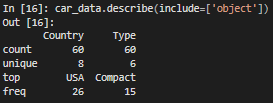

You can confirm your earlier findings by using the argument `include=['number']`.

```python
car_data.describe(include=['number'])
```

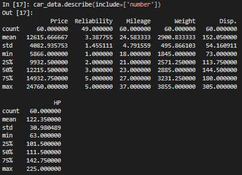

An important note should be provided here. When Pandas imports data into Python as a dataframe, it does not automatically convert columns into categorical datatypes, unlike R. To do so, you must convert the datatype of a column into categorical and then append it to your dataframe. Let's convert *Country* into a categorical datatype and append it to the dataframe. Use `columns` to view the newly created column.

```python
car_data['Country_cat'] = car_data['Country'].astype('category')

car_data.columns
```
Looking at the listed columns, the newly created column `Country_cat` is listed at the end. Notice that the datatype of `Country` is still `object`, while the datatype of `Country_cat` is `category`. 

```python
car_data.dtypes
```

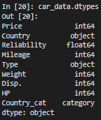

Let's repeat the earlier process for `describe()`, only this time for data types of `object` and `category`.

```python
car_data.describe(include=['object'])

car_data.describe(include=['category'])
```

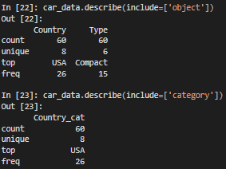

Many other useful functions exist for categorical data within Pandas. For example, it is possible to add additional categories, remove categories not currently used in the dataset, change the existing categories, and consolidate categories. See the online documentation for more details on how to perform these operations: [https://pandas-docs.github.io/pandas-docs-travis/user_guide/categorical.html](https://pandas-docs.github.io/pandas-docs-travis/user_guide/categorical.html).

In order to determine the skewness and kurtosis within Python, separate functions must be run. Similar to R, these functions can be run separately for each column or on the entire dataframe. 

```python
car_data.kurt()
```

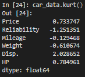

The following table provides a list of the most fundamental descriptive functions within the Pandas library, including those for skewness and kurtosis.

| Function | Description |
|:---|:---|
| count() | Number of non-null observations |
| sum() | Sum of values |
| mean() | Mean of values |
| mad() | Mean absolute deviation |
| median() | Arithmetic median of values |
| min() | Minimum |
| max() | Maximum |
| mode() | Mode |
| abs() | Absolute Value |
| prod() | Product of values |
| std() | Sample standard deviation |
| var() | Unbiased variance |
| sem() | Standard error of the mean |
| skew() | Sample skewness (3rd moment) |
| kurt() | Sample kurtosis (4th moment) |
| quantile() | Sample quantile (value at %) |

### Using Plots
Often, numbers by themselves are not intuitive. Human brains are designed to interpret visual objects more readily than numerical data. Thus, it is important to create basic plots to assess your data in addition to looking at numbers. This includes simple scatter plots, box plots, or histograms. Below is an example of a simple plot for time-ordered data using the function `plot()`. The code below generates a random time series.

```python
ts = pd.Series(np.random.randn(1000), index=pd.date_range('1/1/2000', periods=1000))
ts = ts.cumsum()
ts.plot()
```

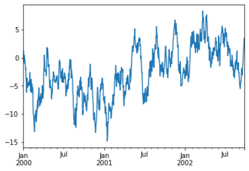

The scatter plot is a popular plot used to assess data prior to modeling. The scatter plot is simple enough to use within Python. For this example, variables from the ozone dataset will be used. The variable *radiation* is placed on the *y*-axis; the variable *temperature* on the *x*-axis. This allows you do assess the relationship between variables prior to modeling. In the plot below, a weak positive relationship exists between *radiation* and *temperature*.

```python
ozone_data.plot.scatter(x='temp', y='rad')
```

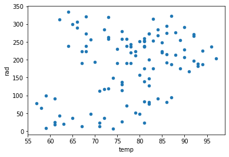

If your data set contains more than one or two variables, it may take too much time to create individual scatter plots. Recall in R, the function `pairs()` allows you to plot scatter plots for all variables. Unfortunately, Pandas does not contain such a function. You will need to plot each pair of variables. Using your knowledge of loops, you can make short work of this. I will leave that up to you to explore how it is done.

Another type of plot that you should use is the boxplot.

```python
ozone_data.boxplot()
```

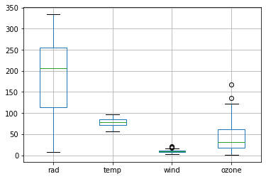

This should look familiar. This is the same plot you obtained from the boxplot function in R. Just like we saw with that plot, outliers are present. For both *wind* and *ozone* data points lie above the horizontal bar. These are considered outliers in the data. These are data points that are either greater than 1.5 times the interquartile range or lower than 1.5 times the interquartile range. Though, *wind* is cramped making assessment difficult. Let's try removing *radiation* from the plot to bring that into focus.

```python
ozone_data.loc[:,['temp','wind','ozone']].boxplot()
```

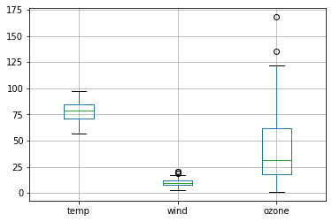

That is an improvement. *Ozone* is very much skewed with outliers. Still, *wind* is still squished.

```python
ozone_data.loc[:,['wind']].boxplot()
```

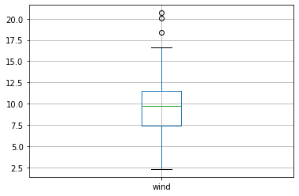

Excellent! This brings it into greater focus. You can see the outliers present at the top of the plot.

Histograms are excellent for viewing the spread of your data. A histogram provides the frequency in which certain data points appear. This also lets you eyeball the skewness and kurtosis of your data.

```python
ozone_data['rad'].plot.hist(alpha=0.5)
```

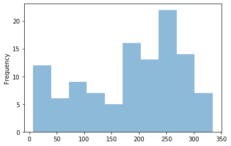

You can also use bar charts to plot categorical data. 

```python
car_data.Country.value_counts().plot.bar()
```

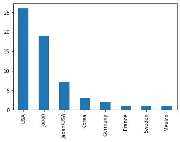

```python
car_data.Country.value_counts().plot.barh()
```

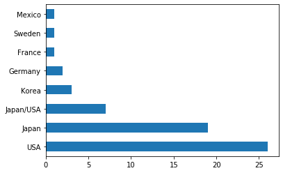

```python
car_data.Type.value_counts().plot.barh()
```

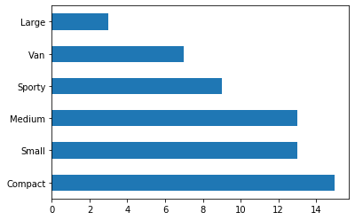

The first two plots use the exact same data. One is a vertical bar chart while the other is horizontal. My recommendation is to switch to a horizontal bar chart when you have more than 5 variables; otherwise, the plot becomes too crowded with the text for the variable names overlapping.

### Assessing Normality
Testing for normality is an important first step of familiarizing yourself with your data. In many ways, this will help determine what kinds of analysis you should perform. If non-normality is an issue, you may need to use a non-parametric test. Some statistical techniques, such as linear regression, require the data to exhibit a normal distribution. 

Two simple tests exist for assessing normality: 1) Quantile-quantile plot and 2) Shapiro-Wilk test. The quantile-quantile plot, or QQ plot, is a more subjective assessment that relies on the statistician’s eye. To perform this function in Python for the *radiation* variable, use the following code. Note, `sts` is a reference to the library `scipy.stats` and is the shorcut we assigned when the library was imported (i.e. `import scipy.stats as sts`).

```python
sts.probplot(ozone_data.rad, dist="norm", plot=plt)
```

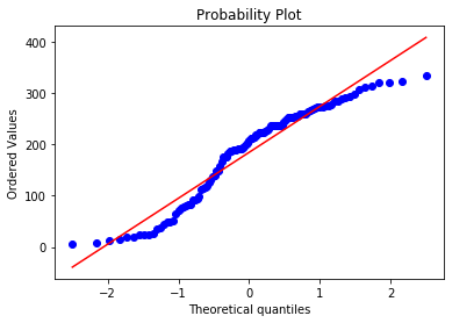

The straight, dashed line represents a normal distribution; the circles represent the data points of your variable. Notice the slight S-shape of the data. It should be noted that this plot is for a single variable. If you have several, say 12, then you would have to create 12 separate QQ plots.

In addition to the QQ plot, you can use the Shapiro-Wilk test. This is considered a more objective assessment and provides a p-value. Normality results in a non-significant result of the test. Importantly, the significance depends on the alpha level you choose. I always take a more conservative approach and require an alpha of 0.05. This function also comes from the library `scipy.stats`.

```python
sts.shapiro(ozone_data.rad)
```

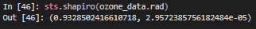

The output provides two numerical values. The first is the test statistics; the second value is the p-value of 0.00002957, which is highly significant. Not surprisingly, this is not considered a normal distribution.

### Skewness and Kurtosis
Like in R, Python has functions available to test skewness and kurtosis. This includes the univariate test `skew()` for skewness and `kurt()` for kurtosis.

```python
ozone_data.wind.skew()
ozone_data.wind.kurt()
```