# Descriptive Statistics in R
There are many ways to assess the basic descriptive information of the data. Often, this merely entails looking at the mean, median, spread, shape, and data types within your data. R comes with many built-in functions that are adequate for summarizing and counting data.

Two of the most basic functions within R include `summary()` and `str()`.
* `summary()` provides column-based summaries including minimum, 1st quartile, median, mean, 3rd quartile, and maximum
* `str()` short for structure, this function provides the data type and example data for each column

To illustrate both of these functions, please use [ozone.data.tx](../data/ozone.data.txt).

```R
temptable = paste(workingdirectory, "\\ozone.data.txt", sep="")
ozone_data = read.table(temptable, header=T, sep="\t")

summary(ozone_data)
```

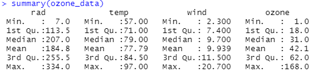

Many observations can be made for each of the columns. For example, the ranges for the data differ greatly.
* `rad` 7 to 334
* `temp` 57 to 97
* `wind` 2.3 to 20.7
* `ozone` 1 to 168

This indicates that they are all measured on different scales. While not an issue now, for certain statistical techniques you will not be able to use them in their current form. You will need to transform them by such methods like normalizing and standardizing.

Still keeping in mind the ranges, look at the medians versus the means. The average for `ozone` appears closer to the minimum than the maximum. This could indicate skewness of the data, another potential problem for some statistical models.

The other function to familiarize yourself with is `str()`.

```R
str(ozone_data)
```

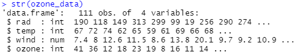

First, look at the data types. Three of the variables (`rad`, `temp`, and `ozone`) are integers while `wind` is numeric. In addition, you can get a feel for what the data looks like by looking at the example data provided. This is especially useful for when you have text-based data.

Another important piece of information is the sample size, or the number of observations. For this data set, the sample size is 111. You also are given the number of variables. While apparent with this data, larger datasets are more difficult to discern.

The library `psych` also provides many additional functions that can help with assessing your data. An important one is the function `describe()`. First, run the code `library(psych)` to load it into memory. 

```R
library(psych)
```

Second, run the `describe()` function on your data. For example, if I wanted specific information on the variable *radiation*, I would perform the following.

```R
describe(ozone_data$rad)
```

This provides more details compared to `str()` such as measures for standard deviation, skewness, kurtosis, standard error, and the range. You also can see the sample size for this variable. The sample size for each column of data may not be equal, so obtaining column-specific information is important.

After finding the mean, median, minimum, and maximum you should determine the variance and standard deviation. If you recall, these values provide an idea as to the spread of the data about the mean. In other words, how the data spread out to the left and right of the mean. You can use the function `var()` and `sd()` to calculate the variance and standard deviation, respectively.

```R
var(ozone_data$rad)
sd(ozone_data$rad)
```

### Using Plots
Often, numbers by themselves are not intuitive. Human brains are designed to interpret visual objects more readily than numerical data. Thus, it is important to create basic plots to assess your data in addition to looking at numbers. This includes simple scatter plots, box plots, or histograms.

One of the most basic plots is an Index Plot. This takes the data as it is ordered in the file and presents them on an x-y plane where the *y-value* is each data point’s value and *x* is the position, in order. For example, say you have the variable `shoe_size` for 5 people.

| Name | Shoe Size |
|:---:|:---:|
| Grace McKenzie | 6 |
| Sankar Reddy | 7.5 |
| Peter Zhang | 11 |
| David Wilkinson | 12 |
| Amy Johnson | 8.5 |

The Index Plot would create a plot giving the following x-value to each of the individuals in the data:
* Grace: 1
* Sankar: 2
* Peter: 3
* David: 4
* Amy: 5

As you can see, the *x-values* are merely just an ordering of the data as it appears in the data file. If Grace had been listed third and Peter first, then their assigned index values would have been swapped so that Grace was given 3 and Peter 1. What this means is that the index value provides very little information and has no meaning beyond the ordering of your data. Keep in mind, sometimes data is time-ordered, such as transaction-based data; this would indicate the ordering is time-based and sequential.

Below is an example of an Index Plot using the variable *radiation* from the `ozone.data.txt` file.

```R
plot(ozone_data$rad)
```

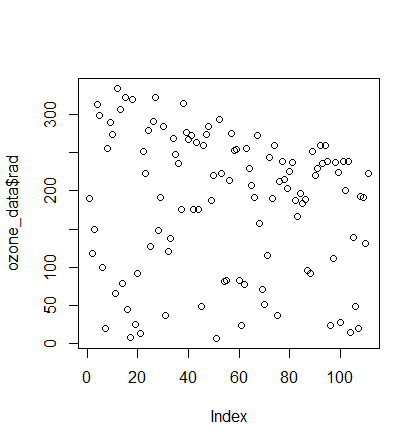

To create such a plot, use the function `plot(x)` where *x* is the variable. It should be noted that two variations exist using this function:
* `plot(x)`: creates an Index Plot of *x*
* `plot(x, y)`: if *x* is continuous, this provides a scatterplot; if *x* is a categorical (i.e. factor) variable, then it provides a box-and-whisker plot

If your data set contains more than one or two variables, it may take too much time to create individual scatter plots per pair of variables. One function that allows for assessing the relationship of all variables at the same time is `pairs()`. This creates a plot of all variables in your data.

```R
pairs(ozone_data, panel=panel.smooth)
```


The argument `panel=panel.smooth` adds a non-parametric smoother. The target variable is in the row and the explanatory variable is in the column. For example, in the bottom-left corner of the plot *ozone* is on the *y-axis* and *radiation* is on the *x-axis*. 

Look at the plot where *ozone* is on the *y-axis* and *wind* is on the *x-axis*; there is a strong relationship between the two variables because the data points tightly follow the red line in the plot. It also appears that the relationship is non-linear due to the curvature seen.

Another type of plot that you should use is the boxplot. While you can use the function `plot(x, y)` to obtain the boxplot for categorical data, a different function is needed for continuous data. Typing in `boxplot(ozone_data)` results in a boxplot for each variable.

```R
boxplot(ozone_data)
```

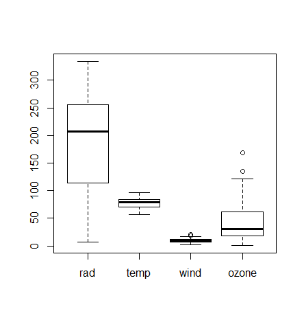

The bold, horizontal line in the middle of each box is the median value for each variable. The top of the box is the 75th percentile while the bottom of the box is the 25th percentile. The dashed lines are the whiskers, leading from the 25th or 75th percentiles to the minimum or maximum data point, respectively. Sometimes, however, that horizontal line does not refer to the minimum or maximum value; they can represent 1.5 times the interquartile range of the data (approximately 2 standard deviations).

For both *wind* and *ozone* there are data points above the horizontal bar. These are considered outliers in the data. These are data points that are either greater than 1.5 times the interquartile range or lower than 1.5 times the interquartile range.

Creating boxplots for individual variables may improve the plot. Notice how squished *temperature*, *wind*, and *ozone* are due to the range of *radiation*.

```R
boxplot(ozone_data$ozone, main="Boxplot of Ozone")
```

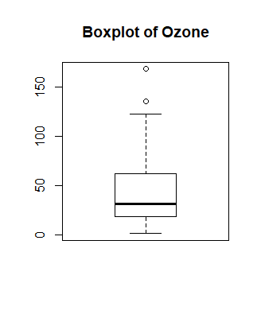

This strongly identifies *ozone* having skewness. In fact, a few outliers (represented by the two points at the top) may be present within the data causing the skewness.

To further confirm this characteristic, we can use a histogram. Histograms are excellent for viewing the spread of your data. A histogram provides the frequency in which certain data points appear. This also lets you eyeball the skewness and kurtosis of your data.

```R
hist(ozone_data$ozone, main="Ozone Histogram")
```

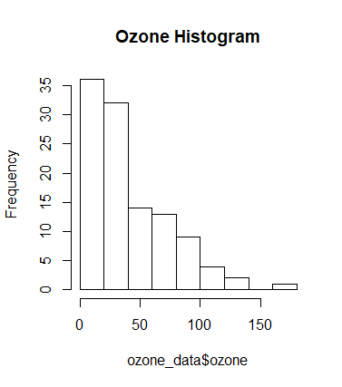

### Assessing Normality
Testing for normality is an important first step of familiarizing yourself with your data. In many ways, this will help determine what kinds of analysis you should perform. If non-normality is an issue, you may need to use a non-parametric test. Some statistical techniques, such as linear regression, require the data to exhibit a normal distribution. 

Two simple tests exist for assessing normality: 1) Quantile-quantile plot and 2) Shapiro-Wilk test. The quantile-quantile plot, or QQ plot, is a more subjective assessment that relies on the statistician’s eye. Below is a QQ plot for *radiation*.

```R
qqnorm(ozone_data$rad)
qqline(ozone_data$rad, lty=2)
```

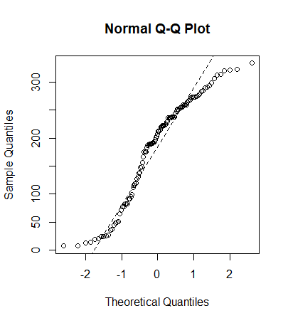

The straight, dashed line represents a normal distribution; the circles represent the data points of your variable. Notice the slight S-shape of the data. The tail ends appear above and slightly below the left and right ends of the normal distribution, respectively. I should note that this plot is for a single variable. If you have several, say 12, then you would have to create 12 separate QQ plots.

The function `qqnorm()` creates the plotted data while the function `qqline()` overlays the normal line across the plotted data.

In addition to the QQ plot, you can use the Shapiro-Wilk test. This is considered a more objective assessment and provides a p-value. Normality results in a non-significant result of the test. Importantly, the significance depends on the alpha level you choose. I always take a more conservative approach and require an alpha of 0.05.

```R
shapiro.test(ozone_data$temp)
```

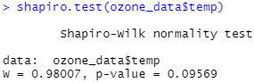

The above performs the test for *temperature*. The p-value is greater than 0.05, resulting in non-significance. This qualifies as having a tendency toward normality.

```R
shapiro.test(ozone_data$ozone)
```

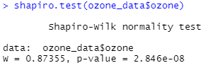

Not surprisingly, the test results in significance. In fact, this is significant at the 0.01 level. This result indicates *ozone* as characterized as non-normal.

### Skewness and Kurtosis
After assessing the normality of your data, you need to understand the distribution in more detail. This requires you to look at the skewness and the kurtosis. While a histogram can help you to visually assess the skewness, it is better to use more objective criteria. 

Skewness deals with the extent to which the end tails of the data are drawn out. Michael Crawley provides an excellent illustration in his book of what this may look like (page 286 1st edition, page 350 2nd edition), which I have included here. Note, that a negative skew is an indication of a skew to the left (see the tail end?) and a positive skew indicates a skew to the right. The positive and negative is in reference to the high point of that hump.

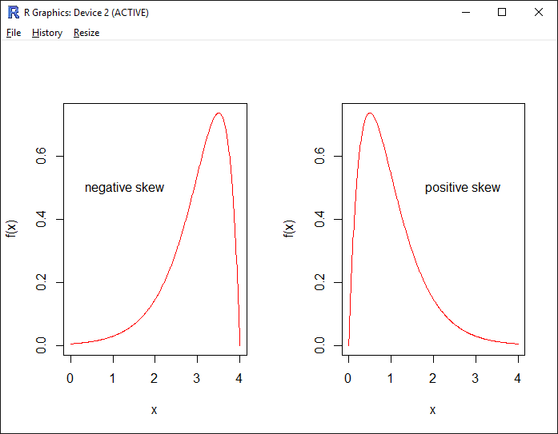

To calculate the skewness value for a single variable, simply use `skew()`. This is a univariate test, rather than multivariate. This gives a value that is negative (left skew), 0 (no skew), or positive (right skew). What a skew value does not indicate is how significant the skew value is. In other words, is it really worth worrying about? If it is, then a transformation, such as a square-root transformation, may be needed. Note, this value is the same as that given by the function `describe()`.

Kurtosis is another measure of normality that deals with the peak of a distribution. Two main types of kurtosis are encountered: leptokurtosis, which is very pointy, and platykurtosis, which is flat.

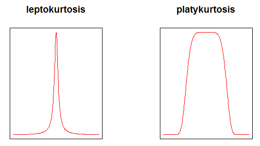

The `pysch` package comes with a function to calculate the kurtosis value. Simply type in `kurtosi()` and a value is provided. The function `describe()` also provides an estimate of kurtosis.

```R
skew(ozone_data$ozone)
kurtosi(ozone_data$ozone)

describe(ozone_data$ozone)
```

