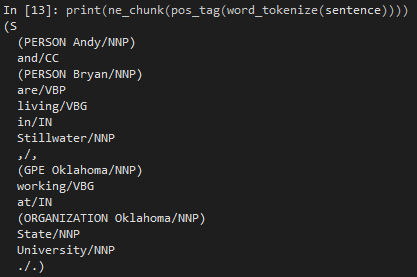
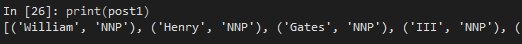
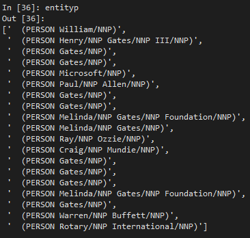
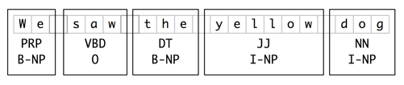
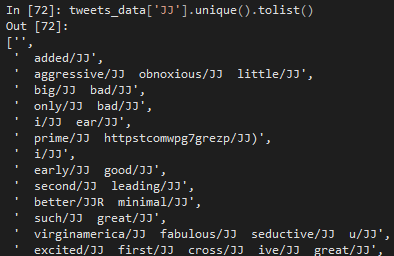

# Simple Example
To begin, I will start with a simple example. Suppose I would like to extract entities from the text `Andy and Bryan are living in Stillwater, Oklahoma working at Oklahoma State University`. This is done using the library `nltk`.

```python
sentence = "Andy and Bryan are living in Stillwater, Oklahoma working at Oklahoma State University."
 
print(ne_chunk(pos_tag(word_tokenize(sentence))))
```

The process above first tokenizes the text, then passes them through a POST filter, then a chunking process. The below image displays the results of the python code. Notice that the names for `Andy` and `Bryan` have a label, `Person`. Oklahoma has the label `Organization`, though it is not complete as it is missing "State University."



# Web Scraping Example
Moving onto the first main example for this module, I am going to scrape data from a website and extract the entities. The following loads the required libraries. Importantly, four dictionaries are downloaded for the library `nltk`.

```
import pandas as pd
import numpy as np
import os
import requests
from selenium import webdriver
from selenium.webdriver.common.keys import Keys
import nltk
from nltk.stem import PorterStemmer
#nltk.download('punkt')
#nltk.download('averaged_perceptron_tagger')
#nltk.download('maxent_ne_chunker')
#nltk.download('words')

from nltk import word_tokenize, pos_tag, ne_chunk
from nltk.chunk import conlltags2tree, tree2conlltags
```

The webpage I will use is for former CEO of Microsoft, Bill Gates. The website is found on Wikipedia [https://en.wikipedia.org/wiki/Bill_Gates](https://en.wikipedia.org/wiki/Bill_Gates).

```
wiki_url = "https://en.wikipedia.org/wiki/Bill_Gates"

driver = webdriver.Firefox(executable_path=r'C:\Users\bryan\Documents\Visual Studio 2019\geckodriver.exe')
driver.get(wiki_url)

para1 = driver.find_element_by_xpath('/html/body/div[3]/div[3]/div[4]/div/p[2]')
para2 = driver.find_element_by_xpath('/html/body/div[3]/div[3]/div[4]/div/p[3]')
para3 = driver.find_element_by_xpath('/html/body/div[3]/div[3]/div[4]/div/p[4]')
para4 = driver.find_element_by_xpath('/html/body/div[3]/div[3]/div[4]/div/p[5]')
para5 = driver.find_element_by_xpath('/html/body/div[3]/div[3]/div[4]/div/p[6]')

textbank = para1.text + para2.text + para3.text + para4.text + para5.text

driver.quit()
```

Following the steps for retrieving named-entities, I start by tokenizing the data, then converting it into POST elements.

```
post1 = pos_tag(word_tokenize(textbank))
print(post1)
```



For the libraries I am using here, the labels from the POST process are as follows:

* CC: coordinating conjunction
* CD: cardinal digit
* DT: determiner
* EX: existential there (ie "there is" or "there exists")
* FW: foreign word
* IN: preposition/subordinating conjunction
* JJ: adjective
* JJR: adjective, comparative; eg "uglier"
* JJS: adjective, superlative; eg "ugliest"
* LS: list marker; ie 1), 2), 3), etc
* MD: modal could; eg "will"
* NN: noun, singular
* NNS: noun, plural
* NNP: proper noun, singular
* NNPS: proper noun, plural
* PDT: predeterminer
* POS: possessive ending
* PRP: personal pronoun
* PRP$: possessive pronoun
* RB: adverb
* RBR: adverb, comparative
* RBS: adverb, superlative
* RP: particle
* TO: to go "to" the store.
* UH: interjection
* VB: verb, base form
* VBD: verb, past tense
* VBG: verb, gerund/present participle
* VBN: verb, past participle
* VBP: verb, singular present
* VBZ: verb, 3rd person singular present
* WDT: wh-determiner
* WP: wh-pronoun
* WP$: possessive wh-pronoun
* WRB: wh-abverb where

A wide variety of labels exist as a result from the POST process. Notice that multiple versions exist for the different grammatical components. For example, noun has four types, two singular and two plural. Depending on the text, you may not have all of these in your result.

After the POST process, I then run the POST elements through a named-entity chunker.

```
tree1 = ne_chunk(post1)
print(tree1)
```

The results provide several different types of named-entities. The `nltk` library contains several types of chunks: LOCATION, ORGANIZATION, PERSON, DURATION, DATE, CARDINAL, PERCENT, MONEY, and MEASURE. In our case, we are only interested in named-entities relating to individuals, organizations, and places. These include the following labels:

* Organization
* Person
* Geo-Socio-Political (GSP)
* Geo-Political Entity (GPE)

These named-entity labels reside among the POST labels. In order to draw them out, I need to extract them based on their labels. The following code loops through the tree structure, identifies elements by their label, and saves them to a vector or list. The image below is an output of the `entityp` vector. It contains all the `PERSON` labels from the scraped website.

```
entityp = []
entityo = []
entityg = []
entitydesc = []

for x in str(tree1).split('\n'):
    if 'PERSON' in x:
        entityp.append(x)
    elif 'ORGANIZATION' in x:
        entityo.append(x)
    elif 'GPE' in x or 'GSP' in x:
        entityg.append(x)
    elif '/NN' in x:
        entitydesc.append(x)

entityp
entityo
entityg
entitydesc
```



Chunks are typically represented as tree structures (as shown here) or using tags. The tagging method refers to inside-outside-begin or IOB. According to the `nltk` [library](http://www.nltk.org/book/ch07.html) (see section 2.6), the labeling is based on the following:

> A token is tagged as B if it marks the beginning of a chunk. Subsequent tokens within the chunk are tagged I. All other tokens are tagged O. The B and I tags are suffixed with the chunk type, e.g. B-NP, I-NP. Of course, it is not necessary to specify a chunk type for tokens that appear outside a chunk, so these are just labeled O.

The following figure is an example shown on the `nltk` [website](http://www.nltk.org/book/ch07.html):



The code below converts the tree structure into the IOB tagging format. The output then becomes `word, tag, IOB-tag`.

```
iob_tag = tree2conlltags(tree1)
print(iob_tag)
```

The first few elements output from this include the following:

```
('William', 'NNP', 'B-PERSON'), ('Henry', 'NNP', 'B-PERSON'), ('Gates', 'NNP', 'I-PERSON'), ('III', 'NNP', 'I-PERSON')
```

Typically, IOB tags are the standard used to communicate chunk structures in industry and academic research. The reason is because they maintain some of the contextual information from the original sentence structure.

# Airline Tweet Example
The next example will use Twitter data. This data was used in a previous module. The code below prepares the data for text analysis; no new code is presented that you have not already covered.

```
tweets_data = pd.read_csv('tweets.csv')
tweets_data.rename(columns={'text': 'tweettext'}, inplace=True)
tweets_data['tweettext'] = tweets_data['tweettext'].apply(lambda x: " ".join(x.lower() for x in x.split()))
patterndigits = '\\b[0-9]+\\b'
tweets_data['tweettext'] = tweets_data['tweettext'].str.replace(patterndigits,'')
patternpunc = '[^\w\s]'
tweets_data['tweettext'] = tweets_data['tweettext'].str.replace(patternpunc,'')
porstem = PorterStemmer()
tweets_data['tweettext'] = tweets_data['tweettext'].apply(lambda x: " ".join([porstem.stem(word) for word in x.split()]))
```

The goal of this process is to create new columns in the dataframe for future analysis. This analysis could include classification or other machine learning techniques. The process follows the 4-step process shown above. This time, however, I have written a function that processes the text, separates out the nouns, verbs, adjectives, and geo-location elements. While I did not have to write a function, I want to show you more possibilities for your future work. In addition, I could take this function and save it to a separate python script file, then reference it from another script file. 

This function has a single argument, a string. In this case, the string is text from a tweet.

```
tweets_data['NN'] = ''
tweets_data['JJ'] = ''
tweets_data['VB'] = ''
tweets_data['GEO'] = ''

def tweet_ner(chunker):
    treestruct = ne_chunk(pos_tag(word_tokenize(chunker)))
    entitynn = []
    entityjj = []
    entityg_air = []
    entityvb = []
    for y in str(treestruct).split('\n'):
        if 'GPE' in y or 'GSP' in y:
            entityg_air.append(y)
        elif '/VB' in y:
            entityvb.append(y)
        elif '/NN' in y:
            entitynn.append(y)
        elif '/JJ' in y:
            entityjj.append(y)
    stringnn = ''.join(entitynn)
    stringjj = ''.join(entityjj)
    stringvb = ''.join(entityvb)
    stringg = ''.join(entityg_air)
    return stringnn, stringjj, stringvb, stringg
```

At the end of the function, I return four objects:
* `stringnn`: a list of nouns from the tweet
* `stringjj`: the list of adjectives from the tweet
* `stringvb`: the verbs from the tweet
* `stringg`: the geo-location elements from the tweet

Returning to the main body of code, I loop through the entire dataframe column containing the tweet text. This text is passed into the function I just created.

```
i = 0
for x in tweets_data['tweettext']:
    entitycontainer = tweet_ner(x)
    tweets_data.at[i,'NN'] = entitycontainer[0]
    tweets_data.at[i,'JJ'] = entitycontainer[1]
    tweets_data.at[i,'VB'] = entitycontainer[2]
    tweets_data.at[i,'GEO'] = entitycontainer[3]
    i += 1
```

```
tweets_data['NN'].unique().tolist()
tweets_data['JJ'].unique().tolist()
tweets_data['VB'].unique().tolist()
tweets_data['GEO'].unique().tolist()
```



An interesting result of this process is that the column `GEO` does not contain any information while the other three columns do. Think about this for a moment. In my previous example, the one using the webpage of Bill Gates, the GEO-location tagging found plenty of text to label. Why not in this case? I will let you explore the data and determine that on your own.

Using the new data, sentiment scores can be assigned to each tweet. The verbs and adjectives provide ample text to obtain sentiment scores from. Using the sentiment scores, I could use each of these new columns to classify, just like I did in the previous module.

If you would like a more in-depth understanding of the `nltk` library and this process, please read [http://www.nltk.org/book/ch07.html](http://www.nltk.org/book/ch07.html).
