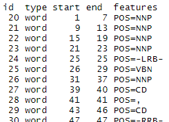
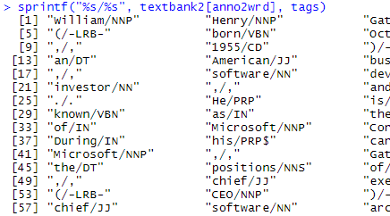
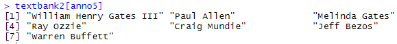
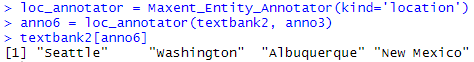
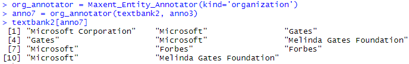

# Web Scraping Example
In this tutorial I will scrape the same webpage as I did in the python example. I will use two familiar libraries `RSelenium` and `stringr` as well as two new libraries `NLP` and `openNLP`. The main R package of interest is `openNLP`. This is based on the Apache OpenNLP library for machine learning [https://opennlp.apache.org/docs/1.9.1/manual/opennlp.html#opennlp](https://opennlp.apache.org/docs/1.9.1/manual/opennlp.html#opennlp). This library supports tokenization, sentence segmentation, part-of-speech tagging, named entity extraction, and chunking--all important elements for the process of extracting named entities from unstructured data.

Prior to implementing `openNLP`, ensure you download the appropriate dictionary by running `install.packages("openNLPmodels.en", repos = "http://datacube.wu.ac.at/", type = "source")`. Many other dictionaries are available such as the Stanford model, as well as other languages for the various dictinaries such as German, French, or Italian (see [https://datacube.wu.ac.at/src/contrib/](https://datacube.wu.ac.at/src/contrib/) for available libraries).

```R
library(RSelenium)
library(stringr)
library(NLP)
library(openNLP)
#install.packages("openNLPmodels.en", repos = "http://datacube.wu.ac.at/", type = "source")
```

Using `RSelenium`, I pull the text from the introductory section of the webpage.

```R
wiki_url = "https://en.wikipedia.org/wiki/Bill_Gates"
rD = rsDriver(verbose=FALSE, browser = 'firefox', port = 4566L)
remDr = rD$client
remDr$navigate(wiki_url)

xp_name1 = '/html/body/div[3]/div[3]/div[4]/div/p[2]'
xp_name2 = '/html/body/div[3]/div[3]/div[4]/div/p[3]'
xp_name3 = '/html/body/div[3]/div[3]/div[4]/div/p[4]'
xp_name4 = '/html/body/div[3]/div[3]/div[4]/div/p[5]'
xp_name5 = '/html/body/div[3]/div[3]/div[4]/div/p[6]'

person_elem = remDr$findElements(using = "xpath", value = xp_name1)
para1 = unlist(sapply(person_elem, function(x) {x$getElementText()}))

person_elem = remDr$findElements(using = "xpath", value = xp_name2)
para2 = unlist(sapply(person_elem, function(x) {x$getElementText()}))

person_elem = remDr$findElements(using = "xpath", value = xp_name3)
para3 = unlist(sapply(person_elem, function(x) {x$getElementText()}))

person_elem = remDr$findElements(using = "xpath", value = xp_name4)
para4 = unlist(sapply(person_elem, function(x) {x$getElementText()}))

person_elem = remDr$findElements(using = "xpath", value = xp_name5)
para5 = unlist(sapply(person_elem, function(x) {x$getElementText()}))

textbank = paste(para1, para2, para3, para4, para5)

remDr$close()
rD$server$stop()
```

The next step, which is optional, is to remove the reference notation from the text. I did not perform this filtering in the python code, but it is a possible option. I then convert the text into a `string` datatype.

```R
ref_pattern = '\\[[0-9]]|\\[[0-9][0-9]]|\\[[0-9][0-9][0-9]]'
textbank2 = str_replace_all(textbank, ref_pattern, "")

textbank2 = as.String(textbank2)
```

The next step is to tokenize the text using a sentence annotizer, `Maxent_Sent_Token_Annotator()`, and a word annotizer, `Maxent_Word_Token_Annotator()`. Once complete, a POST annotator tokenizes the sentences and words using `Maxent_POS_Tag_Annotator()`. The variable `anno1` contains tokenized elements for just words and sentences; `anno2` contains tokenized POST elements.

```R
sent_token_annotator = Maxent_Sent_Token_Annotator()
word_token_annotator = Maxent_Word_Token_Annotator()
pos_tag_annotator = Maxent_POS_Tag_Annotator() 

anno1 = annotate(textbank2, list(sent_token_annotator, 
                               word_token_annotator))

anno2 = annotate(textbank2, pos_tag_annotator, anno1)
```

Sometimes, I like to view the probabilities assigned to each word for the given POS tag. The code below provides output that attaches a new column to the POST data containing the probability of having that POS tag.

```R
(annotate(textbank2, Maxent_POS_Tag_Annotator(probs = TRUE), anno2))
```

While interesting, this is not readable. The actual words are missing. What are the POS tags for a given word? While confusing at first, the output is straight forward. First, filter out everything except words. I remove the sentences from the dataset because I am not interested in those right now.

```R
anno2wrd = subset(anno2, type == "word")
anno2wrd
```



Look at the columns `start` and `end`. These contain index values for the characters in the variable `textnank2`. The first row contains the first word which starts at `1` and ends at `7`. Care to guess what that word is? Return to the website [https://en.wikipedia.org/wiki/Bill_Gates](https://en.wikipedia.org/wiki/Bill_Gates) and look at the first word in the text scraped. The word is `William`. How many characters does it contain?

The next word, the second row, starts at character `9` and ends at `13`. The previous word ends at `7`, so why does it not start at `8`? I will let you figure that out.

The next step is to filter out only those rows of data that have the value `POS` in the `features` column. I only want elements with a POS tag assigned. I can look at the tags using `tag` or displaying them in a tablular format with `table(tags)`.

```R
tags = sapply(anno2wrd$features, `[[`, "POS")
tags
table(tags)
```

The last step is to use the function `sprintf()` to merge the tags with the words.

```R
sprintf("%s/%s", textbank2[anno2wrd], tags)
```



While obtaining POST labels is beneficial, the main focus of this module is to extract named entities. I will show you how to obtain people and locations. Just like in python, I can obtain other named entities. The Apache OpenNLP contains the same standard set that most NER systems use (see [https://opennlp.apache.org/docs/1.9.1/manual/opennlp.html#org.apche.opennlp.running-pear-sample](https://opennlp.apache.org/docs/1.9.1/manual/opennlp.html#org.apche.opennlp.running-pear-sample) for current list). As of this writing, the supported types include
* date
* location
* money
* organization
* percentage
* person
* time

The code for processing named-entity for people is shown below.

```R
anno3 = annotate(textbank2, list(sent_token_annotator, 
                                 word_token_annotator))

entity_annotator = Maxent_Entity_Annotator(kind='person')
entity_annotator
```

Just as with the previous example with POST, this process does not provide the actual text. The code below shows two alternatives to retrieving the text. I can run this

```R
anno4 = annotate(textbank2, entity_annotator, anno3)
anno5 = subset(anno4, type == "entity")
anno5
```

or, as an alternative, this

```R
anno5 = entity_annotator(textbank2, anno3)
anno5
```

and then run this code after either of those to obtain the text.

```R
textbank2[anno5]
```



The code below obtains the location data from the text I scraped.

```R
loc_annotator = Maxent_Entity_Annotator(kind='location')

anno6 = loc_annotator(textbank2, anno3)
anno6

textbank2[anno6]
```



The last example I will show is extracting organization entities from the text. Again, this process is very similar to what I have already done.

```R
org_annotator = Maxent_Entity_Annotator(kind='organization')

anno7 = org_annotator(textbank2, anno3)
anno7

textbank2[anno7]
```


