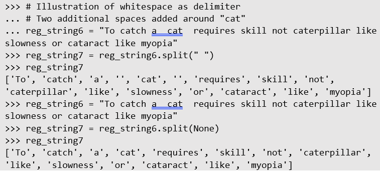

# Regular Expressions in Python
The logic behind regular expressions in Python is similar to what you learned in R, though the syntax of the code itself differs. Like R, Python contains libraries to execute regular expression queries. The two you will familiarize yourself with are `re` and `regex`. When possible, use `regex` because it is backwards compatible with everything `re` is capable of, but brings additional functionality.

```Python
import regex 
 
reg_string1 = "To catch a cat requires skill not caterpillar like slowness or cataract like myopia" 
 
reg_string2 = "Cats exude cataract like myopia" 
 
pattern1 = r"[Cc]at." 
 
# The function match() only compares the  
# first word in a string 
if regex.match(pattern1, reg_string1): 
    print("You found a match!") 
else: print("Bummer. No match.") 
 
if regex.match(pattern1, reg_string2): 
    print("You found a match!") 
else: print("Bummer. No match.")
```

The above example illustrates the similarities of the logic and syntax of Python’s implementation of regular expressions. One interesting addition is found in the regex pattern above `pattern1 = r"[Cc]at."` in which a lowercase `r` is placed before the string contained within quotes. This indicates to Python that the text contained within the quotes is a raw string.

Why make this distinction within Python? Recall that a backslash is a special character in regular expressions, but it also may be used as an escape character. For example, `\t` represents a tab, `\n` represents a newline. If you were searching for specific files on your computer using regular expressions, you would write out the entire path `"C:\\\\Users\matrim\documents"` to represent `C:\Users\matrim\documents`. Notice the use of four backslashes. If you happen to miss using one of those backslashes, your code would not execute properly and attempting to debug this may take a long time. By using the “r” placed before the text, the new string would look like this instead: 

```
r"C:\\Users\\matrim\\documents" 
```

The two most basic functions contained within the library `regex` are `match()` and `search()`. The code below illustrates the difference between the two:

```Python 
#=========================================== 
# Comparing functions match() and search() 
#=========================================== 
matches1 = regex.match(pattern1, reg_string1)
matches2 = regex.match(pattern1, reg_string2)
matches3 = regex.search(pattern1, reg_string1)
matches4 = regex.search(pattern1, reg_string2)
matches5 = regex.search("[Dd][Oo][Gg]", reg_string1)
matches6 = regex.search("[Dd][Oo][Gg]", reg_string2)
 
matches1
matches2
matches3
matches4
matches5
matches6
```

You should see output for `matches2`, `matches3`, and `matches4`, not the others. This is because the function `match()` only looks at the first word contained in a string while `search()` looks at the whole string until it finds a matching word.

The output appears odd at first but is very useful. It indicates where in the string the match occurs. If you only want the matched value returned, then use the function `group()` at the end of the code like so:

```Python
matches2.group()

matches3.group()

matches4.group()
```

In addition to `group()`, a matched object--the object returned by `search()` or `match()`--contains other functions such as `span()`, `start()`, and `end()`.
* `span()` the index range in which the matched word is found within a string
* `start()` the beginning index of the match
* `end()` the ending index of the match

```Python
matches2.span()
matches2.start()
matches2.end()
```

The result of `span()` indicates the match starts at the very beginning of the string and ends at the fifth character. The other two functions are just extensions of `span()`.

The function `group()` has a more exact purpose than providing the actual value matched within a string. Recall that parentheses are used to group parts of a regular expression. As an example, say you would like to grab two parts out of an email address, the username, the host company, and whether it is educational or commercial. 

```Python
reg_email = r"([a-z\.-]+)@([a-z\.-]+)\.(com|edu)" 
pattern_email1 = "bryan.hammer@okstate.edu" 
 
matches7 = regex.search(reg_email, pattern_email1) 
matches7.group() 
matches7.group(1) 
matches7.group(2) 
matches7.group(3) 
```

The output will look like so: 
 
```Python
>>> matches7.group() 
'bryan.hammer@okstate.edu' 
>>> matches7.group(1) 
'bryan.hammer' 
>>> matches7.group(2) 
'okstate' 
>>> matches7.group(3) 
'edu'
```
 
You can create a database with the columns username, company, and entity type. This can be a very powerful tool, especially for web scraping. While this tutorial is not intended to cover web scraping, a hint of what you will later learn can illustrate the power of regular expressions.

One of the problems I face as a faculty member is having a public email address. This is displayed on a webpage for any individual to find. The drawback of this is I receive a lot of spam. This spam comes from some individual scraping email addresses from university webpages and selling them to 3rd party companies. How would this be accomplished? 

Head on over to the webpage [https://business.okstate.edu/msis/directory.html](https://business.okstate.edu/msis/directory.html). This directory contains all the faculty of the department of Management Science and Information Systems. If you look at the source code of the webpage, you will see that all email addresses are contained in code as shown below: 

```HTML
<p><a href="mailto:bryan.hammer@okstate.edu?subject=">bryan.hammer@okstate.edu</a></p> 
<p><a href="mailto:ramesh.sharda@okstate.edu?subject=">ramesh.sharda@okstate.edu</a></p>
```

A simple method of pulling out the email addresses would be the following: 

```Python 
reg_string4 = '<p><a href="mailto:bryan.hammer@okstate.edu?subject=">bryan.hammer@okstate.edu</a></p><p><a href="mailto:ramesh.sharda@okstate.edu?subject=">ramesh.sharda@okstate.edu</a></p>'
 
reg_ptags = r"<p><a href=\"mailto:([a-z\.-]+)@([a-z\.-]+)\.(com|edu)\?subject=\">([a-z\.-]+)@([a-z\.-]+)\.(com|edu)</a></p>" 

matches9 = regex.findall(reg_ptags,reg_string4) 

for emaillist in matches9: 
    print(emaillist) 
```

In the R tutorial on regular expressions, you learned about numbering your capturing groups using \1, or \2, etc. Another variation of this uses named capturing groups, instead of numbered capturing groups. The below example illustrates how this is used.

```Python
reg_ptags2 = r"<p><a href=\"mailto:(?P<username>[a-z\.-]+)@(?P<business>[a-z\.-]+)\.(?P<entitytype>com|edu)\?subject=\">([a-z\.-]+)@([a-z\.-]+)\.(com|edu)</a></p>" 
 
for i in regex.finditer(reg_ptags2,reg_string4): 
    print(i.group('username'), i.group('business'), i.group('entitytype'))
```

Inserting `?P<name>` inside a group attaches a match to that named group. In the example above, three groups are created: `username`, `business`, and `entitytype`. This allows you to reference these groups later in your code just like a numbered capturing group. The advantage is that remembering a name is easier than remembering a number, especially if you have upwards of 20 numbered capturing groups. 

This is a lot to take in, especially if you are unfamiliar with HTML. Take some time and go through the last few concepts. You may need to read through this 4 or 5 times.

Just like in R, Python contains a function that will extract all possible word-matches within a single string. The function `findall()` will return all matches for a given regex pattern. The next example illustrates this. The example provides two alternatives to output the results to the console. The first provides the output as a list while the second displays each match on a single line individually using a loop. 

```Python
reg_string3 = "To catch a cat requires skill not caterpillar like slowness or cataract like myopia" 
pattern2 = r"(cat){1}([a-z]*)" 
 
matches8 = regex.findall(pattern2,reg_string3) 
 
# in the loop, cats is arbitrary; you could use 
# asdf instead of cats 
for cats in matches8:  
    print(cats)
```

What if you wanted a count of the number of matches and not the values themselves? Use the function `len()`.

```Python
len(matches8)
```

Sometimes, the text you are working with needs to be split into substrings. In the R tutorial, most of the content was based on using multiple substrings. In this tutorial, you have learned how to use regex with a single string. To break a string down into a list of substrings, you can use the function `split()`. By default, it uses whitespaces as the delimiter.

```Python
reg_string5 = reg_string1.split()
reg_string5
```

An important note should be given about the default delimiter. Each single whitespace is considered a delimiter. If your string contains two spaces in a row, that will be considered two separate substrings. The use of `None` extends the delimiter to include any whitespace between substrings. 

```Python
reg_string6 = "To catch a  cat  requires skill not caterpillar like slowness or cataract like myopia" 

reg_string7 = reg_string6.split(" ")
reg_string7
 
reg_string6 = "To catch a  cat  requires skill not caterpillar like slowness or cataract like myopia"
reg_string7 = reg_string6.split(None)
reg_string7
```



You can also specify your own delimiter. This can be useful in case your string uses tabs, semicolons, or some other means to separate text. In fact, you can create a regular expression to use as a delimiter! This can be especially useful for scraping data from Twitter, Facebook, Instagram, or many other social media platforms.
