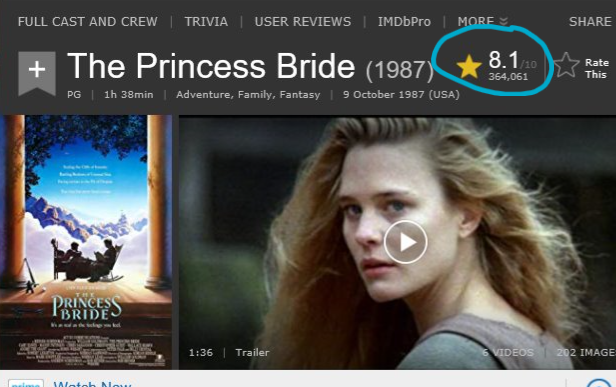
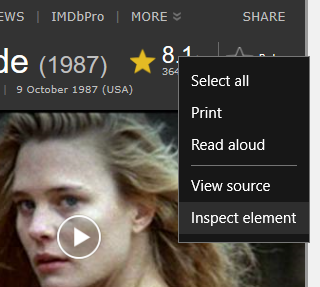
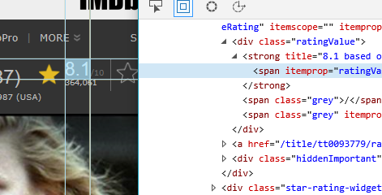
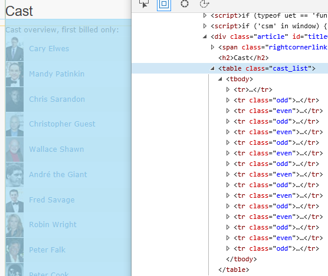
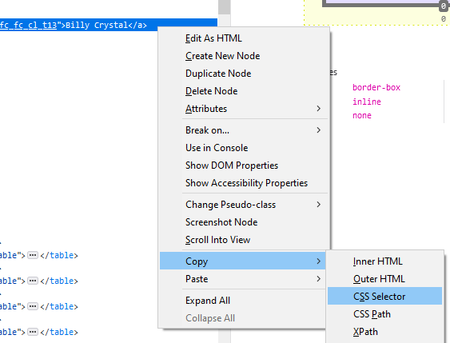

# HTML and CSS Selectors for Web Scraping
What you just learned about HTML and CSS serves as a foundation for understanding and using how HTML with CSS selectors provides a way to scrape data from a webpage. Yet, you still need to understand how all these pieces fit together. If I had to summarize it all up into two important points, they would be this:
* HTML acts as the tree structure that organizes all the parts together
* CSS allows you to target specific HTML you want to reference to scrape data

Knowing how these two work hand-in-hand is vital. In this section, we will discuss using CSS Selectors embedded within HTML to target specific data.

## Types of Selectors
When using CSS selectors, you have a myriad of options to specify the HTML you are after. Below is a table containing the most often used CSS selectors for web scraping. Many other options are available with the current version of CSS, but these are the most important to familiarize yourself with.

| Selector | Type | Example | Example Description |
|:---|:---:|:---|:---|
| .class | basic | `.intro` | Selects all elements with `class="intro"` |
| #id | basic | `#firstname` | Selects the element with `id="firstname"` |
| * | basic | `*` | Selects all elements |
| element | basic | `p` | Selects all `<p>` elements |
| element element | combinator | `div p` | Selects all `<p>` elements inside `<div>` elements |
| element>element | combinator | `div>p` | Selects all `<p>` elements where the parent is a `<div>` element |
| element+element | combinator | `div+p` | Selects all `<p>` elements that are placed immediately after `<div>` elements |
| element1~element2 | combinator | `p~ul` | Selects every `<ul>` element that are preceded by a `<p>` element |
| [attribute^=value] | attribute | `a[href^="https"]` | Selects every `<a>` element whose href attribute value begins with "https" |
| [attribute$=value] | attribute | `a[href$=".edu"]` | Selects every `<a>` element whose href attribute value ends with ".edu" |
| [attribute*=value] | attribute | `a[href*="okstate.edu"]` | Selects every `<a>` element whose href attribute value contains the substring "okstate.edu" |
| :empty | pseudo class | `p:empty` | Selects every `<p>` element that has no children |
| :first-child | pseudo class | `p:first-child` | Selects every `<p>` elements that is the first child of its parent |
| :last-child | pseudo class | `p:last-child` | Selects every `<p>` elements that is the last child of its parent |
| :only-child | pseudo class | `p:only-child` | Selects every `<p>` element that is the only child of its parent |

## Movie Data Example
Ready for an example that will showcase all your new knowledge? Let's dive in! In this example, we would like to pull data about the movie [The Princess Bride](https://www.imdb.com/title/tt0093779/) from imdb.com. This data includes rating and cast.

The first part requires a knowldge of HTML. You need to know where in the webpage's code your data lies. You can identify the data one of two ways: 1) XPath or 2) CSS selectors. As this tutorial specifically focuses on CSS selectors, that is what we will use.



The image above comes from the webpage for *The Princess Bride* on imdb.com. The rating, one of the pieces of data we are scraping, is circled in blue. In order to scrape this piece of data, you need to know where in the code it is embedded. How do you select the CSS on your own? Using a web browser such as Edge (Firefox and Chrome work as well) you need to open the debugging console to find the element. The easiest way to accomplish this is to right-click the item you want and then click *Inspect element* (see the image below).



This will open a new window displaying all the code from the webpage. The program will automatically navigate to the location of the code (see next image). Notice that as you mouse over the code, different elements will receive a focus on the webpage. The image below shows the rating text under a cross hatch with its corresponding line of code highlighted. The `<span>` tag contains the rating data we are after.



The next part requires an understanding of CSS. You must identify the CSS selector in order to pull out the appropriate data. This may require you to play around with various CSS. At first, you might think `<span>` sufficient. A quick perusal of the code for this webpage reveals lots of `<span>` tags. The next logical option is identifying the sibling or parent tag of `<span>`, in this case `<strong>`. How do we reference this using CSS selector notation? Using the table above as a reference, look at row 6. We know that `<span>` is the child of `<strong>`. We can use the notation `strong>span`. 

Is this a good option? A quick perusal of the code would show you other lines of code with those options. The notation `strong>span` would select *all* span tags that have the parent `<strong>`. Let's keep looking.

Moving up one more parent gives you something more unique: `div > strong > span`. Not bad for using the tree structure of HTML. Still this could present potential problems. What else could we use that is more specific? We need to ensure the first HTML tag we specify will select the one we really want.

In the previous tutorial on CSS, I discussed using the ID or class of a tag to identify it. Look at the code again. I have copied the relevant part below for you.

```HTML
<div class="ratingValue">
<strong title="8.1 based on 386,002 user ratings">
<span itemprop="ratingValue">8.1</span>
</strong>
<span class="grey">/</span>
<span class="grey" itemprop="bestRating">10</span>
</div>
```

Do you see an ID or a class that is unique? The topmost `<div>` has a class `class="ratingValue"` that appears fairly unique. The CSS selector notation would simply be `div.ratingValue>strong>span`. Assuming no other tag has that value, this makes obtaining the value fairly straight forward.

The next data to scrape is the [cast list](https://www.imdb.com/title/tt0093779/fullcredits?ref_=tt_ql_1). This is easier to identify in the HTML as shown in the image below.



> Example: Using the code below, determine the CSS selector notation to extract the cast list. Note, this is just a snippet of the code and does not contain the full cast list.

```HTML
<tbody>
    <tr><td colspan="4" class="castlist_label"></td></tr>
    <tr class="odd">
        <td class="primary_photo">
            <a href="/name/nm0000144/?ref_=ttfc_fc_cl_i1"></a>
        </td>
        <td><a href="/name/nm0000144/?ref_=ttfc_fc_cl_t1">Cary Elwes</a></td>
        <td class="ellipsis">...</td>
        <td class="character">
            <a href="/title/tt0093779/characters/nm0000144?ref_=ttfc_fc_cl_t1">Westley</a>
        </td>
    </tr>
    <tr class="even">
        <td class="primary_photo">
            <a href="/name/nm0001597/?ref_=ttfc_fc_cl_i2"></a>
        </td>
        <td><a href="/name/nm0001597/?ref_=ttfc_fc_cl_t2">Mandy Patinkin</a></td>
        <td class="ellipsis">...</td>
        <td class="character">
            <a href="/title/tt0093779/characters/nm0001597?ref_=ttfc_fc_cl_t2">Inigo Montoya</a>
        </td>
    </tr>
    <tr class="odd">
        <td class="primary_photo">
            <a href="/name/nm0001697/?ref_=ttfc_fc_cl_i3"></a>
        </td>
        <td><a href="/name/nm0001697/?ref_=ttfc_fc_cl_t3">Chris Sarandon</a></td>
        <td class="ellipsis">...</td>
        <td class="character">
            <a href="/title/tt0093779/characters/nm0001697?ref_=ttfc_fc_cl_t3">Prince Humperdinck</a>
        </td>
    </tr>
    <tr class="even">
        <td class="primary_photo">
            <a href="/name/nm0001302/?ref_=ttfc_fc_cl_i4"></a>
        </td>
        <td><a href="/name/nm0001302/?ref_=ttfc_fc_cl_t4">Christopher Guest</a></td>
        <td class="ellipsis">...</td>
        <td class="character">
            <a href="/title/tt0093779/characters/nm0001302?ref_=ttfc_fc_cl_t4">Count Rugen</a>
        </td>
    </tr>
    <tr class="odd">
        <td class="primary_photo">
            <a href="/name/nm0001728/?ref_=ttfc_fc_cl_i5"></a>
        </td>
        <td><a href="/name/nm0001728/?ref_=ttfc_fc_cl_t5">Wallace Shawn</a></td>
        <td class="ellipsis">...</td>
        <td class="character">
            <a href="/title/tt0093779/characters/nm0001728?ref_=ttfc_fc_cl_t5">Vizzini</a>
        </td>
    </tr>
    <tr class="even">
        <td class="primary_photo">
            <a href="/name/nm0000764/?ref_=ttfc_fc_cl_i6"></a>
        </td>
        <td><a href="/name/nm0000764/?ref_=ttfc_fc_cl_t6">André the Giant</a></td>
        <td class="ellipsis">...</td>
        <td class="character">
            <a href="/title/tt0093779/characters/nm0000764?ref_=ttfc_fc_cl_t6">Fezzik</a>
        </td>
    </tr>
    <tr class="odd">
        <td class="primary_photo">
            <a href="/name/nm0000625/?ref_=ttfc_fc_cl_i7"></a>
        </td>
        <td><a href="/name/nm0000625/?ref_=ttfc_fc_cl_t7">Fred Savage</a></td>
        <td class="ellipsis">...</td>
        <td class="character">
            <a href="/title/tt0093779/characters/nm0000625?ref_=ttfc_fc_cl_t7">The Grandson</a>
        </td>
    </tr>
    <tr class="even">
        <td class="primary_photo">
            <a href="/name/nm0000705/?ref_=ttfc_fc_cl_i8"></a>
        </td>
        <td><a href="/name/nm0000705/?ref_=ttfc_fc_cl_t8">Robin Wright</a></td>
        <td class="ellipsis">...</td>
        <td class="character">
            <a href="/title/tt0093779/characters/nm0000705?ref_=ttfc_fc_cl_t8">The Princess Bride</a>
        </td>
    </tr>
    <tr class="odd">
        <td class="primary_photo">
            <a href="/name/nm0000393/?ref_=ttfc_fc_cl_i9"></a>
        </td>
        <td><a href="/name/nm0000393/?ref_=ttfc_fc_cl_t9">Peter Falk</a></td>
        <td class="ellipsis">...</td>
        <td class="character">
            <a href="/title/tt0093779/characters/nm0000393?ref_=ttfc_fc_cl_t9">The Grandfather</a>
        </td>
    </tr>
</tbody>
```

To help you think about the solution, first determine what you are after. Here, we would like to scrape the names of the cast. The names are contained in several places. The first thing you should determine is which HTML tag you will pull the data from. Let's use Peter Falk's entry as an example here.

```HTML
<tr class="odd">
    <td class="primary_photo">
        <a href="/name/nm0000393/?ref_=ttfc_fc_cl_i9"></a>
    </td>
    <td><a href="/name/nm0000393/?ref_=ttfc_fc_cl_t9">Peter Falk</a></td>
    <td class="ellipsis">...</td>
    <td class="character">
        <a href="/title/tt0093779/characters/nm0000393?ref_=ttfc_fc_cl_t9">The Grandfather</a>
    </td>
</tr>
```

This HTML comes from a `<table>`, so that should tell you about the structure of the HTML. If you cannot remember, take some time to review [HTML tables](https://www.w3schools.com/html/html_tables.asp).

The basic structure is as follows:

```HTML
<table>
	<tr>
		<td>some text</td>
		<td>other text</td>
	</tr>
	<tr>
		<td>more text</td>
		<td>some stuff</td>
	</tr>
</table>
```

The data is contained within the `<td></td>` table data tags. These data tags are contained within rows `<tr></tr>`. Each cast member has data contained within a table row. Each row has four data `<td></td>` tags or cells:
1. An image of the individual
1. A link, using the individual's name, to their profile page
1. Ellipsis text
1. The name of the movie character

The name of the cast member is contained in the first and second options: the image tag and the profile link. So which one should we use? If you look through all the cast members, you will notice that not every cast member has an image, but each one has a name. Since we are after the names, we cannot use the image tag ``. That leaves the second option.

Knowing this, we need to determine the CSS selector notation. What is the first thing you should look for at this point? Either a unique ID or a fairly unique class name. Start by looking at the HTML tag your data resides in, the anchor tag `<a>`.

Nope, nothing useful there. 

Time to move to the next level of HTML. This would be the data tag `<td>` in which the anchor tag is couched in. Again, nothing stands out, so this cannot be used.

At this point you have a couple of options. You can start to look at neighboring tags or continue to work down the HTML tree structure. A potential neighbor (that is, a tag at an equal level) would be the first `<td>`. It has the attribute `class="primary_photo"`. While not entirely unique, it will select all the cast members. The issue here is that not all cast members have a photo, so not all cast members will have the code `<td class="primary_photo">`. Bummer.

Time to move down the HTML tree. The next level of HTML contains the table row `<tr>`. This appears to have a unique class name: `<tr class="odd">`. If you scroll back up to the example HTML that has multiple cast listings, you will notice that every table row tag switches class name. Some have `.odd` while others have `.even`. Care to guess why these alternate?

It's a simple matter of formatting. Look at the actual webpage. The table rows `<tr>` with `.odd` have a darker shade of gray in the background compared to those with `.even`. How does this effect us using the row for the CSS selector notation? Does this mean we cannot use it?

You can, but you cannot pull *all cast members* by using one selector. You will have to use two. Take a moment to think about it. The answer is at the end of this tutorial.

Another option is you can continue working down the HTML structure and move to the next tag. This solution is also presented below.

## Using Firefox to Extract CSS Selectors
In a perfect world you would be able to choose the CSS selctor on your own without having to use a tool. This comes with more experience than you most likely have. In the meantime, you can also use tools to select it for you.

For this example, I will use the web browser Firefox. Go ahead and open the cast list for *The Princess Bride* using the link provided earlier in this tutorial. Right-click on one of the cast members and select `Inspect Element (Q)`. This will open up the *Developer Tools* window and highlight the HTML you selected.

Find the anchor tag containing the name for Billy Crystal. Right-click on the selection to open the context menu (see image below) and navigate to `Copy` then `CSS Selector`. Paste this in a document. Do this again, but instead of selecting `CSS Selector`, choose `CSS Path`. Paste this in a document as well.



Notice the two solutions given by Firefox. These two are very different from what you or I might have created. This is because Firefox is attempting to select a very specific instance of the tag while in the example I gave you earlier, I want to select several tags at one time. 

The CSS path helps to illustrate this. Look at the end of the CSS path.

```CSS
html.scriptsOn body#styleguide-v2.fixed div#wrapper div#root.redesign div#pagecontent.pagecontent div#content-2-wide.redesign div#main div.article.listo div#fullcredits_content.header table.cast_list tbody tr.odd td a
```

The end contains the elements we looked at in the example: `table.cast_list tbody tr.odd td a`. This does confirm that our reasoning was on track. Note, the CSS path provides the HTML tree structure from the very bottom `<html>` to whatever you select; class names and IDs are included. Notice that IDs are designated with a `#`, like the `<div>` containing the table of interest. In fact, the notation includes not just the ID, but the class name too.

```CSS
div#fullcredits_content.header
```

> Explore two other websites to practice selecting HTML elements. Choose a webpage from OSU and another from Wikipedia. Try to manually choose the CSS selector notation before using Firefox to choose it for you.

As examples of using OSU and Wikipedia, I have a video demonstrating how to determine CSS selectors.
* [:tv: Example of Selecting CSS Selectors](https://youtu.be/wDXQFMaEG7k) 

# Solution to Examples
> Example: Using the code below, determine the CSS selector notation to extract the cast list. Note, this is just a snippet of the code and does not contain the full cast list.

```
tr.odd
tr.even

OR

table.cast_list>tbody>tr
```
