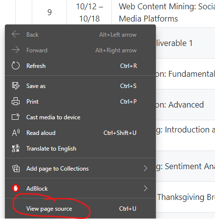

# Hyper Text Markup Language (HTML)
This is the start of the section on HTML. You have a lot of material to cover. Pace yourself. Do not get discouraged. Again, you need to be familiar enough with these concepts to recognize them. I do not expect you to become a web developer or web designer just from this one lesson. 

If at any time you need to look up more information on a topic here, you can use this reference section: [HTML Reference](https://www.w3schools.com/tags/default.asp).

## Basics of HTML
This first section introduces you to HTML. Say hello! You will learn about many of the basic building blocks of HTML. We will be using w3schools.com again, like we did for the Python tutorial. And, just like that tutorial, I have curated specific topics for you to cover. Thus, while w3schools.com may offer more content related to HTML, these are the ones I would like you to review. If you would like to read through all of the content on w3schools.com, then feel free!

I want to make one important note here. While HTML and CSS may appear to resemble programming languages, they are not programming languages. HTML is a markup language. In the world of programming three major styles of languages include the following: scripting, markup languages, and compiled (i.e. programming). 

JavaScript is a scripting language, though it resembles a programming language. A scripting language does not need to be compiled prior to running; it's just interpreted or run on the fly. Python is a scripting language. Each time you use a Python program, the entirety of the code is run live. These types of programming languags run slower than compiled programs because an interpreter has to process a scripting language each. and. every. time. it is run. Very tedious.

Java, C, C++, and many others are first compiled. This makes them less flexible, yet much faster at run-time. Compiled programs tend to have fewer bugs and issues while scripting languages (i.e. interpreted language) are intepreted or ran as you use them leading to more bugs. This is because the interpreter (program that processes the code) can vary depending on the platform. Web browsers operate this way. They interpret the HTML real-time. This is why websites look and operate differently among Edge, Firefox, Chrome, and Safari. Sometimes a website is broken on one browser, so you have to switch to a different one. Each interprets the HTML in its own way (don't get me started on why Safari ruined the web because it interpreted way too loosely going against web standards; grrrrr). In a way, you are up to the mercies of the web browser (or any interpreter) for how code is handled.

I bring this all up because you will find HTML to be very messy in modern websites. The reason? Developers have to include code that runs in Edge/Chrome, then some for Firefox (and other Mozilla-based browsers), and then Safari. Think of having a Python or R script file with lots, and lots, and lots, and lots of if-else statements for every deviation among the interpreters. Yikes! This can lead to very confusing and jumbled HTML on a webpage.

Are you ready to begin? Let's go!
* [HTML Introduction](https://www.w3schools.com/html/html_intro.asp)
* [HTML Basic](https://www.w3schools.com/html/html_basic.asp)
* [HTML Elements](https://www.w3schools.com/html/html_elements.asp)
* [HTML Attributes](https://www.w3schools.com/html/html_attributes.asp)
* [HTML Headings](https://www.w3schools.com/html/html_headings.asp)
* [HTML Paragraphs](https://www.w3schools.com/html/html_paragraphs.asp)
* [HTML Styles](https://www.w3schools.com/html/html_styles.asp)
* [HTML Formatting](https://www.w3schools.com/html/html_formatting.asp)
* [HTML Quotations](https://www.w3schools.com/html/html_quotation_elements.asp)
* [HTML Comments](https://www.w3schools.com/html/html_comments.asp)

## Colors in HTML
This next section covers colors for the Web. Colors influenec everything: the color of a link you have not clicked on, the color on a link when you mouse over it, the color after you have clicked on it; text color, color of tables, color of backgrounds, color of shadows, and so much more. 

Three main options are used for HTML: RGB, HEX, and HSL. The last option, HSL, is rarely used compared to RGB and HEX. Both RGB and HEX have existed for a long time, with RGB having greater support in the early days of the Web. I would only give HSL a cursory glance, just so you can recognize it if you see it on webpages.
* [Color Overview](https://www.w3schools.com/html/html_colors.asp)
* [RGB](https://www.w3schools.com/html/html_colors_rgb.asp)
* [HEX](https://www.w3schools.com/html/html_colors_hex.asp)
* [HSL](https://www.w3schools.com/html/html_colors_hsl.asp)

## Hyperlinks (i.e. URLs)
To me, hyperlinks are what turly connect us and each other on the Internet. When you click on a link on a webpage, tweet, post in social media, chat message, email, or any other web-based program, you are using a hyperlink. Without these, you would not be able to navigate the Internet. We would lose the interconnectivity the Internet gives us. Think about that. This simple little HTML tag is what links millions of people, organizations, and communities together all over the world. Remove these, and we will be back to the days prior to the Internet. Crazy, huh?
* [HTML Links](https://www.w3schools.com/html/html_links.asp)
* [Links](https://www.w3schools.com/html/html_links.asp)
* [Link Colors](https://www.w3schools.com/html/html_links_colors.asp)
* [Link Bookmarks](https://www.w3schools.com/html/html_links_bookmarks.asp)

## Images
For this section you will learn about embedding images within a webpage.
* [HTML Images](https://www.w3schools.com/html/html_images.asp)
* [Images](https://www.w3schools.com/html/html_images.asp)
* [Image Map](https://www.w3schools.com/html/html_images_imagemap.asp)
* [Background Images](https://www.w3schools.com/html/html_images_background.asp)
* [The Picture Element](https://www.w3schools.com/html/html_images_picture.asp)

## Tables
Ah, tables. I have very fond memories of tables. In the early days of the Web, tables were actually used to structure and format webpages. Yes, they were also used to present data on a webpage (the original, intended purpose), but because no true formatting tags existed we relied heavily on tables. This created a very slow Internet because tables take longer to process by interpreters compared to other HTML. I was guilty of this.

With that, on to the segment on tables.
* [HTML Tables](https://www.w3schools.com/html/html_tables.asp)

## Lists
This section covers everything about lists, including bulleted and numeric.
* [HTML Lists](https://www.w3schools.com/html/html_lists.asp)
* [Lists](https://www.w3schools.com/html/html_lists.asp)
* [Unordered Lists](https://www.w3schools.com/html/html_lists_unordered.asp)
* [Ordered Lists](https://www.w3schools.com/html/html_lists_ordered.asp)
* [Other Lists](https://www.w3schools.com/html/html_lists_other.asp)

## HTML Used to Structure Webpage
One of the best things (and worst) to happen to HTML is the inclusion of the `

` tag. This opened a new world to structuring and formatting beautiful webpages. This meant not relying on `<table></table>` for this job (a huge relief). This also meant webpages became more complex and messy, especially because `

` was not well defined in the beginning.

Read on to learn about ways to organize, structure, and format a webpage
* [HTML Block & Inline](https://www.w3schools.com/html/html_blocks.asp)
* [HTML Classes](https://www.w3schools.com/html/html_classes.asp)
* [HTML Id](https://www.w3schools.com/html/html_id.asp)
* [HTML Iframes](https://www.w3schools.com/html/html_iframe.asp)
* [HTML Head](https://www.w3schools.com/html/html_head.asp)
* [HTML Layout](https://www.w3schools.com/html/html_layout.asp)

## Files and References
Remember discussing global and local variables for R and Python? Well, HTML has something similar. These are referred to as absolute and relative. Though similar, they do not operate exactly like the concepts of *global* and *local*.
* [HTML File Paths](https://www.w3schools.com/html/html_filepaths.asp)
* [HTML JavaScript](https://www.w3schools.com/html/html_scripts.asp)

## HTML Forms and Data
During the span of a week you usually fill out some information on a webpage and submit it. This could be registering for a new account someplace, signing up for a service, or perhaps a post in Instagram, Facebook, Twitter, or many other social media platforms. Have you ever wondered how that worked? You will.
* [HTML Forms](https://www.w3schools.com/html/html_forms.asp)
* [HTML Form Elements](https://www.w3schools.com/html/html_form_elements.asp)
* [HTML Input Types](https://www.w3schools.com/html/html_form_input_types.asp)
* [HTML Input Attributes](https://www.w3schools.com/html/html_form_attributes.asp)
* [HTML Input Form Attributes](https://www.w3schools.com/html/html_form_attributes_form.asp)

## More Examples
Do you feel like you need more examples to help you understand how these parts all fit together? Here you go: [HTML Examples](https://www.w3schools.com/html/html_examples.asp)

You can also view the HTML on any website you visit. On most browsers, simply find a blank space on the webpage and right-click to bring up the context menu.

Select the option `View page source`. This should bring up the HTML for the webpage. Do note, this may not reflect the original HTML sent from a server to your web browser. We will cover that in detail in a later tutorial on web scraping.

Just an FYI, I sometimes use this trick to bypass paid walls, like those found on news sites. For those websites, a little window opens in the middle preventing you from reading the article, asking you to pay or signup for service. Oh yeah? Well, just open the `page source`, browse the HTML until you find the content of the article (I usually just use `Ctrl-F` to find the first line of the text) and read on. This only works if the entire article is loaded into the webpage. Larger news outlets like Wall Street Journal smartly load only a portion of the news article, so this little trick won't work.

I suggest you try this out on simple websites, like [https://www.w3schools.com/css/css_intro.asp](https://www.w3schools.com/css/css_intro.asp). If you try ESPN or similar websites with lots of content, the complexity increases.
