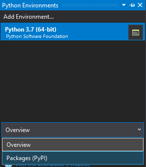
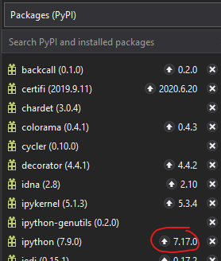

# Review of Python
This tutorial is meant to offer a quick overview of Python and basic programming syntax. Hopefully, you have been exposed to programming in the past. If your experience was years ago (as opposed to a few months) then you may need to experiment with Python a little more than what this tutorial will expose you to.

At any time if a Pythonic term, phrase, or concept is confusing, please feel free to use the following webpages to seek clarification:

* [Python Keywords](https://www.w3schools.com/python/python_ref_keywords.asp)
* [Python Glossary](https://www.w3schools.com/python/python_ref_glossary.asp)

## Module Tasks
Please complete the following tasks:

* :notebook:Read the tutorial documentation above
* :tv:Watch the videos
* :school:Complete the ICE in class, in groups or individually
* :computer:Complete the THA on your own, individually

### Tutorials
Please read the remainder of this document. No extra tutorials are available.

Open Visual Studio and create a new python script file. Simply navigate to the menu and click on `File`, `New File` (a new window opens), select `Python` in the new menu and then `Empty Module`. Use this file to follow along with the exercises below.

To execute a line of code within Visual Studio, simply place your cursor on the line you wish to execute and type Ctrl+Enter. If you wish to run a whole block of code (like an entire loop), highlight the entire block and then type Ctrl+Enter.

## Python
This tutorial will rely on material provided by W3Schools.com, a website that introduces basic knowledge for a wide variety of programming languages, such as Python. While the website may divide up the Python content in a specific manner, I have divided the content below based on how I would like you to review the concepts and ideas.

As you go through the different sections, the website provides a space for you to practice writing the code under discussion. While this is less effortful, I recommend you open up Visual Studio and follow along. The more you practice in your development enrivonment, the more comfortable you will be using the software. This comfort will pay dividends later in the semester as you learn more complex tasks in Python.

If you feel frustrated at any point learning a new programming language, do not feel like a failure. Remember, learning a programming language is like learning a new spoken language. If you have taken a language class in the past--such as Spanish, Japanese, Arabic--you know how difficult it can be. Becoming fluent is difficult. Fluency often comes with years of experience. The same idea applies here for a programming language. You are learning how to communicate with the computer in a language it can understand. If fluency comes slow, do not panic. This is normal. Different people learn at different rates; some people spend less time learning the symantics and subtleties than others. 

Without further ado, let's jump right in!

### Updating Python Libraries
One of the first tasks you should engage in is updating your libraries. Do not worry about what a library is at this moment. We will discuss that later in this module. I will show you how to update libraries in Visual Studio.

Locate your `Python Environments` window within Visual Studio. It should look similar to what you see below. Select the drop-down menu and select the option `Packages (PyPI)`. You will see a list of all the libraries you currently have installed.



Some of your libraries may indicate an update is available. This is shown by an icon that is an arrow pointing up with a number (the version number) next to it. See the image below.



To update the library, simply click on the arrow. For example, need to update my ipython library to version 7.17.0. By clicking on the arrow, the current version is uninstalled and the new version is installed. If a window pops open asking permission to make changes, click "Yes". 

Python utilizes a package called `pip` to manage the updates. This is a package manager. You can use pip from the command line or within IDEs like Visual Studio. You should always maintain the most recent update for pip. If you have a lot of updates, I suggest updating pip first. At some point, when you have become comfortable with Python and using a command line, I suggest updating your libraries with pip through the command line, rather than a graphical interface.

At times you may run into errors when using Python. This is usually due to one of two things:
1. Your libraries are old and need updating in order to function correctly
2. An updated library conflicts with an older library, leading to broken functionality

Rarely will you run into the second problem. If you are using a well-supported Python library, like numpy, ipython, or sklearn, then chances are the developers have checked for interoperability with other popular libraries. They may not have checked it with Less popular libraries, so be aware. If you install a less popular library, perhaps something developed by an individual user for their own usage (and not meant for the public), interoperability may be problematic.

[:tv: Python Updating and Managing Libraries](https://youtu.be/x32w6qVsteo): How to update Python using pip through Visual Studio.

### Learning the Basics
In this section you will be introduced to the most basic concepts of Python. This mostly covers basic syntax. You will notice each of these topics is very short. Again, this is a review of Python and you will be covering the same amount of material in this entire tutorial that an undergraduate in their 2nd year would cover in a semester. No pressure!

An important note. We will revisit these topics throughout the semester. You will be exposed to more complex ideas as the semester wears on. For example, one of the topics below is `Strings`. This will play an important role when you learn about regular expressions.

Please work through each of these in order.
* [Introduction to Python](https://www.w3schools.com/python/python_intro.asp)
* [Syntax](https://www.w3schools.com/python/python_syntax.asp)
* [Commenting](https://www.w3schools.com/python/python_comments.asp)
* [Variables](https://www.w3schools.com/python/python_variables.asp)
* [Data Types](https://www.w3schools.com/python/python_datatypes.asp)
* [Numbers](https://www.w3schools.com/python/python_numbers.asp)
* [Add Two Numbers](https://www.w3schools.com/python/python_howto_add_two_numbers.asp)
* [Casting](https://www.w3schools.com/python/python_casting.asp)
* [Strings](https://www.w3schools.com/python/python_strings.asp)
* [Booleans](https://www.w3schools.com/python/python_booleans.asp)
* [Operators](https://www.w3schools.com/python/python_operators.asp)


[:tv: Python Basics](https://youtu.be/YAtKdX4d94g): Performing basic operations in Python.

### More on Characters and Strings
Using numberical values tends to be more straight forward and easier to use in programming languages. This is because they behave in a logical fashion. Additionally, the functions and operations associated with them follow logical patterns. Characters and strings, on the other hand, are not so logical. Becoming familiar with how they operate is vitally important. You might say, this will come back to haunt you later in the semester.
* [String Formatting](https://www.w3schools.com/python/python_string_formatting.asp)
* [String Reference](https://www.w3schools.com/python/python_ref_string.asp)

A simple example of how challenging characters and strings may be is given as follows. You would like to print a message to the screen indicating the value of a variable. At first, you might create code that looks like this:

```python
j = 2

print('Hey, j has the value of j.')
```

The first "j" is merely a representation of the name of the variable while the second "j" is the output of the variable. Unfortunately, the output looks like this.


Not quite what you wanted. Perhaps another attempt.

```python
j = 2

print('Hey, j has the value of')
print(j)
print('.')
```


Hey, the value of `2` is output, so that's an improvement. Still, it would be nice to have the value and the period on the same line as the rest of the sentence.

Here is one way to accomplish this.

```python
j = 2

print('Hey, j has the value of %d.' % (j))
```

If you have more than one value to output in the `print()` function, just extend the previous code like so.

```python
j = 2
k = 'potato'

print('Hey, j has the value of %d. Is that the same as %s?' % (j,k))
```


The value `%s` represents string. If you used `%d` Python would have thrown an error because it was looking for a numeric value.

What if you had used two numerical values? Simple.

```python
j = 2
k = 45

print('Hey, j has the value of %d. Is that the same as %d?' % (j,k))
```


You can then extend this pattern as many times as necessary.

```python
j = 2
k = 45

print('Hey, j has the value of %d. Is that the same as %d? No, %d is equal to %d' % (j,k,j,j))
```


Ok, looks good. What if we wanted to ignore the format of the value? Say, you don't want to worry about whether a value is a string or number. I got you covered.

```python
j = 2
k = 'potato'

print('Hey, j has the value of {}. Is that the same as {}? \nUmmmm, no. Why would you ask that?' .format(j,k))
```


What about a simpler solution? What about inserting something inline instead of appending it at the end of the sentence? Ok, how's this?

In Python, you can concatenate strings simply by using the `+` inline. Like so: `print('Hey, ' + k + ' is a veggie.')`. A numerical value, unfortunately, is not a string, and therefore you cannot concatenate it.

Problem? No. You simply convert the numeric value into a string.

```python
j = 2
k = 'potato'

print('Hey, j has the value of ' + str(j) +'. Is that the same as ' + k + '?' +
	'\nUmmmm, no. Why would you ask that?')
```


This could be handy. The other methods require you to keep track of position of your variables throughout the string you are building. The last method merely requires you to insert the variables where you need them, no need to remember order.

Ok, just one more example and I will move on.

```python
j = 2
k = 'potato'

print(f'Hey, j has the value of {j}. Is that the same as {k}?' +
	'\nUmmmm, no. Why would you ask that?')
```


This last one tends to be the cleanest in my opinion. None of these are better than the others, so use the one you are most comfortable with.

<!---[:tv: Python Strings and Characters]() 
* Video: Discussion on strings and characters in Python.-->

### Data Containers
Earlier you learned about `variables` and their ability to retain stored values. For example, we can store numeric values or strings in a variable:

```python
age = 93
weight = 183
first_name = 'Russell'
last_name = "Nelson"
zipcode = '84065'
```
A couple of important points about variables. Notice that one of my strings has double quotes while the other two utilize single quotes. You can use either as long as you are consistent. I personally like single quotes and so I will utilize single quotes throughout my script file. Others like using double quotes. This is a preference.

The other thing to note is that zipcode is contained as a string, not a number. It is a numeric value, is it not? Then why would I create the variable as a string? The answer is simple. Save a value as a number if you can perform a math operation on it. If it is a value that will never have a math operation performed on it, then save it as a string. Zipcode is not a numerical number in which math operations will be performed. You would not add 74075 to 97006 would you? At least, I hope you would not.

Many types of containers exist in programming languages. The main ones you will use frequently in Python include those listed in the table below. Note, the links to the review pages are contained within the column `Container Name`.

| Container Name | Ordered | Changeable | Duplicates | Reference |
|:---:|:---:|:---:|:---:|:---|
| [Lists](https://www.w3schools.com/python/python_lists.asp) | Ordered | Changeable | Allowable | [List Methods](https://www.w3schools.com/python/python_ref_list.asp) |
| [Tuples](https://www.w3schools.com/python/python_tuples.asp) | Ordered | Unchangeable | Allowable | [Tuple Methods](https://www.w3schools.com/python/python_ref_tuple.asp) |
| [Sets](https://www.w3schools.com/python/python_sets.asp) | Unordered | Unchangeable | Prohibited | [Set Methods](https://www.w3schools.com/python/python_ref_set.asp) |
| [Dictionaries](https://www.w3schools.com/python/python_dictionaries.asp) | Unordered | Changeable | Prohibited | [Dictionary Methods](https://www.w3schools.com/python/python_ref_dictionary.asp) |
| Arrays | Ordered | Changeable | Allowable | N/A |

In addition to these, you will rely on arrays. You will notice that no review page is linked for arrays. We will cover arrays below in another section. Normally, I would include the topic in this section, but you need additional skills prior to learning how to use them. Additionally, arrays are not built-in to Python. You need to rely on libraries to import the functionality. Many Python purists encourage the use of lists over arrays. For me personally, I learned to use Java and C long before Python, so I am more comfortable with the use of arrays over lists.

<!---[:tv: Python Containers]() 
* Video: Creating and using containers in Python.-->

### Evaluating Conditions and Statements
Any program will run through your code linearly. That is, it will run each line of code in the order it appears. Yet, you may want to not run a section of code for one reason or another. For example, you are offering a scholarship for students and the criteria includes GPA and annual income. To qualify, students must earn less than $20,000 a year and have a cumulative GPA of 3.7. The below is a hypothetical data set of students who applied. Additionally, it runs code to email those who qualify to notify them and a separate line of code to notify those who did not qualify.

```python
gpa_list = [3.2, 3.7, 3.8, 3.3, 2.8, 3.9]
name_list = ['Greg Moody', 'Jamal Chambers', 'Harshit Venkatraman', 'Sneha Gupta', 'Rebel Williams', 'Akira Kanashiro']
income_list = [12000, 5640, 32000, 7546, 9547, 4390]

# Email those who qualify
email_function(email_list, 'qualify')

# Email those who do not qualify
email_function(email_list, 'no qualify')
```

Quickly, you can determine who would qualify for the scholarship. Only two students qualify: Jamal Chambers and Akira Kanashiro. This requires you to manually sift through the data to determine who qualifies. What if over 700 students applied? Would it not be better if this process was automated for you? Also, the code would email all students regardless of qualification. We need some way to automatically differentiate between those who qualify and those who do not.

Using conditional statements would solve this problem. Sometimes these are referred to as if-then statements or if-else statements. The logic is straight forward. First, an evaluation is performed. This is in the form of a comparison and includes the following:
* Equals `==`
* Not equals `!=`
* Less than `<`
* Less than or equal to `<=`
* Greater than `>`
* Greater than or equal to `>=`

In our situation, we would want to compare the student GPA to `3.7` and the income to `20000`. The question is, which of the comparisons would we use for each of them?

For GPA, you could approach it using multiple comparison types:

```python
gpa > 2.9

gpa >= 3.7
```

For income, the same applies.

```python
income < 20000

income <= 19999
```

What if students cannot earn less than $10,000? Then we could adjust the code by using the `AND` operator.

```python
income < 20000 and income >= 10000
```

Thus, the final code could be written like so.

```python
gpa_list = [3.2, 3.7, 3.8, 3.3, 2.8, 3.9]
name_list = ['Greg Moody', 'Jamal Chambers', 'Harshit Venkatraman', 'Sneha Gupta', 'Rebel Williams', 'Akira Kanashiro']
income_list = [12000, 5640, 32000, 7546, 9547, 4390]

if gpa >=3.7 and income < 20000 and income >= 10000:
	# Email those who qualify
	email_function(email_list, 'qualify')
else:
	# Email those who do not qualify
	email_function(email_list, 'no qualify')
```

For a more detailed discussion on if-else statements, please review the following:
* [If...Else](https://www.w3schools.com/python/python_conditions.asp)

Ultimately, you would develop code that would email one response to the recepients who receive the scholarship, but not the others. Without if-else statements you could not execute the code separately.

[:tv: Python Conditional Statements](https://youtu.be/_syRY71w1Yo): Executing evaluation and conditional statements in Python.

### Iterating Through Data
You may find yourself in a situation in which you need to iterate through some data contained in a list, tuple, set, dictionary, or array. Programming languages have built-in functions that allow you to iterate through the data. The two most basic types in Python include `While` and `For`. The `while loop` includes an evaluation statement, so you can think of it like an if-else loop (I know, it isn't the same thing, but just go with it). In other words, it suggests, "Do the following block of code while a statement is true. When the statement is no longer true, stop it."

The `for loop` is interesting. If you have experience in other programming languages, then you have certain expectations here. Drop them. In Python, this operates more like an iterator rather than what I would consider a traditional `for` loop.

Please review the following:
* [While Loops](https://www.w3schools.com/python/python_while_loops.asp)
* [For Loops](https://www.w3schools.com/python/python_for_loops.asp)
* [Iterators](https://www.w3schools.com/python/python_iterators.asp)

[:tv: Python Loops](https://youtu.be/6y1WnIQVyCE): Iterating through data using `for` and `while` loops in Python.

Now that you are familiar with iterating through data, we can talk about arrays (I told you we would come back to arrays; how could you doubt me?). Arrays can be thought of as data containers, like lists, tuples, and sets; however, arrays allow for special functionality not present in those other options. 
* [Python Arrays](https://www.w3schools.com/python/python_arrays.asp)

### Running Stored Code
Back in our discussion on if-else statements I noted that sometimes you do not want code to execute in a linear fashion. In the example, a program you were writing needs to email one message to those who qualify for a scholarship while the other students are emailed a different message to notify them they did not qualify. Notice the line of code I wrote is on a single line. You are passing in a variable `email_list` to the function `email_function()`.

```python
gpa_list = [3.2, 3.7, 3.8, 3.3, 2.8, 3.9]
name_list = ['Greg Moody', 'Jamal Chambers', 'Harshit Venkatraman', 'Sneha Gupta', 'Rebel Williams', 'Akira Kanashiro']
income_list = [12000, 5640, 32000, 7546, 9547, 4390]

if gpa >=3.7 and income < 20000 and income >= 10000:
	# Email those who qualify
	email_function(email_list, 'qualify')
else:
	# Email those who do not qualify
	email_function(email_list, 'no qualify')
```

A couple of observations here. First, notice that the function is exactly the same for those who qualify and those who do not. A function allows you to reuse code. If we did not have the function, the code might look like the following:

```python
gpa_list = [3.2, 3.7, 3.8, 3.3, 2.8, 3.9]
name_list = ['Greg Moody', 'Jamal Chambers', 'Harshit Venkatraman', 'Sneha Gupta', 'Rebel Williams', 'Akira Kanashiro']
income_list = [12000, 5640, 32000, 7546, 9547, 4390]

if gpa >=3.7 and income < 20000 and income >= 10000:
	# Email those who qualify
	import smtplib
	from email.message import EmailMessage
	msg = EmailMessage()
	msg.set_content('Congratulations, you have qualified for a scholarship! Please reply to this email within 10 days of reception to begin the process of receiving your funds.')
	msg['Subject'] = 'Results of Scholarship Application'
	msg['From'] = 'bryan.hammer@okstate.edu'
	msg['To'] = email_list
	s = smtplib.SMTP('localhost')
	s.send_message(msg)
	s.quit()
else:
	# Email those who do not qualify
	import smtplib
	from email.message import EmailMessage
	msg = EmailMessage()
	msg.set_content('Thank you for applying to such-and-such scholarship. Unfortunately, you do not qualify. Sorry.')
	msg['Subject'] = 'Results of Scholarship Application'
	msg['From'] = 'bryan.hammer@okstate.edu'
	msg['To'] = email_list
	s = smtplib.SMTP('localhost')
	s.send_message(msg)
	s.quit()
```

I know a lot of the syntax may be unfamiliar to you, such as the `import`, but ignore that for now. Notice that a lot of the code is used twice. This is a lot of wasted space. We can consolidate that so it is cleaner.

```python
gpa_list = [3.2, 3.7, 3.8, 3.3, 2.8, 3.9]
name_list = ['Greg Moody', 'Jamal Chambers', 'Harshit Venkatraman', 'Sneha Gupta', 'Rebel Williams', 'Akira Kanashiro']
income_list = [12000, 5640, 32000, 7546, 9547, 4390]

def email_function(emails,qualification, msg):
	import smtplib
	from email.message import EmailMessage
	msg = EmailMessage()
	msg.set_content(msg)
	msg['Subject'] = 'Results of Scholarship Application'
	msg['From'] = 'bryan.hammer@okstate.edu'
	msg['To'] = emails
	s = smtplib.SMTP('localhost')
	s.send_message(msg)
	s.quit()

if gpa >=3.7 and income < 20000 and income >= 10000:
	# Email those who qualify
	email_function(email_list, 'qualify', 'Congratulations, you have qualified for a scholarship! Please reply to this email within 10 days of reception to begin the process of receiving your funds.')
else:
	# Email those who do not qualify
	email_function(email_list, 'no qualify', 'Thank you for applying to such-and-such scholarship. Unfortunately, you do not qualify. Sorry.')
```

We have gone from 28 lines of code to 22. That may not seem like a lot, but imagine a containing five thousand lines of code. If the rate of line reduction was 6, like in our example, we would have 3,928 lines. That's a little over 1,000 lines removed. Considering most modern programs span multiple files with thousands of lines of code, this is a considerable advantage. (The message to those who qualify reads like a phishing message, doesn't it? Well, if life does not work out as a professor for me, maybe I can become an African prince in exile who is looking for funding to recapture my throne)

Let's review the concepts of functions and lambdas.
* [Python Functions](https://www.w3schools.com/python/python_functions.asp)
* [Python Lambda](https://www.w3schools.com/python/python_lambda.asp)

[:tv: Python Functions](https://youtu.be/NrD1uAePYe4): Using all the concepts learned thus far, an example function illustrates using functions in Python.

An important programming concept is scope. This refers to the level at which a variable is accessible. You can have a *local* variable and a *global* variable. Please read through the following for an explanation on scope. A *global* variable is accessible from almost anywhere in your program file. A *local* variable is only accessible within a specific block of code. 

For example, if you define a variable within a block, you cannot reference it outside of the block:

```python
j = 2

if j > 1:
	x = 2 + 3
	print('Looks like 2 is greater than 1')
	print(x)
else
	x = 47 / 3
	print('Looks like 2 is not greater than 1')
	print(x)

print(x)
```

Ths code contains three `print(x)`: one within the if statement, one in the else statement, and another at the very end. The third would throw an exception. This is because x is defined within the if and else statements, one level lower. To use a variable, it must be defined at the same level as the code utilizing it. To correct this code, we would do this:

```python
j = 2
x = 0

if j > 1:
	x = 2 + 3
	print('Looks like 2 is greater than 1')
	print(x)
else
	x = 47 / 3
	print('Looks like 2 is not greater than 1')
	print(x)

print(x)
```

Notice I initialized the variable `x` with the value `0`. This value is arbitrary; I could have selected `39483979373973947`. Remember, Python has no command or function to declare a variable: it's created the moment you assign a value. Before you say it, casting in Python is not the same as declaring a data type for a variable. At a surface level, they appear the same, but subtley they are not.

By using `x = 0` I am essentially saying to Python, "Hey, this is a numeric variable. Just so you know." This also serves as a reminder to me that it is numerical. Remember, variables can have any data type in Python, so intializing a variable with a specific value can be a helpful reminder.

I have created the variable `x` outside the if-else statement. This allows me to reference it at that level of the code. If instead you create a function, the variable inside the function will not be treated as a global variable even if you have the same variable outside of the function.

```python
j = 2
x = 0

def funky():
	j = 3
	x = 'onigiri'
	print(j)
	print(x)

funky()

print(j)
print(x)
```


Strange. What is going on here? If you use the same variable name inside and outside of a function, Python views them as separate and distinct. The first `x` is a global version while the `x` contained within the function is local to the function. To get around this, you would need to only create the variable one time, at the global level.

```python
j = 2
x = 0

def funky():
	print(j)
	print(x)

funky()
```

I did mention that you have to create a variable at the level you would like to access it. I lied. Well, kind of. You can use the keyword `global` inside a function, for example, to create a global-level variable.

```python
def funky():
	global j 
	global x
	j = 3
	x = 'onigiri'
	print('Local Level')
	print(j)
	print(x)

funky()

print('Global Level')
print(j)
print(x)
```

Hmmmm, that is interesting. That suggests something. Remember the problem we had earlier about creating a variable, both at the global and local levels, and Python treating them as separate variables?

```python
x = 0

def funky():
	x = 'onigiri'
	print(x)

funky()

print(x)
```


Using the keyword `global` can help resolve this problem.


```python
x = 0

def funky():
	global x
	x = 'onigiri'
	print(x)

funky()

print(x)
```


Be careful. I would not recommend this. If you need to use a variable inside a function, pass that variable into the function, then use a diffrent name inside the function.

```python
x = 0

def funky(y):
	print(y)
	y = 'onigiri'
	print(y)

funky(x)

print(x)
```

For more on scope within Python, please read this.
* [Python Scope](https://www.w3schools.com/python/python_scope.asp)

More specific methods exist to run previously developed code. Modules (i.e. libraries, packages, etc.) are self-contained snippets of code. Many wonderful modules exist developed by other people. Using their code saves you the time and effort of writing that exact same code. This allows you to focus more of your time and effort on other tasks. The downside is that it was developed by another person. Potentially, the code may not be optimized for your specific use-case. It may contain artifacts that cause your program problems. Only download and use a module/library from trusted sources.
* [Python Modules](https://www.w3schools.com/python/python_modules.asp)

If you have used an object-oriented language such as Java or the OS Linux or Unix, you know that managing libraries/packages/modules can become burdensome. This is especially true when it comes to updating the packages. Why? Imagine managing updates for 53 Python libraries you are using in a current project. You would need to manually check the updates every day. Additionally, and this is the most severe problem, is you may update a package that conflicts with another package. Now your code no longer works correctly. You could spend hours debugging the issue without realizing the issue does not lie in your own code, but a library someone else wrote! Trust me, this has been my experience.

Enter the package manager. The package manager automatically checks for package updates as well as conflicts. Windows Update is perhaps the most familiar package manager system to you. Unfortunately, these systems are not fool-proof. Sometimes, a library is updated which leads to conflicts. I personally wait some time prior to updating any program or library to allow others to discover any existing problems. This is a good practice in general.

For Python, the most popular package manager is PIP. Here is a short introduction in how to use PIP.
* [Python PIP](https://www.w3schools.com/python/python_pip.asp)

### More on Data Types
While the majority of the data types you use in Python are numeric and string, you will also encounter another type that behaves differently from them: dates. This data type includes time, not just calendar dates. 
* [Python Dates](https://www.w3schools.com/python/python_datetime.asp)

### Python Math Functions
At times you will need to perform math operations on numerical values. Be aware that Python includes many types of math operations. Please work on the following review:
* [Python Math](https://www.w3schools.com/python/python_math.asp)

### File Handling
I will not spend a lot of time discussing file handling. I will make an important note here. Different Python libraries and packages have their own functions and methods of importaing and exporting files. While the functions presented here are useful to know, they will not be the only ones you learn this semester.
* [File Handling](https://www.w3schools.com/python/python_file_handling.asp)
* [Read Files](https://www.w3schools.com/python/python_file_open.asp)
* [Write/Create Files](https://www.w3schools.com/python/python_file_write.asp)
* [Delete Files](https://www.w3schools.com/python/python_file_remove.asp)
* [Reference](https://www.w3schools.com/python_ref_file.asp)

### Advanced Topics
This last section deals with more advanced topics and are merely for your information. Well, the first topic *Classes and Objects* is important to familiarize yourself with as is the second topic *Python Inheritance*. The other topics cover data handling with the last two focusing on database systems. I suggest you merely become acquainted with the material in the last three.
* Classes and Objects: [w3schools.com](https://www.w3schools.com/python/python_classes.asp)
* Python Inheritance: [w3schools.com](https://www.w3schools.com/python/python_inheritance.asp)
* Python JSON: [w3schools.com](https://www.w3schools.com/python/python_json.asp)
* Python MySQL: [w3schools.com](https://www.w3schools.com/python/python_mysql_getstarted.asp)
* Python MongoDB: [w3schools.com](https://www.w3schools.com/python/python_mongodb_getstarted.asp)
