# Review of R
This tutorial is meant to offer a quick overview of R and basic programming syntax. Hopefully, you have been exposed to programming in the past. If your experience was years ago (as opposed to a few months) then you may need to experiment with R a little more than what this tutorial will expose you to.

## Module Tasks
Please complete the following tasks:

* :notebook:Read the tutorial documentation
* :tv:Watch the videos within the documentation
* :school:Complete the ICE in class, in groups or individually
* :computer:Complete the THA on your own, individually

### Tutorials
Please read the remainder of this document. No extra tutorials are available.

Open RStudio and create a new R file. Simply navigate to the menu and click on `File`, `New File`, `R Script`. 

To execute a line of code within RStudio, simply place your cursor on the line you wish to execute and type `Ctrl+Enter`. If you wish to run a whole block of code (like an entire loop), highlight the entire block and then type `Ctrl+Enter`.

Throughout the tutorial I provide examples for you to try. The solutions are presented at the end of this document. While you may be tempted to look at them, please do not. I want you to try and figure it out on your own until you have exhausted all possible thought; only then look at the answer.

## Meet R
Like Java, C, C++, Python, and many other languages R is a programming language. Unlike most programming languages, R is a statistical package first and a programming language second. You will find during the semester that many statistical procedures and computations are easier to perform in R; whereas, programming-like syntax are easier in Python. To reiterate, Python is a programming language first and statistical package second.

R is open source operating under the GNU license. One of the strengths of R is the community. Like other programming languages, R is extended by individuals like you and I who develop libraries and packages. The vast majority do this for free on their own time.

To get a sense for the size and scope of this community, you can browse currently submitted [R packages](https://cran.revolutionanalytics.com/web/packages/available_packages_by_name.html). You will find many advanced, modern statistical procedures here that are not available in commercial offerings like SAS or IBM Modeler. This is because there is no monetary ROI attached to those who have a passion for developing content.

For more on the background of R, see [https://www.r-project.org/about.html](https://www.r-project.org/about.html).

For more in-depth manuals maintained by the R Core Team, see this [webpage](https://cran.r-project.org/manuals.html).

With that introduction, let's jump into learning the basics of R.

### Learning the Basics
In this section you will be introduced to the most basic concepts of R. This mostly covers basic syntax. You will notice each of these topics is very short. Again, this is a quick overview of R and you will be covering the same amount of material in this entire tutorial that an undergraduate in their 2nd year would cover in a semester. No pressure!

An important note. We will revisit these topics throughout the semester. You will be exposed to more complex ideas as the semester wears on. For example, one of the topics below is `Strings`. This will play an important role when you learn about regular expressions.

I understand that you may feel overwhelmed at this point. Yet, give it time. The more you practice and use R, the more comfortable it will feel. By the end of the semester, R will feel like an old friend.

#### Managing Packages in R

Installing packages in R is simple and can be performed from the command line. You only need to know the name of the package.

```R
install.packages('<packagename>')
```

You can find the name of any package in the official [R packages](https://cran.revolutionanalytics.com/web/packages/available_packages_by_name.html) list. Remember, these are case sensitive, so be sure to spell the name correctly.

To load a package into memory so you can access its functions, use this code:

```R
library(<packagename>)
```

Installing packages over time tends to accumulate quite a mess. You may have packages that have overwritten other packages, rendering them useless. This can be problematic if you are unsure which packages have done this. Sometimes, having a clean slate is the most practical option. An excellent blog post on R-bloggers shows [how to remove all user installed packages](https://www.r-bloggers.com/how-to-remove-all-user-installed-packages-in-r/) in R.

[:tv: Managing Packages in R](https://youtu.be/byE7LlUTeAo): Installing and loading packages and libraries in R.

#### Syntax
Unlike Python, R follows a more traditional programming language with indentations. That is, instead of using indentations to denote blocks of code, R uses curly braces.

```R
if(x>2) {
  y = 100
}
else {
  y = 148
}
```

The first brace `{` denotes the beginning of the block and the end brace `}` indicates the end of the block. In some ways, this allows for greater slack in your code. For example, I could have used the following code, and the results would be the same.

```R
if(x>2) {
y = 100
}
else {
y = 148
}
```

The two blocks of code are equivalent because the braces tell R where the blocks are. In Python, this is not possible.

Another important aspect of syntax is the assignment operator in R. You can use either `=` or `<-` in R. Here is an example.

```R
x <- 3
y = 3

x == y
```

This evaluation will print `TRUE` to the console. Unlike the vast majority of programming languages which only use `=` as the assignment operator, why would R provide two options? In fact, when you peruse documentation for R online, most use `<-` instead of `=`.

Here is a quote from [Revolution Analytics](https://blog.revolutionanalytics.com/2008/12/use-equals-or-arrow-for-assignment.html) with an explanation:

> A little history before we continue: when the R language (and S before it) was first created, <- was the only choice of assignment operator.  This is a hangover from the language APL, where the arrow notation was used to distinguish assignment (assign the value 3 to x) from equality (is x equal to 3?). (Professor Ripley reminds me that on APL keyboards there was an actual key on the keyboard with the arrow symbol on it, so the arrow was a single keystroke back then. The same was true of the AT&T terminals first used for the predecessors of S as described in the Blue Book.)

Ok, so it's a holdover from earlier days when R was in its infant stage. But, are any notable differences present? The answer is, "Maybe?"

I will not dive deep into the difference here because you will most likely never encounter any problems related to this. If you are interested in understanding this, a lively discussion on Stack Overflow has been around for more than 10 years: [discussion on Stack Overflow](https://stackoverflow.com/questions/1741820/what-are-the-differences-between-and-assignment-operators-in-r).

Ultimately, it is your personal preference. I came from a traditional application development background, so my habits are built around using `=`, but you can use the *gets arrow* `<-` if you fancy it.

Here is another reason I avoid using the *gets arrow*. Typos.

```R
x <- 27

x < -27

x < - 27
```

Look at those lines of code. The first line assigns the value 27 to variable `x`. The other two lines of code evaluate an expression, is `x` less than `-27`? I have pointed out this problem with R traditionalists and they still like to use the *gets arrow*. Honestly, it also requires an additional key stroke.

One last discussion point for syntax. You can use parentheses to execute a line of code and output the results to the console. For example, if you perform an operation such as creating a vector named `vect` you would have to type out the name of the vector on a new line to output its content.

```R
vect = c(3:11)

vect
```

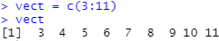

You can avoid this by surrounding your line of code with parentheses, like so:

```R
(vect = c(3:11))
```

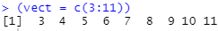

This saves time and space within your file.

#### Commenting
Commenting in R is very basic. Any line begining with `#` is interpreted by R as a comment. For example, the following is a comment.

```R
# This line is a comment in R
x = 22
# Another comment from R
#comment again
```

Unlike other programming languages, R does not have multi-line commenting syntax. If you wish to comment on multiple, consecutive lines, you need to continue using `#` on each line.

```R
# This is an example
# of a multi-line comment.
# It spans multiple lines,
# not just a single one.
```

Commenting is an important part of programming and scripting. It enables you and others to understand the process presented in your script file. I have found it the best method of retaining historical information. I have returned to files more than 10 years old. Those with good comments are easy for me to understand my workflow, selection of code and functions, and decision for certain statistical techniques.

As you write your code, you will inevitably delete work. Perhaps you oringally chose a boxplot and then switched to a horizontal bar chart. You take a hiatus, return to your work 8 months later, and cannot remember the work clearly. Why did you not choose a boxplot? Or, perhaps you did, but the results were not good.

A couple of suggestions on using commenting for history keeping:
1. Comment, rather than delete
2. Comment to describe

Some people will comment out "bad" code, rather than deleting it. This provides very good history of your work. You include all of your decisions and past workflow.

One problem with this method is the document can become lengthy. Another problem is your workflow becomes confusing; with lots of changes, deletions, adjustments, your code will become difficult to read. Just because a block of code you commented out lays in a specific position in the file, does not mean it originally existed there in your workflow. Maybe when you first started that block of code was supposed to be the end, but after many iterations and changes it now lies in the middle.

I tend to use the second option, comment to describe, with some of the first. I will delete a segment of code, put in place a comment describing what I tried, the results, and why I moved onto something else. If I have a partiularly complex piece of code that I might return to in the future, I comment it out *and* 1) describe why I am no longer using it and 2) mention why I might return to it in the future.

Commenting is so much work. I get it. I was a developer for years. Trust me on this. You want to comment. You need it.

#### Variables
Variable names in R are case-sensitive. The variable `t` is not the same as `T`. Setting a value for `t` and then a different one for `T` does not override the existing value for `t`.

```R
t = 3
T = 'I deserve a treat'
```

Variables should not start with a number or symbol. For example, do not use `2data` or `786val` or `&jdi9`. This can lead to problems when performing math operations or statistical operations.

Another important note. You can use the period `.` in a name, but not a space "` `". The underscore `_` is a great option for spacing characters in a name.

Like in Python, variables are instantiated the moment you assign a value. You do not need to declare the variable like in traditional programming languages.

Not much more needs to be said here other than this: use variable names that make sense. I once took over a project from a non-programmer (he only had the job because he needed the cash and his dad knew the manager). All the variables were some iteration of his wife's name, Aislynn. 

For example:

```R
aislynn1 = 65
aislynn2 = i + aislynn_roundup
```

These variables had no meaning. I would have to read through all the code and try to reverse engineer everything. Usually, I deleted the entire file and started from scratch.

Here is an example of code you will use later this semester for web scraping. I know this may seem very complex and there is lot going on, but pay less attention to all the new things and focus on the variable names.

```R
imdb_rating = princbride %>%
  html_node("div > strong > span") %>%
  html_text() %>%
  as.numeric()

imdb_castlist = princbride %>%
  html_nodes(".cast_list") %>%
  html_text()
```

I am scraping data from IMDB for a movie called *The Princess Bride*. The variables make sense. I do not need metadata or documentation to explain to me what those variables are.

#### Data Types
Like Python, R has data types built-in.

| Category | Data Type |
|:---|:---|
| Numeric Type | `integer`, `numeric` |
| Text Type | `character` |
| Sequence Type | `vector`, `factor`, `matrix`, `array`, `list` |
| Boolean Type | `logical` |
| Data | `data frame` |

Notice I placed `data frame` by itself. This could easily be placed with the `Sequence Type` because it shares many of the same characteristics. Yet, it possesses many unique attributes that set it apart.

The next few sections will discuss each of the different categories of data types.

#### Numbers
Three main types of numeric data types exist in R: integer and numeric. The integer, like in Python, is a number without decimals, or a whole number. To instantiate a variable as an integer, you need to use the function `as.integer()`.

```R
age1 = as.integer(35)
age2 = as.integer(47)
```

This works on non-integers, converting them into integers. For example, if someone is 70.3 inches tall. You would like to store this as the variable `height1`, but only as an integer.

```R
height1 = as.integer(70.3)
```

This results in the value of `70`.

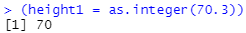

To evaluate if a variable is an integer, simply use the `is.integer()` function.

```R
is.integer(height1)
```

The above expression returns the value `TRUE`. For a non-integer, it returns `FALSE`.

The `numeric` data type is the default for variables in R. This data type is actually a decimal. These are automatically created any time you make a numeric variable. This includes assigning a value that is an integer.

```R
x = 47
is.integer(x)
```

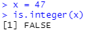

This returns `FALSE`. If you explicitly want an integer, you must use the function `as.integer()`.

#### Strings
A variable with characters is assumed to be a `character` data type. Like in Python, you need to surround your character string with either single quotation marks or double.

```R
x = 'hello world'
y = "hello world"

x == y
```

The above results in `TRUE`, indicating that both `x` and `y` contain the same value. Which do you choose? This all depends. For me, sometimes I am in the mood to use single quotes. You will see some of my tutorials using double quotes, sometimes single quotes.

> Example: Within RStudio, create the following variables: `firstname` where it is equal to your first name, `lastname` where it equals your last name, set `u` equal to the character 4, set `p` equal to the integer with value 7.6, and set `d` equal to the decimal 3.14.

Like Python, a few different methods exist for printing values. The first involves the combination of `print()` and `paste()`.

```R
x = 'hello Stillwater'

print(paste('I want to hear you shout', x, '.'))
```

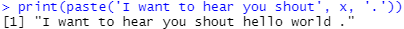

The function `paste()` combines the elements which are separated by commas. Each element must be placed in the order of appearance. The function contains three elements:
* The string "I want to hear you shout"
* The variable `x`
* The string "."

One problem does exist. Look at the end of the sentence in the output. A space is between the word "world" and the period. The function `paste()` has an argument that will help with that. It is `sep=""`. This should remove the extra white space.

```R
print(paste('I want to hear you shout', x, '.', sep=''))
```

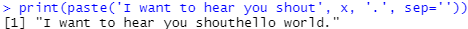

Ok, looks like it worked a little too well. The extra white space was removed around the variable `x`, but now the words "shout" and "hello" have merged. One more time!

I will add a space after the word "shout".

```R
print(paste('I want to hear you shout ', x, '.', sep=''))
```

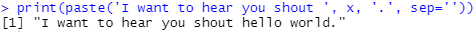

That worked perfectly. Now the proper amount of white space exists.

The second method you can use involves the function `cat()`. This is fairly simple in comparison.

```R
cat('I want to hear you shout', x, '.')
```

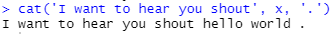

A third method comes from the `glue` package. This provides string interpolation, similar to what you saw in Python.

```R
library(glue)

y = 'hello OSU'
glue('Please tweet out {y}.')
```

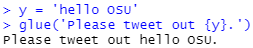

The only downside is having to load in a library, if you consider that a downside.

> Example: Given the following variables, use the `print()` function to output the values in the order they are given to you: `firstname` equal to your first name, `sentence1` equal to "likes to eat", `breakfast` equal to your most common breakfast food/meal, `sentence2` equal to "very often because", `eat_reason` equal to the reason you eat that food/meal. Perform this using the `paste()` function and then perform it again on a separate line using the `cat()` function.

You might come across discussion on this topic online. Some people recommend `sprintf()` as an option. *Do not use this*. From the R documentation:

> The format string is passed down the OS's sprintf function, and incorrect formats can cause the latter to crash the R process.

#### Operators
R contains many of the same operators you find in Python:
* Arithmetic
* Comparison
* Logical
* Assignment

Other operators exist, but those are covered in MSIS 5223 *Programming for Data Science and Analytics II*. For now, these are what I consider relevant for this semester.

*Arithmetic* operators perform mathematical operations on numerical data.

| Operator | Name | Example |
|:---|:---|:---|
| `+` | Addition | `x + y` |
| `-` | Subtraction | `x - y` |
| `*` | Multiplication | `x * y` |
| `/` | Division | `x / y` |
| `%%` | Modulo | `x %% y` |
| `^` | Exponent | `x ^ y` |

*Comparison* operators compare two values, like in Python:

| Operator | Name | Example |
|:---|:---|:---|
| `==` | Equal | `x == y` |
| `!=` | Not equal | `x != y` |
| `>` | Greater than | `x > y` |
| `<` | Less than | `x < y` |
| `>=` | Greater than or equal to | `x >= y` |
| `<=` | Less than or equal to | `x <= y` |

*Logical* operators combine conditional statements.

| Operator | Name | Description | Example |
|:---:|:---|:---|:---|
| `&` | AND | Equivalent to Python's *And*. Returns `TRUE` if both statements are true. | `q = 3i+7`<br/>`r = 3i+7`<br/>`print(q&r)` |
| `!` | NOT | Equivalent to Python's *Not*. Reverse the result, returns `False` if the result is true | `print(!q&r)` |
| `\|` | OR | Equivalent to Python's *Or*. Returns `True` if one of the statements is true| `x=5`<br/>`y=3`<br/>`x<4\|y<4` |

*Assignment* operators were already covered in the previous section on syntax. They include the get arrow `<-` or `->` and the equal sign `=`.

### Sequences and Containers
Like Python, R possesses containers (or sequences) to house values or variables.

| Container Name | Ordered | Changeable | Duplicates |
|:---:|:---:|:---:|:---:|
| Vectors | Ordered | Changeable | Allowable |
| Lists | Ordered | Changeable | Allowable |
| Factors | Either | Changeable  | Allowable  |
| Arrays | Ordered | Changeable | Allowable |
| Matrices | Ordered | Changeable | Allowable |

Each of these is discussed below.

#### Vectors
Think of vectors as the most basic form of sequences. It is a container of data of the same data type. That is, all the values within the vector will have the same data type. This means all values will be numeric, all character, etc.

Many methods exist for creating vectors. The simplist method is using the function `c()`. I am going to create a vector of numeric values.

```R
vec1 = c(1,4,2,4,5)
is.vector(vec1)
```

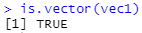

An interesting aspect of vectors is that when you insert a value that has a differing data type, it force converts all other values to be similar.

```R
vec2 = c(1,4,2,4,5,'some text')
is.vector(vec2)
```

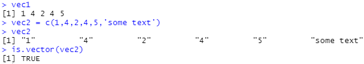

Compare the output of `vec1` and `vec2`. Notice that the values for `vec2` have double quotes surrounding them. This indicates they are characters. So, by adding in `'some text'` into `vec2`, R automatically converted all the numbers into characters. I can confirm this easily.

Let's look at the first value in each vector, the number `1`. I can access this value using an index. It is the first value, so I can access its value by typing `vec1[1]`.

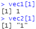

Clearly the first value within each vector is a one. Yet, for `vec2` the value is a character because it has double quotes. Still doubting me? Run this code in R.

```R
is.numeric(vec1[1])
is.numeric(vec2[2])

is.character(vec1[1])
is.character(vec2[1])
```

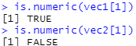

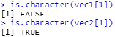

This indicates that only one of them is numeric; the other is not.

> Example: Create two vectors. The first vector contains the following values: 1, 3, 53, 642, 23, 73, 922; the second vector contains the following values: 1, 3, 53, 642, 23, 73, 922, 'no more'. Evaluate each of them to determine if their data type is numeric or character.

You can determine the length of a vector, or the number of values it contains, by using the function `length()`

```R
length(vec1)
```

You can also access any of the values within the vector by using its index value, like so.

```R
# First value
vec1[1]

# Fourth value
vec1[4]
```

> Example: Create a vector with the following values: 'cheese', 'dough', 'tomato sauce', 'sausage', 'pepperoni'. Using the index value, output the value for 'tomato sauce'.

You can create numeric vectors using other functions, such as `seq()` and `rep()`. The function `seq()` creates a sequence of numbers from one value to another; by default it increments by 1. If we want to create a vector of the numbers 1 through 10, incrementing by 1, then we would type the following.

```R
seq(1,10)
```

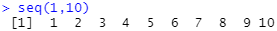

If we would like to increment by 2.

```R
seq(1,10,by=2)
```


We can create a vector of repeating numbers as well. If we want to have 12 repeating 4s, we would type this.

```R
rep(4,12)
```

If we want to repeat the numbers 1 through 4 three different times, we would use this.

```R
rep(1:4,3)
```

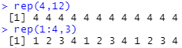

#### Lists
Lists can be thought of as a collection of dissimilar data types. They are considered *recursive* because of this. 

```R
list_a = list(vec1, vec2, x)
list_a
```

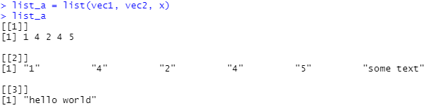

You can access the various items in your list by using the index number. To access `vec1`, you would use `list_a[1]` because it is the first item in the list.

#### Factors
This is a special form of a vector in that the data type contained within is categorical. You use the function `factor()` to convert a vector into a sequence of categorical data.

```R
vec3 = c('happy','sad','worried','happy','happy','worried','sad','worried','happy')

classmoods = factor(vec3)
```

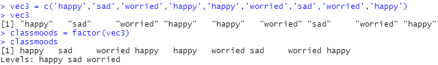

You can order your factors if you desire. Do note, that an ordered factor with the same values as an unordered factor *are not equal*. That is, R does not consider them equivalent variables.

```R
classmoods2 = factor(vec3, ordered=T)
```

#### Matrices
Think of a matrix as a table of data. It contains rows and columns of data. Below is a matrix containing 4 rows and 4 columns.

```R
matrix(data=NA, nrow=4, ncol=4, byrow=T)
```

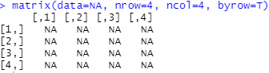

You can access any data point contained therein by specifying the row and column. Let's create a "4x4" table containing the numbers 1 through 16 to illustrate this.

```R
matrix1 = matrix(data=1:16, nrow=4, ncol=4, byrow=T)
```

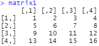

Let's pick a value to retreive from the matrix. How about row 3, column 4? The value is 12.

```R
matrix1[3,4]
```

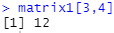

You can create matrices from vectors using `rbind()` and `cbind()` depending on how you would like to orient the data. How about we combine `vec3` to a new vector with the same number of items, listing out numbers starting with 1?

```R
vec4 = 1:length(vec3)
```

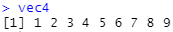

```R
rbind(vec3,vec4)

cbind(vec3,vec4)
```

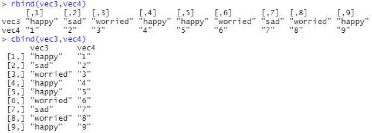

Do note, the numeric values contained in `vec4` are now characters. This is because in R, matrices are either numeric or character in type, not both. Let's create a numeric matrix by creating a new vector that orders the numbers in reverse.

```R
vec5 = length(vec3):1

cbind(vec4,vec5)
```

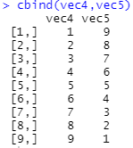

#### Arrays
Arrays are composed of *n* dimensions, meaning they may contain multiple vectors. For example, a one-dimensional array is like a numeric value: it contains only one value. A two-diemnsional array contains two. R provides for three-dimensional and greater arrays. Here is an example of one-, two-, and seven-dimensional arrays.

```R
(arr1 = array(2:8, dim=c(1)))
(arr2 = array(2:8, dim=c(2)))
(arr3 = array(2:8, dim=c(7)))
```

You can also create arrays similar to a table or matrix. This one has 4 "rows" and 4 "columns".

```R
(arr4 = array(2:9, dim=c(4,4)))
```

[:tv: R Sequences and Containers](https://youtu.be/AwAPnoAGOoA): Using sequences and containers within R.

### Evaluating Conditions and Statements
Just like in Python, you can utilize if-else statements in R. Also, like in Python, these rely on comparison operators. Keep in mind that R relies on curly braces to segment blocks of code, unlike Python which utilizes indention.

R does allow a shortcut, however. If you have only one line of code to execute, then you could use either option presented below. The first utilizes `{}` while the second does not.

```R
if(x>23) {
 y = 100
}

if(x>23) y=100
```

These two are equivalent. This is also true for if-else statements.

```R
if(x>23) {
  print("First option")
} else {
  print("Second option")
}
```

The alternative would be this.

```R
if(x>23) print("First option") else print("Second option")
```

Personally, I always use the curly braces. This maintains better organization in my code.

An important note about the syntax. Note the placement of the `else` statement. This must follow the closing curly brace of the preceding `if` statement. That is, the following would *not* work.

```R
# This does not execute and will throw an error
if(x>23) {
  print("First option")
}
else {
  print("Second option")
}
```

> Example: Within RStudio, create a if-else statement that evaluates the expression `y > 56`. For the `if` block, print "y is less than 56"; for the `else` block, print "y is greater than 56". Create a global variable `y` and set its value such that your if-else statement works appropriately.

You can stack if-else statements to build an infinite number of test cases.

```R
if (evaluation1) {
  block1
} else if (evaluation2) {
  block2
} else if (evaluation3) {
  block3
} else {
  block4
}
```

As a more specific example, we can evaluate the value for `j`.

```R
j = 346

if(j<0) {
  print('j is less than 0')
} else if (j<23) {
  print('j is greater than 0, but less than 23)
} else {
  print('j is greater than 23')
}
```

[:tv: R Evaluating Expressions with If-Else](https://youtu.be/JohML3EGlUk): Evaluating expressions in if-else statements using comparison operators.

### Iterating Through Data
R posseses two loop commands like Python and most other programming languages.
* `for` iterates through a sequence (i.e. list, array, etc.)
* `while` evaluates a conditional statement and executes until no longer true

Using a `for` loop with a vector is simple. Let's use a vector and iterate through it.

```R
vec1 = c(1,4,2,4,5)

for(i in vec1) {
  print(i)
}
```

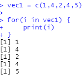

Loops also behave like if-statements with respect to braces. For example:

```R
for(i in 1:5) {
  print(i)
}
```

As an alternative without curly braces:

```R
for(i in 1:5) print(i)
```

Like if-statements, this only works if you have a single line contained within your braces. For multi-line blocks, you cannot use this version.

> Example: Try creating a `for` loop yourself. Within RStudio, create a `for` loop that iterates through a vector which contains the following values: 'cheese', 'dough', 'tomato sauce', 'sausage', 'pepperoni'. Print out each value, one by one.

The `while` loop behaves similarly to other programming languages. It evaluates a conditional statement and continues iterating, executing the expression contained within the curly braces until the condition changes. 

```R
i = 0
while(i<10) {
  print(i)
  i = i + 1
}
```

The while loop presented above evaluates the condition `i<10`. So long as `i` is less than the number `10`, the loop executes the code, or expression, contained within the curly braces. 

Notice a global variable outside the loop, `i = 0` is set prior to the loop. Think of this as the start value for the loop. I want to loop 10 times, so I start out with 0. I arbitrarily chose the number 0. I could have chosen 1 as the start and then changed the conditional statement to `i<11`, like so:

```R
i = 1
while(i<11) {
  print(i)
  i = i + 1
}
```

This would have resulted in the same number of iterations or loops: 10 of them. Go ahead, run both of these inside R.

> Example: Try building your own loop. Create the variable *k* and loop through it 15 times. Try one loop with `k = 0` and another with `k = 15`. Print out each incremental value of k.

We can try something a little more complex with vectors. Are you ready?

> Example: Create a vector with the following values: 'cheese', 'dough', 'tomato sauce', 'sausage', 'pepperoni', 'mozzarella', 'bell pepper', 'red onion', 'garlic'. Use a `while` loop to print out each value.

<!---[:tv: R Loops](): Iterating through data using `for` and `while` loops in R.-->

### Running Stored Code
You can create functions like in other programming languages. Recall, a function is a set or block of code which only executes when called upon. You should already be familiar with functions. You have already used many of them. For example, the function `length()` or `print()` executes code which is hidden from you. Someone else took the time to write it so you would not have to figure it out on your own.

What happens when you need to write it yourself? I have done this many times. In R, the basic format of a user-defined function looks like this:

```R
function_name = function(arg1, arg2,...,argn) {
  executed code in here
  return value
}
```

The `function_name` is the name of the function and what you reference when you would like to execute the function. So, for the `print()` function, its name is `print`.

The list of variables `arg1`, `arg2`, `arg3`, etc. are the arguments you pass in. A function can receive as many arguments as you would like. All functions have predefined arguments they accept.

The `print()` function primarily accepts a string. Did you know it contains other arguments? For example, it contains the argument `quote` which indicates whether or not your string should be printed with surrounding quotes.

```R
print('Hello, my name is Inigo Montoya, you killed my father, prepare to die', quote=TRUE)
```

Within the body of the function some code is executed. This code will do something (whatever you choose) using the arguments you pass in.

Lastly, the `return` statement returns some value back out. This is optional.

Let's try making our own function. I want to create a function that takes in my name, and the quote from Inigo Montoya, and return a string.

```R
montoya_quote = function(firstname, lastname) {
  senten1 = 'Hello, my name is'
  senten2 = 'you killed my father, prepare to die.'
  lastname = paste(lastname, ',', sep='')
  senten_final = paste(senten1, firstname, lastname, senten2)
  return(senten_final)
}

fname = 'Bryan'
lname = 'Hammer'

the_quote = montoya_quote(fname, lname)

the_quote
```

You can also return multiple values from a function. Yet, this is not very intuitive. At first, you may assume you could return values like so:

```R
montoya_quote = function(firstname, lastname) {
  senten1 = 'Hello, my name is'
  senten2 = 'you killed my father, prepare to die.'
  lastname = paste(lastname, ',', sep='')
  senten_final = paste(senten1, firstname, lastname, senten2)
  return(senten_final, 'data', 'potato')
}
```

This throws an error inside of R. You must first create a list of objects, and then return them.

```R
montoya_quote = function(firstname, lastname) {
  senten1 = 'Hello, my name is'
  senten2 = 'you killed my father, prepare to die.'
  lastname = paste(lastname, ',', sep='')
  senten_final = paste(senten1, firstname, lastname, senten2)
  x = 1268348
  stuff_return = c(senten_final, 'data', 'potato', x)
  return(stuff_return)
}
```

You would then receive a list as the returned object. These means parsing out the objects from the list, not such a terrible task, but an additional step. In Python, this is not a required step; you can return multiple objects from inside a function.

[:tv: R Functions](https://youtu.be/JQ5lyOY4SI4): Using all the concepts learned thus far, an example function illustrates using functions in R.

### Date and Time Data Types
All modern statistical packages provide functions that perform mathematical operations and dates and times. For example, say you have data on employee work hours and you need to calculate pay for hourly employees. For each day over a five-day span you have the time the employee clocked in and the time the employee clocked out. You need to calculate the total number of hours the employee worked by using one of two methods: 
1. You convert the date-time values into hours-minutes-seconds and sum up the values or 
2. Use a date-time function that will automatically convert for you and provide you the total hours.

The second option is the obvious choice as it requires minimal computational skills on your part. R has a function, `difftime()`, that will provide the difference between two date-time values. One of the downsides to most statistical packages is they do not convert date-time values into date-time objects. That is, date-time values are read as categorical values made up of character strings; you cannot perform math on character strings. This means that functions like `difftime()` will not work on the data.

Converting date-time values in any statistical program requires work, and R is no exception. For this portion of the tutorial you will be given an example of how to convert date-time values from categorical datatypes to date-time datatypes. You can use the [afib_data.txt](data/afib_data.txt) file to follow along. The figure below contains the column names of the dataset. This contains data on atrial fibrillation patients.

```R
# Read in the csv file
afib_data = read.table("C:\\Users\\bryan\\source\\repos\\msis5193-pds1-master\\review-r\\data\\afib_data.txt", header=T, sep="\t")

# Display column names
names(afib_data)
```

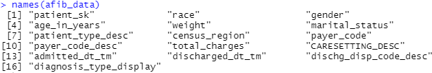

As mentioned previously, R imports date-time values as categorical datatypes. The dataset contains two date-time columns: `admitted_dt_tm` and `discharged_dt_tm`. Looking at figure below, the datatypes for both are listed as `factor`. The next step is to convert these two columns into a date-time datatype.

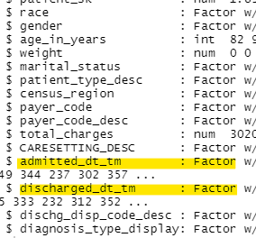

The function in R to convert a string into a date-time datatype is `strptime()` or "strip time." This function is dependent on your ability to format the sequence of numbers and delimiters correctly in order to convert it to a date-time datatype. 

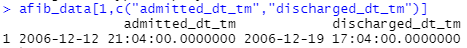

Before we use the function, we need to first determine how the data is formatted. Let's pull the first record from the data and only look at the two columns of interest.

The line in the figure above shows how the date-time is formatted in the dataset. Notice that it has the year (in four digits) first, then a dash, then the month, then another dash, and then the day. After this a space follows, and then the hour (a 24-hour format), the minute, the seconds, and seven trailing zeroes.

Let's use the strip time function. This process essentially creates a new column of data. I will have to insert it back into the data frame later.

```R
admitdate = strptime(as.character(afib_data$admitted_dt_tm),"%Y-%m-%d %H:%M:%S.0000000")
```

The first part that uses the `as.character()` function merely converts the `admitted_dt_tm` column into a character string in case it isn’t already. The next part tells R what the format of the date-time character string is. The `%Y` represents a four-digit year, as opposed to `%y` that represent a two-digit year. The `%m` represents a two-digit month. Notice a dash lies between `%Y` and `%m`. This is because the actual data has a dash. If the year and month had a forward slash, like "2016/05/23" then you would have to type `%Y/%m/%d`. 

The following are all of the formatting characters used by R for date-time datatypes:

| Character | Description |
|:---:|:---|
| `%a` | Abbreviated weekday name |
| `%A` | Full weekday name |
| `%b` | Abbreviated month name |
| `%B` | Full month name |
| `%c` | Date and time, locale-specific |
| `%d` | Day of the month as decimal number (01–31) |
| `%H` | Hours as decimal number (00–23) on the 24-hour clock |
| `%I` | Hours as decimal number (01–12) on the 12-hour clock |
| `%j` | Day of year as decimal number (001–366) |
| `%m` | Month as decimal number (01–12) |
| `%M` | Minute as decimal number (00–59) |
| `%p` | AM/PM indicator in the locale |
| `%S` | Second as decimal number (00–61, allowing for two 'leap seconds') |
| `%U` | Week of the year (00–53) using the first Sunday as day 1 of week 1 |
| `%w` | Weekday as decimal number (0–6, Sunday is 0) |
| `%W` | Week of the year (00–53) using the first Monday as day 1 of week 1 |
| `%x` | Date, locale-specific |
| `%X` | Time, locale-specific |
| `%Y` | Year with century |
| `%Z` | Time zone as a character string (output only) |

Now that the column admitted_dt_tm is converted to a date-time datatype, it needs to be placed back into the original dataframe. To do this, it must first be converted into a dataframe and then appended to the end of the original dataframe. The object `admitdate` is just a vector and cannot be placed into the dataframe, so it must be converted to a `data frame` object. The following code shows how this is done, along with the conversion of the column `discharged_dt_tm`.

```R
admitdate = as.data.frame(admitdate)

afib_data = data.frame(afib_data, admitdate)

dischargedate = strptime(as.character(afib_data$discharged_dt_tm),"%Y-%m-%d %H:%M:%S.0000000")

dischargedate = as.data.frame(dischargedate)

afib_data = data.frame(afib_data, dischargedate)
```

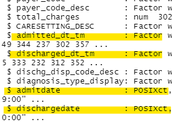

The last two columns listed show a datatype of `POSIXct`. This is one of the date-time datatypes found in R. The `ct` stands for continuous time. The other date-time datatype is `POSIXlt`, where `lt` stand for list time. You can convert back and forth between the two. When performing date-time operations, ensure that your columns of data are all `POSIXct` or all `POSIXlt` within your data frame, not both.

### File Handling
I cover this in greater detail in a later tutorial, so we will not cover it here.

### Solutions to Examples
> Example: Within RStudio, create the following variables: `firstname` where it is equal to your first name, `lastname` where it equals your last name, set `u` equal to the character 4 (confirm it is a character), set `p` equal to the integer with value 7.6, and set `d` equal to the decimal 3.14.

```R
firstname = 'Bryan'
lastname = 'Hammer'
u = '4'
is.character(u)
p = as.integer(7.6)
d = 3.14

firstname
lastname
u
p
d
```

> Example: Given the following variables, use the `print()` function to output the values in the order they are given to you: `firstname` equal to your first name, `sentence1` equal to "likes to eat", `breakfast` equal to your most common breakfast food/meal, `sentence2` equal to "very often because", `eat_reason` equal to the reason you eat that food/meal. Perform this using the `paste()` function and then perform it again on a separate line using the `cat()` function.

```R
firstname = 'Bryan'
sentence1 = 'likes to eat'
breakfast = 'steel cut oats with honey and two jumbo eggs'
sentence2 = 'very often'
eat_reason = 'because he likes them.'

print(paste(firstname, sentence1, breakfast, sentence2, eat_reason))

cat(firstname, sentence1, breakfast, sentence2, eat_reason)
```

> Example: Create two vectors. The first vector contains the following values: 1, 3, 53, 642, 23, 73, 922; the second vector contains the following values: 1, 3, 53, 642, 23, 73, 922, 'no more'. Evaluate each of them to determine if their data type is numeric or character.

```R
vect_1 = c(1, 3, 53, 642, 23, 73, 922)
is.numeric(vect_1)
is.character(vect_1)

vect_2 = c(1, 3, 53, 642, 23, 73, 922, 'no more')
is.numeric(vect_2)
is.character(vect_2)
```

> Example: Create a vector with the following values: 'cheese', 'dough', 'tomato sauce', 'italian sausage', 'pepperoni', 'olives', 'mushrooms'. Using the index value, output the value for 'tomato sauce'.

```R
vec_pizza = c('cheese', 'dough', 'tomato sauce', 'italian sausage', 'pepperoni', 'olives', 'mushrooms')

vec_pizza[3]
```

> Example: Within RStudio, create a if-else statement that evaluates the expression `y` against a numeric value. For the `if` block, print "y is greater than 56"; for the `else` block, print "y is less than 56". Create a global variable `y` and set its value such that your if-else statement executes the `else`, not the `if`.

```R
y = 55
if(y > 56) {
  print('y is greater than 56')
} else {
  print('y is less than 56')
}
```

> Example: Try creating a `for` loop yourself. Within RStudio, create a `for` loop that iterates through a vector which contains the following values: 'cheese', 'dough', 'tomato sauce', 'sausage', 'pepperoni'.

```R
vec_pizza = c('cheese', 'dough', 'tomato sauce', 'sausage', 'pepperoni')

for(i in vec_pizza) print(i)
```

> Example: Try building your own loop. Create the variable *k* and loop through it 15 times. Try one loop with `k = 0` and another with `k = 15`.

```R
k = 0
while(k<15) {
  print(k)
  k = k + 1
}

k = 15
while(k<30) {
  print(k)
  k = k + 1
}
```

> Example: Create a vector with the following values: 'cheese', 'dough', 'tomato sauce', 'sausage', 'pepperoni', 'mozzarella', 'bell pepper', 'red onion', 'garlic'. Use a `while` loop to print out each value.

```R
vect_pizza = c('cheese', 'dough', 'tomato sauce', 'sausage', 'pepperoni', 'mozzarella', 'bell pepper', 'red onion', 'garlic')

i = 1
while(i <= length(vect_pizza)) {
  print(vect_pizza[i])
  i = i + 1
}
```
