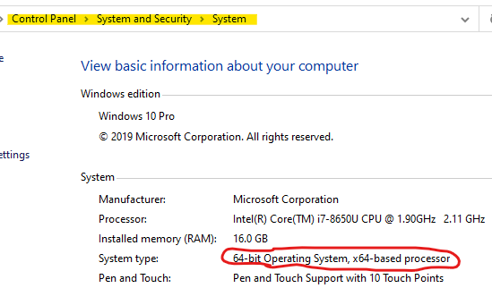
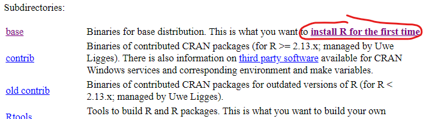
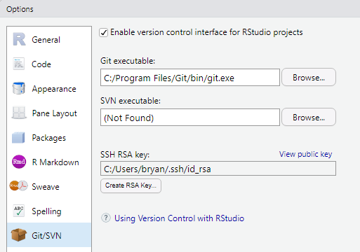
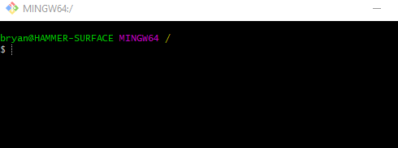

# RStudio Setup and Installation
R is a purpose-built statistical package that is open source. R is based on object-oriented principles: syntax, functions, calls to objects, and libraries operate like they do in C++, Java, Python, and C#. Unlike SAS, IBM Modeler, or Tableau, you can edit R script using a variety of applications. For example, you could use Microsoft Visual Studio or Eclipse. Even Notepad will do. Luckily, R has a built-in editor for users.

R runs on multiple operating systems; if you like using Linux, a version exists for that or if you are one of the few who owns an Apple computer (i.e. OS-X), a distribution exists. For most people, the Windows 64-bit installer is the best option to work with. 

The official website for R is [https://www.r-project.org/](https://www.r-project.org/). This is where you can browse the many various libraries and tutorials provided by the community. If this is your first experience with open source, the communities tend to be very helpful and welcoming (at least for projects this size).

Setting up your work environment for this semester requires four steps:
1. Installing the R base package
2. Installing the Git for Windows program
3. Downloading and installing RStudio
4. Adjust settings within RStudio

## Download the Base Installation Package
To access the installation files, open your web browser to [https://www.r-project.org/](https://www.r-project.org/). Using the navigation menu on the left-hand side of the page, under `Download`, click on `CRAN`. This provides a list of every server that houses the installation files and libraries for R. I always select a location near me to optimize download speed and time. Since I live in Oklahoma, I use the servers from Revolution Analytics, located in Dallas, Texas. This is located under USA towards the bottom of the page.

The installation files are listed by operating system starting with Linux, then Mac OS X, and Windows last. Windows provides a couple of options based on the architecture of your computer. In other words, whether you are using a 32-bit (i.e. X86) system or a 64-bit one. How do you know? Press the `Windows` key on your keyboard, and while holding it down, press the `Pause/Break` key. You should see a window like that shown below, indicating the version. If you do not have a `Pause/Break` key on your keyboard or the `Windows` key, you can also navigate to `Control Panel` --> `System and Security` --> `System`. This will take you to the same screen shown below. I have highlighted in yellow the navigation path to obtain the screen. 



Circled in red is the version of Windows 10 I have installed on my computer. It is a 64-bit system. After determining the version, return to the website and proceed to click on the link to download the correct version. The remainder of this tutorial will follow the installation of the Windows version. You will be presented with a webpage as shown below. In the image below, the link `install R for the first time` will provide the download link for the installation files. The size is approximately 70 megabytes, so ensure you have a steady connection.



## Installing Base R
Run the installer after your download completes. Select your default language, then click Next to continue the installation. Click Next again to accept the GNU license. Accept the default Destination Location.

The next screen provides a list of all the available components that can be installed: Core Files, 32-bit Files, 64-bit Files, and Message translations. At a minimum, the Core Files need to be installed along with either 32-bit Files or 64-bit Files. The only reason to not install all components is due to space. I recommend you install all of the files. While the majority of the work will be done using the 64-bit version, a few R libraries are only available for the 32-bit version. 

The rest of the setup involves customizing R?s behavior. In the next screen you are prompted to indicate whether you would like to customize the startup. Select `Yes (customized startup)` and click `Next`.

The next screen involves the graphical interface of R. You are provided with two options: `MDI` or `SDI`. Select `SDI`, or separate windows, as it is more flexible and easier to use. Click through the rest of the setup accepting the defaults.

If you would like to explore and learn more about available libraries, you can open the following link: [https://cran.revolutionanalytics.com/web/packages/available_packages_by_name.html[(https://cran.revolutionanalytics.com/web/packages/available_packages_by_name.html).

For tutorials on R, please see the following link: [https://cran.r-project.org/manuals.html](https://cran.r-project.org/manuals.html).

## Connecting to GitHub Repository
In order to connect to GitHub, you need to install a standalone GitHub application. GitHub has its own official application for Windows. While other programs exist that are great as standalone programs, since you will be using this in conjunction with R, the official version is sufficient.

Navigate to [https://gitforwindows.org/](https://gitforwindows.org/) and download the latest version. During the installation process you will be provided several configuration options; select the default for all of them, unless you know what you are doing.

## Download and Install RStudio
RStudio is an IDE, just like Visual Studio, NetBean, or Eclipse. Unlike the other IDEs listed, RStudio is designed for R. This program is very useful, especially for project collaboration, management, and working with R. In a web browser, navigate to [https://rstudio.com](https://rstudio.com) and download RStudio Desktop open source edition (the free version). Once downloaded, follow the default installation options (or change them as desired). That?s it!

In RStudio, using the menu, navigate to `Tools`, `Global Options`, then `Git/SVN` (see image below). Ensure the executable path is correct. If you do not have a RSA Key listed, then click on the button `Create RSA Key?` to generate one. This key is used for authenticating to GitHub. Leave the passphrase blank. When you are done, click OK.



The next step requires you to sign in to the Git for Windows program using your GitHub account. Git for Windows installed several types of programs like Git Bash, Git CMD, Git GUI, etc. Open Git Bash. It will look similar to what is shown below.



In the console, type in the following lines of code, one-by-one. Replace `<my_username>` with your GitHub username and `<my_user_email>` with your GitHub email address.

```
git config --global user.name <my_username>

git config --global user.email <my_user_email> 
```

Close the terminal window. You are now ready to access your projects stored on GitHub.