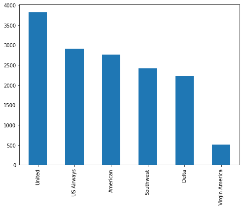
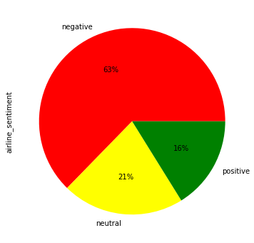
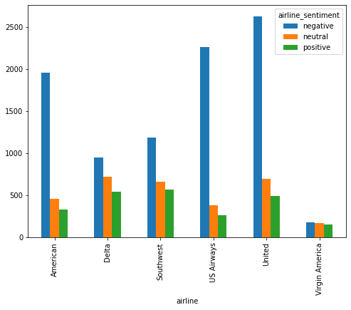
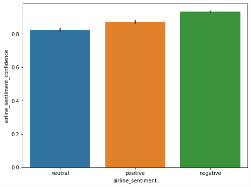
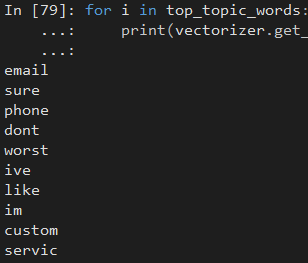
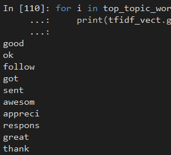
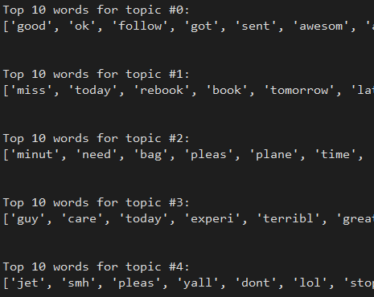
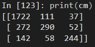
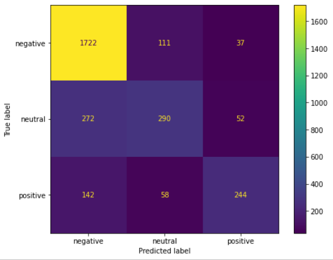
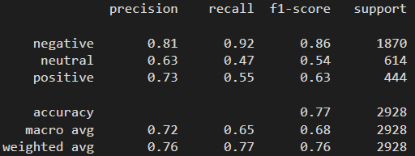

# Sentiment Analysis in Python
The code in this tutorial is an extension of the tutorial on text mining. *Be sure to run the code in the previous tutorial first prior to running this code.* This is because many of the variables created in the previous tutorial will be referenced in this one. This picks right up from the ending of the Text Mining tutorial for Python.

## Data Exploration
The following loads the required libraries for this tutorial. Other libraries are used that are not listed below; they are contained in the previous tutorial. One new package used for this tutorial is `seaborn`. If you have not already, you will need to install it.

```Python
import numpy as np 
import matplotlib.pyplot as plt
import seaborn as sns

from sklearn.feature_extraction.text import CountVectorizer
from sklearn.decomposition import LatentDirichletAllocation
from sklearn.feature_extraction.text import TfidfVectorizer
from sklearn.decomposition import NMF

from sklearn.model_selection import train_test_split
from sklearn.ensemble import RandomForestClassifier
from sklearn.metrics import classification_report, confusion_matrix, accuracy_score, plot_confusion_matrix
```

Prior to jumping into the analysis, I need to first get a feel for the data. I will begin by generating a bar chart of the number of terms categorized by airline.

I first need to adjust the plot size. As I do not know what the default values are for the plot, I will print that to the console.

```Python
plot_size = plt.rcParams["figure.figsize"] 
print(plot_size[0]) 
print(plot_size[1])
```

Looks like the default values are `6.0` and `4.0`. While these are not bad sizes, this would produce a plot that is fairly small for the amount of data it contains. Instead, I will increase the horizontal and vertial size to 8 and 6, respectively. Then use the code `plt.rcParams["figure.figsize"] = plot_size` to apply the changes.

```Python
plot_size[0] = 8
plot_size[1] = 6
plt.rcParams["figure.figsize"] = plot_size
```

Now to create the plot.

```Python
 tweets_data.airline.value_counts().plot(kind='bar')
```



The first plot presents Tweets by airline. United, US Airways, and American are the three largest airlines by volume of tweets. When coming up with any conclusions related to the analysis of this data, keep in mind that because the majority comes from the aforementioned airlines, the results are mainly related to just those three. Though, Southwest and Delta are close behind. Virgin America is so small that it may be worthwhile to remove it from this analysis. For the sake of this example, I will leave Virgin America in the data.

The next plot reveals the percentage of each sentiment type overall. This is a pie chart (which I usually never use because they are a terrible choice for visualizing). Three potential values exist in the data: `negative`, `positive`, and `neutral`. Since the data contains three values, I will choose three colors to represent each value: red, yellow, and green.

```Python
tweets_data.airline_sentiment.value_counts().plot(kind='pie', autopct='%1.0f%%', colors=["red", "yellow", "green"])
```



Notice the vast majority of tweets are negative, with 63%. That’s a large majority. Whether this is greater or less than other industries, I do not know. I would have to pull tweets from the same timeline as these airline tweets to compare.

What about the distribution of sentiment by airline? The following code produces a bar chart.

```Python
airline_sentiment = tweets_data.groupby(['airline', 'airline_sentiment']).airline_sentiment.count().unstack()

airline_sentiment.plot(kind='bar')
```



All airlines have a skew toward the negative except for Virgin America. This illustrates that Virgin America is an outlier in this dataset and should be removed.

The last plot will provide the average confidence level for the tweets belonging to three sentiment categories.

```Python
sns.barplot(x='airline_sentiment', y='airline_sentiment_confidence' , data=tweets_data)
```



Not surprisingly, the green bar, `negative`, has the highest confidence level.

## Topic Modeling
Text mining includes many various styles of analysis. While sentiment analysis is always popular, other types of analysis are available. One such analysis is referred to as topic modeling.

Topic modeling is a text clustering technique designed to determine categories or topics of text. The modeling technique sifts through all the documents to find matching patterns of terms and groups them together into topics. While a very useful technique, topic modeling does not provide any meaning for the topics. The interpretation of the topics needs to come from someone familiar with the industry.

I will use two types of topic modeling techniques in this tutorial: Latent Dirichlet allocation (LDA) and Non-Negative Matrix Factorization (NMF). Other types include explicit semantic analysis, latent semantic analysis, and Hierarchical Dirichlet process. I chose two of the more popular methods to introduce this concept to you. If you would like more information on this technique, please see [https://stackabuse.com/python-for-nlp-topic-modeling/](https://stackabuse.com/python-for-nlp-topic-modeling/).

### Latent Dirichlet allocation
LDA is a natural language processing technique that creates topics based on the co-occurrence of words in documents. If a set of words appear more frequently together in a set of documents, then that denotes a topic. Each document (or Tweet in our example) can contain multiple topics. Some topics are represented less in a document than others depending on word frequency.

Take the airline industry as an example. For Tweets relating to late flights you would expect the following words to generally appear together: late, gate, weather, mechanical, failure, angry, upset, frustrated, agent, refund. A total of ten possible terms exists for this topic. If a Tweet contains eight of those words, then this topic is represented well in that Tweet.

The first step is generating a document-term matrix. This allows me to use numerical data in analyses. The argument `max_df=''` specifies how often a term should appear; in this case, 80% of the documents or fewer (see the code below). The argument `min_df=''` specifies the minimum number of documents a word must appear in to be counted. For this example, I am specifying at least 4 documents; I could have used a percentage if desired. These values are chosen based on your preference. A more conservative approach would be to have a high value for both the maximum and minimum counts.

```Python
vectorizer = CountVectorizer(max_df=0.8, min_df=4, stop_words='english')
```

Once I create the vectorizer, I need to transform it into a document-term matrix. This is done using the `fit_transform()` function of vectorizer. Within this I am pulling the values from the column `tweettext` and casting it as a new data type to pass it to the function `fit.transform`.

```Python
doc_term_matrix = vectorizer.fit_transform(tweets_data['tweettext'].values.astype('U'))
```

Another way I could have done this is as follows:

```Python
tweet_values = tweets_data['tweettext'].values.astype('U')
doc_term_matrix = vectorizer.fit_transform(tweet_values)
```

The new data type I am casting the values from the column `tweettext` is Unicode, represented by a `U`. In the function `astype('U')` I am changing the data type of the column. Currently, it is `O` or Python object (type `tweets_data['tweettext'].dtype` in the console to see). Pandas borrows these data types from Numpy (in the console, type the following: `type(tweets_data['tweettext'].dtype)`).

The vectorizer function works with Unicode. I have to convert the values of the column from the data type provided by Pandas into Unicode. Once converted, I then pass it to the vectorizer and convert it into a document-term matrix.

The last thing I do is to confirm how many documents and terms are in the data.

```Python
doc_term_matrix.shape
```

The document-term matrix results in 2,611 terms with 14,640 documents (i.e. tweets). Using this document-term matrix, I will generate the LDA with 5 topics in the argument `n_components`. I set the seed to 35 using the argument `random_state` so that the results are consistent each time this is run. Think of this like a seed for a random number generator. So long as I use the same seed, the generation is consistent. Without this, each time you ran this LDA function, you would end up with a different result. 

When you run the function `LDA.fit()` to create the LDA, the process may take some time depending on how much RAM your computer has, the processing power, and the size of the data.

```Python
LDA = LatentDirichletAllocation(n_components=5, random_state=35)
LDA.fit(doc_term_matrix)
```

Retrieve words in the first topic, sort the indexes according to probability values using `argsort()`, and output the results to the console.

```Python
first_topic = LDA.components_[0]
top_topic_words = first_topic.argsort()[-10:]

for i in top_topic_words:
    print(vectorizer.get_feature_names()[i])
```



This topic has a group of words that probably reference customer service interaction; and not good customer service.

What about the top 10 words for each of the topics? The code below prints out this text.

```Python
for i,topic in enumerate(LDA.components_):
    print(f'Top 10 words for topic #{i}:')
    print([vectorizer.get_feature_names()[i] for i in topic.argsort()[-10:]])
    print('\n')
```

Here are the results for these 5 topics:
* Topic 1: 'email', 'sure', 'phone', 'dont', 'worst', 'ive', 'like', 'im', 'custom', 'servic'
* Topic 2: 'plane', 'gate', 'flightl', 'time', 'hold', 'wait', 'delay', 'cancel', 'hour', 'flight'
* Topic 3: 'passeng', 'fleet', 'fleek', 'check', 'luggag', 'lost', 'baggag', 'fli', 'plane', 'bag'
* Topic 4: 'tri', 'pleas', 'chang', 'ticket', 'bag', 'need', 'seat', 'book', 'help', 'flight'
* Topic 5: 'time', 'today', 'good', 'fli', 'travel', 'respons', 'airlin', 'great', 'flight', 'thank'

Now that I have some topics with associated terms, I would like to go back into my Twitter data and assign a Tweet a topic. This will require me to create a new column within the data frame. I will create a new object called `topic_values`. Using the function `.shape`, I can determine how large it is. It contains all 14,640 "documents" but only 5 "terms". Recall that the original document-term matrix resulted in 2,611 terms with 14,640 documents. This new variable `topic_values` has only 5 "terms" because those are the 5 topics I just generated.

```Python
topic_values = LDA.transform(doc_term_matrix)

topic_values.shape

tweets_data['topic'] = topic_values.argmax(axis=1)
```

I can see that the new column is added back into the data frame.

```Python
tweets_data.head()
```

The values for the column `topic` are listed at the very end. Note, that the values begin at `0`. This is because Python begins index values at 0, not 1. So, Topic 3 has value 2; Topic 1 has value 0.

### Non-Negative Matrix Factorization
The next topic modeling technique I will showcase is Non-Negative Matrix Factorization (NMF). This is a supervised learning technique in which a matrix is factored into two matrices. The code below shows how to create a document-term matrix using TF-IDF (explained more in the next section Sentiment Analysis Classification, found below). This results in 2,215 terms. Once complete, I then create the NMF.

Many of the concepts in here are similar to LDA: I specified the minimum and maximum document frequency, I use English for the stop words, I convert the data type of the column to Unicode, and transform the data.

```Python
tfidf_vect = TfidfVectorizer(max_df=0.8, min_df=5, stop_words='english')

doc_term_matrix2 = tfidf_vect.fit_transform(tweets_data['tweettext'].values.astype('U'))
```

This results in 2,215 terms.

Next, I decide to create 5 topics using a seed of 42 (pick any number you wish). I use the function `fit()` to generate the results. Note, this function can take several minutes to process.

```Python
nmf = NMF(n_components=5, random_state=42)
nmf.fit(doc_term_matrix2)
```

Similar to LDA, I pull the list of words for the first topic.

```Python
first_topic = nmf.components_[0]
top_topic_words = first_topic.argsort()[-10:]

for i in top_topic_words:
    print(tfidf_vect.get_feature_names()[i])
```



This grouping of words appears to contain text associated with good experiences for customers. 

Lastly, I can pull the top 10 words of each topic to display on the screen.

```Python
for i,topic in enumerate(nmf.components_):
    print(f'Top 10 words for topic #{i}:')
    print([tfidf_vect.get_feature_names()[i] for i in topic.argsort()[-10:]])
    print('\n')
```



Once done, I then add a new column to the dataframe with the topic value. This is in addition to the column containing the values for LDA. I will name this column `topic2`.

```Python
topic_values2 = nmf.transform(doc_term_matrix2)
tweets_data['topic2'] = topic_values2.argmax(axis=1)
tweets_data.head()
```

## Sentiment Analysis Classification
Understanding the sentiment of customers and predicting the sentiment of customers are two different things. In this section of the tutorial I will show you how to classify tweets based on sentiment. One possible use of this by a business is to predict the sentiment of customers based on current tweets by observing the trend of the sentiment. If the sentiment starts to trend toward negativity, then a change in current business practices is warranted.

To do this, I will first create a term-frequency inverse-document-frequency (TF-IDF) matrix. 
* TF  = (Frequency of a word in the document)/(Total words in the document)
* IDF = Log((Total number of docs)/(Number of docs containing the word))

This is one of the most frequently used metrics in in text mining to observe frequencies. 

In setting up the TF-IDF, I use only the 2,500 most frequently occurring terms, only those terms that occur in a maximum of 80% of the documents (I could choose a higher number to be more conservative), but at least in 7 documents (i.e. Tweets).

```Python
features = tweets_data['tweettext']

vectorizer = TfidfVectorizer(max_features=2500, min_df=7, max_df=0.8, stop_words=stop)

processed_features = vectorizer.fit_transform(features).toarray()
```

Now that those are complete, I need to generate a training and testing dataset. I save the sentiment values as a separate variable `labels`. The test dataset will be 20% of the data; this results in a training set of 80%. I pass in the transformed vector `processed_features` and apply the variable `labels` to that vector as "labels" for each value. 

```Python
labels = tweets_data['airline_sentiment']

X_train, X_test, y_train, y_test = train_test_split(processed_features, labels, test_size=0.2, random_state=0)
```

The output of the training-testing split is a creation of two datasets, each with *x*-values and *y*-values. 

I train a machine learning model using random forest; though, you can use a different machine learning approach. I just chose random forest because it is very popular at the moment. I pass in the set of data for the training subset.

```Python
text_classifier = RandomForestClassifier(n_estimators=200, random_state=0)
text_classifier.fit(X_train, y_train)
```

Now that the training model is generated, I need to generate the testing model. I do this using the `predict()` function like so.

```Python
predictions = text_classifier.predict(X_test)
```

Time to evaluate the model. I will first use a confusion matrix. The library `sklearn` provides several confusion matrix plots, but we will just use two here. The first one outputs text to the console. This is very basic and contains no labels. This is useful if you want to copy the text and paste it into another document.

```Python
cm = confusion_matrix(y_test,predictions)
print(cm)
```



The next confusion matrix is more useful because it possesses labels. This matrix also provides a heatmap.

```Python
plot_confusion_matrix(text_classifier, X_test, y_test)
```



I will take a moment to discuss this figure. Look at the labels for the *y*-axis and *x*-axis. On the *y*-axis is "True label" referring to the actual values in the data. The *x*-axis is "Predicted label" indicating the predicted values from the analysis. 

Look at the top row for `negative`. This contains the numbers 1722, 111, and 37. The first column has the label "negative." Where the two intersect (a value of 1722) shows me that 1,722 values were correctly predicted as negative. Looking at the second column, "neutral," I see that 111 data points were predicted as neutral, but in reality are negative. The third column, for "positive," has a value of 37. This indicates that 37 data points (or rows) were predicted as "positive" but should have been negative. Thus, out of a total of 1,870 negative Tweets, 92.1% were classified correctly, 5.9% as neutral (incorrectly), and 2.0% as positive (incorrectly).

The other two rows are interpreted similarly. The data contains a total of 614 neutral Tweets. 272 of those (44.3%) are classified as negative, 290 as neutral (47.2%), and 52 as positive (8.5%). This is problematic. A large majority (44.3%) are classified incorrectly as negative.

A similar problem occurs for the positively labeled Tweets. 142 of the 444 Tweets (32.0%) are classified as negative instead of positive. As you will see shortly, the misclassification for neutral and positive Tweets leads to poor performance.

I can generate a report provides more analysis for the classification. This is a classification report.

```Python
print(classification_report(y_test,predictions))
```



The first column of numbers provides a score of how precise the prediction was. Unsurprisingly, the negative values have a high score at 81.0% while the other two are extremely low. The f1-score is an objective assessment or evaluation of how good the classifier is for a given category. Typically, you want a very high f1-score. The values for neutral and positive are terrible; the score for negative is decent, but still not as high as I would prefer. A score greater than 90% is preferred if possible.

Another important assessment is found on the row labeled `accuracy`. This contains an overall score assessing accuracy of the classification. This is also a f1-score. While not bad, this is not sufficient. I would hope to have a value greater than 90%. Again, this is a result of the poor performance of the random forest model in predicting neutral and positive values.

If you would like to obtain this score by itself, you can use the following:

```Python
print(accuracy_score(y_test, predictions))
```

This results in a value of `0.7704918032786885` or 77%. 

At this point, if this was a real project, I would try other modeling techniques. Perhaps a decision tree, a categorical regression model, neural networks. If none of those proves accurate, then I might scrutinize the data more. It's possible some of the sentiment labels are incorrect. Perhaps I should remove all the "neutral" scores and label those either as "positive" or "negative".