# Sentiment Analysis in R
This module will demonstrate some simple ways you can analyze the sentiment within text-based data using R. The code in this tutorial is an extension of the tutorial on text mining. *Be sure to run the code in the previous tutorial first prior to running this code.* This is because many of the variables created in the previous tutorial will be referenced in this one.

## Sentiment in Data
The following loads the required packages for this tutorial. Keep in mind these are in addition to the ones you already loaded in the previous tutorial on text mining.

```R
library(wordcloud)
library(udpipe)
library(lattice)
```

This set of tweets contains a large number of negative values. This will be illustrated as we progress through this tutorial. The code below results in the following:
* Negative 67,975
* Neutral 17,367
* Positive 12,675

Not surprisingly, the negative values are extremely high.

I want to illustrate a point, so I will take you on a tangent for a moment. Each airline is represented in this data. While it is possible to generalize about the airline industry in the United States based on the results of this data, it should be noted that each airline contributes differing amounts of data.

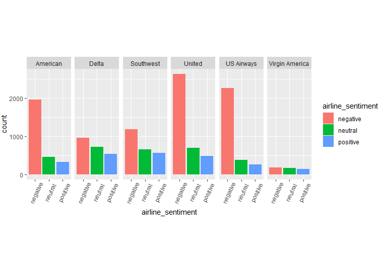

Here is the code for the plot in case you are interested in knowing how to create it:

```R
ggplot(tweets_data, aes(x = airline_sentiment, fill = airline_sentiment)) +
  geom_bar() +
  facet_grid(. ~ airline) +
  theme(axis.text.x = element_text(angle=65, vjust=0.6),
       plot.margin = unit(c(3,0,3,0), "cm"))
```

Note, that American, United, and US Airways contribute the majority of negative tweets. In addition, these airlines are in the top 5 for number of passengers (see [https://en.wikipedia.org/wiki/List_of_largest_airlines_in_North_America](https://en.wikipedia.org/wiki/List_of_largest_airlines_in_North_America)). While they do have a large majority of negative tweets, they also service a large number of passengers; still, Delta and Southwest are in the top 5 as well and have relatively fewer negative tweets.

The point I am illustrating is that while you can draw conclusions and inferences from aggregated data, it may not represent the entire sample you are analyzing. Remember, all data has a distribution; the average is just the data with the greatest representation.

Moving on with the tutorial. I will now perform some analysis on the positively-oriented terms and then perform the same analysis on the negatively-oriented ones. First, filter out the non-positive text.

```R
positive = tidy_dataset4 %>% 
  filter(airline_sentiment == "positive")
```

I will view the top five records in the data to see what types of words are considered "positive".

```R
head(positive)
```

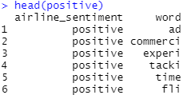

Second, generate a word cloud using the function `wordcloud()`.

```R
wordcloud(positive[,2],
          max.words = 100,
          random.order=FALSE, 
          rot.per=0.30, 
          use.r.layout=FALSE, 
          colors=brewer.pal(2, "Blues"))
```

This function contains many arguments. I will cover each one here.
1. `positive[,2]` - The first argument in the function  just designates the column of data I am using, which in this case, is the column `word`. 
1. `max.words = 100` - The second argument indicates the maximum number of words displayed in the word cloud. I think anything greater than 100 tends to overcrowd the visualization.
1. `random.order=FALSE` - If `FALSE`, words are plotted in decreasing frequency; otherwise, they are random.
1. `rot.per=0.30` - This sets the proportion of words to be displayed at a 90-degree angle. I like a number between 30 and 50.
1. `use.r.layout=FALSE` - If `FALSE`, then C++ code is used for collision detection, otherwise R is used. I find that C++ performs better than R.
1. `colors=brewer.pal(2, "Blues"))` - The coloring scheme to use. I like to use `brewer.pal` which is the color prallette from R Color Brewer. You can use other color palletes or schemes, though. I also use the color `blue` because it is easy on the eyes and is associated with the emotion "positive".

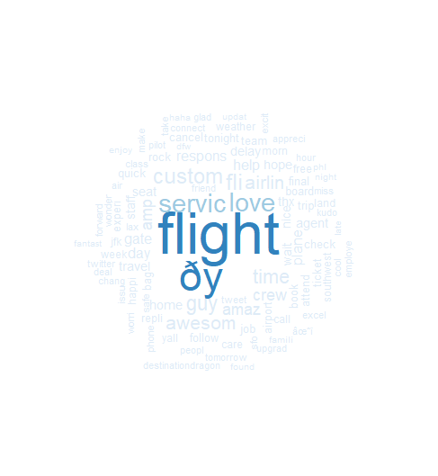

This results in some interesting terms such as service, custom, plane, and crew. Note, the term "custom"" could refer to customer or customs. One weakness of stemming is context and meaning is lost by reducing terms into their root words. The text ðÿ is an emoticon smiley in Twitter.

While this can be considered useful, this has too many values to be of real use. I need fewer terms displayed. In addition, I need to look at the terms with highest frequency. Also, I only want the top 21 terms.

```R
counts5 = count(positive, word, sort = TRUE)
counts5 = rename(counts5, freq = n)
positive2 = top_n(counts5, 21)
```

The second function `rename()` is new. This just renames a column within a data frame. In the dataset `counts5`, the column `n` is not very meaningful. I change the name to `freq` which is short for frequency.

The second function `top_n` allows me to select the number of specified rows. Sort of like creating a subset of the data.

Here is the alternative using the piping notation:

```R
positive2 = positive %>%
  count(word, sort = TRUE) %>%
  rename(freq = n) %>%
  top_n(21)
```

Here are the results of this transformation:

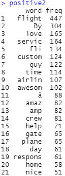

I will now generate the visualization. For this, I am going to use a horizontal bar chart. I will first provide the code and then step through each line of code.

```R
colourCount = length(unique(positive2$word))
getPalette = colorRampPalette(brewer.pal(9, "Set1"))

positive2 %>%
  mutate(word = reorder(word, freq)) %>%
  ggplot(aes(x = word, y = freq)) +
  geom_col(fill = getPalette(colourCount)) +
  coord_flip()
```

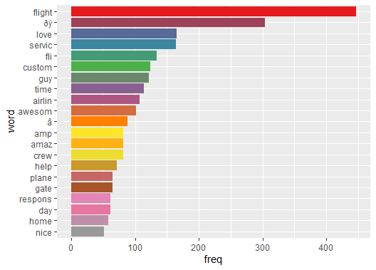

The first and second line of code I will return to momentarily. I will begin with the function `mutate()`. This line of code uses the `mutate()` function. I am reordering the column `word`. The function `reorder()` treats its first argument (in this case `word`) as a categorical variable and then reorders its levels or categories based on the values of the second variable (in this case `freq`).

The next line is the `ggplot` function. Here I am specifying which variable is on the *x*-axis and which is on the *y*-axis.

The line of code using `geom_col(fill = getPalette(colourCount))` has a lot happening here. The function `geom_col()` is a type of bar chart. Two types are available: `geom_bar` and `geom_col`. I chose `geom_col` because I want the heights of the bar chart to represent the values in the data. `geom_bar` makes the height of the bars proportional to the number of "cases" in each group. I want a more realistic representation of my data.

The argument `fill=''` specifies the way you would like to fill the object; in this case, the bar in the bar chart. Here, I am specifying that I would like to use the color palette `getPalette`, which is a variable set equal to `colorRampPalette(brewer.pal(9, "Set1"))`. This is one of the variables I said I would come back to. You can choose any color palette you would like, but I am partial to this one.

The notation `getPalette(colourCount)` contains the other variable, `colourCount`. This variable is set equal to `length(unique(positive2$word))`, which is the number of unique values within the data (i.e. 21). In other words, I would like to have 21 unique colors for the 21 words in my data. I could have used the same color for all of the bars in the bar chart, but that would not look as nice. The distinct colors provide clarity to identify and differentiate each term. If you would like to learn more about changing the aesthetics in `ggplot`, type `vignette("ggplot2-specs")` in the Console of R or RStudio and read the documentation.

The last line of code is `coord_flip()`. This just flips the coordinates so that the *x*-axis is now the *y* and the *y*-axis is now the *x*. Bar charts, like the one I created, tend to be lengthy and squish the labels if placed on the *x*-axis (see below).

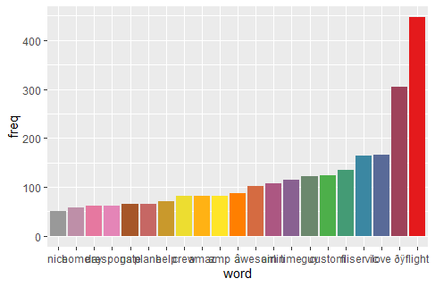

Let's return to the analysis. The original bar chart is shown below.


This provides a nice visual of which words occur most frequently. While the term flight occurs the most, this is such a common term relating to the airline industry that it lacks strong meaning. Other terms are interesting, such as "gate," "help," and "crew." Remember, these are all considered "positive" terms, so the vast majority of these terms in the bar chart are not surprising.

For negatively-oriented terms, other interesting tidbits can be gleaned. I begin by loading in the data, filtering only for "negative" terms.

```R
negative = tidy_dataset4 %>% 
  filter(airline_sentiment == "negative")
```

I generate a word cloud for these negative terms. I use a red-colored pallete because the color red is typically associated with "negative" emotions.

```R
wordcloud(negative[,2],
          max.words = 100,
          random.order=FALSE, 
          rot.per=0.30, 
          use.r.layout=FALSE, 
          colors=brewer.pal(2, "Reds"))
```


I then select 21 of the most frequently occurring negative terms in the data.

```R
counts6 = count(negative, word, sort = TRUE)
counts6 = rename(counts6, freq = n)
negative2 = top_n(counts6, 21)
```

Alternative using piping:

```R
negative2 = negative %>%
  count(word, sort = TRUE) %>%
  rename(freq = n) %>%
  top_n(21)
```

I plot out the data as I did for the positive terms.

```R
colourCount = length(unique(negative2$word))

getPalette = colorRampPalette(brewer.pal(8, "Dark2"))

negative2 %>%
  mutate(word = reorder(word, freq)) %>%
  ggplot(aes(x = word, y = freq)) +
  geom_col(fill = getPalette(colourCount)) +
  coord_flip()
```

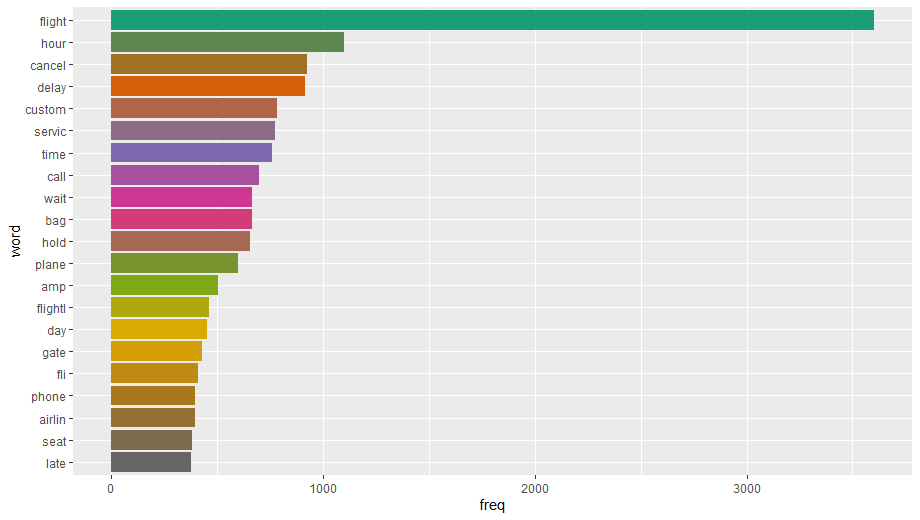

As I mentioned previously, the term "flight" is not useful. Looking at the bar chart, you can see that the term is the most frequently occurring one. No different from the bar chart containing "positive" terms.

## Generating Sentiment Scores
The data you pull when not contain sentiment scores; these need to be generated by you. In order to do so, you must use a psycho-social dictionary, also known as sentiment lexicon. There are a variety of methods and dictionaries that exist for evaluating the opinion or emotion in text. The tidytext package contains three sentiment lexicons in the sentiment’s dataset:
* `AFINN` from Finn Årup Nielsen
* `bing` from Bing Liu and collaborators
* `nrc` from Saif Mohammad and Peter Turney

All three of these lexicons are based on unigrams, i.e., single words. These lexicons contain many English words; the words are assigned scores for positive/negative sentiment, and possibly emotions like joy, anger, sadness, among many others. The `nrc` lexicon categorizes words in a binary fashion (yes/no) into categories of positive, negative, anger, anticipation, disgust, fear, joy, sadness, surprise, and trust. To gain access to the nrc lexicon, you will need to install the library `textdata`.

```R
install.packages('textdata')
```

The `bing` lexicon categorizes words in a binary fashion into positive and negative categories. 

The `AFINN` lexicon assigns words with a score that runs between -5 and 5, with negative scores indicating negative sentiment and positive scores indicating positive sentiment. The AFINN psycho-social dictionary would provide the most granularity of all and allow for greater analysis of data using machine learning techniques. 
All of this information is tabulated in the sentiments dataset, and `tidytext` provides a function `get_sentiments()` to get specific sentiment lexicons without the columns that are not used in that lexicon.

To see the exact values contained within each dictionary, simply use the code as shown below:

```R
get_sentiments('bing') %>%
  distinct(sentiment)

get_sentiments('nrc') %>%
  distinct(sentiment)
```

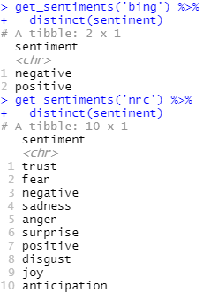

If you are asked to download the nrc lexicon, simply type a `1` to indicate the selection of `Yes`.

To keep things simple, I will start off with a straightforward example using the Bing et al. dictionary. The example, shown below, uses the following steps:
1. Retrieve words with sentiment scores (use `inner_join()` function)
1. Generate count of positive & negative words (use `count()`)
1. Spread out data to place positive and negative sentiment in separate columns (use `spread()`)
1. Calculate the difference between the total positive words and total negative words (use `mutate()`)

```R
newjoin = inner_join(tidy_dataset4, get_sentiments('bing'))
counts7 = count(newjoin, sentiment)
spread1 = spread(counts7, sentiment, n, fill = 0)
(mutate(spread1, diffsent = positive - negative))
```

Alternative code using piping notation.

```R
tidy_dataset4 %>%
  inner_join(get_sentiments('bing')) %>% 
  count(sentiment) %>% 
  spread(sentiment, n, fill = 0) %>% 
  mutate(diffsent = positive - negative)
```

The first line of code performs an inner join between `tidy_dataset4` and the lexicon `bing`. This function automatically finds the rows that match in one dataset with the corresponding rows in another dataset, similar to what is done in a database engine like SQL Server, Oracle, or MySQL. This creates a new column in the data named `sentiment`.

Take a moment to look at the difference between the columns `airline_sentiment` and `sentiment`. The assigned scores differ drastically.

The second line of code using `count()` counts the number the number of rows based on the column `sentiment`. This results in 5,762 negative terms and 2,710 positive terms.

The third line uses the function `spread()` to separate the positive and negative values from each other by placing them into separate columns. This just makes working with the data easier, especially when performing calculations like the one used in the next line of code.

This brings me to the last line of code. I am performing a calculation on the data. I create a new variable called `diffsent`, which is short for "difference between sentiment." This works for me, but feel free to name this whatever you like. This variable is equal to the total number of positive terms minus the total number of negative terms. The result is -3,052. Thus, the data contains 3,000 more negative terms than positive ones.

While interesting, this is a very high-level approach to understanding the sentiment of text. This loses a lot of meaning, especially if specific words are not taken into consideration. The NRC dictionary contains greater granularity by including more sentiment types than Bing. For example, I can contrast the sentiments joy with sadness and trust with fear. If you have not previously done so, install the package `textdata` to download the NRC lexicon.

### Joy and Sadness
I will first compare joy with sadness. I retrieve all values from the NRC dataset that are labeled as "joy" or "sadness." I save this as `nrc_joysad`. This allows me to reference it later in my code. This results in 1,880 values from NRC. 

```R
nrc_joysad = get_sentiments('nrc') %>%
  filter(sentiment == 'joy' | 
           sentiment == 'sadness')

nrow(nrc_joysad)
```

Then I merge those values with the tweet dataset using `inner_join()`. I then count all the occurrences of each word in the dataset using `count()` and then spread them into two columns using `spread()`.

```R
newjoin2 = inner_join(tidy_dataset4, nrc_joysad)
```

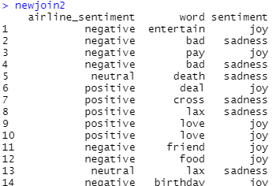

```R
counts8 = count(newjoin2, word, sentiment)
spread2 = spread(counts8, sentiment, n, fill = 0)
```

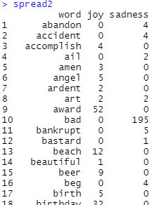

The term `bad` appears 195 times! How very sad.

I create a new variable called `contentment` that is calculated by taking the value of joy and subtracting sadness from it. This creates the "degree" of contentment as I see it. I then arrange the data in descending order and save it as `tweet_joysad`.

```R
content_data = mutate(spread2, contentment = joy - sadness, linenumber = row_number())
tweet_joysad = arrange(content_data, desc(contentment))
```

Alternative code:

```R
(tweet_joysad = tidy_dataset4 %>%
  inner_join(nrc_joysad) %>%
  count(word, sentiment) %>%
  spread(sentiment, n, fill = 0) %>%
  mutate(contentment = joy - sadness, linenumber = row_number()) %>%
  arrange(desc(contentment)))
```

With the data merged, I can plot it on a graph.

```R
ggplot(tweet_joysad, aes(x=linenumber, y=contentment)) +
  coord_flip() +
  theme_light(base_size = 15) +
  labs(
    x='Index Value',
    y='Contentment'
  ) +
  theme(
    legend.position = 'none',
    panel.grid = element_blank(),
    axis.title = element_text(size = 10),
    axis.text.x = element_text(size = 10),
    axis.text.y = element_text(size = 10)
  ) +
  geom_col()
```

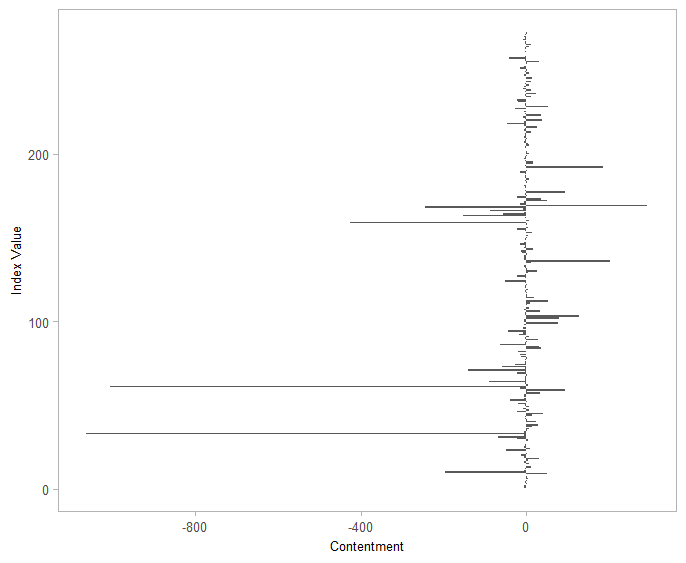

Hmmmmmm. Not the most useful graph. Knowing that visualizations need to tell a story, I realize that this is too busy. I will focus on the top 10 positive contentment words and the bottom 10 negative contentment words, then add a legend with the words. First, I will slice the data. I know rows 1 through 10 contains terms associated with joy (since I sorted the data based on `contentment`). This means the last 10 rows should have terms associated with sadness.

```R
(tweet_joysad2 = tweet_joysad %>%
    slice(1:10,253:262))
```

Now I generate the same plot. I also add in a legend at the bottom because it looks nice and provides a way to interpret the data.

```R
ggplot(tweet_joysad2, aes(x=linenumber, y=contentment, fill=word)) +
  coord_flip() +
  theme_light(base_size = 15) +
  labs(
    x='Index Value',
    y='Contentment'
  ) +
  theme(
    legend.position = 'bottom',
    panel.grid = element_blank(),
    axis.title = element_text(size = 10),
    axis.text.x = element_text(size = 10),
    axis.text.y = element_text(size = 10)
  ) +
  geom_col()
```

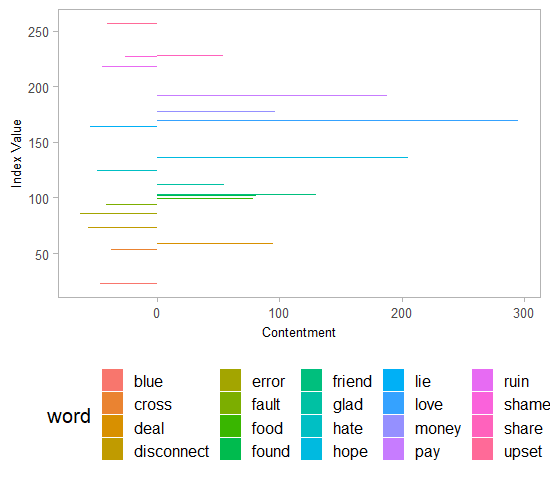

### Trust and Fear
I will now perform a similar assessment using the sentiments "trust" and "fear." The variable "trustworthy" will be calculated as the difference between trust and fear. Like in the previous example, I need to retreive only the sentiment scores for trust and fear from NRC. This returns 2,707 terms.

```R
nrc_trstfear = get_sentiments('nrc') %>%
  filter(sentiment == 'trust' |
           sentiment == 'fear')

nrow(nrc_trstfear)
```

Like in the previous example, I need to perform an inner join, count the terms, spread the data into two columns, generate the new variable `trustworthy`, and finally pull out the top 10 and bottom 10 scores.

```R
(tweet_trstfear = tidy_dataset4 %>%
  inner_join(nrc_trstfear) %>%
  count(word, sentiment) %>%
  spread(sentiment, n, fill = 0) %>%
  mutate(trustworthy = trust - fear, linenumber = row_number()) %>%
  arrange(desc(trustworthy)) %>%
  slice(1:10,348:357))
```

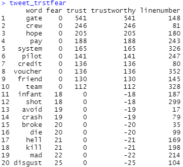

I can now plot the data.

```R
ggplot(tweet_trstfear, aes(x=linenumber, y=trustworthy, fill=word)) +
  coord_flip() +
  theme_light(base_size = 15) +
  labs(
    x='Index Value',
    y='Trustworthiness'
  ) +
  theme(
    legend.position = 'bottom',
    panel.grid = element_blank(),
    axis.title = element_text(size = 10),
    axis.text.x = element_text(size = 10),
    axis.text.y = element_text(size = 10)
  ) +
  geom_col()
```

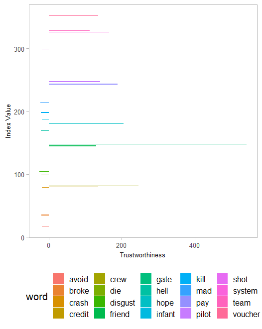

The chart above illustrates an important point. While the terms themselves have certain sentiments attached to them, they are not always indicative of the meaning from the situation they occurred. Take the term "gate" above, which occurs the most often and represents trust. When would that term appear in a tweet? Normally, it appears in a tweet when a customer complains about a transaction or a poor experience with customer service. While the program objectively assigned "gate" a positive score overall for "trustworthy", this does not necessarily mean that the term has this sentiment in the context we are using.

I am going to deviate for a moment. I am going to peruse some of the Tweets containing the term `gate` or `Gate`.

```R
airline_tweets %>%
  filter(str_detect(text, 'gate|Gate')) %>%
  select(text)
```

Here are a few examples taken from the output:
* @VirginAmerica my flight (6000) scheduled for 1pm departure still says on time but no plane at gate. Any update on how long of a delay?
* @VirginAmerica Love the team running Gate E9 at LAS tonight. Waited for a delayed flight, and they kept things entertaining
* @USAirways flt 4439 is on the ground, but you don't have a gate for us at dca. Why is this happening?
* @USAirways hey let flight 1874get to the gate  hours Late Flight and no fate with dozens of kids on board
* @USAirways It was US 893. The gate was open after about 50 mins waiting. What a great way to finish an 18 hour delayed arrival!!
* @AmericanAir The issue is the lack of consideration of an announcement made so Late Flight when the gate agent had been there for over an hour.

A vast majority of them are negative, with criticisms about some event happening at the gate. Just like with any data-oriented process, the results may seem indicative of a conclusion, but always take it with a grain of salt. The process is subjective, not objective, and you must think clearly about what the results really mean, not just what they are saying.

This provides an important lesson. While tools seemingly provide objectivity to an analysis, especially with unstructured data such as Tweets, they do not always represent reality because context and meaning are missing. This is where experience, knowledge, and an understanding of the environment being analyzed come in. Interpretation of the results of any data anlysis is an important skill to learn, one that recruiters, employers, and internship supervisors often mention to me as a weakness. When performing any analysis, always ask the question, "Does this make sense in relation to the context I am studying or is this an artifact of the data?"

One last visualization to show you. This wordcloud contrasts and compares terms, with those classified as "fear" on top and those as "trust" on the bottom. This is a nice way to visually see the frequency of both types of sentiment simultaneously.

```R
library(reshape2)
tidy_dataset4 %>%
  inner_join(nrc_trstfear) %>%
  count(word, sentiment) %>%
  slice(1:40,318:357) %>%
  acast(word~sentiment, value.var='n',fill=0) %>%
  comparison.cloud(colors=c('gray30','gray70'))
```

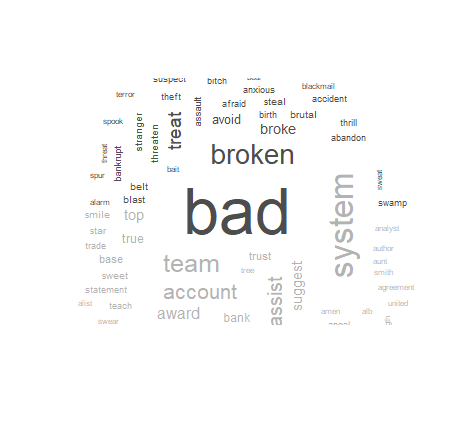

## Part of Speech Tagging
Part of Speech Tagging (POST) is a natural language processing technique in which terms are given additional meaning and context by tagging them. This is akin to tagging used on websites, products on Amazon.com, or using a hashtag on Twitter or Instagram. These tags designate a characteristic or attribute of the "thing" you are referring to.

For this part of the tutorial I will be relying on a new library, `udpipe`. According to the description of this library (see [here](https://cran.r-project.org/web/packages/udpipe/index.html)), it provides "Tokenization, Parts of Speech Tagging, Lemmatization and Dependency Parsing." This is actually a wrapper around a C++ library, so it is not completely a native R library. I won't go into all of the functions provided by this library, but take some time on your own to look through everything.

The official website is hosted on GitHub [here](https://bnosac.github.io/udpipe/en/) which includes this useful [overview of keyword extraction techniques](https://bnosac.github.io/udpipe/docs/doc7.html). This contains additional documentation. 
Additionally, the library has pre-packaged tutorials inside of R. Simply type the following commands within R to access these:
* vignette("udpipe-tryitout", package = "udpipe")
* vignette("udpipe-annotation", package = "udpipe")
* vignette("udpipe-universe", package = "udpipe")
* vignette("udpipe-usecase-postagging-lemmatisation", package = "udpipe")
* vignette("udpipe-usecase-topicmodelling", package = "udpipe")
* vignette("udpipe-parallel", package = "udpipe")
* vignette("udpipe-train", package = "udpipe")

One of the first steps in processing data with POST is downloading the "model" from `udpipe` that I will use for applying tags.

```R
ud_model = udpipe_download_model(language = "english")
```

Once downloaded, I am going to select just the column of terms from the data. I save this list of terms as `tidy_post1`.

```R
tidy_post1 = tidy_dataset4 %>% 
                select(word)
```

I now need to load in the model from my hard drive.

```R
ud_model = udpipe_load_model(ud_model$file_model)
```

The notation `ud_model$file_model` is just pointing to the location of the downloaded file. When I type out `ud_model$file_model` in the console, the value `"C:/Users/bryan/source/repos/msis5193-pds1-master/text-mining/data/english-ewt-ud-2.5-191206.udpipe"` is returned.

I now use `ud_model` and `tidy_post1` in the function `udpipe_annotate()` to begin the tagging process. This function also allows you to perform tokenisation, lemmatization, and dependency parsing; think of it as a catch-all-be-all function provided by the developers. It is convenient because I do not have to memorize multiple functions for each procedure.

Once done with the function `udpipe_annotate()`, I convert the data into a data frame. This process can take a lot of time.

```R
tagging_data = as.data.frame(udpipe_annotate(ud_model, x = tidy_post1$word))
```

The code above initializes the database I will use to tag terms. In particular, the tagging I will be using is to identify terms by their grammatical components. The object `tagging_data` contains lots of information based on the CoNLL-U format (see [here](https://universaldependencies.org/format.html) for more information). For example, it contains the column `UPOS` which houses data on universal part-of-speech tags.

### Basic POST Frequency Statistics
Now that I have my part-of-speech tags associated with the terms in my data, I am going to dig a little deeper into what is in the data. The first step is to compute the frequency of the tags using the function `txt_freq()` from the library `udpipe`. 

Note, like many other functions I am working with, this one also takes some time to process. Be aware that many of the others below also take some time.

```R
post_stats = txt_freq(tagging_data$upos)
```

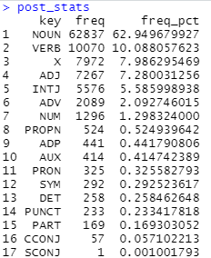

This returns an object with three columns:
* `key` - the grammatical category
* `freq` - the frequency the category occurs
* `freq_pct` - the frequency in percentage

The next step is to convert the data type of the column `key` into a factor. Recall, the data type factor is similar to a category.

```R
post_stats$key = factor(post_stats$key, levels = rev(post_stats$key))
```

Finally a plot to view the output:

```R
ggplot(post_stats, aes(x=key, y=as.factor(freq), fill=key)) +
  coord_flip() +
  theme_light(base_size = 15) +
  labs(
    x='Frequency',
    y='',
    title='UPOS (Universal Parts of Speech)'
  ) +
  theme(
    legend.position = 'none',
    panel.grid = element_blank(),
    axis.title = element_text(size = 10),
    axis.text.x = element_text(size = 10),
    axis.text.y = element_text(size = 10),
    title = element_text(size = 13)
  ) +
  geom_col() +
  scale_fill_grey()
```

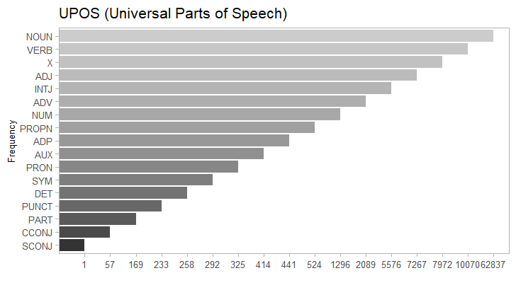

Notice the top occurring part of speech is `NOUN` followed by `VERB`. This is not too great of a surprise considering the grammatical structure of the English language. Also, considering the data contains Tweets, which include very truncated phrases and sentences, this comes as no surprise.

### POST Nouns
Continuing with this example, I am going to further drill down into three parts of speech: nouns, adjectives, and verbs. Diving into nouns provides a different view of the subjects mentioned in airline data. When you think of nouns in relation to the airline industry, some words immediately come to mind: flight, airplane, luggage, bag, gate, ticket, and airport. Objectively, though, I really do not know what subjects are mentioned in these Tweets. In other words, what subjects are truly important to passengers?

I will use a similar process to obtaining the universal parts of speech for extracting nouns. One difference is that I need to make a subset of the UPOS column. Recall that this column contains nouns, verbs, adjectives, adverbs, and many more forms of speech. If you wish to see what all the various parts of speech tags are, see the website [https://universaldependencies.org/u/pos/index.html](https://universaldependencies.org/u/pos/index.html).

```R
noun_stats = subset(tagging_data, upos %in% c("NOUN"))
```

Now I will generate the frequencies and then convert it to a factor data type.

```R
noun_stats2 = txt_freq(noun_stats$token)

noun_stats2$key = factor(noun_stats2$key, levels = rev(noun_stats2$key))
```

This results in 6,429 nouns (see the column `key` in `noun_stats2`). This would overwhelm the visualization. Instead of selecting all of them, I will just take a look at the top 20 using the function `slice()` (same one I used earlier in this tutorial) within the code to generate a plot.

```R
noun_stats2 %>%
  slice(1:20) %>%
  ggplot(aes(x=key, y=as.factor(freq), fill=freq)) +
  coord_flip() +
  theme_light(base_size = 15) +
  labs(
    x='Frequency',
    y='',
    title='Noun Occurrences'
  ) +
  theme(
    legend.position = 'none',
    panel.grid = element_blank(),
    axis.title = element_text(size = 10),
    axis.text.x = element_text(size = 10),
    axis.text.y = element_text(size = 10),
    title = element_text(size = 13)
  ) +
  scale_fill_gradient(low="orange", high="orange3") +
  geom_col()
```

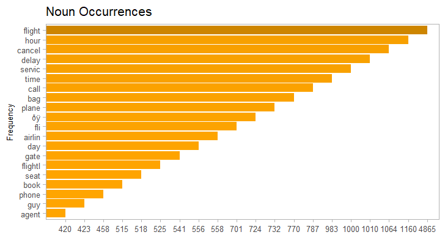

A lot of these terms come as no surprise. Keep in mind, though, that this analysis is not about looking for sentiment. Some of these nouns could refer to a negative or positive situation. Importantly, I need to use this analysis in conjunction with my earlier analysis on positive/negative and trust/fear to obtain a clearer picture of what is occurring. If I return all the way to the wordclouds for both negative and positive sentiment, I see the term "flight" stands out as the most frequently occurring one. Looking at the figure above, this bears out.

How can this help? If I look at the third term "cancel," that clues me into knowing that the cancellation of flights or services is one of the most important topics of discussion on Twitter related to the airline industry. While not surprising that it is important, this analysis does help place emphasis on this topic. This indicates that airlines should place a greater amount of resources in assisting customers who have experienced canceled flights or are attempting to cancel a flight. Other important areas to focus resources on include delayed flights (the term "delay") and baggage (the term "bag").

### POST Adjectives
I will now repeat the exercise for adjectives. While nouns can provide subjects of importance, adjectives can provide the attitude or feelings experienced by customers.

```R
adjstats = subset(tagging_data, upos %in% c("ADJ"))

adjstats2 = txt_freq(adjstats$token)

adjstats2$key = factor(adjstats2$key, levels = rev(adjstats2$key))
```

Now the plot.

```R
adjstats2 %>%
  slice(1:20) %>%
  ggplot(aes(x=key, y=as.factor(freq), fill=freq)) +
  coord_flip() +
  theme_light(base_size = 15) +
  labs(
    x='Frequency',
    y='',
    title='Adjective Occurrences'
  ) +
  theme(
    legend.position = 'none',
    panel.grid = element_blank(),
    axis.title = element_text(size = 10),
    axis.text.x = element_text(size = 10),
    axis.text.y = element_text(size = 10),
    title = element_text(size = 13)
  ) +
  scale_fill_gradient(low="chartreuse", high="chartreuse3") +
  geom_col()
```

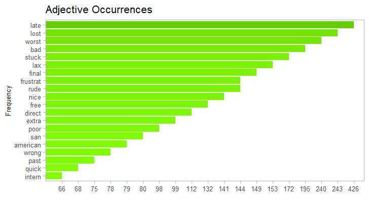

Looking at the figure, many of the terms jump straight out: late, worst, bad, frustrating, rude, nice, wrong. The top occurring adjective is "late." I do not have to stretch my imagination to figure out the context to which these terms are applied. When combined with the analysis for nouns, I can put together a picture of the issues and feelings customers have toward those issues.

### POST Verbs
Finally, verbs. These are the actions or behaviors associated with the context studied. In this case, the behaviors associated with the airline industry.

```R
verbstats = subset(tagging_data, upos %in% c("VERB"))

verbstats2 = txt_freq(verbstats$token)

verbstats2$key = factor(verbstats2$key, levels = rev(verbstats2$key))

verbstats2 %>%
  slice(1:20) %>%
  ggplot(aes(x=key, y=as.factor(freq), fill=freq)) +
  coord_flip() +
  theme_light(base_size = 15) +
  labs(
    x='Frequency',
    y='',
    title='Verb Occurrences'
  ) +
  theme(
    legend.position = 'none',
    panel.grid = element_blank(),
    axis.title = element_text(size = 10),
    axis.text.x = element_text(size = 10),
    axis.text.y = element_text(size = 10),
    title = element_text(size = 13)
  ) +
  scale_fill_gradient(low="tan", high="tan3") +
  geom_col()
```

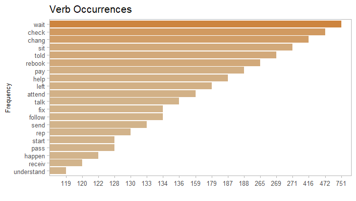

Combining this with the other two analyses provides a clearer picture of what is occurring. The top term is "wait." This could apply to phone calls with service reps, the boarding process, delayed flights, and many other situations. One of the largest criticisms of the airline industry is how inefficient it is and how good it is at wasting time. This helps to confirm that assessment.

### What About X?
UPOS has many different parts of speech. I want to bring your attention back to this figure.


Notice that "X" is the third most frequently occurring part-of-speech. What is X? According to [this webpage](https://universaldependencies.org/u/pos/X.html) it is a category for terms that do not fit into any of the others. If that is the case, then why is it populated heavily? This is a mystery that requires me to dig deeper.

First, I need to extract just the terms categorized as `X`.

```R
xstats = subset(tagging_data, upos %in% c("X"))

xstats2 = txt_freq(xstats$token)

xstats2$key = factor(xstats2$key, levels = rev(xstats2$key))
```

Now I can look at the terms.

```R
xstats2$key
```

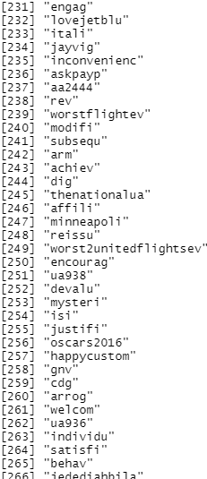

Above is a snippet of the resulting terms. Do you notice something odd about these terms? On the surface, these terms appear to be just regular terms that should have been categorized as nouns, verbs, or adjectives. Yet, upon closer inspection, you can see that these are something specialized for Twitter.

Have you guessed it yet? These are mostly hashtags. Hashtags are typically a conglomeration of words placed together without a space. The R library `udpipe` does not recognize that, and so does not separate them. In a way, this is good because hashtags serve as an emphasis or summary for a Tweet. It is bad, because these could be useful for the other analyses I just performed.

Other terms are assigned this category. This includes abbreviations for places such as New York City `nyc`. In addition, Twitter account usernames are also placed in here.

## Conclusion
This is just a small preview of the type of sentiment analysis within R. A great many more techniques are available, especially in the library `udpipe`. The most important thing to remember is to always embed your conclusions and interpretations within the context of your study.