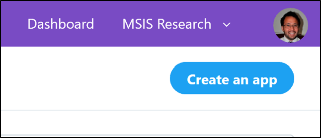
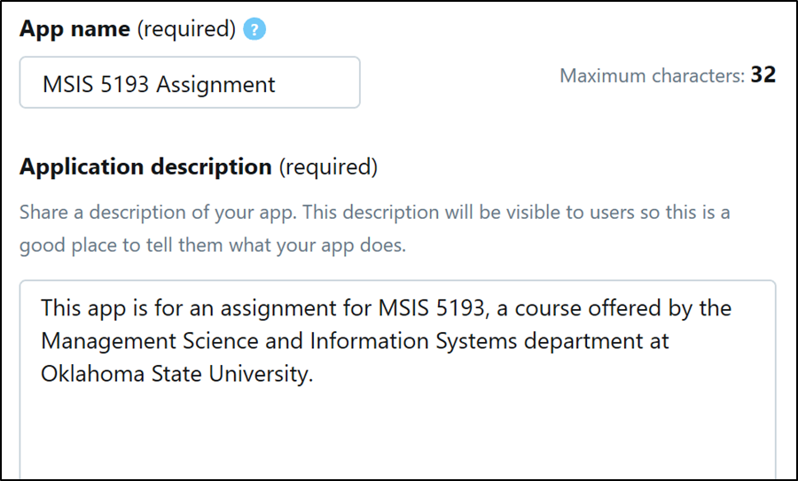
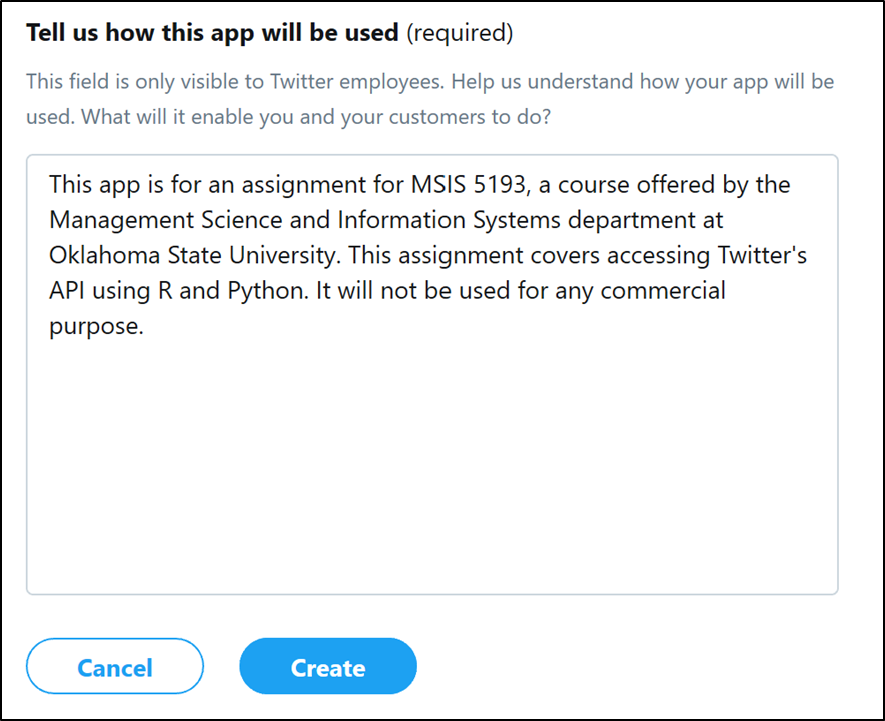
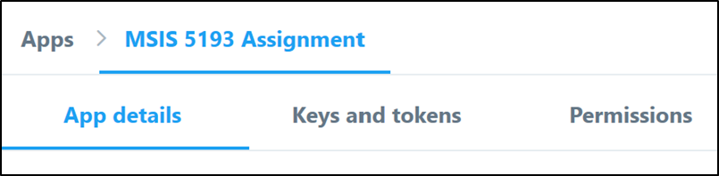
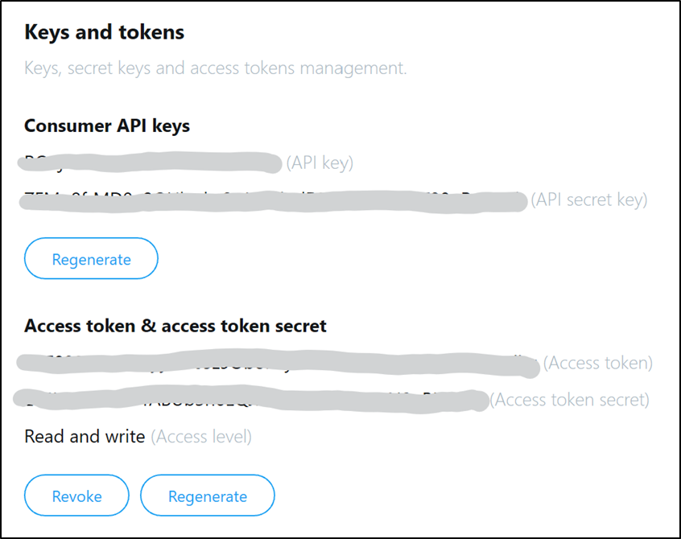

# Social Media Scraping
So far you have learned how to scrape data from a website using a combination of regular expressions and web scraping packages such as Selenium. While these tools are wonderful, they do require lots of effort to generate code specialized in scraping data from websites. Scraping data from social media platforms can be especially difficult compared to static webpages. This is because the webpages for SMPs dynamicall change as you scroll "down" the page. This means the webpage is constantly being loaded by your web browser, changing the HTML on the page. This means your CSS and XPath selectors will change too.

Many SMPs provide their own API allowing you to pull data in a simplified, meaningful way. This means a library for R or Python will have simplified functions that are straight forward and simple to use. You can avoid using regular expressions, selector paths, and sifting through pages of HTML. This can come with a cost. Many platforms, such as Twitter and Facebook, have pricing categories that limit the type and amount of data you can pull. If you use their API, you must pay a cost. While most SMPs provide a free tier, the severe restrictions of data you can pull act as a strong incentive to use a paid-tier. For me, I usually just end up using Selenium/regex/CSS-XPath-selectors to avoid paying those costs.

# Module Tasks
Please complete the following tasks:
* :notebook:Read the tutorial documentation below
* :school:Complete the ICE in class
* :computer:Complete the THA on your own

# Authenticating Your Session
To begin, you must first generate your keys in order to authenticate with Twitter. Login to Twitter at [https://developer.twitter.com/apps](https://developer.twitter.com/apps). In the top-right corner click on the blue button labeled `Create an app`. Your page may look slightly different from the one presented below.

You will be required to fill in details for the new application you are developing. Please use the following details shown below:

For the website url please enter `https://go.okstate.edu/`. For the callback url, enter `http://127.0.0.1:1410`. Finally, enter the text shown in the image below. This is a description of how you will use the app. Once done, select the blue button `Create`.

You now need to obtain the authentication tokens and keys. You will see three different tabs at the top of your application’s portal: `App details`, `Keys and tokens`, and `Permissions`. Click on the middle tab, `Keys and tokens`.

Copy the `API key`, `API secret key`, `Access token`, and `Access token secret`. If you do not see any Access tokens, generate them by clicking on the button to create them. Do not share these unless it is with someone you absolutely trust. These are specific to your Twitter account. If they are used by another individual or program and are found to be abusing Twitter, you could have your access to Twitter revoked permanently.

These credentials will be used in R and Python to access the Twitter API. 

# Twitter API
Currently, the Twitter API supports 3 tiers of search options. The following descriptions are copied directly from Twitter’s website: 
* **Standard**: This search API searches against a sampling of recent Tweets published in the past 7 days. Part of the 'public' set of APIs.
* **Premium**: Free and paid access to either the last 30 days of Tweets or access to Tweets from as early as 2006. Built on the reliability and full-fidelity of our enterprise data APIs, provides the opportunity to upgrade your access as your app and business grow.
* **Enterprise**: Paid (and managed) access to either the last 30 days of Tweets or access to Tweets from as early as 2006.  Provides full-fidelity data, direct account management support, and dedicated technical support to help with integration strategy.

For this tutorial, we will rely on the standard search tier as it is free. 

The following table includes the various standard operators used in Twitter queries or searches. This table comes from the [Twitter developer documentation](https://developer.twitter.com/en/docs/tweets/search/guides/standard-operators). Note the many subtle nuanced ways in which you can query tweets. For example, by including a question mark `?` in the query, you will find all questions related to the query.

| Operator | Finds Tweets ... |
|:---|:---|
| `watching now` | containing both "watching" and "now", but not necessarily in that order. This is the default operator. |
| `"watching now"` | containing the exact phrase "watching now". |
| `love OR hate` | containing either "love" or "hate" (or both). |
| `beer -root` | containing "beer" but not "root". |
| `#haiku` | containing the hashtag "haiku". |
| `from:interior` | sent from Twitter account "interior". |
| `list:NASA/astronauts-in-space-now` | sent from a Twitter account in the NASA list astronauts-in-space-now |
| `to:NASA` | a Tweet authored in reply to Twitter account "NASA". |
| `@NASA` | mentioning Twitter account "NASA". |
| `politics filter:safe` | containing "politics" with Tweets marked as potentially sensitive removed. |
| `puppy filter:media` | containing "puppy" and an image or video. |
| `puppy -filter:retweets` | containing "puppy", filtering out retweets |
| `puppy filter:native_video` | containing "puppy" and an uploaded video, Amplify video, Periscope, or Vine. |
| `puppy filter:periscope` | containing "puppy" and a Periscope video URL. |
| `puppy filter:vine` | containing "puppy" and a Vine. |
| `puppy filter:images` | containing "puppy" and links identified as photos, including third parties such as Instagram. |
| `puppy filter:twimg` | containing "puppy" and a pic.twitter.com link representing one or more photos. |
| `hilarious filter:links` | containing "hilarious" and linking to URL. |
| `puppy url:amazon` | containing "puppy" and a URL with the word "amazon" anywhere within it. |
| `superhero since:2015-12-21` | containing "superhero" and sent since date "2015-12-21" (year-month-day). |
| `puppy until:2015-12-21` | containing "puppy" and sent before the date "2015-12-21". |
| `movie -scary :)` | containing "movie", but not "scary", and with a positive attitude. |
| `flight :(` | containing "flight" and with a negative attitude. |
| `traffic ?` | containing "traffic" and asking a question. |

The following tutorials are available for R and Python.
* [SMP Scraping in R](assets/tutorial%20smp%20scraping%20in%20r.md)
* [SMP Scraping in Python](assets/tutorial%20smp%20scraping%20in%20python.md)

The accompanying example script files are found here:
1. [Example R file](assets/smp%20scraping%20example.R)
1. [Example Python file](assets/smp%20scraping%20example.py)