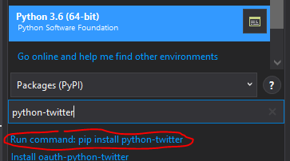
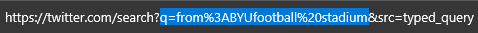
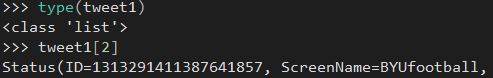
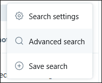

# Social Media Scraping in Python
The library you will be using to access Twitter from Python is `python-twitter`, a very easy name to remember. To check if you have this library installed within Visual Studio, type in the name of the library in `Packages (PyPI)` and see if it is listed as installed. If the first returned value is `Run command: pip install python-twitter`, then you need to install it. Select that option (see image below).



## Using `python-twitter`
The process is similar to that in R. You must first create an authenticated session with Twitter. This requires the API Key, the API Secret Key, the Access Token, and the Access Token Secret. Again, these are obtained from the Twitter Developer website. You can use the same Twitter app from your Developer Account that you used for the R tutorial. If you would like to use a separate app, you can go through the process again to create a separate app. This process will create entirely new and distinct tokens and keys for the API Key, the API Secret Key, the Access Token, and the Access Token Secret.

In the code sample below, copy and paste your API Key, the API Secret Key, the Access Token, and the Access Token Secret into the corresponding variables. 

```Python
import twitter

apikey = ''
apisecretkey = ''
accesstok = ''
accesstoksec = ''

twitconn = twitter.Api(consumer_key=apikey,
                       consumer_secret=apisecretkey,
                       access_token_key=accesstok,
                       access_token_secret=accesstoksec)
```

In addition, you must verify your credentials to establish the session. Use the following code to perform this step.

```Python
twitconn.VerifyCredentials()
```

You should see your user ID and Twitter screen name displayed in the console, confirming your identity.

You can perform general searches using the function `GetSearch()`. This functions similarly to the search function within Twitter whether you are using the website or an app, except you are limited to a certain number of returned results.

The easiest way to create query strings to use with `python-twitter` is to use a web browser and type in the search query directly into Twitter. For example, if I wanted to see the recent tweets about the stadium for BYU from their official BYU Twitter account, I would type in the following within Twitter:


Perform the search by hitting the `return` or `Enter` key on your keyboard. You should now have a list of results within Twitter. You need to copy a certain portion of the url for use within Python. The image below shows which portion. The `q=` represents a variable being passed from a previous webpage or server; it stands for query. The `%20` represents a space; each term you enter will have a space between it and another value. When you see the ampersand `&`, that represents the start of a new variable. We do not need the variable `src` for Python; leave it out.



Copy the url and paste it into your function within Python.

```Python
tweet1 = twitconn.GetSearch(raw_query='q=from%3ABYUfootball%20stadium')
```

In some ways, this is simpler than the method in R. You first perform the search in the website, then use the returned query value from the url. Yet, you need to rely on using the website to obtain the url, unlike R.

Like R, the variable housing the returned Tweets is a list. This means you can reference each index by using its index value, just like in R.



If you would like to specifically pull tweets from a single account, you should use the `GetUserTimeline()` function instead of `GetSearch()`. An example is given below.

```Python
tweet2 = twitconn.GetUserTimeline(screen_name='BYUfootball', count=30)

tweet2

for item in tweet2:
    print(item.text)
```

While we could dump out the contents of the entire variable `tweet2` to the console, instead, you can use a loop to cycle through every Tweet’s text. Very handy! This is better than using the index value one-by-one for each Tweet. Imagine if you had 1,583 Tweets. Typing out each index value would take a lot of time.

You can also use the Advanced Search within Twitter to build more complex search strings. To use it, click on the ellipses to the right of the search bar:


Click on Advanced search and a dialogue box will open containing various fields.



You can specify exact words or phrases that must be included, date ranges, Twitter accounts, mentions of a Twitter account, or exclude a word or phrase. For example, say I would like to have the following parameters in my search:
* From @BYUfootball
* Starting August 1, 2020
* Ending August 17, 2020

I can then execute the search, copy the resulting url, and paste it into Python like so:

```Python
tweet3 = twitconn.GetSearch(raw_query='q=from%3ABYUfootball%20until%3A2020-09-17%20since%3A2020-08-01')

for item in tweet3:
    print(item.id, item.text)
```

The library contains many more functions, including the following:
* `GetBlocks()` – Fetch the sequence of all users (as twitter.User instances), blocked by the currently authenticated user.
* `GetFollowers()` – Fetch the sequence of twitter.User instances, one for each follower.
* `GetFriends()` – Fetch the sequence of twitter.User instances, one for each friend.
* `GetHomeTimeline()` – Fetch a collection of the most recent Tweets and retweets posted by the authenticating user and the users they follow.
* `GetListMentions()` – Returns the 20 most recent mentions (status containing @screen_name) for the authenticating user.

Many other functions are included. See the online documentation for descriptions of each one: [https://python-twitter.readthedocs.io/en/latest/twitter.html](https://python-twitter.readthedocs.io/en/latest/twitter.html).

Another well supported library is `TwitterAPI`. For documentation on that library, see [https://github.com/geduldig/TwitterAPI](https://github.com/geduldig/TwitterAPI).