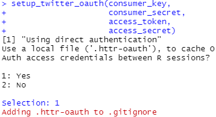
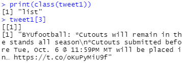

# Social Media Scraping in R
The library you will use in this tutorial is `twitteR` (note the capitalization of the letter R). Install and load the library prior to beginning this tutorial.

## Establishing a Session
When you connect to the Twitter API, you must first establish a session with Twitter's servers. You will use your credentials from your Twitter Developer Account. The following code is used to create that session.

```R
api_key = 'yourconsumerkey'
api_secret = 'yourconsumersecret'
access_token = 'youraccesstoken'
access_secret = 'youraccesssecret'

setup_twitter_oauth(api_key, 
                    api_secret, 
                    access_token, 
                    access_secret)
```

The first four string variables are the credentials you copied from your Twitter Developer Account. These allow you to authenticate to Twitter and access their servers where Tweets are stored.

When you first establish your session, you may be asked about `Using direct authentication` by using a `local file ('.httr-oauth')`.



Type `1` into the console to indicate you like to use a local file.

The library `twitteR` provides the function `searchTwitter()`. This allows you to apply parameters to a search string resulting in returned data. The table in the main section of this tutorial provides many search parameters.

We will start off with a simple search string. As a fan of BYU football, this season with coronavirus has left its mark on stadium attendance. If I use the search string `from:BYUfootball+stadium` I am searching for Tweets that have the keywords "BYUfootball," and "stadium." The search parameter `from` designates a Twitter account. In this case, it is `BYUfootball`. I use the `+` symbol to indicate I would like to add a word or phrase to the search term. In other words, I am searching the Twitter account "BYUfootball" for Tweets that use the word "stadium".

```R
tweet1 = searchTwitter(searchString = 'from:BYUfootball+stadium')

tweet1

tweet1[1]
```

I save the results from the search as the variable `tweet`. Obviously, you can change the name of this variable to something more specific. I could have named it `byu_stadium_tweets` or something more descriptive.

The variable is a list. This means you can reference specific Tweets using an index value.



In the next example, we will search for any Tweet mentioning the following terms: "byu," "football," and "jersey." The argument `n=20` means to limit the search to a maximum of 20 Tweets. Due note, the number returned may not include that many. The API limits how far back in time you can search. 

```R
tweet2 = searchTwitter(searchString = 'byu+football+jersey', n=20)

tweet2
```

We can use the search parameter `until:<date>+since:<date>` to specify a date range. Or, you could leave out `until:` or `since:` to be more inclusive.

```R
tweet2 = searchTwitter(searchString = 'byu+football+jersey+until:2020-09-20+since:2020-09-01', n=20)

tweet2
```

The last discussion point I will cover is using the argument `resultType=''`. The `resultType` argument specifies the type of search results received in the API response. Default is mixed. Allowed values are `mixed` (includes popular + real time results), `recent` (returns the most recent results), and `popular` (returns only the most popular results). Thus, if I would like to see the most popular Tweets surrounding my alma mater, then I can use `resultType='popular'.

```R
tweet3 = searchTwitter(searchString = 'BYU+football', resultType = 'popular')

tweet3
```

Do note that using this argument means your results can change over time. The most popular Tweets this hour may not be the same later in the day.

That's it! Experiment with different search parameters (see the table on the main tutorial page).