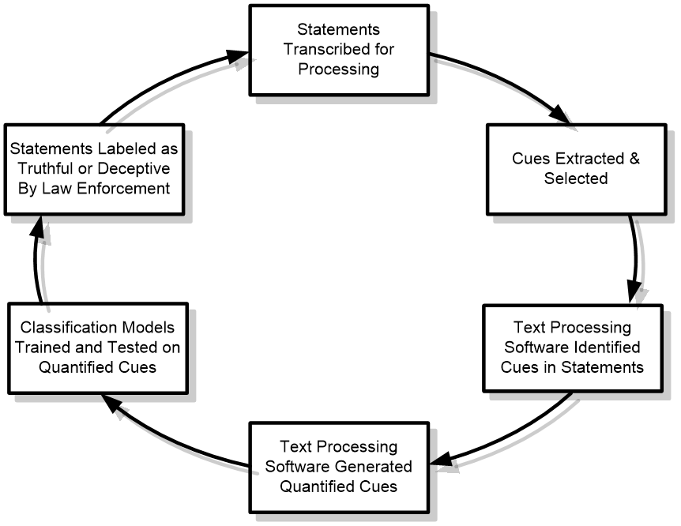
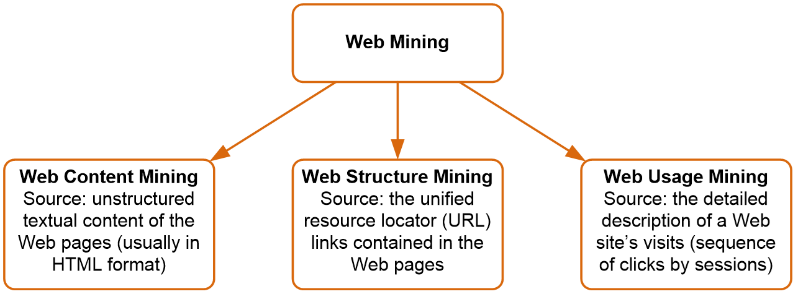

# Text Mining: Introduction
The vast majority of data exists online as unstructured, free-form text. From social media posts and user forums, to blogs and other static websites, text online is a gold mine. Two main hurdles impede organizations from tapping this gold mine: 1) scraping the data from the web and 2) analyzing the text data.

You previously learned about scraping data from the internet. In this tutorial, I will introduce you to text mining and analyzing text-based data.

# Module Tasks
Please complete the following tasks:
* :notebook:Read the tutorial documentation below
* :school:Complete the ICE in class
* :computer:Complete the THA on your own

# What Is Text Mining?
In short, *text mining* is a semi-automated process used to extract meaning, knowledge, or information from unstructured text-based sources. These text-based sources can be public (e.g. Twitter, Facebook, Instagram, user forums, blogs, news article comments) or private (e.g. meeting notes, emails, presentation files, employee profiles and records). The meaning or attitude that an individual or organization wishes to understand could be as simple as wanting to know attitudes toward a new coffee flavor; or as complex as views and opinions related to an upcoming presidential election.

How is text mining similar and different from data mining? Are they even the same thing? First, the similarities. Both are processes that seek for patterns among data. The purpose is to discover meaning that leads to insights or novel ideas. Another similarity is the usage of objective processes to impose order on data.

Second, text mining and data mining are semi-automated. Human involvement and intervention are required in both processes, though not necessarily at the same stages or using the same action. These are not black box approaches. The results of these analyses require human experience to interpret and impose understanding. As they are computer driven, automated processes can be programmed into various stages and steps.

Despite all these similarities, they are fundamentally different. Data mining uses structured data. This structured data typically resides in databases. As such, data is typically well-formatted, consistent in form, easily accessible, and redundant. For text mining, the data is unstructured. Think of the last time you read a social media post. How organized are the terms, ideas, nouns, subjects, or anything else in the text? Unlike a database, you cannot just point to a column of data and retrieve millions of entries, all organized neatly.

Unstructured data can appear in various forms. Some examples include Word documents, PDF files, emails, XML files, JSON files, Tweets, Facebook posts, blogs, images of notes written on a white board, and many more. The purpose of text mining is to impose a structure on the unstructured data.

## Real-World Benefits
At this point you might be wondering how it is used. Maybe you think only large corporations utilize it to improve consumer relations. The reality is, you have been exposed to it for decades.

One simple example is found in your email. Open your email and you have a SPAM folder. Usually, your junk email is sent to this folder, though not always. Have you ever wondered how your email service knows an email is junk and another is not? On an email server a program uses text mining algorithms on every single email sent your way. This automated program checks for specific patterns that indicate the email is junk. Phishing emails are partiularly malicious and need a high degree of scrutiny. 

For example, you are sent hundreds of phishing scams each day attempting to obtain your bank account number, credit card information, eBay or Amazon account information, or various login information. You might be thinking to yourself that you do not see that many. That's because the email server automatically removes these for you. You will never see them.

I will provide another example. Years ago I had an international student from India who worked in the patent office for India. He said they were converting the system from paper-based to digital. At the time, when a new patent was filed, individuals who had a working knowledge of existing patents would have to manually search for a patent and determine if any infringement existed. What a tedious process!

By migrating the patents over to a digital form, the text of the patents became searchable. Yet, the challenge still existed that a combination of words in a new patent may not necessarily *mean* the same thing if found in an existing patent. By using text analysis (or patent analysis in this case), terms, phrases, and words could be searched, interpreted for meaning, and compared across patents. A far faster and more efficient method.

A third example. When you search online using Bing or Google (and other search sites) the search engine utilizes text mining to derive your implied meaning. Sometimes when you search, at the top of the results page is a suggested alternative to what you originally typed. This is text mining at work attempting to understand what you meant, rather than what you literally typed.

One last example. Text mining can be used in deception detection. What is deception detection? It is a process in which one party attempts to detect lies in another party. Typically, you see this in crime movies or television shows in which law enforcement has a suspect in an interrogation room.

This is normally a very difficult problem when face-to-face. Sometimes "lie detectors" such as a polygraph are employed. Trained law enforcement rely on phsical cues to determine if a lie is present.

Often, law enforcement is only supplied with text in a case. For example, when attempting to track down pedophiles who roam the internet. In these situations, they no longer have physical cues to rely on. This is where text mining plays a role. Below is the process typically followed when engaging in text-based deception detection.

I have personally done research in this field, looking into text-based deception detection. In one project, a student and I investigated Amazon.com product reviews for deception. At one point, many reviews were the result of receiving payment from the manufacturer for a positive review. We used linguistic semantics analysis to look at the structure of the text, both at the sentence level and for paragraphs. Our results were only 87% successful at detecting deceptions, though. Obviously, more work is necessary to develop tools to successfully combat text-based deception.

## Text Mining Approaches
Two main approaches to text mining exist: bag-of-words approach and natural language processing (NLP). The bag-of-words approach is considered more rudimentary. A document is seen as a list of words where the meaning of the words is not important. Natural language processing attempts to understand the meaning behind the words in a document using clues such as context, grammatical structure, cultural elements (e.g. slang). The semantic meaning is vital.

Here is an example:
> Time flies like an arrow 
> Fruit flies like a banana

The first phrase is a well-known phrase that has special meaning to you and I. It means that time can flow quickly. You and I do not take this phrase literally. Natural language processing would pick up on the meaning; whereas the bag-of-words approach would not.

The second phrase, if taken out of context, would have a funny meaning. If the meaning is not literal, like the first phrase, then the phrase is confusing. How does fruit fly like a banana? Yet, in a literal sense, the bugs fruit flies do like eating bananas.

### Bag-of-Words
As stated earlier, in the bag-of-words approach words have little meaning. This is especially true for common words such as "the," "and," "or," "but," "through," "of," etc.. These types of common words are referred to as *stop words*. Typically, when engaging in a bag-of-words approach, the stop words are removed from a document.

In addition to stop words, another important concept for the bag-of-words approach is *stemming*. Stemming reduces words to their base form. This captures the content of the document better, but loses out on a lot of meaning. For example, a document might contain the following words: jumping, jumps, jumped. Stemming would reduce all three to *jump*.

As a specific example of how meaning is lost, here are two phrases:
> Received a late delivery. 
> Product not delivered on time.

In the first sentence, the word "delivery" is a noun, referring to a specific package. In the second sentence, the word "delivered" is a verb, referring to the process of delivering a package. Using stemming, both words would be reduced to "deliver".

Given its limitations, what is the advantage to using stemming with bag-of-words? You can better categorize documents by reducing the complexity of words. Since words are reduced to their root form, you can use classification techniques to order, sort, and categorize documents.

Sometimes removing stop words and stemming remove phrases with particular meaning. This is when you need to specify specific *word pairs and phrases*. These are lists of words that frequently appear together. This avoids the loss of text that are vital to capture. For example, the name of the rock band *The Who* would be removed because both words in the name are considered stop words.

As you create word pairs and phrases, you build up a *lexicon*. A lexicon is a list of words that are specifically important for the context of study. This may include variations of a word or phrase.​ For example, a study of tweets on flight departures may use "flight," "flt," or just "fl." Tweets and other social media posts are notorious for using shortened words or phrases. Do note, lexicons can change over time due to culture shifts, politics, or major events​.

If you search online, you can find pre-built lexicons for specific contexts. Many programming language libraries come with built-in lexicons. You can find lexicons for sports such as football, soccer, baseball, or basketball. Lexicons for movies and television exist. You can even find lexicons for beer and wine.

With the bag-of-words approach, each "word" or "phrase" of interest is referred to as a *term*. A term is not limited to a single word. If you are interested in capturing the names of historical figures, then each name would be a term. These terms are stored in a table or matrix referred to as a term-by-document matrix. Terms are listed in the column while a document is listed in the row. Each cell contains the number of times a term appears in a document. This cell value can be the frequency or other special derived values, such as percentages.

| | skin | boil | scar | tender | blood |
|:---|---:|---:|---:|---:|---:|
| Document 1 | 0.00 | 0.82 | 0.00 | 0.00 | 0.00 |
| Document 2​ | 0.30​ | 0.00​ | 0.00​ | 0.47​ | 0.37​ |
| Document 3​ | 0.00​ | 0.82​ | 0.00​ | 0.02​ | 0.00​ |
| ... | | | | | |
| Document n​ | 0.00​ | 0.00​ | 0.68​ | 0.32​ | 0.12​ |

Sometimes this is referred to as an occurrence matrix, because the matrix contains the occurrences of a term within a document. The document can be a website, a blog, a Tweet, a news article, SMS message, email, or anything with text. A term-document matrix can consist of a mixture of sources.

This term-document matrix should not be confused with corpus. The *corpus* for a project refers to all the text associated with a given project. This is comprised of multiple documents. In Latin, corpus means "body". Thus, this is a collection of text or the entire body for a given subject or topic. A typical process for generating a ready-to-use corpus includes the following tasks:
* Converting the entire document to lower case
* Removing punctuation marks (periods, commas, hyphens etc)
* Removing stopwords
* Removing numbers
* Filtering out unwanted terms
* Removing extra whitespace
* Stemming words

As I mentioned earlier, bag-of-words ignores grammar. Information has meaning depending on the placement of words. For example, "I did B, not A" is different from "I did A, not B," yet the bag-of-words approach would only see the following:
* Sentence 1: a, b, i, did, not
* Sentence 2: a, b, i, did, not

Both sentences would be considered equivalent. Again, the bag-of-words approach sees documents as lists of words; grammar, context, and semantics are not important.

Another problem is words can have multiple meanings depending on the context. Define the word "close." How many did you think of? If I do not give you a context, it is difficult to come up with meaning. Here are two possible definitions:
* To stop or obstruct
* To be together or near

By simply giving you the word "close" you are unable to determine which meaning is attributed to the term. If I give you the phrase, "I was close to her," then you could provide meaning. Yet, the bag-of-words approach does not differentiate among the possible meanings.

### Natural Language Processing
Natural language processing, or NLP for short, is considered a subfield of artificial intelligence (AI) and computational linguistics. Unlike the bag-of-words approach, NLP seeks to understand language through its meaning. Thus, NLP focuses on semantics. According to the Oxford Dictionary, semantics is defined as

> "the branch of linguistics and logic concerned with meaning. There are a number of branches and subbranches of semantics, including formal semantics, which studies the logical aspects of meaning, such as sense, reference, implication, and logical form, lexical semantics, which studies word meanings and word relations, and conceptual semantics, which studies the cognitive structure of meaning."

As you can see, semantics is multifaceted. Its not just focused on the relationships of words to each other, but includes advanced topics such as the implied meaning of words and phrases (e.g. sarcasm).

In reading about bag-of-words, you learned about a few challenges to text analysis. Here are some more challenges that NLP needs to overcome:
* Part-of-speech tagging: categorizing a term as a noun, verb, adjective, adverb; this depends on the context
* Text segmentation: Eastern Asign writing (e.g. Japanese, Chinese) is more difficult to parse; English is easier and so the majority of lexicons and NLP processes are written for English
* Word sense disambiguation: meaning based on context; how do you differentiate context?
* Syntax ambiguity: grammar structure of sentences is not consistent for all sentences, especially for modern social media posts (e.g. Tweets or Instagram posts)
* Imperfect or irregular input: dialects, accents, grammatical errors, shortened words

## Text Mining Process
Just like data mining, text mining has a logical, sequential process which includes three steps:
1. Establish the corpus
1. Create term-document matrix
1. Extract patterns

Each stage has an input and an output. Between each step is a feedback loop. Engaging in a step could lead to revisions for the previous step.

*Step 1: Establish the Corpus*

The purpose of the first step is to identify the scope of the project. This includes determining what type of documents to obtain (social media posts, blogs, website text, emails, etc.). Once identified, all relevant text is collected and stored. This process may include creating a web scraper or just downloading the relevant files. Once complete, the records are digitized (if paper-based documents are utilized), sorted, and converted into a standard text format such as ASCII or Unicode.

*Step 2: Creating The Term-Document Matrix*

In this stage, terms are extracted from documents using tokenizing.*Tokenizing* is the process of breaking apart text into terms. During this stage, you must determine which terms you will retain and which you will discard (e.g stop words, synonyms). You may need to process your text and stem the terms. Through stemming and merging synonyms, the term-document matrix is reduced to managable sizes. Additionally, the value in the cells of the TDM must be determined. Will you use row counts, binary frequency, log frequency, or inverse document frequency?

*Step 3: Extracting Patterns*

Using the TDM as input, this stage utilizes statistical techniques to derive patterns from the text data. Some example techniques include classification, clustering, association analysis, regression, neural networks, time series analysis, and many more. Since the data is now in a numerical format, many quantitative statistical techniques are available.

## Web Mining
Text mining as a field includes many subfields. One of the most popular is web mining. As the name inplies, this is text mining except the source of the data is generated from websites and other online mobile apps.

Web mining consists of three main divisions: web content mining, web structure mining, and web usage mining. The most well-known is web content mining. Unstructured text is scraped from the HTML of a webpage, tokenized, transformed, and then analyzed.

Web structure mining involves analyzing the structure of websites based on the URLs found in the webpages of a website.

Web usage mining is the second most popular web mining approach. This is typically used by the organization who owns the website. The purpose of this approach is to determine How effective and efficient the flow of traffic is for website users. This is done by tracking how many pages a customer visits, which URL links are used to traverse the webpage, which webpage the customer started on, which the customer ended on, and the duration of time on each webpage. This builds a profile of the type of visit for a customer.

As an example, Amazon.com did not always have the one-click button on its website. One of the biggest challenges ecommerce faced was a loss of customers in the purchasing process. In a brick-and-mortar store, such as Target, customers are loathe to leave the store without purchasing a product. This is because customers spend time, gas, and energy to traverse a store to look through goods and therefore are hesitant to leave the store without a purchase because of the investment of time, gas, and energy. Online, because of the lack of perceived investment of resources, customers do not feel as obligated to purchase a product, even if they spend a good amount of time researching them. Some customers felt the final steps to purchase a product too effortful compared to a brick-and-mortar store, so they failed to purchase anything.

After parsing through countless records of failed purchases by customers, Amazon decided to implement a one-click button on each product page. This reduced the amount of effort required to purchase a product. Sales increased after that and subsequently patented the "technology".

Analyzing the flow of internet traffic from one webpage to another is referred to as clickstream analysis. The data is housed on servers contained in server access logs.

Clickstream analysis is only one type of analysis for web usage mining. Organizations also use these other applications:
* Determine the lifetime value of clients
* Design cross-marketing strategies across products
* Evaluate promotional campaigns
* Target electronic ads based on access patterns
* Predict user behavior based on user profiles

One last area of improvement is improving website navigation. For large websites, such as those for Microsoft or Google, finding information on the website can become almost impossible, even using the website search function. By anaylzing website navigation patterns, organizations can streamline navigation.

# Tutorials for R and Python
Alright, enough discussion on text mining. Time for some hands-on experience. The following tutorials will introduce you to text mining in R and Python.
* [Text Mining in R](assets/tutorial%20text%20mining%20in%20r.md)
* [Text Mining in Python](assets/tutorial%20text%20mining%20in%20python.md)

The accompanying example script files are found here:
1. [Example R file](assets/text%20mining%20example.R)
2. [Example Python file](assets/text%20mining%20example.py)
