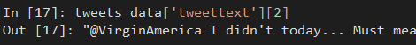
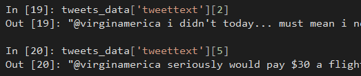
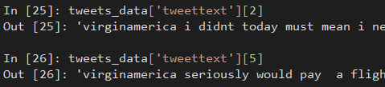
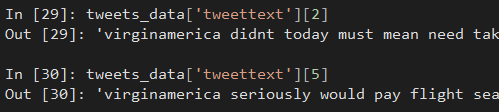
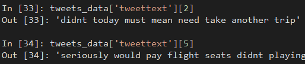
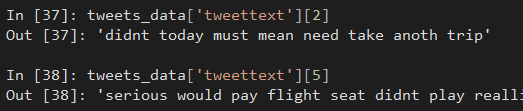

# Text Mining in Python
In this tutorial you will learn how to perform the text mining process in Python. While some similarities exist between your work with R, limitations of the libraries dictates how some of the processes unfold.

You will be using the same data file for this module. The file is [tweets.csv](../data/tweets.csv), which includes tweets about airlines and their associated sentiment scores.

## Data Formats for Corpus
The following loads the required libraries for this tutorial. Note, a separate file for stop words is downloaded separately. Below the line of code `import nltk` you will see a line commented out. Be sure to uncomment and run the line of code; comment again once you have downloaded the file. This is the dictionary for stopwords. You should only have to download this one time on your computer.

```Python
import pandas as pd
import matplotlib.pyplot as plt
import os

import nltk
#nltk.download('stopwords')
from nltk import word_tokenize, sent_tokenize
from nltk.corpus import stopwords
from nltk.stem import LancasterStemmer, WordNetLemmatizer, PorterStemmer
```

The library nltk is the [Natural Language Toolkit](http://www.nltk.org/) (nltk) for Python. The developers provide an [online book](http://www.nltk.org/book/) that goes into more depth than this tutorial. I suggest you take a look when you can. This library provides text mining functions for classification, tokenization, stemming, tagging, parsing, and semantic reasoning. Very powerful!

To begin, load in the data file and rename the column `text` as `tweettext` to make it more descriptive.

```Python
tweets_data = pd.read_csv('tweets.csv')
tweets_data.columns

tweets_data.rename(columns={'text': 'tweettext'}, inplace=True)
```

Unlike the process in R, the tokenization comes later in the process. This is not because Python operates differently, but because it is better to transform the data first and then tokenize the data. If you tokenize the data first, then a lot of unnecessary data will exist. In R, unfortunately, due to how the developers created the libraries, tokenization comes first.

## Preparing the Data
The first step is to convert the text to lowercase so that all words with similar spelling are treated the same. Look at an entry in the data. 

```Python
tweets_data['tweettext'][2]
```



You can see that this particular tweet contains uppercase values. Let's change that.

```Python
tweets_data['tweettext'] = tweets_data['tweettext'].apply(lambda x: " ".join(x.lower() for x in x.split()))
```

I can confirm that only lowercase values are present in the data.

```Python
tweets_data['tweettext'][2]
tweets_data['tweettext'][5]
```



The next step is to remove the numerical values and punctuation from the words. This process is performed using regular expressions. First, remove the numerical values.

```Python
patterndigits = '\\b[0-9]+\\b'
tweets_data['tweettext'] = tweets_data['tweettext'].str.replace(patterndigits,'')
```

Second, remove the punctuation.

```Python
patternpunc = '[^\w\s]'
tweets_data['tweettext'] = tweets_data['tweettext'].str.replace(patternpunc,'')
```

Third, confirm that the changes occurred. I am only using index value `2` and `5` to illustrate this example, but it is good practice to confirm your adjustments by looking at multiple records in the data, not just one or two.

```Python
tweets_data['tweettext'][2]
tweets_data['tweettext'][5]
```



Remove stop words from the data by using the library `nltk`. Obviously, we will choose `english` because the Tweets are in English.

```Python
stop = stopwords.words('english')

tweets_data['tweettext'] = tweets_data['tweettext'].apply(lambda x: " ".join(x for x in x.split() if x not in stop))
```

Tweets with missing stopwords.



Remove the Twitter account names of each airline from the data. Just like with R, removing the airline names helps focus this data on words and terms that contribute meaning.

```Python
airline_names = ['americanair','southwestair','jetblue','virginamerica','usairways','united']

tweets_data['tweettext'] = tweets_data['tweettext'].apply(lambda x: " ".join(x for x in x.split() if x not in airline_names)) 
```

Again, confirm the changes:

```Python
tweets_data['tweettext'][2]
tweets_data['tweettext'][5]
```



The next step is to stem the words. `nltk` provides an easy-to-use function, `PorterStemmer()`, to help.

```Python
porstem = PorterStemmer()

tweets_data['tweettext'] = tweets_data['tweettext'].apply(lambda x: " ".join([porstem.stem(word) for word in x.split()]))
```

```Python
tweets_data['tweettext'][2]
tweets_data['tweettext'][5]
```



The last step is creating a document-term matrix. We use a vectorizer from `scikitlearn`.

```Python
from sklearn.feature_extraction.text import CountVectorizer
vectorizer = CountVectorizer()

tokens_data = pd.DataFrame(vectorizer.fit_transform(tweets_data['tweettext']).toarray(), columns=vectorizer.get_feature_names())
```

Take a look at the columns in this dtm.


This contains a lot of columns. So much so that the majority of them are truncated and not displayed. To overcome this, you can use the following code.

```Python
print(tokens_data.columns.tolist())
```

A few terms are not too surprising: `delay` and `cancel`. The term `cancel` is interesting. One mistake beginners often make is to assume a term is limited to the correct spelling. People are notorious for shortening words (or misspelling them), especially on Twitter. The dtm also contains `cncdld`, `cnceld`, `cncld`, and `cncled`. Wow! When you select a term for analysis, be sure you look for any alternative spellings.

Now that I have this dtm, I can perform some interesting analysis. This doesn't require any fancy programming. Towards the beginning of the semester you learned how to query the data and create subsets using simple syntax. In this example, I would like to see how many tweets mention the term `delay` more than once.

```Python
delayproblems = tokens_data[(tokens_data.delay>1)]
delayproblems['delay']
```

One thing I did not do is look at alternative spelling for this term. Here are a few from the dataset: `delayconsequ`, `delayedagaineveri`, `delayedbecaus`, `delayedcancel`, `delayedconnect`, `delayedl`, `delayedno`, `delayednot`, `delayedov`, `delayedovernight`, `delayedstil`, `delayedthat`, `delayedwow`, `delayforwhat`, `delaygreatcustomerservic`, `delaykil`, `delaymiss`, `delaypend`, and `delayscancel`. 

At first, these may seem really odd. Most of them seem like spelling errors. Yet, these are actually not. Take a moment and think about what you know concerning Twitter. When do you see words mashed together without spaces?

Most of these terms are actually hashtags. Earlier in this tutorial we removed punctuation, which includes the `#` pound symbol. This means that any hashtag will appear oddly in the latter part of the analysis, like here. An alternative way I could have performed this analysis is to use regular expressions to remove any hashtags from the dataset prior to removing punctuation and symbols. The reason I did not is because hashtags often contain some of the most important language within a Tweet! In a way, hashtags are a concise summary of the Tweet.