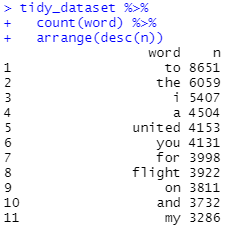
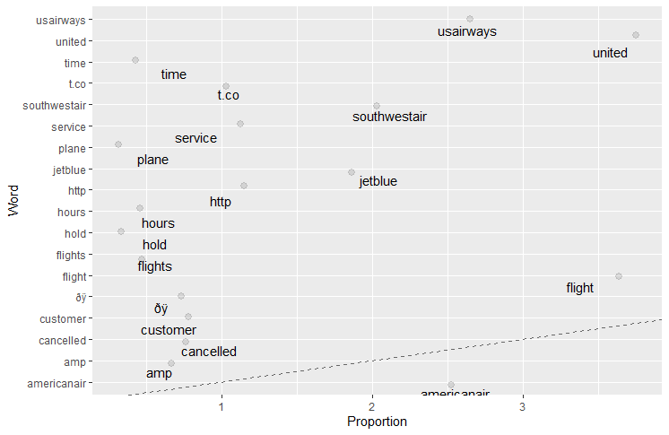

# Text Mining in R
For this tutorial, you will be returning to `tidyverse` to perform text mining. A good alternative is the library `tm` (abbreviation for text mining), which is designed specifically for text mining. This allows a greater degree of control compared to `tidyverse`, but requires a bit of extra work. Unlike the package `tm`, instead of saving a group of documents and its associated meta data, text that is in the tidytext format will contain one word per row wherein each row will include meta data associated with the word. This is a simpler way of storing data than using a term-document matrix.

For this tutorial, you will use the file [tweets.csv](../data/tweets.csv). This dataset contains Tweets concerning airlines.

## Data Formats for Corpus
The following loads the required packages for this tutorial. Note, for stemming, the libraries `hunspell` and `proustr` are good alternatives to `SnowballC`.

```R
library(tidyverse)
library(tidytext)

#Stemming packages
library(SnowballC)
```

Within our `tidytext` framework, we need to both break the text into individual tokens (a process called tokenization) and transform it into a tidy data structure. To do this, we use tidytext’s `unnest_tokens()` function. The `unnest_tokens()` function splits the text into single words/terms, strips all punctuation, and converts each word to lower case for easy comparability.

```R
airline_tweets = select(tweets_data, text, airline_sentiment)

tidy_dataset = unnest_tokens(airline_tweets, word, text)
```

The function `select()` behaves as a query operator. This allows us to pull only the columns `text` and `airline_sentiment` from the data. Much simpler and cleaner than using index values. Another wonderful tool provided by `tidyverse`.

The second line of code uses the `unnest_tokens()` function to tokenize the documents or tweets.

For those interested in using the pipe symbol `%>%`, an alternative version is provided:

```R
airline_tweets = tweets_data %>% 
  select(text, airline_sentiment)

tidy_dataset = airline_tweets %>%
  unnest_tokens(word, text)
```

This now lets us do some simple analysis on the text, rather than using specialized functions to analyze a corpus object. For example, we can count the most popular words in the airline tweets.

```R
counts = count(tidy_dataset, word)

result1 = arrange(counts, desc(n))

# Alternative
result2 = tidy_dataset %>%
  count(word) %>%
  arrange(desc(n))
```



The result shows the most popular words are "to," "the," "I," and "a." This should come as no surprise. These words in and of themselves are not meaningful. These types of commonly occurring words are referred to as stop words. As part of the text mining process, removing these stop words is an important step.

## Preparing the Data
Remove stop words from the data by using the dataset `stop_words` found in the `tidytext` package.  This is a dictionary of stop words provided by the developers of `tidyverse`. The possibility does exist that it may not contain all the stop words for your specific project or a specific context. This is one downside to using a dictionary provided by a third party. As a solution, you could simply add in the missing terms.

Continuing with the tutorial, load the stop words. Using the function `anti_join()` in `tidyverse`, we will remove the stop words from the data set. This function is simply the opposite of using a `join` function. The last step is to count the number of instances of each word and then arrange them in descending order.

```R
data("stop_words")

tidy_dataset2 = anti_join(tidy_dataset, stop_words)

counts2 = count(tidy_dataset2, word)

arrange(counts2, desc(n))
```

Alternative using the pipe symbol.

```R
data("stop_words")

tidy_dataset2 = tidy_dataset %>%
  anti_join(stop_words)

tidy_dataset2 %>%
  count(word) %>%
  arrange(desc(n))
```


Normally, in the text mining process, the words should be converted to lowercase. This is because the majority of text mining engines consider case as indicative of differing words. That is, the words "Happy" and "happy" are different words due to capitalization. Luckily, `tidytext` automatically changes the case to lowercase for all words. If you used the package `tm`, you would have to manually adjust the case. Additionally, `tidytext` automatically removes the punctuation from text; not so for `tm`.

The next step is to remove the numerical values from the words. This requires our old friend `stringr` from regular expressions. Recall, this package is part of `tidyverse`, so you do not need to load the library separately.

```R
patterndigits = '\\b[0-9]+\\b'

tidy_dataset2$word = str_replace_all(tidy_dataset2$word, patterndigits, '')

counts3 = count(tidy_dataset2, word)

arrange(counts3, desc(n))
```

The first part of the process is writing a regular expression to capture numerical values. These are then replaced with blank values using the familiar function `str_replace_all()`. The terms/words are counted and then arranged in descending order. This reduced the data from 15,093 terms to 13,946. That’s a lot of numerical data removed! Note, if you are specifically interested in capturing certain types of numerical data, you need to ensure your regular expression allows for that.

```R
tidy_dataset2$word = tidy_dataset2$word %>%
  str_replace_all(patterndigits, '')

tidy_dataset2 %>%
  count(word) %>%
  arrange(desc(n))
```

If you looked through all the values contained within the dataset, you will find blank values. At first, this may seem odd, as if the data had become corrupted. These blank values represent new lines, tabs, and other blank spaces. Again, using regular expressions, replace all new lines, tabs, and blank spaces and then filter out those values.

```R
tidy_dataset2$word = str_replace_all(tidy_dataset2$word, '[:space:]', '')

tidy_dataset3 = filter(tidy_dataset2,!(word == ''))

counts4 = count(tidy_dataset3, word)

arrange(counts4, desc(n))
```


```R
tidy_dataset2$word = tidy_dataset2$word %>%
  str_replace_all('[:space:]', '')

tidy_dataset3 = tidy_dataset2 %>% 
  filter(!(word == ''))

tidy_dataset3 %>%
  count(word) %>%
  arrange(desc(n))
```

While the process is not complete, this is a good opportunity to illustrate why the next step is important. Some words occur more often than others in a dataset such as this. A simple way to visualize this is to generate a plot with the proportion of occurrence of a word. Below, I plot the words in the dataset with a proportion greater than 0.5. 



I have included the code for the plot for those of you interested.

```R
frequency = tidy_dataset3 %>%
  count(word) %>%
  arrange(desc(n)) %>%
  mutate(proportion = (n / sum(n)*100)) %>%
  filter(proportion >= 0.5)

library(scales)

ggplot(frequency, aes(x = proportion, y = word)) +
  geom_abline(color = "gray40", lty = 2) +
  geom_jitter(alpha = 0.1, size = 2.5, width = 0.3, height = 0.3) +
  geom_text(aes(label = word), check_overlap = TRUE, vjust = 1.5) +
  scale_color_gradient(limits = c(0, 0.001), low = "darkslategray4", high = "gray75") +
  theme(legend.position="none") +
  labs(y = 'Word', x = 'Proportion')
```

Look at the left-hand side of the plot, where terms are listed. Some of the highest occurring terms include the names of the airlines. At first this may not seem surprising. These are Tweets related to the airline industry, so that should be expected. Yet, we would expect other words to rise higher. The airline names are not necessarily meaningful at this point. Currently, I am interested in determining which terms occur the most frequently.

In addition to airline names, one other term needs removal. Looking at the plot above, notice one of the terms is `http`. Obviously, this is present because people include URLs in their Tweets. I will include this in my list of airlines for removal. The terms I wish to remove include the following:
* southwestair
* jetblue
* united
* virginamerica
* americanair
* usairways
* http
* t.co

The next step is to remove all rows containing the terms found in this vector. We can use some of the subsetting techniques learned at the start of the semester, but that is a longer process and requires more effort. Instead, I can use the function `filter()` from the library `dplyr` (which is included in `tidyverse`) to query the data and restrict it to the specific subset I want. 

The simplest and most straight forward method here would be to create a query in which I retreive every term except "southwestair", "jetblue", "united", "virginamerica", "americanair", "usairways", "http", and "t.co". 

The function `filter(<data frame>, <column values>)` selects a subset of rows based on column values. This functions as a tool you can use to query a data frame. Since I am using the data frame `tidy_dataset3`, the function would be `filter(tidy_dataset3, <column values>)`.

Now I need to come up with the column values to query. The column of interest in `tidy_dataset3` is the same one we have been using this entire time: `word`. Using the operator `%in%` I can specify specific values contained in the column `word`. For example, my code could look like this:

```R
tidy_dataset3 = filter(tidy_dataset3, (word %in% ('flight','cancelled','service','time','customer','amp','hours','flight','flights','hold','wait','waiting','waited')))
```

Ok, one problem. I gave up typing terms after `waited`. This approach would require me to type out all the terms contained in the data. Considering I would have to type out over 14,000 terms, I need a more efficient method here. I need to create a query that selects everything *with the exception* of the terms I do not want. In other words, I want everything, but not "southwestair", "jetblue", "united", "virginamerica", "americanair", "usairways", "http", and "t.co". One possibility includes using the operator `!`, which means to "not do something" or "do the opposite."

It might look something like this:

```R
!(word %in% ("southwestair","jetblue","united","virginamerica",
         "americanair","usairways","http","t.co"))
```

First, here I am telling R to select only the rows containing the values "southwestair", "jetblue", "united", "virginamerica", "americanair", "usairways", "http", and "t.co" in the column `word`. With the operator `!` I  am telling R to now perform the opposite. 

I can simplify this code a bit. I will start by creating a vector containing the terms I do not want.

```R
list_remove = c("southwestair","jetblue","united","virginamerica",
         "americanair","usairways","http","t.co")
```

My query will now look like this:

```R
!(word %in% list_remove)
```

Throwing this into the full `filter()` function, I get this:

```R
tidy_dataset3 = filter(tidy_dataset3, !(word %in% list_remove))
```

Here is the alternative using the pipe notation:

```R
# Alternative code using the pipe %>%
tidy_dataset3 = tidy_dataset3 %>%
  filter(!(word %in% list_remove))
```

Another problem with the terms in the data is many need consolidation. For example, "cancelled," "cancel," or "cancellation" should have a higher count in the plot. Same goes for "wait," "waiting," "waited." Part of the issue here is that terms that have a similar root but are treated as distinct. To "merge" or "combine" them I will use the process of stemming. Recall, stemming is the process of reducing terms to their root. So, "waiting" and "waited" will be converted into "wait."

This is where the library `SnowballC` comes in and its function `wordStem()`. This function is fairly simple. The first argument is the data you pass in. This could be a vector of characters, a data frame, or a tibble. The second argument, `language=""`, specifies the input language of the data you are using. Since I am using English, I will use `language="en"`.

```R
stemmed_data = wordStem(tidy_dataset3$word, language="en")
```

While this provides me the data I am after, it is incomplete. This data does not contain the sentiment scores from the column `airline_sentiment`. This process would be more complete if I could stem the terms while still inside of `tidy_dataset3`. While I could append `stemmed_data` as a new column to `tidy_dataset3`, changing the values in place will be cleaner. 

I will once again look to the library `dplyr` in `tidyverse` for a solution. The function `mutate()` from the library `dplyr` allows me to create, modify, and delete columns. This function has multiple variants: `mutate_at`, `mutate_all`, and `mutate_if`. The function `mutate_at()` targets a specific selection of variables (or columns) in the data. I could also use `mutate_all()` if I am targeting all the variables in the data. Since I am only interested in one column `word`, I will just use `mutate_at()`. Specifically, I am interested in changing the existing column `word` and replacing it with new values from the function `wordStem()`.

```R
tidy_dataset4 = mutate_at(tidy_dataset3, "word", funs(wordStem((.), language="en")))

counts5 = count(tidy_dataset4, word)

arrange(counts5, desc(n))
```

And the alternative:

```R
tidy_dataset4 = tidy_dataset3 %>%
  mutate_at("word", funs(wordStem((.), language="en")))

tidy_dataset4 %>%
  count(word) %>%
  arrange(desc(n))
```

If you look at the results, the term `flight` is now first instead of second. 


The plot indicates that stemming made a number of adjustments. For example, the word `delay` is now more prevalent, which comes as no surprise. The word `flights` no longer shows on the plot. Additionally, the term `bag` appears in the plot, most likely related to baggage.

The last step is creating a term-document matrix. Using `tidytext`, the process is straight forward and simple. Unfortunately, this step is simpler to execute using the piping notation.

```R
tidy_tdm = tidy_dataset4 %>%
  count(airline_sentiment, word) %>%
  cast_dtm(airline_sentiment, word, n)
```

The `count()` function you are already familiar with. The last function, `cast_dtm(<document>, <term>, <value>)`, creates a document-term matrix. If you want a term-document matrix, simply use `cast_tdm(<term>, <document>, <value>)`.

In this example, the variable `airline_sentiment` from `tidy_dataset4` is considered the list of "documents." The column `word` is obviously the list of terms. The column `n` from `counts5` (or in this case, from the `count()` function) includes the values inserted into the cells of the table.

And that's it! I now have a completed TDM, ready for further text analysis.