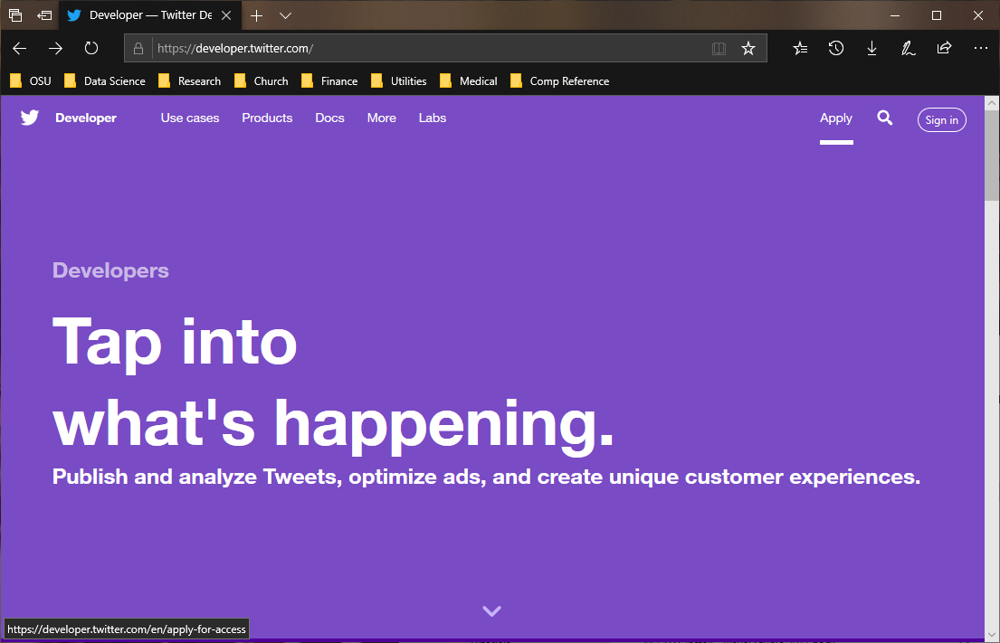
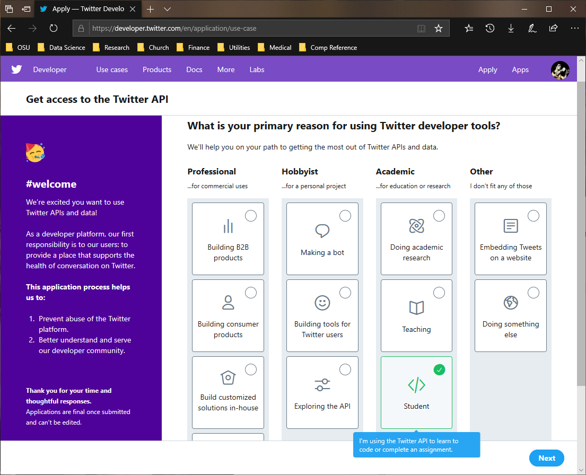
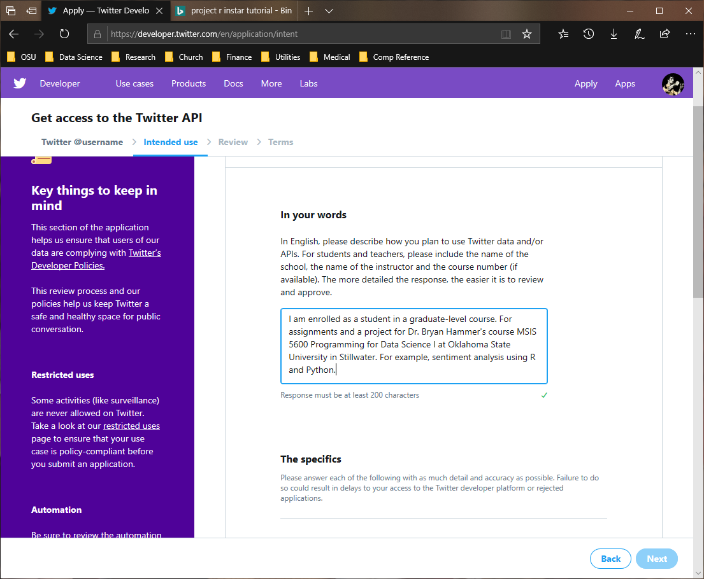
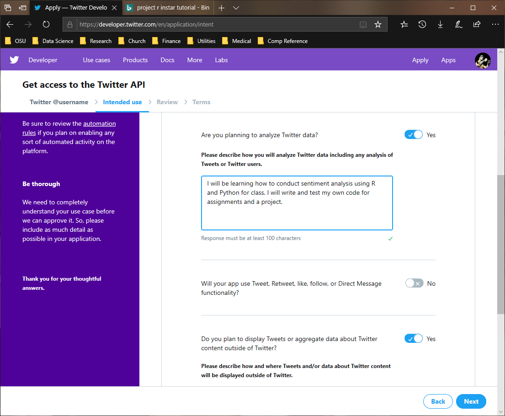
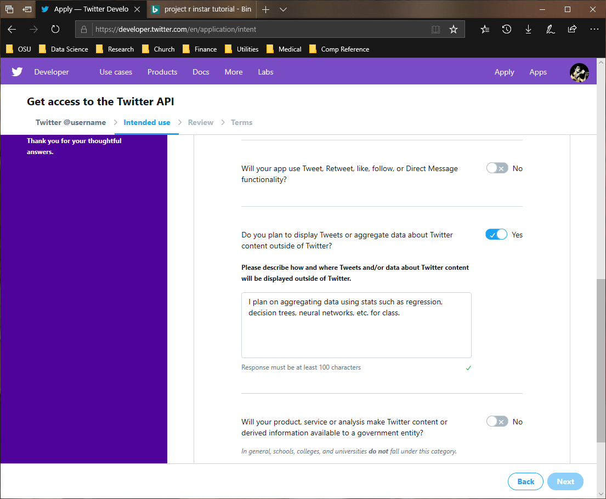

# Setup a Twitter Developer Account
The majority of social media platforms (SMP) require secure access to pull data. If you are using R or Python, you need to have this secure access in the form of a token given to you as a registered developer. For this course you will create a Twitter developer account. 

## Setup
Start by navigating to [https://developer.twitter.com/](https://developer.twitter.com/) in a web browser. You should see a webpage as shown below. If you are logged into Twitter already, do not worry about logging out.

Click on the link in the upper-right corner `Apply`. If you do not have a Twitter account, create one. You will need to validate your email address by confirming it through an email Twitter sends you.

Once you have logged into the system you will prompted about the type of activity you will engage in (see below image).

Under the column `Academic` select the option `Student` and click `Next`. If you do not have a valid phone number, you must provide a number. You will then receive a text with a verification code which you will enter.

Once you have verified your number (if required), you will have a few questions to answer. Please ensure the following:
* You are using an individual developer account
* Change your email address if you would like
* Indicate you are in the United States
* Select a unique name for your account that you will remember

The next series of questions are designed to justify the creation of this account. Below is an example that you may use for the first question:

The next question asks specifically about analysis of the data. You may use the following text in your response.

For the next question, “Will your app use Tweet, Retweet, like, follow, or Direct Message functionality?” indicate No by clicking on the button. For the next question, you may use the below text as your response.

For the next question, toggle the switch to indicate `No`. Continue clicking next until you have submitted your application. Note, if you have not verified your email address prior to this, you may need to before submitting your application. After you have submitted the application, you will receive a confirmation email. 