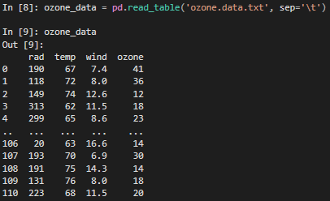
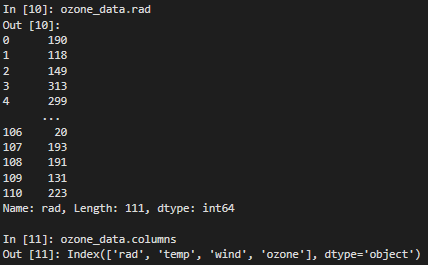
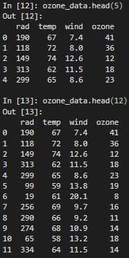
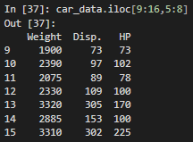
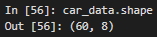
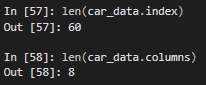
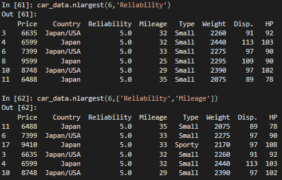
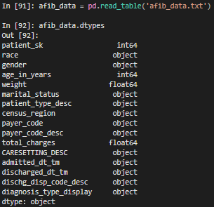

# Libraries and Packages
For this portion of the tutorial, we will be using the following libraries and modules. Within your Python script, import the following packages if already installed:

```python
import os
import pandas as pd
import numpy as np
import matplotlib.pyplot as plt
from sklearn.model_selection import KFold
```

If you have not installed them, you will need to download and install some of these packages in Visual Studio using `pip`. In particular, you will need to manually install
* pandas
* numpy
* matplotlib
* scikit-learn

In future tutorials, when you see me import packages, use `pip` to install them. I will not explicitly tell you to do so. This is a good habit to develop. When you graduate and start to rely on other resources to learn more about Python (e.g. Reddit, Discord, blogs, etc.), you will need to intuitively determine which packages you will need to install or update.

## Data Files

Unlike R, Python does not have a built-in object of dataframe type. As you will come to know, the dataframe object is very powerful for statistical analysis. The module `pandas` was developed to provide Python with similar functionality to that found in R. Many other libraries developed for Python rely on this module.

You will also be using the following data files.
* [ozone.data.txt](../data/ozone.data.txt)
* [car.test.frame.txt](../data/car.test.frame.txt)
* [seedlings.txt](../data/seedlines.txt)
* [class_performance.txt](../data/class_performance.txt)
* [afib_data.txt](../data/afib_data.txt)

## Setting the Working Directory
By default, the working directory of Python in Windows is your Documents folder. To determine what your current directory is, simply import the `os` library and run the command `getcwd()`.

```
import os

os.getcwd()
```

To change the working directory, simply use the `chdir()` function contained in the module `os`.

```python
os.chdir(r'C:\Users\bryan\source\repos\msis5193-pds1-master\using-and-manipulating-data\data')
```

You can use `os.getcwd()` once more to ensure the change occured.

# Managing Data
## Data Input
Importing a data file into Python is a simple process, much like it is in R. The function is simply `pd.read_table()` where `pd` is the `pandas` library. At the start of working on any project, always import the Pandas library. Additionally, you should also import `numpy` and `matplotlib.pyplot` if you have not already done so.

For this part of the tutorial, open the [ozone.data.txt](../data/ozone.data.txt) file. Again, this is similar to R. 

```python
ozone_data = pd.read_table('ozone.data.txt', sep='\t')
ozone_data
```



Like in R, the dataframe automatically assigns index values to each of the records. Alternatively, you can assign one of the columns to be the index by using the argument `index_col=’column_name’` where `column_name` is the name of the column within your data.

For your dataframe object, referencing columns in Python is a little different than in R. In R, the dollar symbol $ is used to denote a column; in Python, simply use a period between the dataframe and the column name. To lookup the names of the columns within your dataframe, use the columns attribute.

```python
ozone_data.rad

ozone_data.columns
```



To quickly view your data, you can use the `head(num)` or `tail(num)` functions, where `num` is the number of records you wish returned.

```python
ozone_data.head(5)

ozone_data.head(12)
```



## Changing Column Data
Removing columns in Python is a straightforward process. After importing your data into a dataframe, use the function `drop()` to remove the columns of interest. For this portion of the tutorial, use the [car.test.frame.txt](../data/car.test.frame.txt) file. The dataset contains the following variables, in order: *Price*, *Country*, *Reliability*, *Mileage*, *Type*, *Weight*, *Disp.*, and *HP*.

```python
car_data = pd.read_table('car.test.frame.txt', sep='\t')
car_data.columns
```

In this situation, you are not interested in the column Mileage, Type, and Weight. These columns are the fourth, fifth, and sixth respectively. To remove the columns, type the following:

car_data.drop(['Mileage','Type','Weight'], axis=1, inplace=True)

```python
car_data.drop(['Mileage', 'Type', 'Weight'], axis=1, inplace=True)
car_data.columns
```

As an alternative method, you can use the column index values instead of the actual names.

```python
# Import data into Python again
car_data = pd.read_table('car.test.frame.txt', sep='\t')
# Drop the columns
car_data.drop(car_data.columns[[3,4,5]], axis=1, inplace=True)
car_data.columns
```

The first example is a way to remove individual columns of data using the name of the column. If you have a long list of columns to remove, typing out individual column names would become tedious. The second example shows a way in which to remove columns using their index value. 

It should be noted that in Python, the indexing starts at 0 for both columns and rows; in R, indexing values start at 1. Thus, the fourth column in Python has an index value of 3, not 4.

Renaming columns is a simple process. Python provides many possible ways to change a column header. The first requires you to type in all of the column names, even the ones you are not changing. This can be tedious, however, if you have a lot of columns. If that is the case, the second method is better; also, it is recommended that you remove unwanted columns or create a subset of your data prior to renaming columns. In essence, you are renaming every single column in the dataframe; you just are not changing some of them.

For the first method, assume you would like to rename the column Mileage to Total_Mileage.

```python
# Import data again
car_data = pd.read_table('car.test.frame.txt', sep='\t')
# Rename the column
car_data.columns = ['Price', 'Country', 'Reliability', 'Total_Mileage', 'Type', 'Weight', 'Disp.', 'HP']
```

The second method uses the function `rename()`. This method will only allow the renaming of a single column of data. This avoids having to write out all the names of each column. Rename the column Total_Mileage back to Mileage.

```python
car_data.rename(columns={'Total_Mileage':'Mileage'}, inplace=True)

car_data.columns
```

# Working with a Dataframe
This next section deals with working with the data within a dataframe. Prior to even performing simple descriptive statistics, it may be beneficial to familiarize yourself with the data contained in the dataframe. This entails selecting specific columns or rows, sorting data, and selecting data based on conditions.

Sometimes it is useful to select specific values within your data. Like R, Python uses an indexing system, like the majority of statistical packages, for both rows and columns. In Python, just like R, because there is no GUI, you must specify the value using the indices, or subscripts as they are sometimes called.

The indices look like this `[r, c]` where *r* is the row value and *c* is the column value. 

The Pandas module provides two different methods for indexing and selecting data:
* Selection by position: a suite of methods to access data by integer-based indexing; use `.iloc`
* Selection by label: a collection of methods to access data from a dataframe by label-based indexing; use `.loc`

## Integer-Based Indexing
The following are considered valid inputs for accessing indexes for integer-based indexing.
* Integers such as `4`, `34`, `78`
* A list object or an array such as `[4, 34, 78]
* A slice object using integers `4:78`

Recall the car data contains eight columns of data. If I wanted to access ro 37, I would use the following.

```python
car_data.iloc[36]
```

Wait. Why didn't I use the number 37 if I wanted row 37? Remember, Python begins index values at 0, not 1. Thus, the first row has index value 0. For any row you want, subtract the value of 1 to obtain its index value such that `i = r - 1` where *i* is the index value you wish to obtain and *r* is the row you are attempting to access. For row 37, the index value is 36.

What if you want only the first 3 rows? You could use slicing for this. Here I present two possible solutions.

```python
car_data.iloc[:3]

car_data.iloc[0:3]
```

Note, the values here are not inclusive. If you count up the number of index values input, four values should have been returned. Count them: 0, 1, 2, 3. That's four items. Yet, Python only returned 3 rows. Why is this? When using `.iloc` Pandas is not inclusive when you perform a slice. For arrays, Pandas is inclusive.

Returning to our example, you can use an array as input.

```python
car_data.iloc[[0,1,2]]
```

Now that we know how to access rows of data, what about columns of data? Simple. For integers, let's select row 3 and column 3. Just like rows, we need to subtract a value of 1 from the column number to obtain the index value.

```python
car_data.iloc[2,2]
```

Using slicing as an input, let's select the first 3 rows and first 3 columns.

```python
car_data.iloc[:3,:3]

car_data.iloc[0:3,0:3]
```

What about rows 10 through 16 and the last 3 columns? Sure, we can do that too.

```python
car_data.iloc[9:16,5:8]
```



Since we are using the technique slicing, we need to add one more value to the last integer in our slices. Instead of using `9:15` we use `9:16`; instead of `5:7` we use `5:8`.

Another important note on slicing. If you would like all rows in the data but only the last three columns, you would do the following:

```python
car_data.iloc[:,5:8]
```

Moving on to arrays, we can find the first 3 rows and last 3 columns.

```python
car_data.iloc[[0,1,2],[5,6,7]]
```

For a detailed review on integer-based indexing, see [https://pandas.pydata.org/docs/user_guide/indexing.html#indexing-integer](https://pandas.pydata.org/docs/user_guide/indexing.html#indexing-integer).

## Label-Based Indexing
The following are considered valid inputs for accessing indexes for label-based indexing.
* Labels in the form of integers such as `4`, `34`, `78` or names of columns as strings
* A list or array of labels such as `['Price', 'Country', 'Mileage']` for columns or `['a','b','c']` for rows if your index values are characters and not integers
* A slice object using labels `Country':'Mileage'`

Using slicing, we can access the columns in our dataframe like so.

```python
car_data.loc[:,'Price']
```

This yields all rows of data with just the column *Price*. If we would like to obtain all rows for the columns *Price* through *Mileage* we could use the following.

```python
car_data.loc[:,'Price':'Mileage']
```

What about rows? How will slicing work since the index values are numeric in nature? Well, `.loc` will treat them as if they were labels and not integers!

```python
car_data.loc[0:3,'Price':'Mileage']
```

This code pulls the first 4 records. Note, that this is inclusive, unlike `.iloc`. This is because the index values are not treated like integers; they are labels for all intents and purposes.

Now that we understand slicing with labels, how about using arrays? Easy! Remember, we are dealing with labels now, not integers. This means when we select the columns, instead of referencing their index values as integers, we use their actual labels. For the first 3 rows and last 3 columns, the result would be the following.

```python
car_data.loc[[0,1,2],['Weight','Disp.','HP']]
```

For more details on label-based indexing, see [https://pandas.pydata.org/docs/user_guide/indexing.html#indexing-label](https://pandas.pydata.org/docs/user_guide/indexing.html#indexing-label).

## Unique Values

Three more functions that are useful should be noted here. The first one identifies the unique values contained within your data. If you have categorical data, this can be helpful in determining the various values contained in your variable (in R, the term `factor` is used instead of categorical). For example, Country contains eight unique values. To see a list of these values, type in the following code:

```python
pd.unique(car_data.Country)
```

## Row and Column Meta-Data
The second function, or set of functions, provides basic information on row and column size. This may be useful if you do not know the number of records your data contains or the number of columns. Two methods are provided. The first one provides information on rows and columns.

```python
car_data.shape
```



The seond method merely assesses the length of the rows and columns.

```python
len(car_data.index)
len(car_data.columns)
```



## Sorting Dataframe
The third set of functions allows you to sort your data. You can sort ascending, descending, select multiple columns to sort by, include only certain columns in your results, and many other combinations. A simple sort would look like this:

```python
car_data.sort_values(by='Reliability')
```

This sorts the data only on the column *Reliability*. Notice the missing values in the column are listed toward the bottom of the sort. If you would like the missing values at the top, type in the following:

```python
car_data.sort_values(by='Reliability',na_position='first')
```

Sometimes you are only interested in the largest or smallest value within a column of data. Using the functions nlargest() and nsmallest(), you can obtain those values respectively. For example, say you want the six largest values for *Reliability*.

```python
car_data.nlargest(6,'Reliability')
```

Perhaps you would like the six largest values for both *Reliability* and *Mileage*. The code is not too much of an extension from the previous line.

```python
car_data.nlargest(6,['Reliability','Mileage'])
```

The output from the two different lines of code reveal subtle differences. While the same records appear in both outputs, the order they appear differs. In the second output where *Mileage* is added as a condition, the record with an index value of 11 is listed first. This is because it has the largest value for both *Reliability* and *Mileage*.



Sorting multiple columns is also straight forward. Just add the additional columns in the order that you would like them sorted. If you want to sort by *Reliability* and *Mileage* in that order, you would list *Reliability* first; if you want *Mileage* sorted first, then list *Mileage* first.

```python
car_data.sort_values(by=['Reliability','Mileage'])

car_data.sort_values(by=['Mileage','Reliability'])
```

# Subsampling in Python
One basic approach to sampling is basing your subsample on a percentage of the overall sample size. For example, say you would like to sample 60% of your original data and perform an analysis on it. As a refresher, the steps include
* determine how many rows is 60% of your data,
* find out how many rows are in your dataframe,
* determine the range of your sample,
* and perform the splitting.

Use the ozone data to perform this operation. Some example code is provided below. Notice the function `astype(int)`. The function `np.round()` returns a number with a decimal point, even when you request zero decimal points. To change the datatype from float to an integer, you have to recast the object using `astype(int)`.

```python
splitnum = np.round((len(ozone_data.index) * 0.6), 0).astype(int)
splitnum

ozone_data_sample = ozone_data.sample(n=splitnum, replace=False)
len(ozone_data_sample.index)
```

Another option is to skip the steps calculating the number of rows to sample. The function `sample()` provides the argument `frac` that allows you to specify the percentage you would like sampled. This is a quicker method than the previous one shown.

```python
ozone_data_sample = ozone_data.sample(frac=0.6, replace=False)
len(ozone_data_sample.index)
```

Both methods yield a length of 67 rows.

Often you will want to select a subsample based on certain conditions or criteria given the data you have. For this example, the [seedlings.txt](../data/seedlines.txt) data will be used. The seedlings data contains three columns *cohort*, *death*, and *gapsize*. First, read in the data. Second, convert *cohort* to a categorical data type.

```python
seedlings_data = pd.read_table('seedlings.txt')

seedlings_data['cohort'] = seedlings_data['cohort'].astype('category')
```

*Cohort* contains two unique values as shown below.

```python
seedlings_data.cohort.unique()
```

Assume you would like to perform an analysis only on seedlings planted in September. Or, put another way, you want data not obtained in October. The code below shows how you perform both of these operations.

```python
seedlings_data[seedlings_data.cohort=='September']

seedlings_data[seedlings_data.cohort!='October']
```

After perusing your September-data, you realize that you only want data with a death value less than or equal to 10. This is another simple process. You just append additional conditions using the symbol `&`.

```python
seedlings_data[(seedlings_data.cohort=='September')&(seedlings_data.death<=10)]
```

What if you want to find data that is for September or October? You would type in both conditions and separate them using the OR operator, which is `|`.

```python
seedlings_data[(seedlings_data.cohort=='September')|(seedlings_data.cohort=='October')]
```

You may wish to create subsamples to perform techniques requiring training, testing, validation data or even k-fold cross validation data. For more information on using the library and its functions, please review this webpage for [scikit-learn](http://scikit-learn.org/stable/modules/cross_validation.html#k-fold).

Essentially, I would like to split the data into two halves, one for training and the other for testing. I am using the index values to determine how to split the data.

```python
kf = KFold(n_splits=2)

for train, test in kf.split(car_data):
    print("%s %s" % (train, test))

car_data.iloc[train]

car_data.iloc[test]
```

You can also test your dataframe for missing values. The first method utilizes two functions and returns a TRUE-FALSE value based on whether it is complete; i.e. TRUE indicates no missing values whereas FALSE indicates missing values. This function is `notnull()`.

```python
pd.notnull(seedlings_data)
```

To perform the opposite test, use the function `isnull()`. This returns TRUE for missing values and FALSE when no data missing.

```python
pd.isnull(seedlings_data)
```

An important note should be provided here. Datetime datatypes, specifically `dattime64[ns]`, `NaT` represents missing values, whereas `NaN` is typically used in numeric datatypes. Object datatypes will use the value provided them. Pandas objects are intercompatible between NaT and NaN.

# Adding Rows and Columns to Dataframes
An important task you will be engaging in as you work with data in Python is appending new rows to dataframes or adding additional columns. Pandas provides a simple way in which to do this. 

First, create some new rows of data to populate the seedlings dataset.

```python
newrows = [{'cohort':'November', 'death':333, 'gapsize':0.333},
           {'cohort':'November', 'death':444, 'gapsize':0.444},
           {'cohort':'December', 'death':5555, 'gapsize':0.555}]
```

Second, append the array of data to the existing dataframe. Save this as a new dataframe object named `seedlings_data2`. The reason I do this is to create a historical trail. If I need access to the original dataframe, I cannot overwrite it.

```python
seedlings_data2 = seedlings_data.append(newrows, ignore_index=True)
```

We can test to see if we successfully added the three new rows by looking at the lengths of the dataframes.

```python
len(seedlings_data.index.values)

len(seedlings_data2.index.values)
```

What if I have an existing dataframe and want to merge it with another dataframe? Easy. Here is an example in which I have an existing dataframe object containing 5 records. I can use the function `concat()` to add it to the other dataframe.

```python
newrows2 = pd.DataFrame({'cohort':['July', 'December', 'January', 'April', 'December'],
                         'death':[1,2,3,4,4],
                         'gapsize':[0.4216,0.1532,0.5434,0.6843,0.8531]},
                        index=[63,64,65,66,67])

seedlings_data3 = pd.concat([seedlings_data2, newrows2])
```

Ok, we know how to add rows. How about adding columns? I got you covered.

Well, actually, Pandas has you covered. Say we want to create a new column called *daylight* containing the amount of daylight each plant receives.

```python
newcols = pd.DataFrame({'daylight': range(490,558)})
```

Using the `concat()` function, add the new column of data to the existing dataframe.

```python
seedlings_data4 = pd.concat([seedlings_data3, newcols], axis=1)
```

For more information on this, see [http://pandas.pydata.org/pandas-docs/stable/merging.html](http://pandas.pydata.org/pandas-docs/stable/merging.html).

# Dates and Times
All modern statistical packages provide functions that perform mathematical operations and dates and times. For example, say you have data on employee work hours and you need to calculate pay for hourly employees. For each day over a five-day span you have the time the employee clocked in and the time the employee clocked out. You need to calculate the total number of hours the employee worked by using one of two methods: 1) you convert the date-time values into separate numerical values such as hours, minutes, and seconds and sum up the values or 2) use a date-time function that will automatically convert for you and provide you the total hours.

The second option is the obvious choice as it requires minimal computational skills on your part. One of the downsides to most statistical packages is they do not convert date-time values into date-time objects. That is, date-time values are read as categorical values made up of character strings; you cannot perform math on character strings. Converting date-time values in any statistical program requires work. For this portion of the tutorial you will be given an example of how to convert date-time values from *object* datatypes to *date-time* datatypes. Use the [afib_data.txt](../data/afib_data.txt) file to follow along.

```python
afib_data = pd.read_table('afib_data.txt')

afib_data.dtypes
```



The process of converting to a date-time object is simpler in Python than it is in R because the Pandas library provides powerful tools. Focus on the column *admitted_dt_tm* for this example. Looking at the data itself reveals the formatting is a string character. 

```python
afib_data.admitted_dt_tm.head()
```

To convert the column to a date-time format, simply use the `pd.to_datetime()` function. Notice the actual data is slightly different, with less trailing zeroes than before. The datatype is now `datetime64[ns]` instead of object.

```python
afib_data['admitted_dt_tm'] = pd.to_datetime(afib_data['admitted_dt_tm'])

afib_data.admitted_dt_tm.head()
```

It's a straight forward process without much fuss.