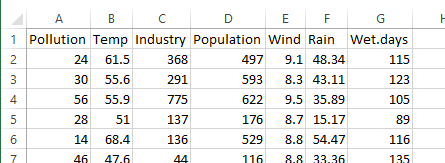
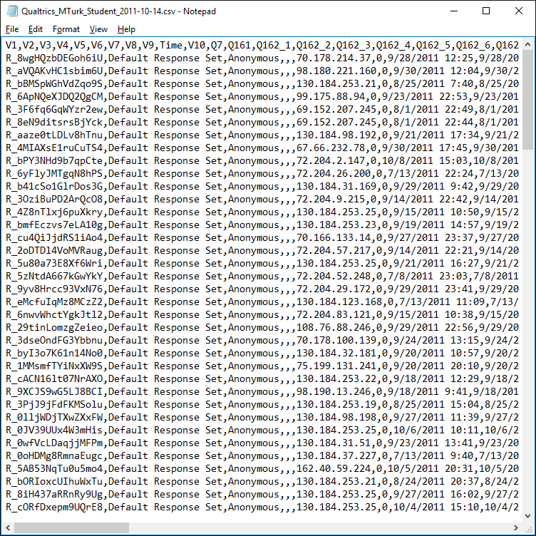
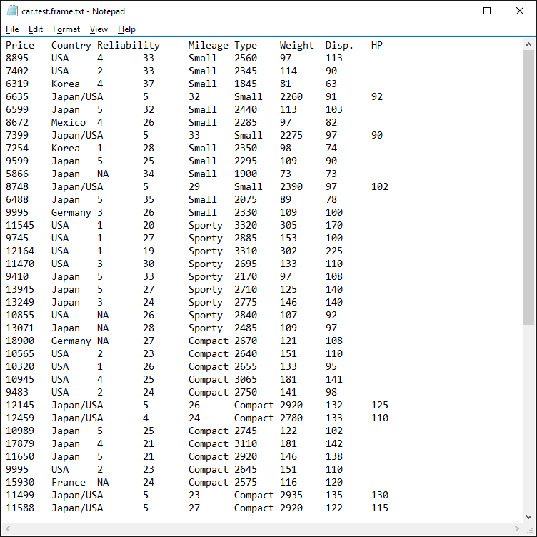
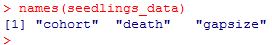

# Using and Manipulating Data in R
For this portion of the tutorial you will be using the following data files:
* [ozone.data.txt](../data/ozone.data.txt)
* [car.test.frame.txt](../data/car.test.frame.txt)
* [seedlings.txt](../data/seedlines.txt)
* [class_performance.txt](../data/class_performance.txt)
* [afib_data.txt](../data/afib_data.txt)

# Setting the Working Directory
The working directory is the default directory R will save files to. All programs, including video games, contain a default directory. When you create a new Word or Excel file, the directory you saved it in becomes the default for that file. Have you ever noticed that Word creates temporary files while working on a Word document? This file is created in the default working directory.

While you do not have to change the working directory in R, I recommend doing so as it keeps your data organized. If you work on all of your projects within the same working directory, you will have a very full folder with many files not related to each other. What a mess!

It is very simple to set the working directory within R. The following shows you how to do this:

```R
setwd("C:\\Users\\bryan\\source\\repos\\msis5193-pds1-master\\using-and-manipulating-data\\data")
```

You’ll notice that you need to specify the full path of the directory for your file, starting from the root, which is usually the C-drive. You will also notice that instead of using a single backslash to delineate directories, R requires a double-backslash. For example, if you have a file contained in your Documents folder within Windows `C:\Users\Person001\Documents\MSIS5633\Project\Data\expedia_reviews.txt`, you will need to add double-backslashes into the path like so:

```R
C:\\Users\\Person001\\Documents\\MSIS5633\\Project\\Data\\expedia_reviews.txt
```

Be sure to put quotation marks around the path. Failure to do so will result in an error. Another method of setting your working directory is to create a character object that is the directory path. Then, simply reference that object in the function `setwd()`.

```R
workingdirectory = "C:\\Users\\jim\\OneDrive\\MSIS 5633\\Data"
setwd(workingdirectory)
```

The advantage of this is you can reference the working directory in R for functions besides `setwd()`. An example is provided in the next section of this Exercise.

One of the advantages of using R is it creates a history of your analytics project. If you forgo working on your project for months and return to it later, you only need to parse through your R code to remember what you did. Your working directory provides the location of where you stored your data files.

To further help clarify code for future comprehension, use comments as much as possible. Comments are limited to a single line and are designated with #. For example, here is code that I often use before I setup the working directory:

```R
#######################################################
#=============Setup the Working Directory=============#
#Set the working directory to the project folder by   #
#running the appropriate script below. Note, you can  #
#run the data off of your OneDrive or DropBox.        #
#######################################################
```

# Data Input in R
By default, R contains a vast list of datasets designed to help you learn its various functions. To access this list, simply type `data()` in the console. You’ll notice this list spans many pages. This is overwhelming, to say the least. If you would like to use a dataset specifically designed for a particular analysis, use the function `try()`. One of the libraries used this semester is psych, which contains many functions used for descriptive statistics. Try the following command:

```R
try(data(package="psych"))
```

You should see a short list of datasets such as Bechtoldt, Chen (Schmid), Holzinger, and others. Most libraries contain built-in data sets to help you learn the functions of the library. How thoughtful are the authors of those libraries?

Usually, you will not be using a built-in dataset when working with R. You have obtained your own and would like to perform an analysis on it. R offers several methods for opening data files. The most important function due to its robustness is `read.table()`. Often, the function will look like this:

```R
datafile = read.table("c:\\directory-of-file\\filename.txt", header=T, sep="\t")
```

After specifying the location of the file you need to indicate whether the file contains a header row as well as the type of file you are working with. What is the header? Typically, it is the first row of a data file that provides the column names, as seen below in Excel. The column headings start with Pollution and end with Wet.days. Failure to include this will cause R to treat the column header row as just another row of data.



The last argument in the function deals with the how the file’s columns are separated. The two most common types you will encounter are tab-delimited (files often end in txt) and comma-separated (files often end with csv). Below are examples of both types of files opened within Notepad.





Right away you will notice differences in how these two types of files are formatted. A comma separated file contains lots of commas. This can be problematic if you have a column of data that is text. For example, if you are pulling data from Twitter you will have tweets that contain commas (see example below). If the file was not set up correctly, that comma in the text will be treated as a separator and you will end up with one extra column for that row.


How do you differentiate the file type using `read.table()`? If you are using a tab-delimited file you need to use `\t` to represent tabs, and a comma for comma separated files; they would look like `sep="\t"` and `sep=","` respectively.

When importing data you may encounter errors or problems with importing your file. Some common reasons may be due to your column headers having incorrect formatting such as blank spaces. For example, if you have a column header called annual sales you should convert it to annualsales, annual¬_sales, or annual.sales. If your headers have blank spaces, then R will assume these are two separate columns. So, annual sales is treated as two columns, not one. This results in your header having one more column than the body of data!

Another common error encountered in R is due to missing values in your dataset. This is not to say R cannot handle missing values, but those missing values cannot be left as a null value. The easiest solution to this is to open your file in Excel and replace all missing values with the value NA. To R, NA represents a null value. In fact, all database systems use a value to represent a missing value. While this seems odd at first glance, it is logical. A computer must represent the lack of data somehow in its memory; it cannot merely have nothing.

R has two alternate functions for opening files that you should be aware of. The first one allows you to browse for the file of interest. It is possible that you may not remember the exact location of your file and wish to browse your computer within R. To do so, simply type the following command:

```R
datafile2 = read.table(file.choose(), header=T)
```

The other function that you should be aware of is `scan()`. This is much more flexible to use than `read.table()`. This also means it is much more difficult to use. Why would you use this function? One good reason is your data file contains different numbers of values for each record. Scanning the file will allow you to import that kind of file while `read.table()` demands each row have equal columns.

Let’s return to the function `read.table()`. The last item to mention is saving the data file as a dataframe object within R. A dataframe is a technical, fancy way of saying a dataset in R. By saving it as an object you can refer to it and its many parts anytime you would like to. Here is the code one more time:

```R
datafile = read.table("c:\\directory-of-file\\filename.txt", header=T, sep="\t")
```

The dataframe object we have chosen to create is called datafile. You could have named this banana, weak_pancake, weakpancakge, or fifteen.toes_green. I like to use periods or underscores to separate words. You cannot use spaces. Keep in mind, if you already have a dataframe or variable with a name, don’t create a new dataframe with that exact same name! This will overwrite the previous value with the new value, which is a dataframe in this case.

The last thing you should know is how to reference or access the columns within your dataframe. Simply use a dollar sign attached to the dataframe object to do so. For example, if I have the column header annual_income in my dataframe sales¬_data, I would simply type sales_data$annual_income. If you are not sure what the column header names are, use the `names()` function to find out.



In the previous section I suggested you could save your working directory as a character object to reference later in R. One way I do that is with read.table(). Instead of typing out the entire path of the file’s location, I can simply reference the variable I created containing the path. See below for an example.

```R
workingdirectory = "C:\Users\bryan\source\repos\msis5193-pds1-master\using-and-manipulating-data\data"
acct_dir = "C:\\Users\\bryan\\AccountingData"
mark_dir = "C:\\MarketingData"
setwd(workingdirectory)
```

# Changing Column Data
Removing columns in R is a straightforward process. After importing your data into a dataframe, use the function `subset()` to remove the columns of interest. If you are using an automobile dataset with a list of cars with their respective characteristics, you may wish to remove columns that you are not interested in. The dataset contains the following variables, in order: weight, total_mileage, transmission, gps_bt, style, color, engine, and manufacturer.

In this situation, you are not interested in the column total_mileage, transmission, and gps_bt. You own a fifth-wheel and use your phone for navigation. To remove the columns, type the following:

```R
car_data = subset(car_data, select=-c(total_mileage, transmission, gps_bt))
```
or

```R
car_data = subset(car_data, select=-c(total_mileage:gps_bt))
```

The first example is a way to remove individual columns of data. If you have a long list of columns to remove, this list would become long. The second example shows a way in which to remove consecutive columns, giving the first, `total_mileage`, and the last, `gps_bt`. Note, the second method will remove any columns found between the two specified columns.

Renaming columns is a simple process. R provides many possible ways to change a column header. The first requires you to type in all of the column names, even the ones you are not changing. This can be tedious, however, if you have a lot of columns. If that is the case, the second method is better; also, it is recommended that you remove unwanted columns or create a subset of your data prior to renaming columns. Using the previous example, you want to rename the columns gps_bt and engine in your car data. You would type the following:

```R
colnames(car_data) = c("total_mileage", "transmission", "gpsnav_bluetooth", "style", "color", "cylinder_type", "manufacturer")
```

The method relies on knowing the index value of your column. That is, which position is your column in? One simple way to find out is type in `names(dataframe)` where `dataframe` is your dataframe object. Count each column header listed until you find yours. If your column is the fourth, you would type in the following, where dataframe is your dataframe object, 4 is the index value of your column, and NewName is the text you want to name your column:

```R
names(dataframe)[4] = 'NewName'
```

In addition to changing the columns within your dataframe, you may wish to change the actual data within your columns. For example, say you have a column that contains race information called race_primary. You find that your data has two versions of a null value: Null and NULL. The majority of stat programs will recognize these as two completely different values. You decide you would like to change all the uppercase values of “NULL” to match that of “Null.” To do this, simply use the code below:

```R
gsub("NULL", "Null", dataframe$race_primary)
```

The function `gsub()` is used for pattern matching and replacement. The first argument in the above example—`NULL`—is the value you want to change. The second argument—`Null`—is the new value you would like. The last argument is the object you wish to change, which in this case is a column within a dataframe. Obviously, you would use the name of your dataframe and the name of your column instead of those in the example.

To further illustrate how this function works, assume you would like to change all values of “Null” and “NULL” to NA. You would have to run the function twice as shown below:

```R
gsub("NULL", "NA", dataframe$race_primary)
gsub("Null", "NA", dataframe$race_primary)
```

Sometimes, you have more complex changes for your data in mind. For example, you may need to convert the first letter of all the values in your variable to a capital O. Or, perhaps you need to change the third letter for all values that begin with a capital T, but end with a lowercase W, but not if it contains the letter F as the third or fourth letter. This requires the use of a technique referred to as regular expressions.

This is beyond the scope of this module because of its level of technicality and sophistication. You will learn about it later in the semester. 

# Working with a Dataframe
This next section deals with working with the data within a dataframe. Prior to even performing simple descriptive statistics, it may be beneficial to familiarize yourself with the data contained in the dataframe. This entails selecting specific columns or rows, sorting data, and selecting data based on conditions.

Sometimes it is useful to select specific values within your data. R uses an indexing system, like the majority of statistical packages, for both rows and columns. In certain statistical packages with a GUI (graphical user interface), like IBM Modeler or SAS Enterprise Guide, you navigate a spreadsheet-like interface and use your mouse to highlight a specific value or values in the dataset. In R, because there is no GUI, you must specify the value using the indices, or subscripts as they are sometimes called.

The indices look like this

```R
[r, c]
```

where `r` is the row value and `c` is the column value. Recall the car data contains eight columns of data. If you want to find the data for the fourth row of data, for transmission (which is the third column), you would type the following:

```R
car_data[4,3]
```

What if you cannot remember which order the columns are in? You can use the `name()` function to list the columns, in order, in your dataset. It is also possible to pull the data for a single row. To do so, you would leave the column index value blank, like so:

```R
car_data[36,]
```

This brings up all of the data for row 36 for all columns of data. Likewise, you can pull data for a single column for all rows of data. If you would like to pull data for style, then you would leave the row index value blank, like so:

```R
car_data[,5]
```

It is quite possible that you would like specific columns for a specific row. Assume you would like only columns 2, 3, and 4 for row 107. There are two ways to do this. The first method uses a range of columns, all inclusive:

```R
car_data[107,2:4]
```

The second method specifies each column using indices or column names:

```R
car_data[107,c(2,3,4)]

car_data[107,c("total_mileage", "transmission", "gps_bt")]
```

The first method is useful if you have a long range of columns and you do not want to type out each one individually. The second method gives you the freedom to specify the columns of interest. If you only wanted columns 2 and 4 without 3, you could not use the first method; only the second method would allow this:

```R
car_data[107,c(2,4)]
```
or

```R
car_data[107,c("total_mileage", "gps_bt")]
```

You can also save an entire column of data as a new dataframe like so:

```R
gps_data = car_data[,4]
```
or

```R
gps_data = car_data[,c("gps_bt")]
```

Of course, a simple way of doing this would be referencing the column of data from the dataframe itself. In R, you can reference any column of data within a dataframe simply by using the `$` symbol to designate a column. For example, to obtain the data for total_mileage you would type the following into R:

```R
car_data$total_mileage
```

This returns only the data for the column total_mileage. This is useful for referencing the column to be used in various equations and functions. If you wanted to calculate the mean value of total_mileage, you would type the following:

```R
mean(car_data$total_mileage)
```

Likewise, if you wanted to create a new dataframe that only contains a single column of data, you would type in the following command:

```R
gps_data = car_data$gps_bt
```

This will only work for a single column of data. If you would like to save two or more columns of data into a new dataframe, you would have to use the previously shown methods of referencing multiple columns.

Three more functions that are useful should be noted here. The first one identifies the unique values contained within your data. If you have categorical data, this can be helpful in determining the various values contained in your variable (in R, the term “factor” is used instead of categorical). For example, assume that color contains five unique values: red, blue, green, white, and black. To see a list of these values, provide R with the following code:

```R
unique(car_data$color)
```

The second function, or set of functions, provides basic information on row and column size. This may be useful if you do not know the number of records your data contains or the number of columns. Respectively, these are provided as follows:

```R
nrow(dataframe)
ncol(dataframe)
```

The third set of functions allows you to sort your data. You can sort ascending, descending, select multiple columns to sort by, include only certain columns in your results, and many other combinations. A simple sort would look like this:

```R
car_data[order(car_data$gps_bt),]
```

This sorts the data only on the column gps¬_bt. If you would like to reverse the sort, use the following code:

```R
car_data[rev(order(car_data$gps_bt)),]
```

Sorting multiple columns is also straight forward. Just add the additional columns, in the order that you would like them sorted. If you want to sort by `gps_bt` and `transmission` in that order, you would list `gps_bt` first; if you want `transmission` sorted first, then list transmission first. See the following for the examples:

```R
car_data[order(car_data$gps_bt, car_data$transmission),]
car_data[order(car_data$transmission, car_data$gps_bt),]
```

Observe that the sorting code is entered in the index for row; no column index was specified. One of the issues in sorting the data this way is R includes all of the other columns in your dataset. What if you don’t want all the other columns included in your sort? 

You can include the column index value of the column you want to retain. Here is an example of doing this, including an alternative method for choosing the columns in your dataset:

```R
car_data[order(car_data$gps_bt, car_data$transmission), c(3,4)]
car_data[order(car_data$gps_bt, car_data$transmission),c("transmission","gps_bt")]
```

# Subsampling in R
In the realms of research and analytics, many reasons exist for creating subsamples of your data. For example, you may need to create a subsample for training, testing, and validation. You may need two subsamples to perform an Exploratory Factor Analysis and a Confirmatory Factor Analysis. You may need to look at customers who are only domestic instead of international. Whatever the reason, knowing how to create subsamples is important.

A basic approach to sampling is basing your subsample on a percentage of the overall sample size. For example, say you would like to sample 60% of your original data and perform an analysis on it. The steps include
1. Determine how many rows is 60% of your data
2. Find out how many rows are in your dataframe
3. Determine the range of your sample
4. Perform the splitting

```R
split.num = round(nrow(ozone_data)*.60,0)
nrow(ozone_data)
# Result: 111

x = 1:111	
ozone_data.split = ozone_data[sample(x,split.num,replace=F),]

nrow(ozone_data.split)
# Result: 67
```

The `replace=F` argument means the sampling is done without replacement. This means that none of the records pulled from the data are put back into the data as the sampling progresses. Also note the value `x`. This represents the range within your dataframe that you would like to take the sample from. If you wanted to only sample from the second half of the dataset, I would use `x = 55:111` instead.

In addition to pulling actual values from a dataset, I can perform a bootstrap on the data. In the following example, the data is sampled with replacement.

```R
ozone_data.bootstrap = ozone_data[sample(x, replace=T),]
nrow(ozone_data.bootstrap)
# Result: 111

#Save the newly created bootstrap data
write.table(ozone_data.bootstrap,file="ozone_data_bootstrap.txt",sep="\t",row.names=FALSE,qmethod="escape")
```

Often you will want to select a subsample based on certain conditions or criteria given the data you have. R provides a way for you to query your dataset. For this example, the `seedlings_data` will be used. This data contains three columns: `cohort`, `death`, and `gapsize`. Cohort contains two unique values, `September` and `October`.

```R
names(seedlings_data)

unique(seedlings_data$cohort)
```

Assume you would like to perform an analysis only on seedlings planted in September. Or, put another way, you want data not obtained in October. The code below shows how you perform both of these operations.

```R
seedlings_data[seedlings_data$cohort=='September',]

seedlings_data[!(seedlings_data$cohort=='October'),]
```

The second example uses the exclamation mark to indicate to R that you want the opposite to happen. In this case, if the exclamation mark had been left out, you would have selected data only in October; with the exclamation mark, you want everything without October.

After perusing your September-data, you realize that you only want data with a death value less than or equal to 10. This is another simple process. You just append additional conditions using the symbol `&`.

```R
seedlings_data[seedlings_data$cohort=="September" & seedlings_data$death<=10,]
```

What if you want to find data that is for September or October? You would type in both conditions and separate them using the OR operator, which is `|`.

```R
seedlings_data[seedlings_data$cohort=="September" | seedlings_data$cohort=="October",]
```

Taking this one step further, you can select data for September or October and has a death value less than or equal to 10. Here are two different statements that will select two different datasets:

```R
seedlings_data[(seedlings_data$cohort=="September" | seedlings_data$cohort=="October")& seedlings_data$death<=10,]
seedlings_data[seedlings_data$cohort=="September" | (seedlings_data$cohort=="October" & seedlings_data$death<=10),]
```

Can you spot the difference between these two? Here is a hint: Look at the placement of the parentheses. In statement 1, the parentheses surround the OR operator; in the second statement, they surround the AND operator. 

The first statement selects data that is 
1. September and less than 10 or 
2. October and less than 10. 

The second statement selects data that is 
1. September or 
2. October and less than 10. 

What kind of data would you select if you didn’t use any parentheses? Think about that for a while.

You may want to select columns based on whether they are numeric 

```R
seedlings_data[,sapply(seedlings_data,is.numeric)]
```
or categorical.

```R
seedlings_data[,sapply(seedlings_data,is.factor)]
```

You can also test your dataframe for missing values. The first method returns a TRUE-FALSE value based on whether it is complete; i.e. TRUE indicates no missing values whereas FALSE indicates missing values. It doesn’t specific which column, unfortunately.

```R
complete.cases(seedlings_data)
```

You can also select rows that do not contain missing values and save it to a new dataframe.

```R
seedlings_data_new = na.omit(seedlings_data)
```

Sometimes you would like to select data by excluding certain rows. In this example, rows 4 through 12 inclusive are left out.

```R
seedlings_data[-(4:12),]
```

# More on Subsampling
As an extension of the previous section on subsampling, you may wish to create subsamples to perform techniques requiring training, testing, validation data or even k-fold cross validation data. This is a simple extension of what was covered in the previous section. This part of the tutorial will use the `car.test.frame.txt` file. 

Understanding how indices operate in dataframes is important for this process. Recall that the index represents the row number within a dataframe. This process randomly selects the index values from the dataframe based on the percentages for each subset.

First, set the sizes, in percentages, of the subsets you are creating. Calculate the sample size for each of the subsets.

```R
#### Set the percentages of your subsets
train.size = 0.6
valid.size = 0.2
test.size = 0.2

#### Calculate the sample sizes
samp.train = floor(train.size * nrow(car_data))
samp.valid = floor(valid.size * nrow(car_data))
samp.test = floor(test.size * nrow(car_data))
```

The second step is a bit more complicated for beginners, but the code is fairly easy to understand once the various parts have been taken apart. Again, this part of the code relies on an understanding of indices. The purpose here is to determine which rows (i.e. indices) will be placed in which subset of data. Determine the indices each subset will have by following these steps:
1. Randomly select the indices for the training set
2. Determine the remaining indices not in the training set
3. From the list of indices in Step 2, randomly select indices for the validation set
4. Determine the testing-subset indices by selecting those not in the validation-subset

```R
indices.train = sort(sample(seq_len(nrow(car_data)), size=samp.train))
indices.valid_test = setdiff(seq_len(nrow(car_data)), indices.train)
indices.valid = sort(sample(indices.valid_test, size=samp.valid))
indices.test = setdiff(indices.valid_test, indices.valid)
```

The first line of code randomly assigns indices to the training set. This is based on the sample size (60% in this example) that was chosen. The function `sample()` performs the random selection of indices. The data that is being fed into the function `sample()` is a list (or a sequence) of all the indices from the car dataset, `seq_len(nrow(car_data))`. 

The `sort()` function merely sorts the indices.

The second line of code determines which indices are not found in the list of indices in `indices.train` using the `setdiff()` function. The `setdiff(x, y)` function operates by determining which elements, items, data points, etc. in `x` are not contained in `y`. In other words, these are the indices that will be used in the validation and testing sets. 

The third line of code is a repeat of the first line; indices for the validation set are pulled out of the list of indices not found in the testing set. The fourth line of code uses the `setdiff()` function again.

The last step is to use the three new sets of index values to pull data from the data. See the code below. By providing a list of index values, data can be separated into multiple subsets without any overlap. 

```R
car_data.train = car_data[indices.train,]
car_data.valid = car_data[indices.valid,]
car_data.test = car_data[indices.test,]
```

A k-fold cross validation approach is very similar, except each subset would have the same percentage. Additionally, the number of subsets created would not be limited to just three, as in the example given here, but up to the desired choice. An example of a 5-fold cross validation splitting of data is shown below. The data has 60 rows of data which divides into 5 subsets evenly; I generate a variable `samp.size` containing this information.

```R
samp.size = nrow(car_data) / 5
```

I then determine the indices each subset will have.

```R
indices.one = sort(sample(seq_len(nrow(car_data)), size=samp.size))
indices.not_1 = setdiff(seq_len(nrow(car_data)), indices.one)
indices.two = sort(sample(indices.not_1, size=samp.size))
indices.not_12 = setdiff(indices.not_1, indices.two)
indices.three = sort(sample(indices.not_12, size=samp.size))
indices.not_123 = setdiff(indices.not_12, indices.three)
indices.four = sort(sample(indices.not_123, size=samp.size))
indices.five = setdiff(indices.not_123, indices.four)
```

I take those indices and select the data.

```R
car_data.1 = car_data[indices.one,]
car_data.2 = car_data[indices.two,]
car_data.3 = car_data[indices.three,]
car_data.4 = car_data[indices.four,]
car_data.5 = car_data[indices.five,]
```
