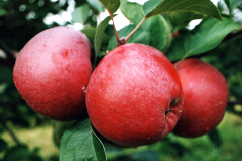
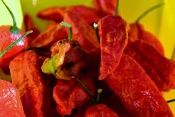

# Advanced Techniques of Data Visualization
The purpose of creating visuals is to convey a message about a topic. A visual can often convey meaning quicker than words. As the saying goes, "A picture is worth a thousand words." While this can be true, my own experience indicates otherwise. Qualifying the statement makes it truer: "A good picture is worth a thousand words. A bad one just confuses people."

In the previous tutorial you learned about using specific types of plots and charts for certain types of data. Yet, if the purpose of a visual is to convey a message, then we can do better than those basic plots.

The purpose of this tutorial is to teach you some techniques to enhance your plots. A story-driven narrative using visual plots or figures is referred to as *visualization*. A visualization catches the eye. It tells a story or a narrative. A point is being made. Let me give you an example.

## The Roots of Education are Bitter, But the Fruit is Sweet.
Take a moment and think about the word fruit. What comes to mind? Do you picture yourself holding something, biting into it, a delicious sweetness entering your mouth?

Not all fruit is sweet. In fact, one of the most popular fruits in the world would be considered far from sweet. Chili peppers are the fruit of plants from the genus Capsicum. The compound found in chili peppers that gives that distinctive spice is capsaicin. The bhut jolokia, or ghost pepper, is one of the hottest peppers in the world. In fact, India's Defence Research and Development Organisation (DRDO) have created and used chili grenades derived from the ghost pepper. The pepper is shown below.

How spicy is spicy, exactly? A few different methods exist for measuring the "spiciness" of peppers, but a very common one is the Scoville Heat Unit (SHU). To give you an idea about what the numbers mean, a bell pepper is 0 SHU, a sweet bell pepper is 100 SHU, a pimiento pepper is 500 SHU, a jalapeno is 8,000 SHU, and the bhut jolokia ghost pepper is 1,041,427 SHU. The hottest pepper currently in existence is the Carolina reaper at 2,200,000 SHU if grown in the right conditions.

| Pungency | SHU |
|:---:|:---:|
| Very Highly Pungent | Above 80,000 |
| Highly Pungent | 25,000 to 79,999 |
| Moderately Pungent | 3,000 to 24,999 |
| Mildly Pungent | 700 to 2,999 |
| Non-Pungent | 0 to 699 |

The table displays the levels of pungency related to Scoville Heat Units. An interesting question to ask is how many peppers are in each of the categories? What is the distribution like? The following website provides a list of peppers with their SHU: [https://chasingchilli.com.au/scoville-scale/](https://chasingchilli.com.au/scoville-scale/). By scraping this data and grouping it into the level of pungency, we can create a dataframe containing pepper name, SHU, and pungency level.

The remainder of this tutorial is broken up into seven parts:
1. [Scraping data and creating a data frame](assets/part01.md)
1. [Creating a box plot](assets/part02.md)
1. [Formatting a box plot](assets/part03.md)
1. [Adding additional elements](assets/part04.md)
1. [Annotating the box plot](assets/part05.md)
1. [Formatting legends](assets/part06.md)
1. [Alternative plot](assets/part07.md)

You can follow along with the example script file for this tutorial.
* [Advanced visualization example in R](assets/visualization%20advanced.R)