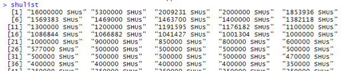

# Scraping Data and Creating a Data Frame
I begin by loading in the required libraries for scraping the data.

```R
library(RSelenium)
library(stringr)
library(dplyr)
library(forcats)
```

I first navigate to the webpage containing the data.

```R
web_url = 'https://chasingchilli.com.au/scoville-scale/'
rD = rsDriver(verbose=FALSE, browser = 'firefox', port = 4566L)
remDr = rD$client
remDr$navigate(web_url)
```

I create the XPath selectors for the pepper name and the SHU. Then pull the data.

```R
namexp = '//div["tablepress-1_wrapper"]/table/tbody/tr/td[1]'
shuxp = '//div["tablepress-1_wrapper"]/table/tbody/tr/td[2]'

name_elem = remDr$findElements(using = "xpath", value = namexp)
pepperlist = unlist(sapply(name_elem, function(x) {x$getElementText()}))

shu_elem = remDr$findElements(using = "xpath", value = shuxp)
shulist = unlist(sapply(shu_elem, function(x) {x$getElementText()}))
```

Unfortunately, the data for the SHU units doesn’t just contain numbers. It contains the text "SHUs" at the end of the text:



This looks like a job for regular expressions. The next step is to remove the text, create a new vector with numeric data, then create a data frame with all the data. In addition, the SHU is used to determine the pungency level.

```R
shunits = vector()
pungency = vector()
pattern_shu = '[:blank:]SHUs$'

n = 0
for (i in shulist) {
  n = n + 1
  shunits[n] = as.numeric(str_replace(i, pattern_shu, ''))
  if(shunits[n]>79999)
    pungency[n] = 'Very Highly Pungent'
  else if(shunits[n]>24999)
    pungency[n] = 'Highly Pungent'
  else if(shunits[n]>2999)
    pungency[n] = 'Moderately Pungent'
  else if(shunits[n]>699)
    pungency[n] = 'Mildly Pungent'
  else
    pungency[n] = 'Non-Pungent'
}

pungency = as.factor(pungency)
pepper_df = data.frame(pepperlist, 
                       shunits,
                       pungency,
                       stringsAsFactors = FALSE)

pepper_df$shunits
```

Looking at the data, I notice the top 5 rows are not peppers, so I will remove them.

```R
pepper_df = pepper_df[-c(1,2,3,4,5),]
```

The last step is to close the Selenium session.

```R
remDr$close()
rD$server$stop()
```

I now have my data frame, ready for use in a visualization.

The next step in the process is [Creating a box plot](part02.md).