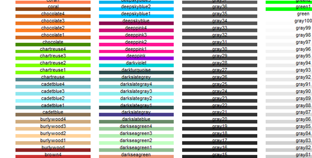
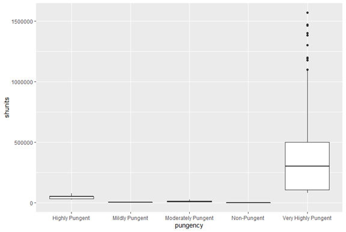
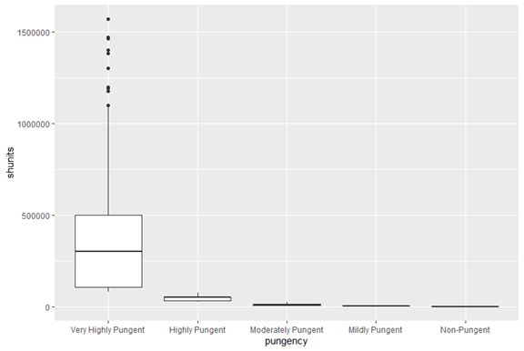
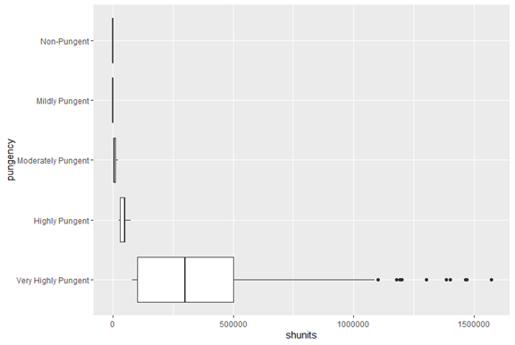
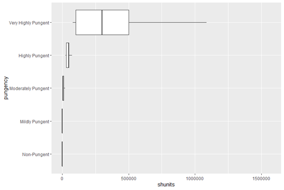
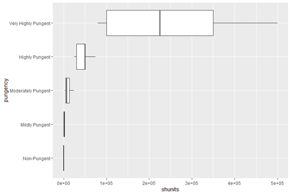

# Creating a Box Plot
Prior to making a plot, I need to determine which type of plot to create based on the data I have. My data consists of two variables: *pungency* and *SHU Unit*. The explanatory variable in this pair is the *pungency level*, which is a categorical variable.

According to this table, I should use either a box plot or a bar chart.

| Plot Name | Explanatory Variable |
|:---|:---|
| Scatterplot | Continuous |
| Histogram | Continuous |
| Box Plot | Categorical |
| Bar Chart (aka Bar Graph) | Categorical or Discrete |
| Line Chart | Time-Ordered |

For the purposes of this tutorial, I will create a box plot.

## The Beginning of Something
For my visualization, I will want to use some nicer looking fonts rather than what the default provides.

```R
#install.packages('extrafont')
#extrafont::font_import()
extrafont::loadfonts(device = "win")
```

In addition to font, I need to decide on what colors to use in my plot. Many colors are available to use in visualizations for R. I can reference them in my code by using their name. The code below provides a method for accessing a palette with all the colors and their names.

```R
library(ggplot2)
# http://sape.inf.usi.ch/quick-reference/ggplot2/colour

d=data.frame(c=colors(), y=seq(0, length(colors())-1)%%66, x=seq(0, length(colors())-1)%/%66)
ggplot() +
  scale_x_continuous(name="", breaks=NULL, expand=c(0, 0)) +
  scale_y_continuous(name="", breaks=NULL, expand=c(0, 0)) +
  scale_fill_identity() +
  geom_rect(data=d, mapping=aes(xmin=x, xmax=x+1, ymin=y, ymax=y+1), fill="white") +
  geom_rect(data=d, mapping=aes(xmin=x+0.05, xmax=x+0.95, ymin=y+0.5, ymax=y+1, fill=c)) +
  geom_text(data=d, mapping=aes(x=x+0.5, y=y+0.5, label=c), colour="black", hjust=0.5, vjust=1, size=3)
```



Using `ggplot2`, the code for generating the boxplot is simple enough.

```R
ggplot(pepper_df, aes(x=pungency, y=shunits)) +
  geom_boxplot()
```

The first function, `ggplot()`, defines the variables used in the plot as well as the data source. The second function, `geom_boxplot()`, provides the actual plot generated. Later on, I will show you how to use other types of plots. This produces a basic box plot.



When displaying a box plot, the larger boxes should be on the left-side of the plot with each consecutive box smaller than the previous. Since the eye is trained to read left to right, this presents the data in an order that our minds are trained to read. To correct this, we can use the `fct_reorder()` function and then plot out the data again.

```R
pepper_sort = pepper_df %>%
  mutate(pungency = fct_reorder(pungency, -shunits))

ggplot(pepper_sort, aes(x=pungency, y=shunits)) +
  geom_boxplot()
```



The labels on the *x*-axis are somewhat lengthy. Additionally, all the boxes except the first are flat—they need more space to stretch. Rotating the axis so the coordinates are flipped will provide more room for the boxes. This is done using the function `coord_flip()`.

```R
pepper_sort %>%
  ggplot(aes(x=pungency, y=shunits)) +
  coord_flip() +
  geom_boxplot()
```



In the R script, notice that each additional formatting element is connected to the previous line of code with a plus `+` symbol. This is the notation and syntax that `ggplot2` utilizes. Rather than type everything on a single line (which is messy), `ggplot2` allows for this tidy and neat formatting.

Returning to the box plot, when the box plot is presented horizontally, the data is best presented with the largest box at the top with the remaining boxes descending from largest to smallest. Additionally, outliers are present in the data (see the `Very Highly Pungent` category). Within the `geom_boxplot()` function, the argument `outlier.shape` can be used to remove outliers by giving a value of `NA`.

```R
pepper_sort %>%
  mutate(pungency = fct_reorder(pungency, shunits)) %>%
  ggplot(aes(x=pungency, y=shunits)) +
  coord_flip() +
  geom_boxplot(outlier.shape = NA)
```



Already the box plot is starting to look more readable. Yet, the scale on the *y*-axis is too long (note, the *y*-axis is not the horizontal axis anymore since the coordinates were flipped). The scales can be manipulated easily in ggplot. To adjust the *y*-axis, use the `scale_y_continuous()` function as shown below. I am limiting the scale to start at `0` and end at `500000`.

```R
pepper_sort %>%
  mutate(pungency = fct_reorder(pungency, shunits)) %>%
  ggplot(aes(x=pungency, y=shunits)) +
  coord_flip() +
  scale_y_continuous(limits=c(0,500000)) +
  geom_boxplot(outlier.alpha = 0)
```



A warning in the console indicates 26 data points were left out of the plot. This is understandable as some data points exist with a SHU value greater than 500,000. The data can be filtered to remove all data with values greater than 500,000, generating a new dataframe, if so desired.

```
pungency_data = pepper_df %>%
  filter(shunits <= 500000)
```

At this stage the box plot is in a good starting position. Yet, the plot is not telling a story. Not yet. The next step is to begin formatting the plot with an idea for a narrative in mind.

[Formatting a box plot](part03.md)