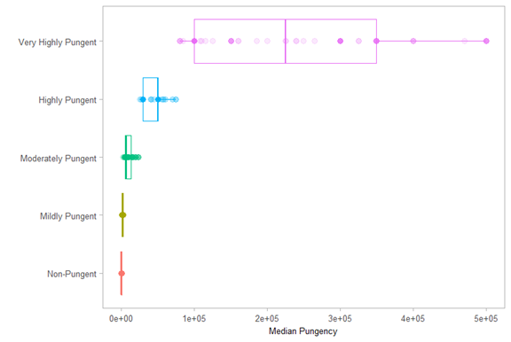
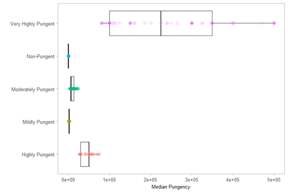
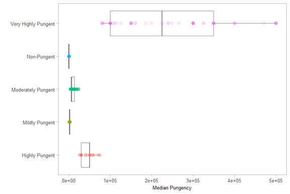
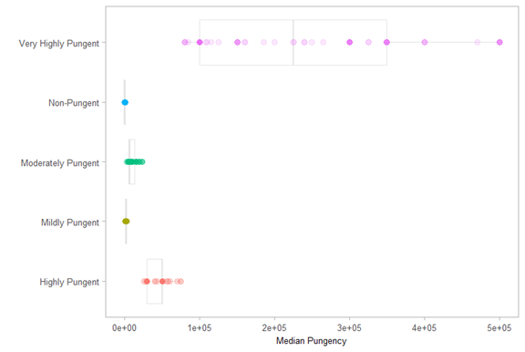
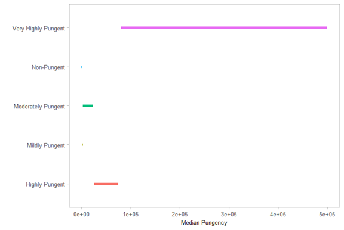
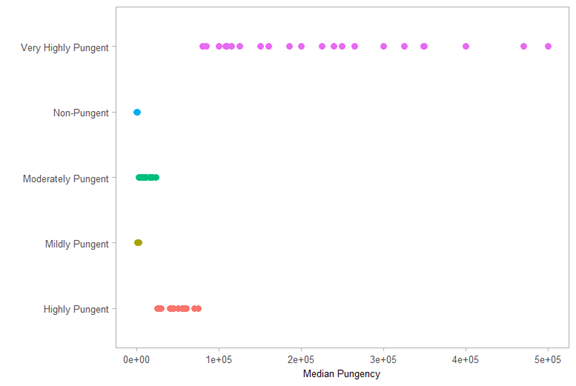
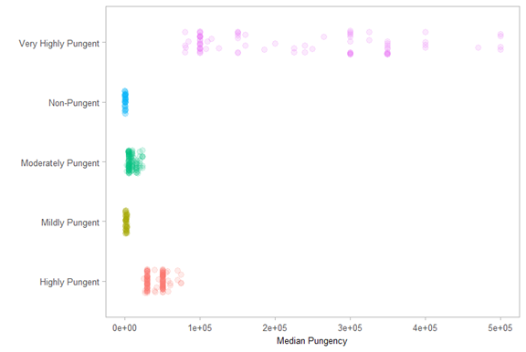
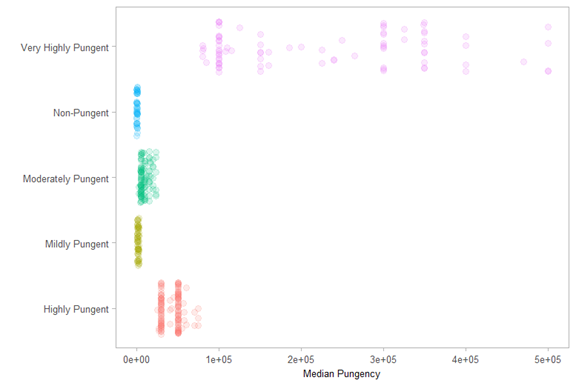

# Formatting a Box Plot
At this point I need to decide on a narrative. What message will my visualization provide? One thing most people are not familiar with is the strength of some peppers in Scoville Heat Units. Additionally, I would also like to compare the strength of the "Very Highly Pungent" category of peppers to the worldwide average. For me, that would make an interesting narrative.

In this section, I will add color to each category of pungency to distinguish them, add a light theme to the background to make the colors pop, update the labels so they are legible, and remove the legend.

```R
pepper_sort = pungency_data %>%
  mutate(pungency = fct_reorder(pungency, shunits)) %>%
  ggplot(aes(x=pungency, y=shunits, color=pungency)) +
  coord_flip() +
  scale_y_continuous(limits=c(0,500000)) +
  theme_light(base_size = 15) +
  labs(
    x='',
    y='Median Pungency'
  ) +
  theme(
    legend.position = 'none',
    panel.grid = element_blank(),
    axis.title = element_text(size = 10),
    axis.text.x = element_text(size = 10),
    axis.text.y = element_text(size = 10)
  ) +
  geom_boxplot(outlier.alpha = 0) +
  geom_point(size = 3, alpha = 0.15)

pepper_sort
```

First, in the `ggplot()` function, the argument `color=` is given the value `pungency` to indicate the categorical variable pungency should influence the color within the plot. The second adjustment is using the function `theme_light()`. The package `ggplot` has many different themes, each one changing various aspects of the plot; other packages provide themes as well. The main use of this theme is changing the background color to a white from the existing gray. This reduces eye strain on the viewer and allows the colors to pop.

The third change is adding in a label of the *y*-axis and no label for the *x*-axis using the function `labs()`. This is simply done by setting `x=''` which is an empty value and setting the label for the *y*-axis to `Median Pungency` using `y='Median Pungency'`.

The fourth addition is the function `theme()`. Inside this function several things are happening:
* The legend is removed from the plot to make room
* The grid layout in the background is removed (not very attractive to begin with)
* The titles for the axes is sized to 10
* The text on the *x*-axis is sized to 10
* The text on the *y*-axis is sized to 10

I used the same size for the axes and the titles to keep a consistent look. If the font size for the titles stands out, this will draw the eyes toward the titles. Again, the purpose of the visualization is to draw attention to what is happening in the figure itself, not the titles.

This results in the following plot.



Now comes the tedious part of creating a visualization. I need to make small adjustments to improve the visual appeal and narrative of the plot. The code for the plot is fairly lengthy. Each time I make an adjustment, I would have to type out the code again. This will become tedious. Often, you will use the same format for a series of plots, especially if you are attempting to improve a plot incrementally.

As a solution, you can create the format and save it as an object in R. The formatting below is saved as `pepper_theme`.

```R
pepper_theme = 
  ggplot(pungency_data, aes(x=pungency, y=shunits, color=pungency)) +
  coord_flip() +
  scale_y_continuous(limits=c(0,500000)) +
  theme_light(base_size = 15) +
  labs(
    x='',
    y='Median Pungency'
  ) +
  theme(
    legend.position = 'none',
    panel.grid = element_blank(),
    axis.title = element_text(size = 10),
    axis.text.x = element_text(size = 10),
    axis.text.y = element_text(size = 10)
  )
```

Using my new variable `pepper_theme`, I can easily make adjustments using `pepper_theme` as a base. One disadvantage here is if I need to adjust anything in the base, I will need to adjust the code and save it as a new theme. 

A box plot and point plot are created. The color of the boxes is changed to `gray20` in order to further differentiate the boxes from the data points.

```R
pepper_theme + 
  geom_boxplot(outlier.alpha = 0,
               color='gray20') +
  geom_point(size = 3, alpha = 0.15)
```



The boxes are fairly distracting, taking special attention away from the data points. In order to refine this, the color of the boxes is adjusted to a lighter gray using `gray50` and then `gray 90`.

```R
pepper_theme + 
  geom_boxplot(outlier.alpha = 0,
               color='gray50') +
  geom_point(size = 3, alpha = 0.15)
```



```R
pepper_theme + 
  geom_boxplot(outlier.alpha = 0,
               color='gray90') +
  geom_point(size = 3, alpha = 0.15)
```



The lightest color, `gray90`, changes the story of the box plot. With a darker color, the boxes are the central aspect of the plot; a lighter color highlights the data points stretching across the plot, making the boxes secondary to the story.

Other plot options are available with `ggplot2`. The line plot provides an alternative story; the point plot can be used alone, without the box plot.

```R
pepper_theme +
  geom_line(size=2)
```



```R
pepper_theme +
  geom_point(size=3)
```



Hmmmmm. Both plots are interesting. While each one tells a story, neither showcases the narrative I want to share.

One issue not readily apparent with these plots is the data is not fully exhibited. A single point on the plot can represent multiple points of data. Since many rows of data can have the same SHU value, those points will overlap with each other in the plot. In order to tease out the data, I will use the `geom_jitter()` function. The argument `width=` changes the extent of the spread shown.

```R
pepper_theme +
  geom_jitter(size=3, alpha=0.15, width = 0.2)
```



I will adjust the values a bit to see what happens with the plot.

```R
pepper_theme +
  geom_jitter(size=3, alpha=0.15, width = 0.4)
```



Unfortunately, due to the randomness of the function, each time `geom_jitter()` is run the pattern of the data points will be different. When adding annotations, text, images, or other artifacts to the plot, this can cause problems, especially if I place text in an empty area only to find a data point covering it in the future.

To get around this problem, I need to use the `set.seed()` function prior to each run of the `geom_jitter()` function. Within `set.seed()` choose a number; any number will suffice. In my example, I have chosen the number `54321`. I must ensure that I always use that same number every time I use `geom_jitter()`.

In comparing the two plots, I prefer the second one with the greater width. I think this does a better job of illustrating the amount of data for each value of SHU.

```R
set.seed(54321)
pepper_theme +
  geom_jitter(size=3, alpha=0.15, width = 0.4)
```

I am now at a point where I can start to add additional elements such as textual information within the plot.

[Adding additional elements](part04.md)