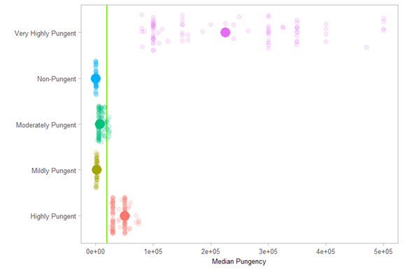
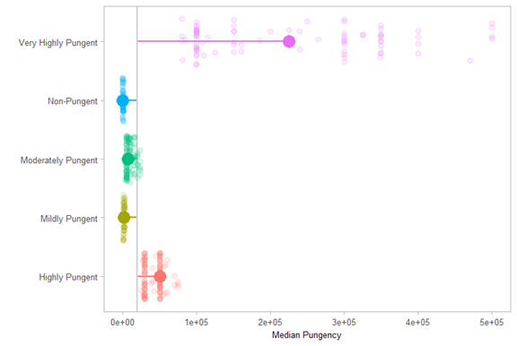

# Adding Additional Elements
This boxplot can still use some more interesting information. A boxplot itself is centered on the median of the data. I have changed the boxplot so much that the median is not apparent for each of the pungency categories. In order to correct this, the median for each pungency level must be calculated. Thinking about the median raises an interesting question: What is the overall median of the entire dataset and how does each pungency level compare to that overall median?

In order to calculate the median for each pungency level, the data is grouped by `pungency`. A new variable `med_pungency` is created by calculating the median value for each group using the `mutate()` function. Then the grouping of the data is reversed using the function `ungroup()`. This is saved into a new dataframe `pungency_data2`.

```R
pungency_data2 = pungency_data %>% 
  group_by(pungency) %>% 
  mutate(med_pungency = median(shunits, na.rm = T)) %>%
  ungroup()
```

The next step is to calculate the overall median. A new variable is created, called `pepper_med`. This is done using the `summarise()` function. The calculation is saved into a temporary variable called `avg`. Using the `pull()` function, the variable `avg` is passed back up to be stored as `pepper_med. 

```R
pepper_med = pungency_data2 %>% 
  summarise(avg = median(shunits)) %>%
  pull(avg)
```

Since a new column of data was generated along with a new dataframe, I need to create a new formatting theme.

```R
pepper_theme2 = 
  ggplot(pungency_data2, aes(x=pungency, y=shunits, color=pungency)) +
  coord_flip() +
  scale_y_continuous(limits=c(0,500000)) +
  theme_light(base_size = 15) +
  labs(
    x='',
    y='Median Pungency'
  ) +
  theme(
    legend.position = 'none',
    panel.grid = element_blank(),
    axis.title = element_text(size = 10),
    axis.text.x = element_text(size = 10),
    axis.text.y = element_text(size = 10),
    plot.title = element_text(size=14,
                              face = 'bold',
                              lineheight = 0.8)
  )
```

Now I add in the median values for each pungency level using the `stat_summary()` function.

```R
set.seed(54321)
pepper_theme2 +
  geom_jitter(size=3, alpha=0.15, width = 0.4) +
  stat_summary(fun.y = median,
               geom = 'point',
               size=6.3)
```


Each category has its median displayed. Using the `geom_hline()` function, I add in the overall median. This generates a horizontal line on the plot. In the case of my plot, I rotated the coordinates, so a horizontal line will be placed in a vertical position.

```R
set.seed(54321)
pepper_theme2 +
  geom_hline(aes(yintercept = pepper_med), 
             color = "chartreuse2", 
             size = 0.8) +
  geom_jitter(size=3, alpha=0.15, width = 0.4) +
  stat_summary(fun.y = median,
               geom = 'point',
               size=6.3)
```



The plot looks better, but the overall median does not stand out so well. One way of bringing attention to it is to draw a line from each individual median to the overall median. This will illustrate the "distance" each pungency median is away from the overall median. This is done using the `geom_segment()` function. This function contains several important arguments:
* `x`: the beginning point along the *x*-axis
* `xend`: the end point along the *x*-axis
* `y`: the beginning point along the *y*-axis
* `yend`: the end point along the *y*-axis

Keep in mind the rotation of the plot as you select the values for each of these points. Both x values are `pungency`; in other words, the thickness of each is only as large as the column of data.

```R
set.seed(54321)
pepper_theme2 +
  geom_segment(aes(x=pungency,
                   xend=pungency,
                   y=pepper_med,
                   yend=med_pungency),
               size=0.8) +
  geom_hline(aes(yintercept = pepper_med), 
             color = "gray80", 
             size = 0.8) +
  geom_jitter(size=3, alpha=0.15, width = 0.4) +
  stat_summary(fun.y = median,
               geom = 'point',
               size=6.3)
```



This is starting to illustrate the narrative nicely. You can clearly see that the median for `Very Highly Pungent` is farther away from the overall median compared to the other categories.

[Annotating the box plot](part05.md)