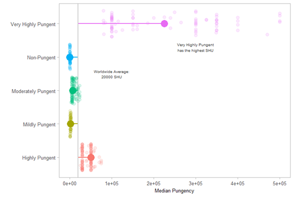
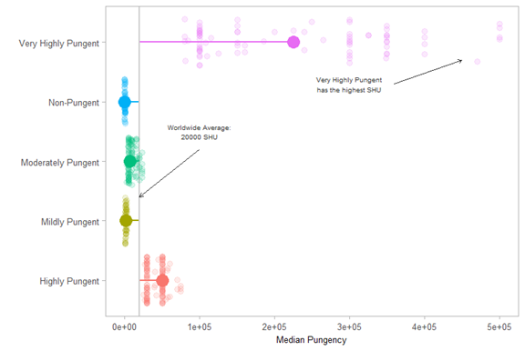

# Annotating the Box Plot
Within each plot, you can add various types of annotations, such as text, images, or drawings. For example, with text, you could add descriptive elements to further clarify or enhance areas on the plot. In my example, the overall median is not readily apparent as to what it is. You and I know what it is because we have seen the code. Adding in a simple phrase "Worldwide Average" with the numeric value of the median can clarify what that line is. Another text annotation could highlight the large values of the "Very Highly Pungent" category. This can be accomplished using the `annotate()` function.

```R
set.seed(54321)
pepper_text = pepper_theme2 +
  geom_segment(aes(x=pungency,
                   xend=pungency,
                   y=pepper_med,
                   yend=med_pungency),
               size=0.8) +
  geom_hline(aes(yintercept = pepper_med), 
             color = "gray80", 
             size = 0.8) +
  geom_jitter(size=3, alpha=0.15, width = 0.4) +
  stat_summary(fun.y = median,
               geom = 'point',
               size=6.3) +
  annotate('text', x = 3.5, y = 100000, size = 2.7, color = 'gray20',
           label = glue::glue('Worldwide Average:\n{round(pepper_med, 1)} SHU')) +
  annotate('text', x = 4.3, y = 300000, size = 2.7, color = 'gray20',
           label = glue::glue('Very Highly Pungent\nhas the highest SHU'))
pepper_text
```



The text alone is insufficient. The text `Worldwide Average: 20000 SHU` appears to be floating in white space, without a subject; it is not evident it is related to the vertical line. Adding arrows to the plot will help resolve this ambiguity.

I have created a data frame of sorts containing the coordinates of two arrows. While you can specify each arrow individually, this method shortens the number of lines of code. Within the plot, the `geom_curve()` function is used to generate the lines.

```R
arrows = tibble(
  x1 = c(3.2, 4.3),
  y1 = c(100000, 360000),
  x2 = c(2.4, 4.7),
  y2 = c(pepper_med, 450000)
)

(pepper_text + geom_curve(data = arrows, 
                         aes(x = x1, y = y1, xend = x2, yend = y2),
                         arrow = arrow(length = unit(0.07, 'inch')), 
                         size = 0.4,
                         color = 'gray20', 
                         curvature = 0.3))
```



I made educated guesses where to start and end each arrow. I iterated through different coordinates about 12 times until I settled on the coordinates seen in the code above.

[Formatting legends](part06.md)