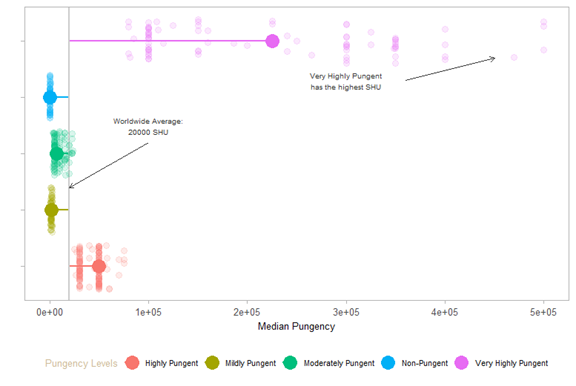
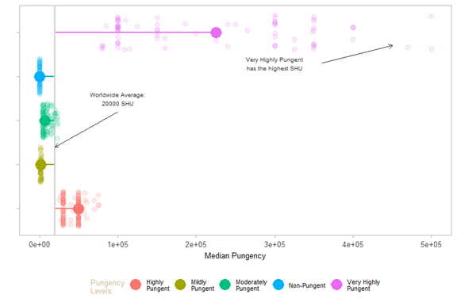
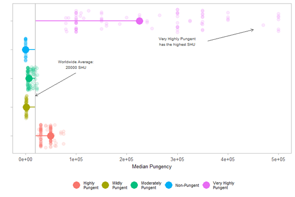

# Formatting Legends
The plots I have presented are missing the legend. Sometimes, a legend can be useful for communicating information. The code below presents code that includes a legend. The labels for the pungency levels on the *x*-axis (that's the one on the vertical axis) are removed. The style of the text within the legend is adjusted.

Since I am adjusting the labels and the legend, I need to create a new theme. This requires me to include all the code. As you can see, this is a lot of code. Yet, you are familiar with the majority of it, so you can navigate your way around it.

```R
(pepper_theme3 = 
  ggplot(pungency_data2, aes(x=pungency, y=shunits, color=pungency)) +
  coord_flip() +
  scale_y_continuous(limits=c(0,500000)) +
  theme_light(base_size = 15) +
  labs(
    x='',
    y='Median Pungency',
    color = 'Pungency Levels'
  ) +
  theme(
    legend.title = element_text(family = 'Arial',
                                color = 'wheat3',
                                size = 10),
    legend.position = 'bottom',
    legend.text = element_text(size = 8),
    panel.grid = element_blank(),
    axis.title = element_text(size = 10),
    axis.text.x = element_text(size = 10),
    axis.text.y = element_blank(),
    plot.title = element_text(size=14,
                              face = 'bold',
                              lineheight = 0.8)
  ) +
  geom_segment(aes(x=pungency,
                   xend=pungency,
                   y=pepper_med,
                   yend=med_pungency),
               size=0.8) +
  geom_hline(aes(yintercept = pepper_med), 
             color = "gray80", 
             size = 0.8) +
  geom_jitter(size=3, alpha=0.15, width = 0.4) +
  stat_summary(fun.y = median,
               geom = 'point',
               size=6.3) +
  annotate('text', x = 3.5, y = 100000, size = 2.7, color = 'gray20',
           label = glue::glue('Worldwide Average:\n{round(pepper_med, 1)} SHU')) +
  annotate('text', x = 4.3, y = 300000, size = 2.7, color = 'gray20',
           label = glue::glue('Very Highly Pungent\nhas the highest SHU')) +
  geom_curve(data = arrows, 
             aes(x = x1, y = y1, xend = x2, yend = y2),
             arrow = arrow(length = unit(0.07, 'inch')), 
             size = 0.4,
             color = 'gray20', 
             curvature = 0.0)
)
```



The legend, while useful, appears a bit too spread out. A reader might find it tedious to read across this amount of space. While you may think that is not the case, subconsciously an individual has only so much bandwidth; anything we can do to ease the ingestion of data from a visualization improves the experience. A simple solution is introducing line breaks into each pungency label. This can be done using the function `scale_color_discrete()`, as shown below.

```R
(pepper_theme4 = 
    ggplot(pungency_data2, aes(x=pungency, y=shunits, color=pungency)) +
    coord_flip() +
    scale_y_continuous(limits=c(0,500000)) +
    theme_light(base_size = 15) +
    labs(
      x='',
      y='Median Pungency'
    ) +
    theme(
      legend.title = element_text(family = 'Arial',
                                  color = 'wheat3',
                                  size = 10),
      legend.position = 'bottom',
      legend.text = element_text(size = 8),
      panel.grid = element_blank(),
      axis.title = element_text(size = 10),
      axis.text.x = element_text(size = 10),
      axis.text.y = element_blank(),
      plot.title = element_text(size=14,
                                face = 'bold',
                                lineheight = 0.8)
    ) +
    scale_color_discrete("Pungency\nLevels:", 
                         labels = c('Highly\nPungent',
                                    'Mildly\nPungent',
                                    'Moderately\nPungent',
                                    'Non-Pungent',
                                    'Very Highly\nPungent')) +
    geom_segment(aes(x=pungency,
                     xend=pungency,
                     y=pepper_med,
                     yend=med_pungency),
                 size=0.8) +
    geom_hline(aes(yintercept = pepper_med), 
               color = "gray80", 
               size = 0.8) +
    geom_jitter(size=3, alpha=0.15, width = 0.4) +
    stat_summary(fun.y = median,
                 geom = 'point',
                 size=6.3) +
    annotate('text', x = 3.5, y = 100000, size = 2.7, color = 'gray20',
             label = glue::glue('Worldwide Average:\n{round(pepper_med, 1)} SHU')) +
    annotate('text', x = 4.3, y = 300000, size = 2.7, color = 'gray20',
             label = glue::glue('Very Highly Pungent\nhas the highest SHU')) +
    geom_curve(data = arrows, 
               aes(x = x1, y = y1, xend = x2, yend = y2),
               arrow = arrow(length = unit(0.07, 'inch')), 
               size = 0.4,
               color = 'gray20', 
               curvature = 0.0)
)
```



Still, this could use a slight improvement. The title in the legend is not necessary as the reader is aware these are pungency levels. This assumes the plot is contained in text that mentions this. If the plot stood alone, such as a tweet or a post in a blog, with no additional contextual information, then leaving the title would be beneficial.

```R
(pepper_theme5 = 
    ggplot(pungency_data2, aes(x=pungency, y=shunits, color=pungency)) +
    coord_flip() +
    scale_y_continuous(limits=c(0,500000)) +
    theme_light(base_size = 15) +
    labs(
      x='',
      y='Median Pungency'
    ) +
    theme(
      legend.title = element_text(family = 'Arial',
                                  color = 'wheat3',
                                  size = 10),
      legend.position = 'bottom',
      legend.text = element_text(size = 8),
      panel.grid = element_blank(),
      axis.title = element_text(size = 10),
      axis.text.x = element_text(size = 10),
      axis.text.y = element_blank(),
      plot.title = element_text(size=14,
                                face = 'bold',
                                lineheight = 0.8)
    ) +
    scale_color_discrete("", 
                         labels = c('Highly\nPungent',
                                    'Mildly\nPungent',
                                    'Moderately\nPungent',
                                    'Non-Pungent',
                                    'Very Highly\nPungent')) +
    geom_segment(aes(x=pungency,
                     xend=pungency,
                     y=pepper_med,
                     yend=med_pungency),
                 size=0.8) +
    geom_hline(aes(yintercept = pepper_med), 
               color = "gray80", 
               size = 0.8) +
    geom_jitter(size=3, alpha=0.15, width = 0.4) +
    stat_summary(fun.y = median,
                 geom = 'point',
                 size=6.3) +
    annotate('text', x = 3.5, y = 100000, size = 2.7, color = 'gray20',
             label = glue::glue('Worldwide Average:\n{round(pepper_med, 1)} SHU')) +
    annotate('text', x = 4.3, y = 300000, size = 2.7, color = 'gray20',
             label = glue::glue('Very Highly Pungent\nhas the highest SHU')) +
    geom_curve(data = arrows, 
               aes(x = x1, y = y1, xend = x2, yend = y2),
               arrow = arrow(length = unit(0.07, 'inch')), 
               size = 0.4,
               color = 'gray20', 
               curvature = 0.0)
)
```



Not bad. While I can continue to put more effort into improving this, I think this is a good point at which to stop developing this visualization. For this tutorial, I have covered all the major principles you can use to develop wonderful visual aids.

One last lesson. Keep in mind that a visualization you create may not be the best plot to convey your narrative. I usually try creating around two or three total and compare them. The last section of this tutorial will illustrate an alternative plot to the box plot I just created.

[Alternative plot](part07.md)