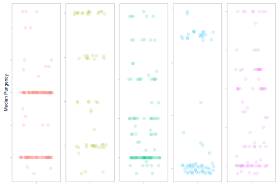

# Alternative Plot
Despite all the improvements made to this plot, the data is not necessarily clear. If the message was to communicate how much higher the `Very Highly Pungent` peppers are compared to all other peppers, this plot would suffice. If, on the other hand, this plot was supposed to communicate the distribution for each pungency level, it does a poor job because you are unable to see the distributions clearly.

As an alternative plot function, I am going to use `facet_wrap()`. This creates an individual plot for each of the levels of pungency.

```R
pepper_theme6 = 
  ggplot(pungency_data2, aes(x=pungency, y=shunits, color=pungency)) +
  theme_light(base_size = 15) +
  labs(y='Median Pungency') +
  theme(
    legend.position = 'none',
    panel.grid = element_blank(),
    axis.title = element_text(size = 10),
    axis.title.x = element_blank(),
    axis.text.x = element_blank(),
    axis.text.y = element_blank(),
    plot.title = element_text(size=14,
                              face = 'bold',
                              lineheight = 0.8)
  ) +
  geom_jitter(size=3, alpha=0.15, width = 0.4)

pepper_theme6 + 
  facet_wrap(~ pungency,
             nrow = 1,
             scales = 'free') +
  theme(strip.text = element_blank())
```



Now the distribution of each level of pungency is clear. Again, this assumes I want to communicate this message. Each visualization should have a story and a purpose. Here, the axis of each category is independent of the others. Thus, this does not suffer from the problem the previous plot did. In the previous plot, because `Very Highly Pungent` had such a large spread, the other boxes for the other categories were squished. Thus, the audience would not be able to distinguish the spread of the data. With this plot, that is apparent.

A warning should be given here. Since the scales are allowed to be "free" you are unable to compare each of the categories to one another. That is, the hash marks on the left-hand side of each of the boxes are different values. Remember, the `Very Highly Pungent` data sits between 80000 and 500000 while `Non-Pungent` is between 0 and 699.
