# Visualization Fundamentals: Using Python
In this tutorial I will cover the creation and usage of plots in Python for continuous variables, categorical variables, and time-ordered data.

For this tutorial I will be using the following data:
* [ozone.data.txt](../data/ozone.data.txt)

## Continuous Explanatory Variables
Let’s take a closer look at scatterplots and histograms. Load that dataset and create a scatterplot for *temperature* and *ozone*.

```Python
import os
import pandas as pd
import matplotlib.pyplot as plt

ozone_data = pd.read_table('ozone.data.txt')

ozone_data.plot.scatter(x='temp', y='ozone')
```

You should now see a scatterplot as shown below. The *x*-axis has the variable *temperature* while the *y*-axis has *ozone*. These types of plots are important in illustrating characteristics the two variables have. The way you read this plot is by observing how a change in each increment of *x* leads to a change in *y*.

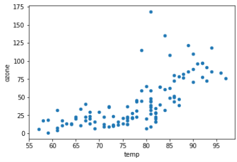

I can make similar plots for *wing* and *radiation*.

```Python
ozone_data.plot.scatter(x='wind', y='ozone')

ozone_data.plot.scatter(x='rad', y='ozone')
```

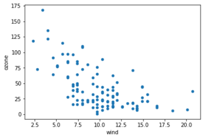

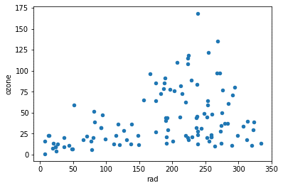

The next type of plot is a histogram. The histogram plots the *y*-axis for you automatically. This plot provides the frequency of the variable. This is useful for determining the distribution of your data at the level of the variable.

```Python
ozone_data['temp'].plot.hist(alpha=0.5)

ozone_data['wind'].plot.hist(alpha=0.5)

ozone_data['rad'].plot.hist(alpha=0.5)

ozone_data['ozone'].plot.hist(alpha=0.5)
```

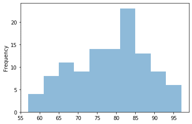

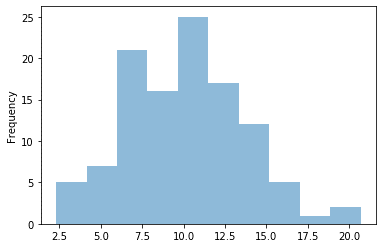

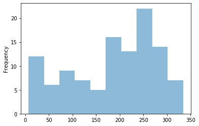

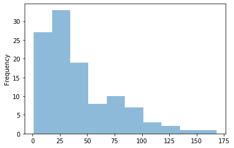

The results are exactly the same compared to those from the R output. The histogram for the variable *ozone* is highly skewed to the left. This has implications for future analyses. For example, multiple regression cannot handle data that is highly skewed, such as this. You will have to transform this data (a logistic transformation will work) in order to correct it.

The second histogram above, that of *wind*, is not necessarily problematic. The middle of the distribution has a dip. In future analyses, you could bin the middle values, removing any kind of dip.

## Categorical Explanatory Variables
Categorical variables require different visual aids to process the data. These categories naturally create groupings. Using the same data, let’s create a grouping for *temperature*. The first plot we will look at is the boxplot or the box-and-whiskers plot as it is sometimes referred to. As this is a numerical variable, it inherently is not ready to be plotted as a categorical variable. I need to bin the data first, create categories based on the bin values, then add the recoded values into the data frame.

First, I need to read in the following library for binning.

```Python
from scipy.stats import binned_statistic
```

Second, I need to determine the maximum and minimum values for the variable.

```Python
ozone_data['temp'].max()

ozone_data['temp'].min()
```

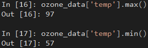

Third, I will create bins using the `binned_statistic()` function.

```Python
bin_counts,bin_edges,binnum = binned_statistic(ozone_data['temp'], 
                                               ozone_data['temp'], 
                                               statistic='count', 
                                               bins=4)
```

The first argument is the sequence of values to be binned. In this case, it is `ozone_data['temp']`, or the column *termperature*. The second argument is the `values`, or the data in which the "statistic" will be performed on (not always used). What is the statistic? That is the third argument. In my example, I am using `count` as the statistic. The following includes all possible options for binning:
* `mean`: compute the mean of values for points within each bin.
* `std`: compute the standard deviation within each bin.
* `median`: compute the median of values for points within each bin.
* `count`: compute the count of points within each bin.  This is identical to an unweighted histogram.  `values` argument is not used.
* `sum`: compute the sum of values for points within each bin. This is identical to a weighted histogram.
* `min`: compute the minimum of values for points within each bin.
* `max`: compute the maximum of values for point within each bin.
* function: a user-defined function.

This function returns three variables: `bin_counts`, `bin_edges`, and `binnum`. The first two are important for this example. The value `bin_counts` returns the "counts" from within each bin. Recall, I used the statistic `count` in the function. The results are nearly identical to those from R.

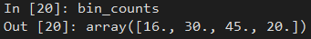

The value `bin_edges` returns the "edges" of the bins. In other words, the actual values used for cutting off values for the binning process.

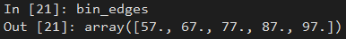

The fourth step involves recoding the values. This requires a few steps as well, which I will explain.

```Python
bin_interval = [57, 67, 77, 87, 98]

binlabels = ['57-66', '67-76', '77-86', '87-97']

temp_categ = pd.cut(ozone_data['temp'], bin_interval, right=False, retbins=False, labels=binlabels)
```

Ignore the first value, `bin_interval`. I will return to this shortly. The variable `binlabels` houses the category labels for my new variable. This is similar to what I did in R.

To split or segment the column *temperature* based on the bin values, I will use the function `cut()` from Pandas, which uses five arguments:
1. `ozone_data['temp']`: the data to be segmented
1. `bin_interval`: a sequence of values representing the criteria to bin by (discussed more below)
1. `right=False`: indicates whether to *include* the right-most edge value in `bin_interval`. This means that instead of values 57 through 66, I would have values 57 through 67 together. The default is `True`.
1. `retbins=False`: short for "return bins"; indicates whether or not to return the bins or not
1. `labels`: the labels to apply to the segmented values.

Let's return to the variable `bin_interval`. I am sure you noticed I added the value `98` at the end. Why include that? If left out, the function `cut()` would assume the highest value I am using is `87`. This means any value in the column *temperature* greater than `87` would be left out. Earlier, I used the function `ozone_data['temp'].max()` to determine the maximum value is `97`. In order to include any value greater than `87` up to `97`, I need to add `98` to `bin_interval`.

Currently, the name of this newly created data is `temp`.

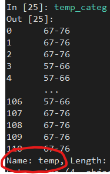

Since the original variable in the data frame has the same name, I need to rename this to something that will not conflict; also, a name more descriptive of its nature as a categorical variable.

```Python
temp_categ.name = 'temp_categ'
```

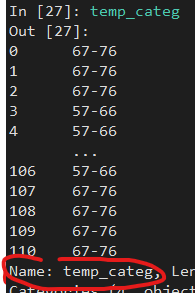

The last step in the process is to attach the data to the original data frame.

```Python
ozone_data = ozone_data.join(pd.DataFrame(temp_categ))
```

I can compare the original column to the new one.

```Python
ozone_data[['temp', 'temp_categ']].sort_values(by='temp')
```

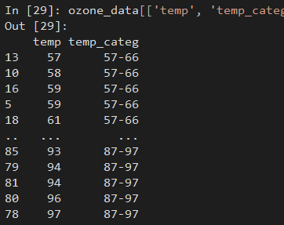

Now I can generate the boxplot to assess the data.

```Python
ozone_data.boxplot(column='ozone', by='temp_categ')
```

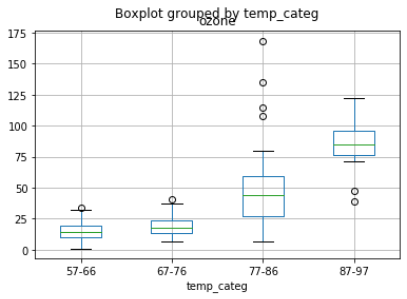

### Bar Charts
The next plot for categorical variables is a bar chart. These plots are focused on comparing the relative values of some category. I will use the data for the fish and wildlife department concerning populations of elk for 2013. This is the same data used in the tutorial for R.

```Python
elk_d = {'population': [33000,265000,148000,17500,70000,80000], 
        'state':['Arizona','Colorado','Montana','Nevada','New Mexico','Utah']}

elk_data = pd.DataFrame(data=elk_d)

elk_data.plot.bar(x='state', y='population')
```


Colorado and Montana clearly have the largest populations for 2013. Keep in mind, though, that these plots can be misleading. At one point, Colorado had close to 300,000 elk and saw a sharp decline in 2011, whereas the population in Utah was experiencing year-over-year growth since 2004. 

## Time-Ordered Data
The last type of plot is a line chart. A line chart shows the trajectory of data over time. For this example, we will generate our own time-based data.

```Python
import numpy as np

ts = pd.Series(np.random.randn(1000), index=pd.date_range('1/1/2000', periods=1000))

ts = ts.cumsum()
```

Now that the data is generated, I can plot it out.

```Python
ts.plot()
```

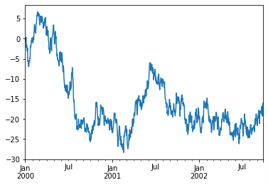