# Visualization Fundamentals: Using R
Within this tutorial I will show you how to create basic visualizations in R. I will cover the following explanatory variables: continuous, categorical, and time-ordered.

For this tutorial I will be using the following data:
* [ozone.data.txt](../data/ozone.data.txt)

## Continuous Explanatory Variables
Let’s take a closer look at scatterplots and histograms. The scatterplot is a very simple plot. Earlier in the semester you used the radiation dataset. Load that dataset and create a scatterplot for `temperature` and `ozone`.

```R
plot(ozone_data$temp, ozone_data$ozone)
```

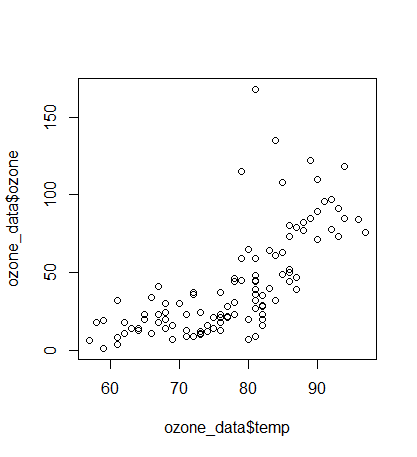

The function `plot()` uses the first variable for the *x*-axis and the second variable for the *y*-axis. You should now see a scatterplot as shown above. The *x*-axis has the variable *temperature* while the *y*-axis has *ozone*. These types of plots are important in illustrating characteristics the two variables have with each other. The way you read this plot is by observing how a change in each increment of *x* leads to a change in *y*.

Observe the trend within the plot. Look at the *x*-axis at unit `60`. If I move upwards along the *y*-axis the data lies between 25 and 37. Move along the *x*-axis to `70`. If I move upwards along the *y*-axis, the data hovers around the same location as it did at `60`. So far, the relationship seems fairly consistent. As I continue to move along the *x*-axis, the data begins to move upward on the *y*-axis. In other words, the data begins to curve upwards. This indicates the relationship between *temperature* and *ozone* is not consistent for every value.

Similar plots can be generated for the other variables in the dataset.

```R
plot(ozone_data$wind, ozone_data$ozone)

plot(ozone_data$rad, ozone_data$ozone)
```

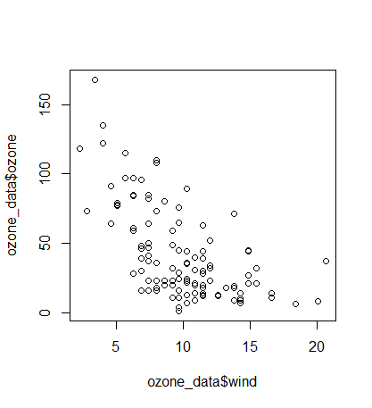

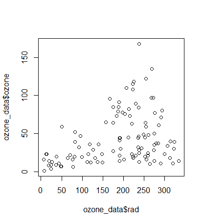

Both plots exhibit strange relationships. A good practice is to take notice of the oddities of these plots. For example, *radiation* has a cornucopia shape. It is narrow on the left-hand side, and as the data moves to the right on the *x*-axis, broadens. If the residuals within the data exhibit this shape, this is indicative of problems with constant variance. While I won't get into this concept this semester, be aware that these plots can be used to perform many types of assessment prior to model building (something I get into in the 2nd-semester of R/Python).

The next type of plot is a histogram. The histogram plots the *y*-axis for you automatically. This plot provides the frequency of the explanatory variable. This is useful for determining the distribution of your data. 

```R
hist(ozone_data$temp)

hist(ozone_data$wind)

hist(ozone_data$rad)

hist(ozone_data$ozone)
```

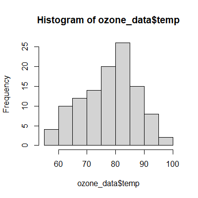

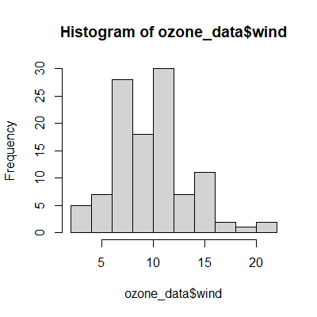

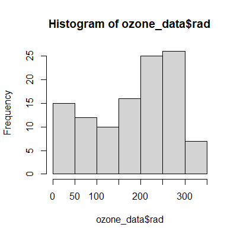

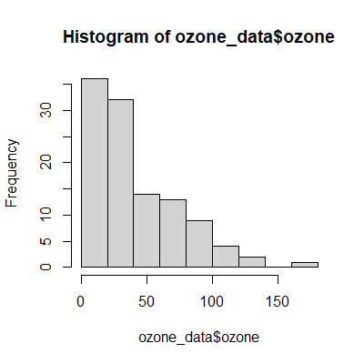

The histogram for the variable *ozone* illustrates the usefulness of this plot. The variable is highly skewed to the left. This has implications for future analyses. For example, multiple regression cannot handle data that is highly skewed such as this. You will have to transform this data (a logistic transformation will work) in order to correct it.

The second histogram above, that of *wind*, is not necessarily problematic. The middle of the distribution has a dip. In future analyses, you could bin the middle values together, removing any kind of dip.

## Categorical Explanatory Variables
Categorical variables require different visual aids to process the data. These categories naturally create groupings. Using the same data, I create a grouping for *temperature*. The first plot I look at is the boxplot or the box-and-whiskers plot as it is sometimes referred to.

For this I will use the library `car`.

```R
library(car)
```

The variable *temperature* is not inherently a categorical data type. It is `integer`. This contains continuous values. 

```R
range(ozone_data$temp)
```

According to the function `range()`, the column *temperature* contains a range of data starting at 57 and ending at 97. I need to convert this data into a categorical variable. To do this, I will use a binning technique.

### Binning Numeric Data
Binning numeric variables is the process of converting numeric values into categorical ones. A range of values is separated into subranges. These subranges are known as bins. One you should be familiar with is income brackets. Another is age ranges used for differentiating among generations of people.

An important consideration is how to bin the data. Three main types of binning procedures are available:
* Equal width binning – Create a set number of bins giving each one equal ranges. May lead to unbalanced bins.
* Equal weight binning – Creates bins based on percentage; so, you could have 5 bins each with 20%; 4 bins each with 25%. These tend to be more balanced.
* Supervised binning – Using information about the target variable to influence the input variable. Be warned, you can’t always generalize to other datasets or your population.

The variable *temperature* has a range between 57 and 97, or 40 numbers. This appears fortuitous. I can split the data into four groups, each with 10 values:
* 57 to 66
* 67 to 76
* 77 to 86
* 87 to 97

I can use the function sequence `seq()` to generate a sequence of numbers, seeding it with the starting number of 57 and ending at 97.

```R
(bin_interval = seq(57, 97, by = 10))
```

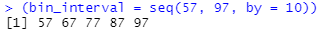

This results in the increments I was hoping for. What I do not know is how the distribution will look like using these values. To do that, I create a table in the console to view the data distribution.

```R
table(cut(ozone_data$temp, bin_interval, right = FALSE))
```

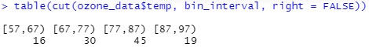

The first bin (57 - 66) includes 16 data points; the second bin (67 - 66) includes 30 data points; the third bin 45 data points; the last bin has 19. This appears to distribute the data so that the binning reflects a normal distribution. This is equal width binning. Each bin has an equal range of values, but may not have an equal distribution of the data itself.

The next step is to create a new variable with the bin values. This requires me to recode the values from the *temperature* column using the function `record()` from the library `car`. I will also name the bins using the ranges. For example, any data in the range between 57 and 66 will be given the value `57-66`.

```R
temp_vec = recode(ozone_data$temp, "57:66='57-66'; 67:76='67-76'; 
                    77:86='77-86'; 87:97='87-97'")
```

I will now take the variable `temp_vec` and add it as a column named `temp_categ` to the data frame.

```R
ozone_data$temp_categ = temp_vec
```

The data type needs to be adjusted, so I will convert it to a factor.

```R
ozone_data$temp_categ = as.factor(ozone_data$temp_categ)
```

I can check my handy work by comparing the original column to the newly created categorical column.

```R
ozone_data[, c('temp', 'temp_categ')]
```

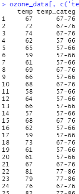

Looks like a perfect fit!

I can now plot the boxplot.

```R
plot(ozone_data$temp_categ, ozone_data$ozone)
```

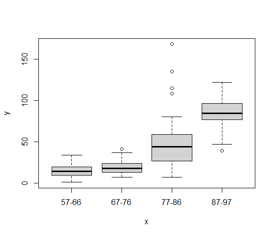

Compare this with the scatterplot above with temperature and ozone. You will notice the trend in the boxplot is similar to that of the scatterplot. This comes as no surprise. Yet, this also gives a different picture from the scatterplot. The boxplot illustrates the density of each category. Notice the 3rd group, `77-86`, has the largest spread, the largest standard deviation. This would indicate the temperature change in this group leads to greater changes in the ozone. Yet, this is influenced by the outliers of that group. Notice the four dots above the group. These are extreme outliers and influence the position of the median (indicated by the solid bars in the boxes) as well as the 25th and 75th quartiles (the outside edges of the boxes).

What other parts of the boxplot are shown? The dashed lines, or whiskers, indicate the maximum value or 1.5 times the interquartile range of the data. The latter is approximately 2 standard deviations; the interquartile range is the difference in the response variable of the 3rd and 1st quartiles. Thus, if outliers are shown (by the points above or below the end of the whiskers), then it is 1.5 times the interquartile range; if no outliers are shown, then the maximum value (or minimum at the bottom) is shown.

Another important aspect you can tease out is the skewness of the data. Two indicators provide this information. First, the box itself. Look at the first grouping, `57-66`. The median is not centered in the box; it is placed closer to the bottom. The range of greater ozone is more numerous than the range of lower ozone.

Second, the whiskers can indicate skewness. Look at the second grouping, `67-76`. The top whisker is longer than the bottom whisker. This indicates the data is skewed towards the lower values.

### Bar Charts
The next plot for categorical variables is a bar chart (also referred to as bar graph or bar plot). These plots are focused on comparing the relative values of some category. For example, perhaps you work for the fish and wildlife department and would like to plot out the populations of elk for 2013.

```R
elk_num = c(33000,265000,148000,17500,70000,80000)
elk_state = c('Arizona','Colorado','Montana','Nevada','New Mexico','Utah')

barplot(elk_num, names.arg = elk_state)
```

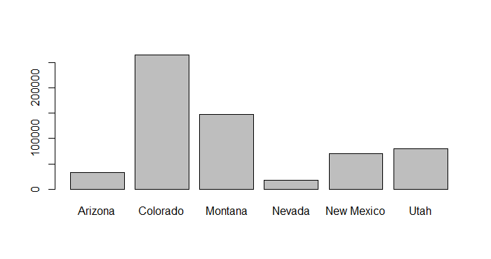

Colorado and Montana clearly have the largest populations for 2013. Keep in mind, though, that these plots can be misleading. At one point, Colorado had close to 300,000 elk and saw a sharp decline in 2011, whereas the population in Utah was experiencing year-over-year growth since 2004. 

This brings up a good point. While your plots do tell a story, make sure you do not infer more from them than what is presented. The previous example might lead you to believe that Colorado has the best population growth of any state for elk, but the reality is the opposite. Additionally, at one point Arizona had only 83 elk.

Let’s look at another example of a bar chart. Returning to the example of the ozone data, we can generate median scores for each of the temperature groups based on *radiation*. We need to create a categorical variable for this.

```R
range(ozone_data$rad)
```

The range for *radiation* is between 7 and 334. I will start out with an arbitrary number to sequence the data. I have chosen increments of 50.

```R
(bin_interval = seq(7, 334, by = 50))
```

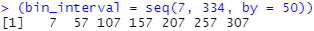

```R
table(cut(ozone_data$rad, bin_interval, right = FALSE))
```

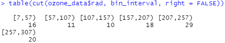

Not bad, except values above 307 are missing from the newly created bins. I need to manually add it.

```R
bin_interval[8] = 335

table(cut(ozone_data$rad, bin_interval, right = FALSE))
```

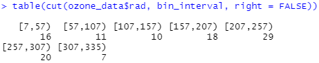

This looks improved. Though, the bins `57-106` and `107-156` could be combined to create an equal distribution. Most of the other bins have about 20 values. When I recode the values, I will merge bins `57-106` and `107-156`.

```R
rad_vec = recode(ozone_data$rad,
                 "7:56='7-56';
                 57:156='57-156';
                 157:206='157-206';
                 207:256='207-256';
                 257:306='257-306';
                 307:334='307-334'",
                 as.factor = TRUE)
```

I will take the binning data and add it as a column to the dataframe.

```R
ozone_data$rad_categ = rad_vec
```

Now that the radiation category is created, I  can calculate the median scores of temperature based on that new grouping.

```R
library(tidyverse)

group1 = group_by(ozone_data, rad_categ)

temp_median = summarise(group1,
  med_temp = median(temp),
  sd_temp = sd(temp)
)
```

Alternative with piping:

```R
library(tidyverse)

temp_median = ozone_data %>% 
  group_by(rad_categ) %>% 
  summarise(
    med_temp = median(temp),
    sd_temp = sd(temp)
  )
```

Finally, plot the data using a bar plot.

```R
barplot(temp_median$med_temp, names.arg = temp_median$rad_categ)
```

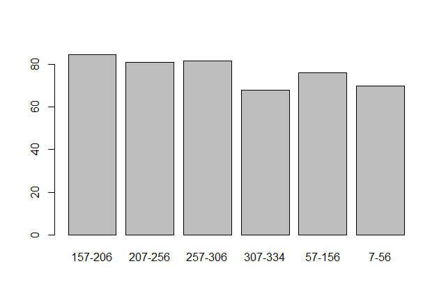

This shows a constant relationship between radiation and temperature.

## Time-Ordered Data
The last type of plot is a line chart. A line chart shows the trajectory of data over time. For this example, we will use air passenger data contained in the library `forecast`.

```R
data(AirPassengers)
plot(AirPassengers)
```

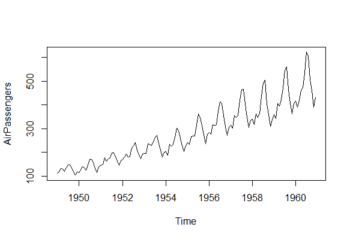

The plot above shows the number of passengers over time. This is a very useful chart for understanding the change of data over time. The data exhibits an increasing, linear trend over time. Additionally, the data also exhibits a seasonal component. This is shown by the wavy pattern. This wave is consistent.