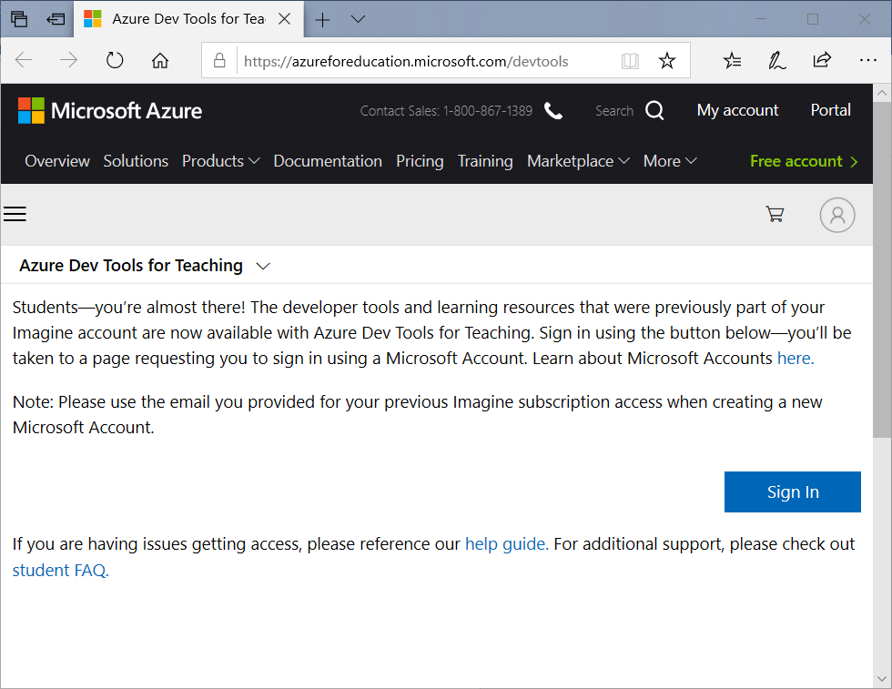
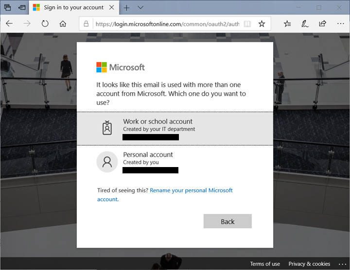
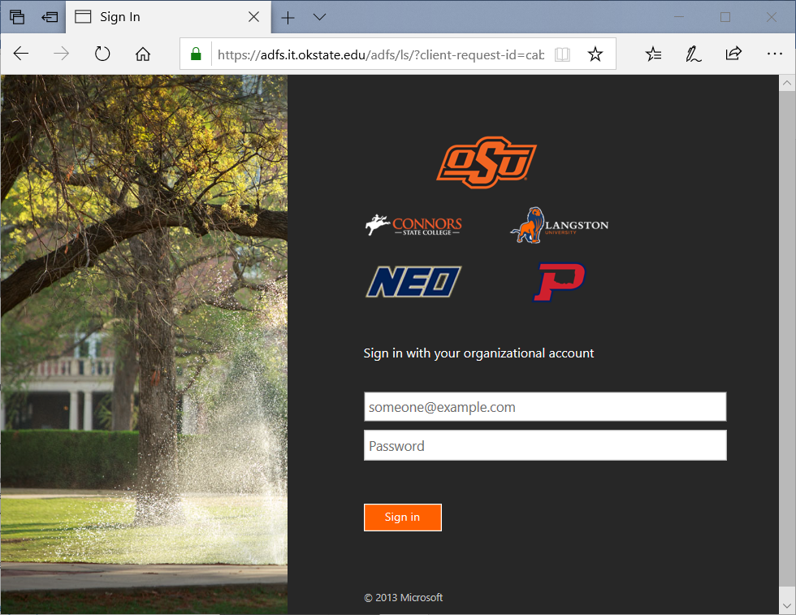
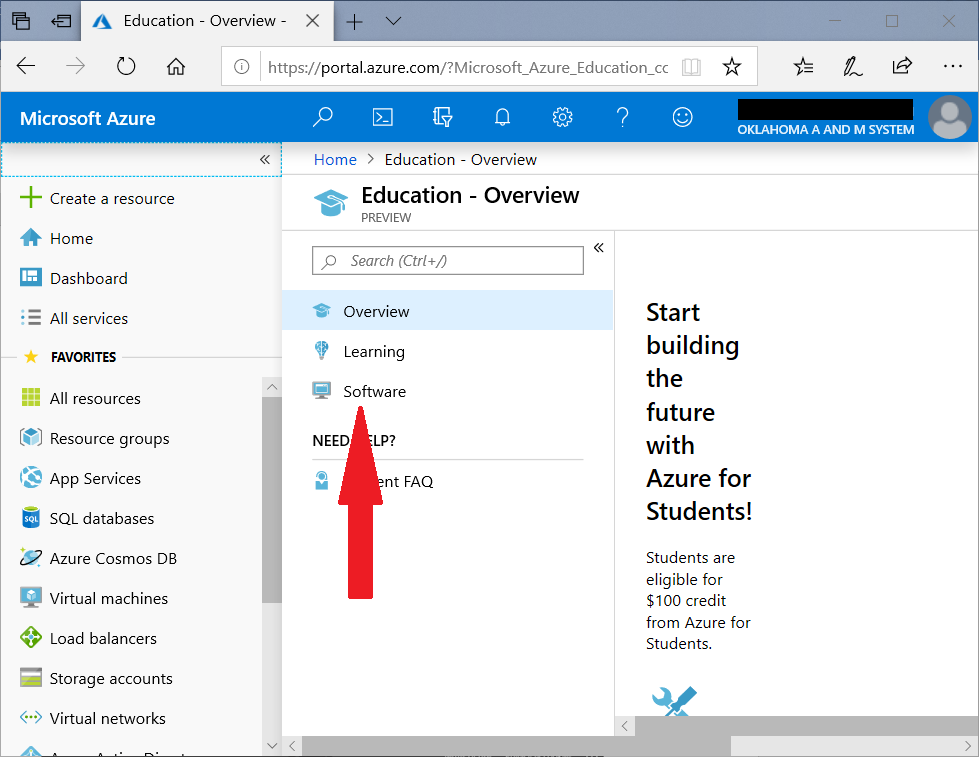
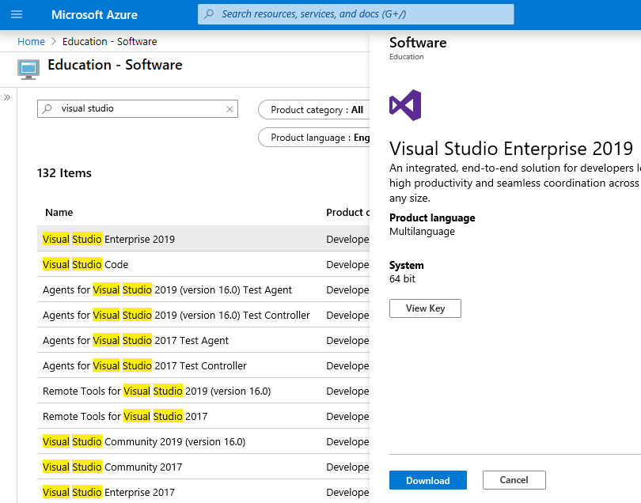
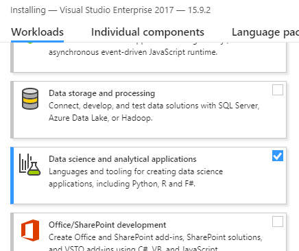
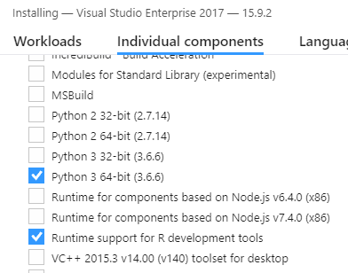
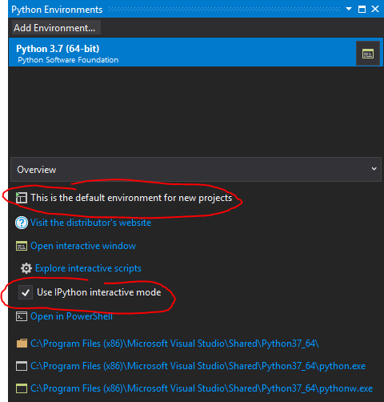
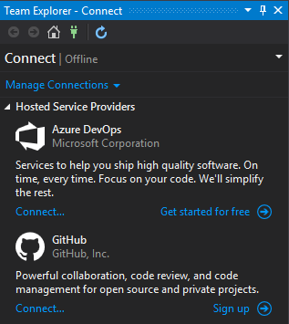

# Visual Studio Setup and Install
Visual Studio is Microsoft's integrated development environment (IDE) for all things programming. An IDE is a software application that facilitates software development with a focus on team work. Within this tutorial you will walk through the installation process for Visual Studio 2019. Specifically, this tutorial will cover installing tools to program Python within Visual Studio.

Setting up your work environment for this semester requires four steps:
1. Downloading Visual Studio 2019
2. Installing Visual Studio and Python packages

## Downloading Visual Studio 2019
Make sure you are on a good internet connection. If you are on a wireless connection, ensure it is consistent. This is a rather large file; if your wireless connection breaks in the middle of the download you may have to begin again. Open a web browser and navigate to [https://azureforeducation.microsoft.com/devtools](https://azureforeducation.microsoft.com/devtools). Click on the blue button `Sign In`.

Enter your OKState email address and click `Next` (if you are already signed into another school account, such as OneDrive, you might skip this step). If prompted, select `Work or school account`.

Log in using your OKState email credentials.

Once you have successfully logged in, click on `Software` as shown in the image below. This will take you to a list of all accessible software as a MSIS student, or as a student enrolled in a MSIS course.

In the search bar, type in `Visual Studio` and a list of programs will appear.

After the filter is applied and the list populates, scroll down until you find `Visual Studio 2019 Enterprise`. Select it. Click on `Download` and `View Key`. Record the key information somewhere secure that you’ll be able to find. You may not be able to access this later.

## Installing Visual Studio and Python
For those of you who are familiar with using IDE environments (e.g. Visual Studio, Eclipse, NetBeans) you can use Visual Studio 2019 to code Python natively. This allows you to code and run Python from directly within Visual Studio, including tab completion. Note, you must have an interpreter in order to run the code.

Ensure that you install the 64-bit version of Visual Studio 2019 Enterprise. It is extremely important that you have an internet connection while installing Visual Studio. The installation process looks for updates; without the connection, your installation will fail. This entire process may take up to an hour if your internet connection is slow. 

Run the installer and wait for the initial dialogue to appear. Under the `Workloads` tab, select `Data science and analytical applications` by checking the box.

Click on the next tab `Individual components` and scroll down until you see the content in the figure below. Select `Python 3 64-bit (3.x.x)` as an option. Depending on when you install this, the exact version of Python will vary.

Once the installation process has completed, run Visual Studio 2019 for the first time. In the menu, navigate to `View`, `Other Windows`, `Python Environments`. You should see a new window similar to the one shown below. Notice that the path of your installation is shown at the bottom of the window. The path displayed changes as you select different flavors of Python installed on your computer if you have more than one version installed.

Ensure this version of Python is set as the default environment for this class. This ensures that this specific version of Python runs each time you run Python script. While you may use Anaconda as an alternative, I personally prefer to use barebones Python. The advantage of using it is that you have absolute control over which libraries are interacting with each other, a major advantage for debugging code. If this makes you uncomfortable, or you are unsure which libraries you will need to manually install throughout the semester, select the Anaconda version instead during the installation of Visual Studio 2019.

In order to use all the features of Visual Studio, such as code suggestions, interactive help menus, and library descriptions, you will need to select `IPython` for your environment of choice. In the figure above a red circle indicates the check box for this selection. 

## GitHub in Visual Studio
Now you need to open the GitHub window. Within Visual Studio, in the menu, click on `View`, `Team Explorer` to open the Team Explorer window. Dock this where you prefer in Visual Studio. Next, click on `View`, `Other Windows`, `GitHub`; dock this where you like. 

With the `Team Explorer` window open, you will see an option to connect a GitHub account (see image below). Click on `Connect` and sign into your account. You should now see the option to Clone, Create, or Sign out.

That's it! You are now ready to run Python in Visual Studio and connect to GitHub.