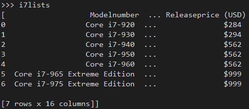

# Web Scraping in Python


## Using `lxml` in Python
One of the more popular libraries in Python for web scraping is lxml. This library provides a Pythonic feel to the C libraries libxml2 and libxslt. This allows a data scientist to use syntax specific to Python inducing an easier environment in which to write code. For this tutorial, you will need to import the following libraries:

```Python
import pandas as pd

from lxml import html
from lxml import etree

import requests
import urllib3
```

Two of the libraries pull the data from the websites: `requests` and `urllib3`. Either of these libraries is sufficient; this tutorial will illustrate how to use both. The usage of either one is left up to you.

Just like in R, you will scrape data from imdb to obtain the rating for the movie *The Princess Bride*. The code below pulls the actual HTML page from the website. A variable is created to house the url of the webpage. The second line of code uses the library `requests` to pull the webpage and save it as the variable `resp`. As an alternative, you can also use the library `urllib3` to pull the webpage. This is saved as the variable `resp2`.

```Python
imdburl = "https://www.imdb.com/title/tt0093779/"

resp = requests.get(imdburl)

# Alternative
httpmng = urllib3.PoolManager()
resp2 = httpmng.request('GET', imdburl)
```

The next step is to create an `lxml` object that compiles the downloaded webpage into a tree structure. This tree structure is used to navigate up and down the html from the webpage. Similar to how you and I might navigate the tree structure when using the Firefox debugger/console. HTML tags embedded within other HTML tags are considered further in the tree structure and are referred to as "moving down" that tree; the opposite is "moving up" the tree structure in which the outermost tags `<html></html>` are considered the root.

```Python
tagtree = html.fromstring(resp.content)

# Alternative
tagtree2 = html.fromstring(resp2.data)
```

Using the variables we created above, `resp` and `resp2`, the tree structure is created as `tagtree` and `tagtree2`, respectively. 

Now that an `lxml` object is created, it is time to parse out the rating. For this example, we are going to use XPath. This is to illustrate an issue you may run into.

> Example: Prior to continuing, pull the XPath yourself.

Sometimes, errors occur from copying the XPath from the browser leading to a regular expression pattern that will not work. This is because the libraries `requests` and `urllib3` pull the HTML prior to it being rendered by the web browser. Often, web browsers will insert new tags into the source code to make it more readable; thus, HTML tags that the developer did not place in the code are inserted by the browser, changing the XPath selector you created. The XPath selector below was created manually by looking through the HTML of the webpage.

```Python
xp1 = '//div[@class="ratingValue"]/strong/span/text()'

imdb_rating = tagtree.xpath(xp1)
imdb_rating
```

Notice that the end of the XPath contains the syntax `text()`. When working with the library `lxml` in Python, the notation informs the library that you want to pull the text embedded within the HTML. In R when using `rvest`, we had to use the function `html_text()`; in `RSelenium`, we had to use `function(x) {x$getElementText()}`. In Python, we can skip that step using the notation presented above.

The next example is the same example used in the R tutorial. We will use the Wikipedia page on Intel's [Core i7 Microprocessors](https://en.wikipedia.org/wiki/List_of_Intel_Core_i7_microprocessors).

```Python
i7url = 'https://en.wikipedia.org/wiki/List_of_Intel_Core_i7_microprocessors'
resp3 = requests.get(i7url)
tagtree3 = html.fromstring(resp3.content)

i7xp = '//div[@class="mw-content-ltr"]/div[@class="mw-parser-output"]/table[2]'

i7table = tagtree3.xpath(i7xp)
```

Once you have obtained the data from the webpage, converting it into a data frame is a simple affair as shown below. As this is an entire table of data, we cannot use the syntax `text()` like we did above. For a single HTML tag, the notation works well. When dealing with complex HTML structures such as `<table>`, it does not work well.

The code below has several steps. 

```Python
tstring = etree.tostring(i7table[0], method='html')
i7lists = pd.read_html(tstring)
i7data = pd.DataFrame(i7lists[0])
i7data.dtypes
```

The first step is to convert the HTML we pull into a simple string using the function `tostring()`. Here is a tiny snippet of what it creates:

```Python
b'<table class="wikitable">\n\n<tbody><tr>\n<th>Model<br>number\n</th>\n<th>sSpec<br>number\n</th>\n<th>Frequency\n</th>\n<th>...'
```

The next function, `pd.read_html()` is a `Pandas` function. It takes the tabular data and formats it in such a way that we obtain a tabular list, like so:



The last step is to convert it into an actual data frame using `pd.DataFrame()`. That's it!

As an alternative to `lxml`, you can use `BeautifulSoup`. In many ways it is more user-friendly and straight forward. For example, scraping all the anchor tags on a page is as simple as using the function `find_all('a')`. Unfortunately, `BeautifulSoup` lacks support for CSS selectors and XPath selectors, making scraping data extremely difficult because it lacks specificity. BeautifulSoup creates a tree structure of all the HTML on a webpage, requiring you to navigate that structure to scrape content. Instead of pulling exactly what you want, you may get more than you hoped for. This lack of exactness is why I do not cover this. If you would like to learn more about this library, please see the official documentation: [https://www.crummy.com/software/BeautifulSoup/bs4/doc/](https://www.crummy.com/software/BeautifulSoup/bs4/doc/).

## Selenium in Python
As you witnessed in R, Selenium is a powerful tool, especially for dynamic websites. Prior to using Selenium for Python, you need to download the gecko driver. Within a web browser, navigate to [https://github.com/mozilla/geckodriver](https://github.com/mozilla/geckodriver) and click on the link `Releases` under `Downloads`. At the bottom of the webpage select the version appropriate for your operating system. For most of you, this will be the Windows 64-bit version. As of this writing, it is `geckodriver-v0.27.0-win64.zip`. After downloading it, extract the executable file and copy it to a location that *does not require administrator* access such as your *Documents* folder.

Once completed, you can import the libraries in Python like so:

```Python
from selenium import webdriver
from selenium.webdriver.common.keys import Keys
driver = webdriver.Firefox(executable_path=r'C:\Users\bryan\Documents\geckodriver.exe')
```

Look at the code above. I have placed geckodriver.exe under my Documents folder. This folder does not require administrative permissions. The reason for this is because the geckodriver creates log files and other temporary files while you are using the web driver. If you had stored this in a location requiring administrative access, an error would occur. Plus, this is just good practice: never give a program like this administrative access to files and directories it should not be changing.

The next step is similar to that in R. We need to pass the url to the web driver and "navigate" to the webpage. The function we use to navigate is `driver.get()`. 

```Python
canvas_url = 'https://stwcas.okstate.edu/cas/login?service=https%3A%2F%2Fcanvas.okstate.edu%2Flogin%2Fcas'
driver.get(canvas_url)
```

The rest is very similar to RSelenium. You specify the `username`, `password`, and submit the HTML form fields. The first step is identifying and retreiving the HTML elements.

```Python
canv_username = driver.find_element_by_id('username')
canv_password = driver.find_element_by_id('password')
canv_submit = driver.find_element_by_name('submit')
```

Notice that the first two functions are `find_element_by_id()` while the third is `find_element_by_name()`. Luckily enough, two of the form fields have `id` attributes, the most unique attribute possible. The third one, the *submit* button, does not have a unique id, but a `name=""` attribute. The name is unique enough, so that is not too large of a worry.

The second step is inputting your *username* and *password* into Python and submitting them using the `send_keys()` function.

```Python
canv_username.send_keys('username@okstate.edu')
canv_password.send_keys('yourpassword')
canv_submit.submit()
```

Now that we are logged into Canvas, we will navigate to a specific course (the same one you saw in the R example). This is a course I taught in a previous semester. You can use your own course from this or a previous semester.

```Python
canvas_url = 'https://canvas.okstate.edu/courses/51579'
driver.get(canvas_url)
```

Once done, I will now grab the modules for a list of assignments, quizzes, documents, videos, etc. using the CSS selector `.content`. Just like with RSelenium, I am leaving the CSS selector rather vague in order to pull every single instance possible contained in this webpage.

```Python
module_elem = driver.find_element_by_css_selector('.content')
module_elem.text
```

Once the data is fetched, I need to close out the session and driver using `driver.quit()`.

```Python
driver.quit()
```

That's it! Other than a few differences in syntax, Selenium behaves pretty much the same aross all platforms and programming languages. The ubiquity of it makes it a worthwhile tool to learn and use.
