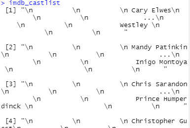
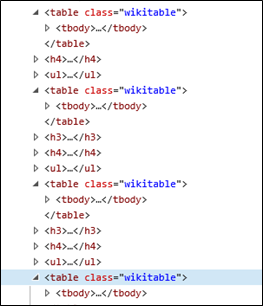
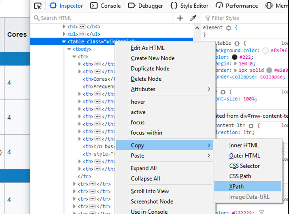
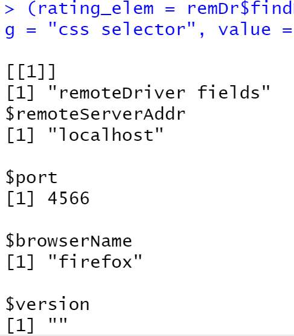
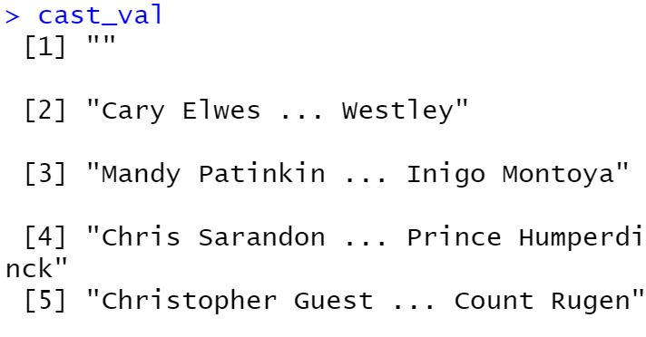
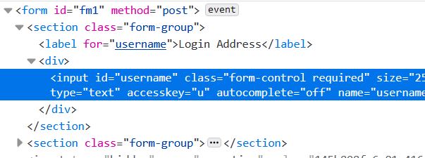
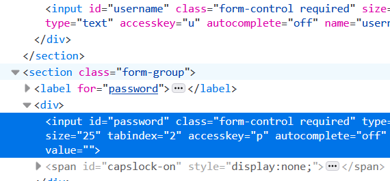
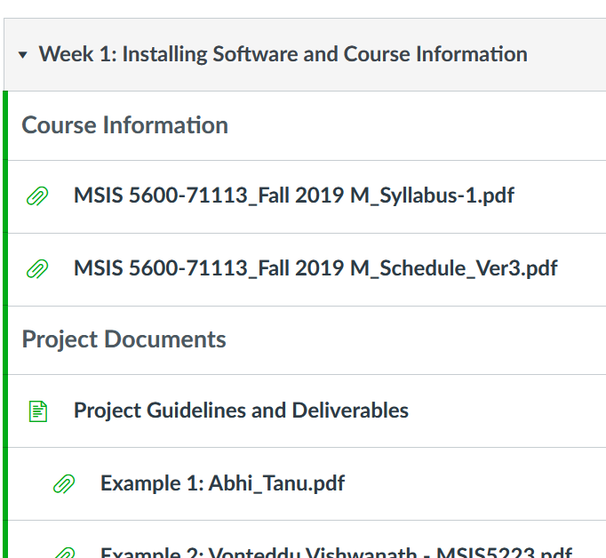
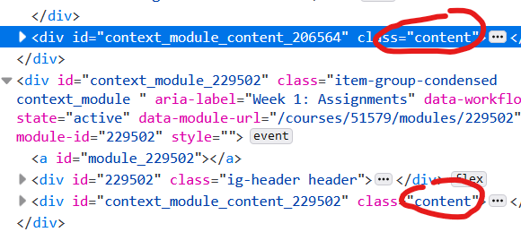
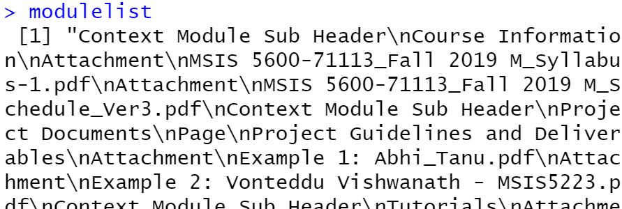

# Web Scraping in R
For this tutorial we are going to return to *The Princess Bride* on [imdb.com](https://www.imdb.com/title/tt0093779/). For this tutorial you will learn how to use two different types of programs: `rvest` and `Selenium`.

## Using `rvest` to Scrape Data
You will first need to install and load the library `rvest`. Also load in `stringr`.

```R
install.packages('rvest')

library(rvest)

library(stringr)
```

When using any of these libraries to scrape a webpage, keep your webpage urls as variables, like so:

```R
princ_url = 'https://www.imdb.com/title/tt0093779/'
```

Then load the webpage into memory so R can read its HTML, CSS, and anything that is loaded from that url:

```R
princbride = read_html(princ_url)
```

This contains all the code from the webpage. This is the same as viewing the source in your browser. Recall, we are interested in scraping the rating value as well as the cast list. Let's first focus on the rating value. We identified the CSS selector `div.ratingValue>strong>span` as a good choice.

```R
find_code = html_node(princbride, `div.ratingValue>strong>span`)
```

The function `html_node()` searches whatever "document" you pass to it for a patter match. You can specify CSS or XPath. For us, this just pulls the `<span>` tag and its content. Now we need to convert the content of the `<span>` tag (i.e. the 8.1) into actual text. We use `html_text()` to do this.

```R
rating_value = html_text(find_code)
```

Almost done. We could just leave things as they are, but the value returned is a string. Let's convert this into a numeric value.

```R
imdb_rating = as.numeric(rating_value)
```

We now have the rating in a useful format. You can leave it as a string, but converting it to numeric allows you to perform mathematical operations on it if necessary.

As a shortcut, you can use the piping notation provided by `stringr`. An example, using the previous code, is shown below.

```R
imdb_rating = princbride %>%
  html_node("div.ratingValue>strong>span") %>%
  html_text() %>%
  as.numeric()
```

Essentially, the piping `%>%` notation allows you to pass the output from one function to another function. This allows you to cut down on the code you use and consolidate the amount of text displayed on the screen. While not necessary to learn now, we will be using this notation later in the semester for visualizations.

Moving on to the cast list, in the previous tutorial we identified two CSS selectors for obtaining cast members:
* `tr.odd` for odd rows
* `tr.even` for even rows

```R
find_code2 = html_nodes(princbride, 'tr.odd, tr.even')

imdb_castlist = html_text(find_code2)
```

The code above is similar to the previous set with one exception: instead of using `html_node()` we use `html_nodes()`. The `html_nodes()` function pulls html for multiple CSS selectors or XPath selectors. Very handy if you have a long list of text you wish to pull.

It is important, though, to just use it when the text you are pulling is formatted similarly.

Here is the alternative piping the code:

```R
imdb_castlist = princbride %>%
  html_nodes('tr.odd, tr.even') %>%
  html_text()
```

Look at the output of `imdb_castlist`. The formatting is not quite right. We cannot store this in a data frame. We need to use regular expressions to pull out the text we want.



This requires a lot of thought. We are after two things: the name of the actor or actress and the name of the character they played.

The first logical step is to determine where the logical "stops" are between the data we want. Look at the first actor, Cary Elwes. He played the character Westley. Between "Cary Elwes" and "Westley" are a bunch of `\n` and white space with elipses `...`. Does this pattern apply to all the other cast members?

This appears to be the case. I always begin with a rough outline of what my regex will look like. Initially, I think it will look like this:

```R
(name)\\n\\.\\.\\.\\n(character)
```

I created a dummy group for the name of the actor. I know there are some `\n` after that, so I just placed one (note, you need to use `\\n`). I know the text has three periods, or an ellipses, so I put in `\\.\\.\\.` followed by another `\\n`. Then, I have the name of the character as a group.

Ok, so far the structure looks good. Now I am going to tackle the actor and actress name. The format contains some uppercase letters and some lowercase letters. I know `[a-z]` looks for any lowercase character and `[A-Z]` looks for any uppercase character. I know a name will have a minimum of 1 character, so I need to use the modifier `+`. Thus, I end up with `[A-Za-z]+`.

Yet, the individual has a first name and last name. Those names are also separated by a space. I need to use two of `[A-Za-z]+` separated by a space: `[A-Za-z]+ [A-Za-z]+`.

I now have the following:

```R
([A-Za-z]+ [A-Za-z]+)\\n\\.\\.\\.\\n(character)
```

Not bad. I could tackle the middle portion, but that's a bit complex, so I think I will tackle the character name instead.

The character name is very similar to the cast member's name. The only difference is, the character name can have more than two words. Possibly four! I have to make this regex more flexible. I know that a word will be separated by a space. This leads me to create a regex like so: `([A-Za-z ]+)`.

```R
([A-Za-z]+ [A-Za-z]+)\\n\\.\\.\\.\\n([A-Za-z ]+)
```

Alright, now the hard part. The middle appears to be fairly similar for all the rows. We have three `\n` with a space, then ellipses, then three more `\n` with spaces. So, it's a pattern that is repeated three times before and after the ellipses. We can use `{3}` to indicate a repetition of three. We end up with something like this: `(\\n\\s){3}`.

This is a good start, but we still have work to do. How many spaces come after each `\n`? Is it the same number? Do they differ?

Here is the text from the first actor:

```
"\n          \n          \n              "
```

I copied and pasted it. I place my cursor to the right of the first `\n` and move it over one space at a time. I count 6 spaces. After the second `\n`, I count 6 again. After the third `\n`, I count 8.

I randomly pull out four more names and count the white spaces for them. It appears this is fairly consistent. This means that after each `\n` there is at least 6 white spaces, possibly 8, though it's also possible more exist. The simplest approach is to just use the quantifier `+`. 

It's flexible and I really don't have to get very specific here. Yes, I could use `{6,8}`, but what if one of the lines of actors has more than 8? What about less than 6? Here is a simple and effective regex to do what we need: `(\\n\\s+){3}`

```R
([A-Za-z]+ [A-Za-z]+)(\\n\\s+){3}\\.\\.\\.(\\n\\s+){3}([A-Za-z ]+)
```

Ok, I think that looks good. Only one way to know for sure. Time to try it out!

```R
cast_regex = "([A-Za-z]+ [A-Za-z]+)(\\n\\s+){3}\\.\\.\\.(\\n\\s+){3}([A-Za-z ]+)"

cast_extract = str_extract_all(imdb_castlist,cast_regex)
castlist_match = str_match(cast_extract, cast_regex)

# Alternative piping
castlist_match = str_extract_all(imdb_castlist,cast_regex) %>%
  str_match(cast_regex)
```

This returns five columns of data. We really only want the second and fifth columns of data. The others we can throw out. Our goal is to store these in a data frame.

First, let's convert this into a data frame. As `castlist_match` contains rows and columns and is a matrix, the conversion is a simple process.

```R
castlist_data = as.data.frame(castlist_match)
```

We only want the second and fifth columns of data, so let's create another data frame with just those columns:

```R
castlist_data = castlist_data[, c(2,5)]
```

And now we are done! Below is a video walking through this example.
* [:tv: Using RVEST to Scrape Data](https://youtu.be/MJ-Qs3VgGxk)

## Using `rvest` With Tables
This next example is very straight forward. The library `rvest` has a wonderful function called `html_table()`. It's job is to pull data from `<table>` without you having to rely on a lot of regular expressions. That's powerful! The developer already created all the code for you.

For this example we will navigate to Wikipedia and look at a page on [Intel's microprocessors](https://en.wikipedia.org/wiki/List_of_Intel_Core_i7_microprocessors). Unfortunately, a problem exists with the tables; they all have the same class name and are embedded in the code in the same manner. We ran into this earlier in a previous tutorial. 



While we could try out CSS selectors and eventually secure the correct values, XPath works wonders here. To keep things simple, I am just going to let Firefox do the heavy lifting and choose the XPath for me.



This process works very similarly to what you are familiar with. Instead of using the function `html_text()` we use `html_table()` instead.

```R
i7proc = read_html("https://en.wikipedia.org/wiki/List_of_Intel_Core_i7_microprocessors")

find_code3 = html_nodes(i7proc, xpath="/html/body/div[3]/div[3]/div[5]/div[1]/table[7]")

i7proc_table = html_table(find_code3,fill=TRUE)

i7proc_table

# Alternative using piping
i7proc_table = i7proc %>%
  html_nodes(xpath="/html/body/div[3]/div[3]/div[5]/div[1]/table[7]") %>%
  html_table(fill=TRUE)
```

One of the nicest features of the function `html_table()` is that it automatically converts the data from `<table>` into a data frame. No extra work required on your part!

Here is a video covering this example.
* [:tv: Using RVEST to Scrape Tables](https://youtu.be/hTQ-_wFuHJA)

## Using `Selenium` to Scrape Data
[Selenium](https://www.selenium.dev/) is a powerful library for web scraping. It has a wonderful community in its [official user group](https://groups.google.com/forum/#!forum/selenium-users). It is a simple web driver available for most programming languages including R.

You must first download and install the library.

```R
install.packages('RSelenium')

library(RSelenium)
```

Selenium creates an actual session using your browser engine of choice. For Firefox, that is the mozilla engine; for Chrome and Edge, it is the Chromemium engine. Go ahead and create an instance of the driver. I will use Firefox. You may need to wait a moment for it to load.

```R
rD = rsDriver(verbose=FALSE, browser = 'firefox', port = 4566L)
```

The next step is to create an instance of that driver. This will actually open up the application on your desktop. Do note, this could take some time depending on the speed of your processor. Wait until the browser fully opens before proceeding.

```R
remDr = rD$client 
```

Create your url (we will again visit *The Princess Bride* on IMDB) and navigate to the website using the function `navigate()`.

```R
web_url = 'https://www.imdb.com/title/tt0093779/'

remDr$navigate(web_url)
```

We know what CSS selector to use here.

```R
rating_css = 'div.ratingValue>strong>span'
```

Now we need to pull the HTML from the website. To do that, we will use the function `findElements()`. This function seeks out the HTML element defined by the attribute `using=''`. We will use `using='css selector'` for this example. Then, in the attribute `value=''` we use the variable `rating_css`. We save this as a variable called `rating_elem`, short for "rating element" or the HTML element the rating value comes from.

```R
rating_elem = remDr$findElements(using = "css selector", value = rating_css))
```

If you output the value of `rating_elem` to the console, a lot of "nonsense" is displayed. The actual text of interest does not show. 



This contains a lot of information related to your web session packaged in a list, none of it what you want. We have to unlist the contents of this variable and pull out the actual text from the html.

```R
rating_val = unlist(sapply(rating_elem, function(x) {x$getElementText()}))
```

This particular combination of functions is using a built-in function native to Selenium. That function is `getElementText()`. This function dives into the html and pulls out the text, similar to the function `html_text()`. Unfortunately, there is a lot of extra content happening here which is advanced. Just take note of the syntax and worry about the details when you are more comfortable with R

The cast list operates similarly.

```R
cast_url = 'https://www.imdb.com/title/tt0093779/fullcredits?ref_=tt_ql_1' 

remDr$navigate(cast_url) 

cast_css = 'table.cast_list>tbody>tr' 

(cast_elem = remDr$findElements(using = "css selector", value = cast_css)) 

cast_val = unlist(sapply(cast_elem, function(x) {x$getElementText()}))
```



The output of this is very similar to what `rvest` returns. The regular expression would be similar to what we had earlier. Luckily, a lot of the spaces and `\n` are missing.

```R
cast_regex2 = "([A-Za-z]+ [A-Za-z]+)(\\s)\\.\\.\\.(\\s)([A-Za-z ]+)"
```

The code is essentially the same at this point. You may receive a warning message concerning coercing. This is alright; just ignore it.

```R
cast_extract2 = str_extract_all(cast_val,cast_regex2)
castlist_match2 = str_match(cast_extract2, cast_regex2)

castlist_data2 = as.data.frame(castlist_match2)

castlist_data2 = castlist_data2[, c(2,5)]
```

A little tidying is left, but the bulk of the data is ready in the data frame.

The final step is to close down the session and driver.

```R
remDr$close()
rD$server$stop()
```

This is something new users of Selenium often forget. Be sure to remember to close your session off once you are done scraping data.

Here is a video covering this example with Selenium.
* [:tv: Web Scraping with Selenium in R](https://youtu.be/G_WbxM8yz3E)

## Authenticated Sessions 
An important procedure is the ability to simulate using a web browser for certain tasks. Sometimes you need to scrape data from a website that requires you to authenticate (i.e. logging in). Merely typing in the url into R and using `rvest` to fetch the data will result in no data. 

For example, if you would like financial data from your bank account such as transactions for the last month, you are required to authenticate with a username and password. While `rvest` does provide some ability to create sessions, it is finicky and often results in selecting the wrong form (i.e. if the webpage has multiple forms such as a search form, login form, etc.).

The package `RSelenium` provides tools necessary to create a session.  Use RSelenium when possible for authenticated sessions.

This example will log you into [https://canvas.okstate.edu](https://canvas.okstate.edu) using your credentials. `RSelenium` will use a web browser to create a session. Sometimes, if you have the browser open, `RSelenium` will be unable to execute; close the browser you wish to use and start over. A good practice is to use a different browser than the primary browser of choice. Assuming the package is installed and the library loaded, the following code will create a session with Canvas.

```R
canvas_url = "https://stwcas.okstate.edu/cas/login?service=https%3A%2F%2Fcanvas.okstate.edu%2Flogin%2Fcas"
rD = rsDriver(verbose=FALSE, browser = 'firefox', port = 4566L)
# Wait while the driver loads
remDr = rD$client
remDr$navigate(canvas_url)
```

To authenticate, you need to identify the form fields in the HTML that take in your username and password.

If you need a quick refresher on HTML forms, take a moment to refresh your memory: [html forms](https://www.w3schools.com/html/html_forms.asp).

Recall that they have the basic structure like so:

```R
<form>
  <input>
  <input>
</form>
```

What we are looking for are the input tags `<input>`. 



The first one I am looking at is the `username`. This is where you type in your Oklahoma State University email address. 

The second one is the `password` form field. This is where you type in your super secret, 16-character long passphrase.



We will not use two functions together. The first function is `findElement()` which is similar to `findElements()` except instead of searching for all instances based on a parameter, we are searching for a singular instance.

We will also use the function `sendKeysToElement()` which passes the text to the browser and places it in the appropriate `<input>` tag.

Use the code below, except replace the email addres with your own and the password with your own.

```R
remDr$findElement("id", "username")$sendKeysToElement(list("yourusername@okstate.edu"))
remDr$findElement("id", "password")$sendKeysToElement(list("yourpassword", key='enter'))
```

After passing in the password, the form should automatically submit and log you in.

You can use RSelenium to navigate the website. As an example, we can navigate to the Monday section of this course offered during Fall of 2019. You should put the URL of a course you have access to.

```R
course_url = 'https://canvas.okstate.edu/courses/51579'

remDr$navigate(course_url)
```

For this scenario, I am going to pull the data from the modules for the whole semester, scraping a list of all documents, videos, quizzes, assignments, and anything else listed.



Looking at the HTML, I see that a div tag `<div>` has a fairly unique CSS class name that will allow me to capture all the modules for every week. These have the class name `content`. Also, it appears only the div tags have that class name. I can use `div.content` or just `.content` for this. Both yield identical results.



```R
module_elem = remDr$findElements(using = "css", ".content")

modulelist = unlist(sapply(module_elem, function(x) {x$getElementText()}))
```



This needs some serious regular expression work to clean. Rather than subjecting you to more of that, we will just end here for the example. Be sure to close your session!

```R
remDr$close()
rD$server$stop()
```

## Additional Examples
I have two additional examples you can watch. The first example extracts data from a Wikipedia page with fuel economy data: [Wikipedia](https://en.wikipedia.org/wiki/National_Highway_Traffic_Safety_Administration). This page contains a table in the section *Fuel Economy*, sub section *Performance*. You already know how to extract table data using `rvest`, now I will show you how with `Selenium`.
* [:tv: Example of Wikipedia Fuel Economy](https://youtu.be/faHuKibXsKQ)

The second example involves scraping names from a information systems academic conference: [ICIS 2019](https://icis2019.aisconferences.org/about/conference-committee/). In this example, I would like to scrape the following (maybe sell it to a third party who will SPAM email with products no one wants):
* First name
* Last name
* Title
* Email

This is a bit more involved than all the other examples. I intentionally chose an example to illustrate how complex your web scraping may be. I need to use regular expressions to tease out the name components. In addition, because I have lots of names to parse through, I use a loop. I place this loop within a function. I use a second loop to parse through the credential data (i.e. title and email) which also requires regular expressions. 

You may need to watch the video several times to catch everything. I would suggest you take the time to look through the code in the example R script file (it's at the very end) to become acquainted with the code prior to watching this video.

The video in all its glory.
* [:tv: Example of Name Scraping Using Regex, Loops, and a Function](https://youtu.be/66iN0Z2WdJM)
